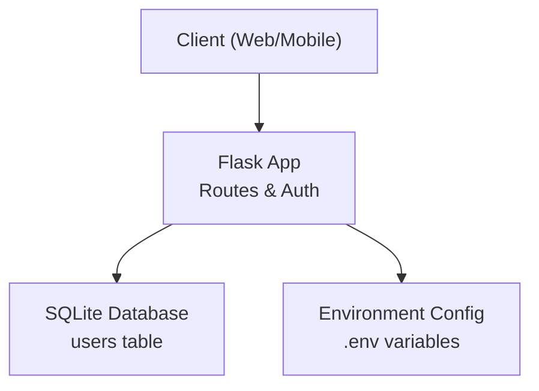
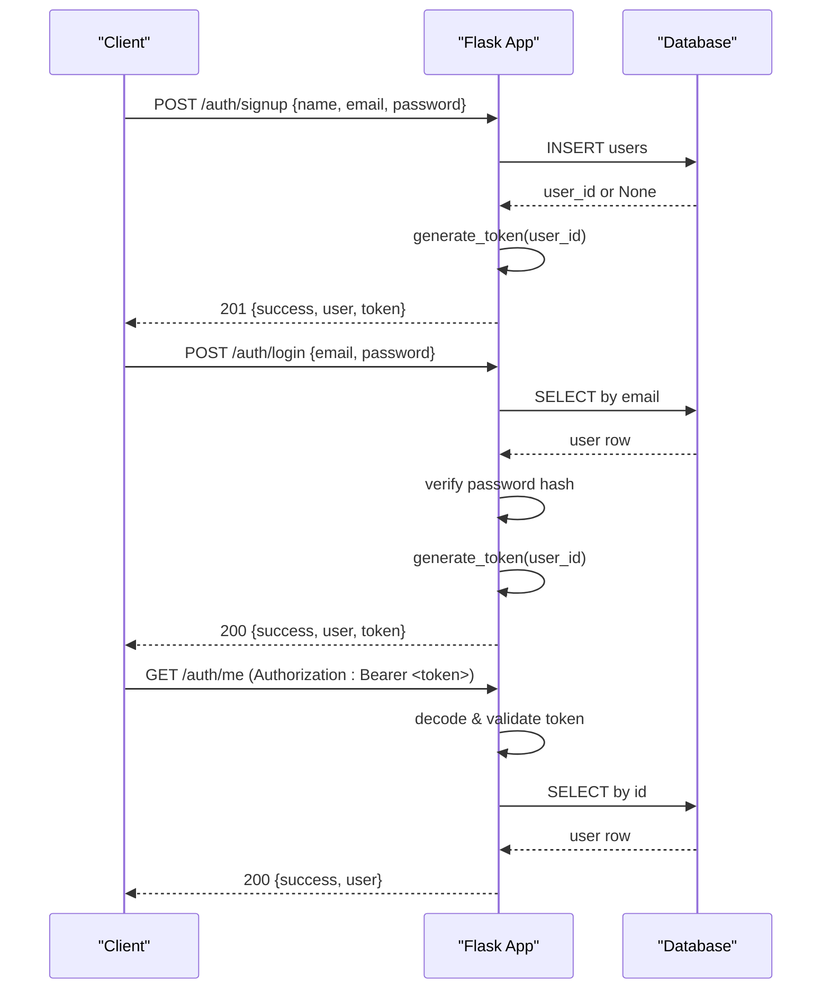
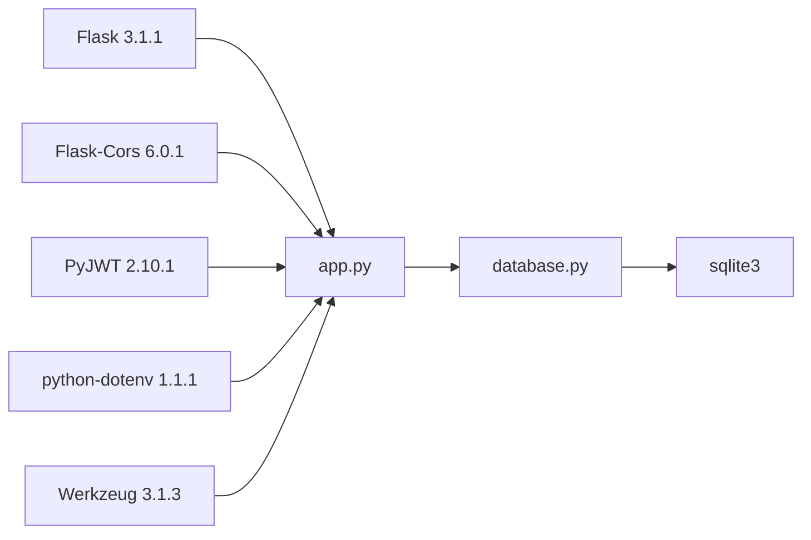

# API Documentation

<cite>
**Referenced Files in This Document**
- [app.py](file://backend/app.py)
- [database.py](file://backend/database.py)
- [test_api.py](file://backend/test_api.py)
- [requirements.txt](file://backend/requirements.txt)
</cite>

## Table of Contents
1. [Introduction](#introduction)
2. [Project Structure](#project-structure)
3. [Core Components](#core-components)
4. [Architecture Overview](#architecture-overview)
5. [Detailed Component Analysis](#detailed-component-analysis)
6. [Dependency Analysis](#dependency-analysis)
7. [Performance Considerations](#performance-considerations)
8. [Troubleshooting Guide](#troubleshooting-guide)
9. [Conclusion](#conclusion)
10. [Appendices](#appendices)

## Introduction
This document provides comprehensive API documentation for the Bon Voyage Pakistan Flask backend. It covers all RESTful endpoints, authentication flows using JWT, request/response schemas, validation rules, error formats, and client integration guidelines. It also includes health check usage, CORS configuration, rate limiting considerations, testing strategies, and notes on versioning and backward compatibility.

## Project Structure
The backend is a minimal Flask application with:
- A single application module defining routes, JWT handling, and helpers
- A database module managing SQLite connection and user operations
- A test script demonstrating end-to-end API usage
- Requirements listing core dependencies

**Diagram sources**
- [app.py:21-27](file://backend/app.py#L21-L27)
- [database.py:9-17](file://backend/database.py#L9-L17)

**Section sources**
- [app.py:1-226](file://backend/app.py#L1-L226)
- [database.py:1-75](file://backend/database.py#L1-L75)
- [requirements.txt:1-6](file://backend/requirements.txt#L1-L6)

## Core Components
- Authentication: JWT-based stateless authentication with Bearer tokens
- User management: Registration, login, profile retrieval, logout
- Data persistence: SQLite with a users table
- Health monitoring: Simple status endpoint
- CORS: Enabled globally for cross-origin requests

Key implementation highlights:
- Token extraction from Authorization header with Bearer scheme
- Password hashing via Werkzeug utilities
- JWT payload includes user_id, exp, iat; encoded with HS256
- Global CORS enabled to support web clients

**Section sources**
- [app.py:33-82](file://backend/app.py#L33-L82)
- [app.py:109-216](file://backend/app.py#L109-L216)
- [database.py:20-75](file://backend/database.py#L20-L75)

## Architecture Overview
The API exposes a small set of endpoints focused on authentication and user data access. All protected endpoints require a valid JWT token passed in the Authorization header. The application uses environment-driven configuration for secret keys and token expiration.

**Diagram sources**
- [app.py:109-153](file://backend/app.py#L109-L153)
- [app.py:156-183](file://backend/app.py#L156-L183)
- [app.py:186-193](file://backend/app.py#L186-L193)
- [database.py:39-75](file://backend/database.py#L39-L75)

## Detailed Component Analysis

### Endpoints

#### Health Check
- Method: GET
- URL: /
- Description: Service health monitoring
- Request: None
- Response: 200 OK
  - Body: JSON object with status and app name
- Errors: None expected under normal operation

**Section sources**
- [app.py:213-216](file://backend/app.py#L213-L216)

#### Register (Signup)
- Method: POST
- URL: /auth/signup
- Authentication: Not required
- Request body schema:
  - name: string, required, trimmed
  - email: string, required, trimmed, lowercased, validated format
  - password: string, required, minimum length 8
- Validation:
  - Missing fields return 400 with message and errors array
  - Invalid email format returns 400
  - Short password returns 400
- Success response: 201 Created
  - success: boolean
  - message: string
  - user: object with id, name, email
  - token: string (JWT)
- Error responses:
  - 400 Bad Request: validation failures
  - 409 Conflict: duplicate email

Example request:
- POST /auth/signup
- Headers: Content-Type: application/json
- Body: {"name": "Test Traveler", "email": "test@bvp.com", "password": "securepass123"}

Example response (201):
- {"success": true, "message": "Account created successfully", "user": {"id": 1, "name": "Test Traveler", "email": "test@bvp.com"}, "token": "<jwt>"}

**Section sources**
- [app.py:109-153](file://backend/app.py#L109-L153)
- [database.py:39-55](file://backend/database.py#L39-L55)

#### Login
- Method: POST
- URL: /auth/login
- Authentication: Not required
- Request body schema:
  - email: string, required, trimmed, lowercased
  - password: string, required
- Validation:
  - Missing fields return 400
- Success response: 200 OK
  - success: boolean
  - message: string
  - user: object with id, name, email
  - token: string (JWT)
- Error responses:
  - 400 Bad Request: missing fields
  - 401 Unauthorized: invalid credentials

Example request:
- POST /auth/login
- Headers: Content-Type: application/json
- Body: {"email": "test@bvp.com", "password": "securepass123"}

Example response (200):
- {"success": true, "message": "Login successful", "user": {"id": 1, "name": "Test Traveler", "email": "test@bvp.com"}, "token": "<jwt>"}

**Section sources**
- [app.py:156-183](file://backend/app.py#L156-L183)
- [database.py:57-64](file://backend/database.py#L57-L64)

#### Get Current User
- Method: GET
- URL: /auth/me
- Authentication: Required (Bearer token)
- Request headers:
  - Authorization: Bearer <jwt>
- Success response: 200 OK
  - success: boolean
  - user: object with id, name, email
- Error responses:
  - 401 Unauthorized: missing token, expired token, invalid token, or user not found

Example request:
- GET /auth/me
- Headers: Authorization: Bearer <jwt>

Example response (200):
- {"success": true, "user": {"id": 1, "name": "Test Traveler", "email": "test@bvp.com"}}

**Section sources**
- [app.py:186-193](file://backend/app.py#L186-L193)
- [app.py:33-65](file://backend/app.py#L33-L65)

#### Logout
- Method: POST
- URL: /auth/logout
- Authentication: Not required
- Description: Stateless logout; client should discard stored token
- Success response: 200 OK
  - success: boolean
  - message: string

Example request:
- POST /auth/logout

Example response (200):
- {"success": true, "message": "Logged out successfully"}

**Section sources**
- [app.py:196-206](file://backend/app.py#L196-L206)

### Authentication Mechanism

#### JWT Token Format
- Algorithm: HS256
- Secret: Read from environment variable SECRET_KEY
- Payload fields:
  - user_id: integer
  - exp: expiration timestamp (UTC)
  - iat: issued at timestamp (UTC)
- Expiration: Configurable via JWT_EXPIRATION_HOURS

Token lifecycle:
- Issued on successful signup and login
- Verified on protected routes by extracting Bearer token from Authorization header
- Decoded using SECRET_KEY; invalid/expired tokens result in 401

Protected route access pattern:
- Include Authorization: Bearer <token> header on requests to /auth/me
- Server decodes token, retrieves user by user_id, and proceeds if valid

**Section sources**
- [app.py:24-27](file://backend/app.py#L24-L27)
- [app.py:33-82](file://backend/app.py#L33-L82)

### Request and Response Schemas

Common patterns:
- Success responses include a success boolean field and a message string
- Protected endpoints return user objects containing id, name, email
- Error responses include success: false, message describing the issue, and sometimes an errors array for validation

Status codes summary:
- 200 OK: Successful login or get current user
- 201 Created: Successful registration
- 400 Bad Request: Missing or invalid request fields
- 401 Unauthorized: Authentication failures
- 409 Conflict: Duplicate email during registration

**Section sources**
- [app.py:109-216](file://backend/app.py#L109-L216)

### Client Implementation Guidelines

Making authenticated requests:
- After login or signup, store the returned token securely
- For subsequent requests to protected endpoints, add Authorization: Bearer <token> header
- Handle 401 responses by prompting re-authentication and refreshing the token

Handling authentication errors:
- On 401 due to missing token: prompt login
- On 401 due to expired token: refresh token via login or implement token refresh flow
- On 401 due to invalid token: clear stored token and prompt login

Managing token lifecycle:
- Store token in secure storage appropriate to the platform
- Set UI states based on token presence and validity
- Clear token on logout

Rate limiting considerations:
- No server-side rate limiting is implemented in the current codebase
- Consider adding rate limiting at the reverse proxy or application layer for production deployments

CORS configuration:
- CORS is enabled globally for all origins
- For production, restrict allowed origins to trusted domains

Testing strategies:
- Use the provided test script to validate core flows: signup, login, protected access, duplicate signup, logout
- Adapt the base URL to your deployment target
- Automate tests using CI pipelines that invoke the test script against staging environments

**Section sources**
- [app.py:21-27](file://backend/app.py#L21-L27)
- [test_api.py:1-62](file://backend/test_api.py#L1-L62)

### API Versioning, Deprecation, and Backward Compatibility

Versioning:
- The API currently does not include a version prefix in URLs
- Consider introducing a versioned base path (e.g., /api/v1/) for future evolution

Deprecation policy:
- Maintain backward compatibility when possible
- Deprecate endpoints gradually with documented timelines and migration guides

Backward compatibility:
- Avoid breaking changes to existing response schemas
- Introduce new fields as optional initially
- Keep legacy endpoints functional during transition periods

[No sources needed since this section provides general guidance]

## Dependency Analysis

**Diagram sources**
- [requirements.txt:1-6](file://backend/requirements.txt#L1-L6)
- [app.py:10-16](file://backend/app.py#L10-L16)
- [database.py:6-17](file://backend/database.py#L6-L17)

**Section sources**
- [requirements.txt:1-6](file://backend/requirements.txt#L1-L6)
- [app.py:10-16](file://backend/app.py#L10-L16)
- [database.py:6-17](file://backend/database.py#L6-L17)

## Performance Considerations
- SQLite is suitable for development and low-traffic scenarios; consider migrating to a more robust database for production
- Connection handling opens and closes connections per operation; pooling can improve throughput
- JWT verification is lightweight but ensure SECRET_KEY is strong and rotated periodically
- Add caching for frequently accessed user profiles if needed
- Implement server-side rate limiting to protect against abuse

[No sources needed since this section provides general guidance]

## Troubleshooting Guide
Common issues and resolutions:
- Missing token on protected routes: Ensure Authorization header is present with Bearer scheme
- Expired token: Re-authenticate to obtain a new token
- Invalid token: Verify token integrity and algorithm; ensure SECRET_KEY matches between client and server
- Duplicate email on signup: Use a different email or handle conflict gracefully in the client
- CORS errors: Confirm that the frontend origin is allowed; adjust CORS settings for production

Validation and error responses:
- 400 responses include a message and may include an errors array detailing validation failures
- 401 responses indicate authentication problems; inspect the message for specifics
- 409 responses indicate conflicts such as duplicate emails

**Section sources**
- [app.py:33-65](file://backend/app.py#L33-L65)
- [app.py:109-153](file://backend/app.py#L109-L153)
- [app.py:156-183](file://backend/app.py#L156-L183)

## Conclusion
The Bon Voyage Pakistan backend provides a concise, JWT-secured authentication API with clear endpoints for registration, login, profile retrieval, and logout. It includes a health check for monitoring and global CORS for web integration. For production, consider adding explicit API versioning, rate limiting, stricter CORS policies, and enhanced performance optimizations.

[No sources needed since this section summarizes without analyzing specific files]

## Appendices

### Environment Configuration
- SECRET_KEY: Used to sign JWTs; must be strong and kept secret
- JWT_EXPIRATION_HOURS: Controls token lifetime; default is 24 hours

**Section sources**
- [app.py:24-27](file://backend/app.py#L24-L27)

### Testing Utilities
- Use the provided test script to validate core flows against a running instance
- Adjust the base URL to match your deployment target
- Automate these tests in CI to ensure API stability across changes

**Section sources**
- [test_api.py:1-62](file://backend/test_api.py#L1-L62)