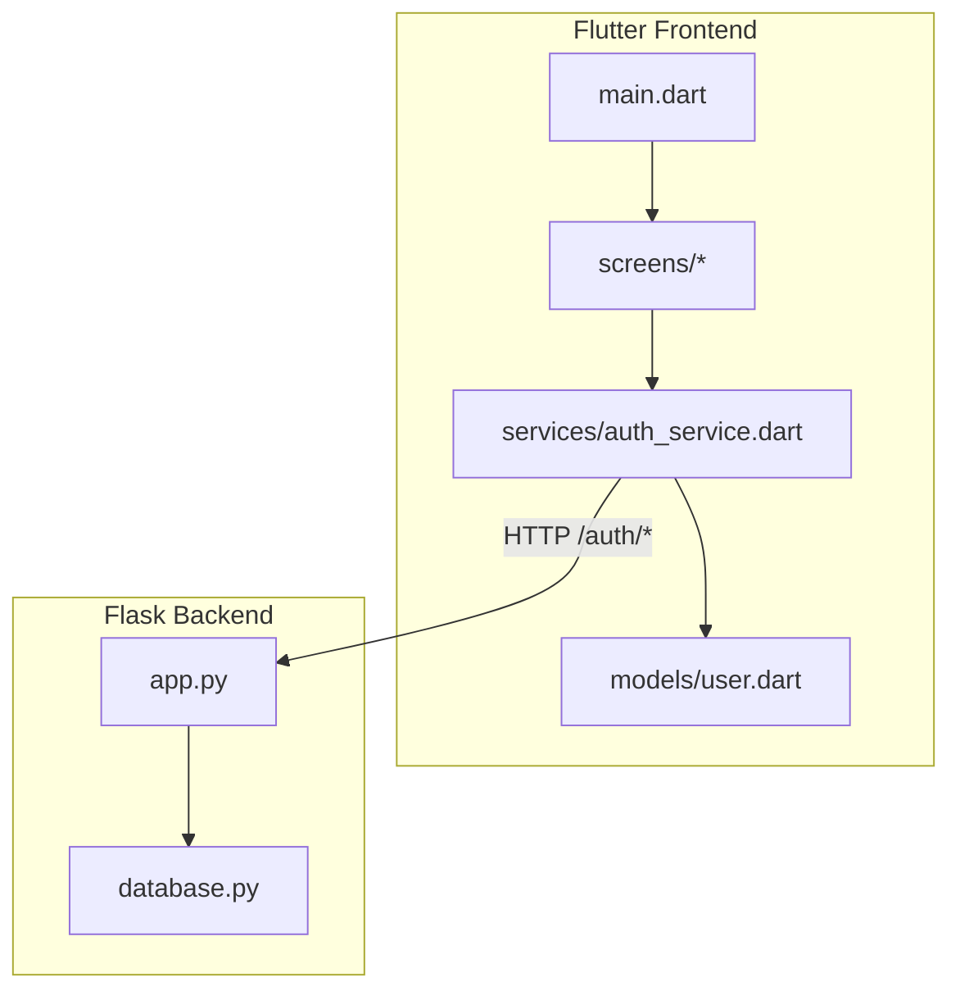
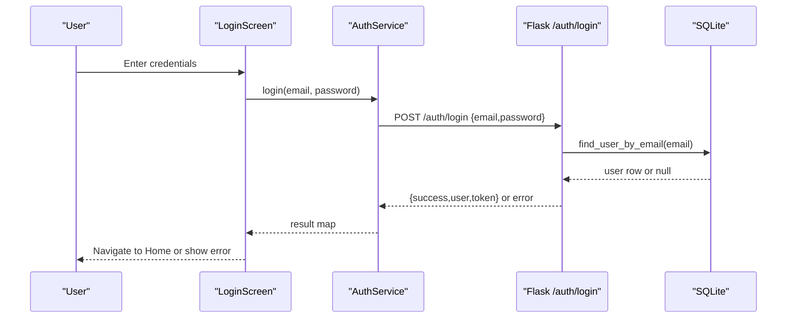
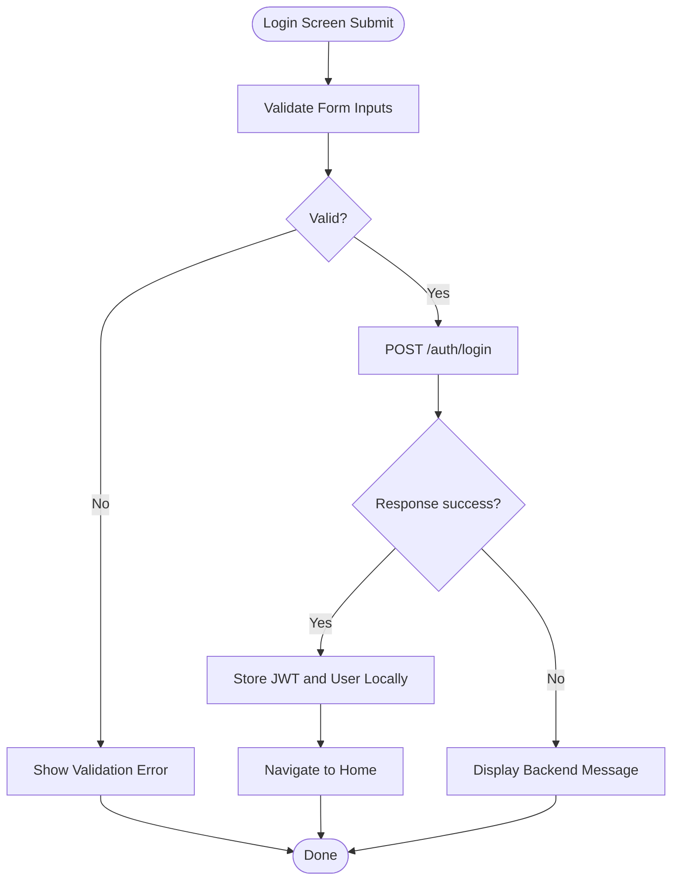
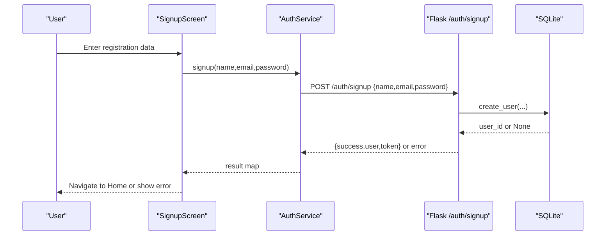
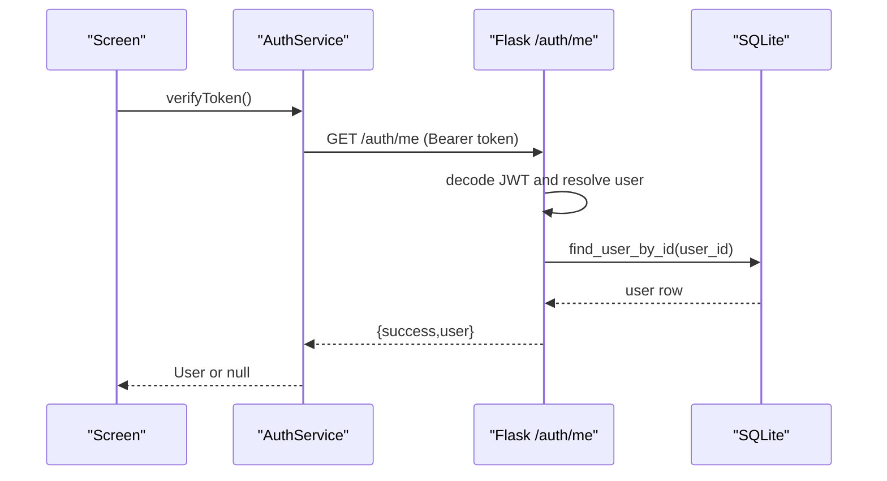
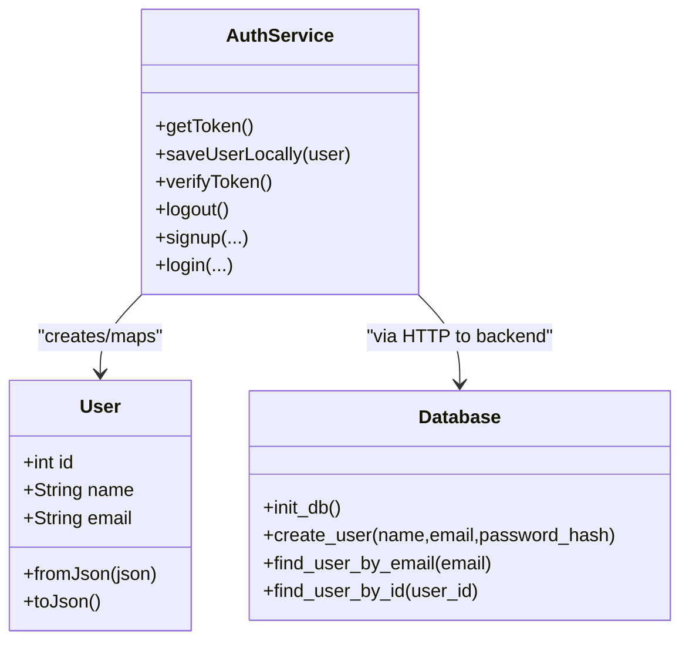
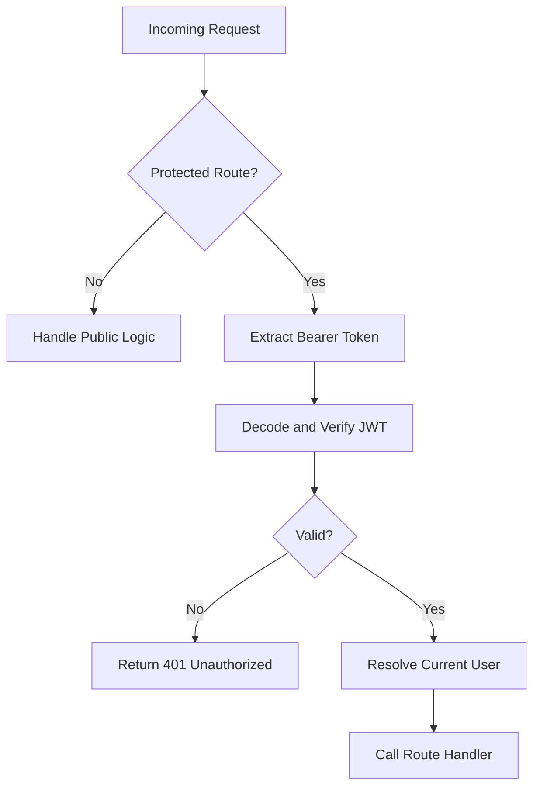
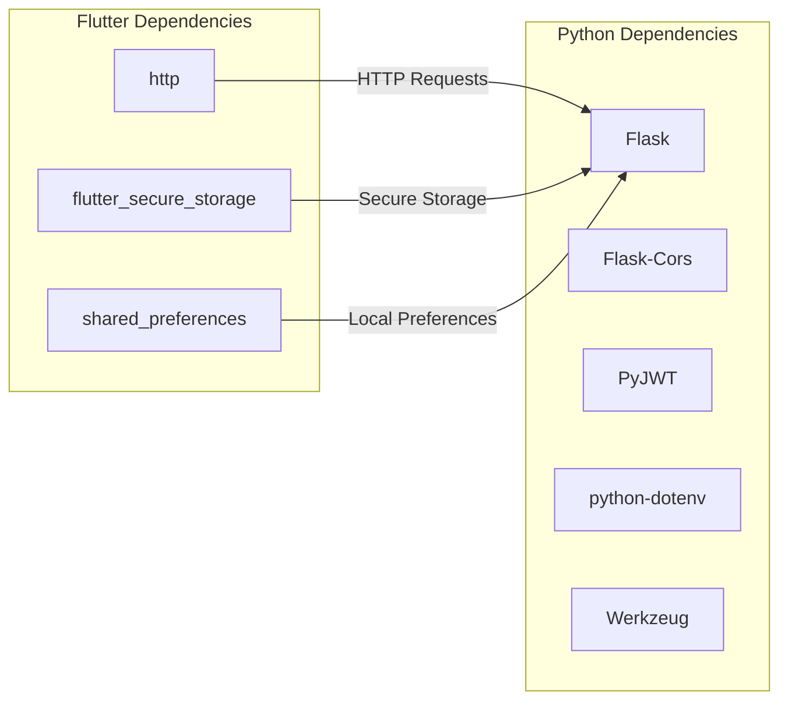

# Architecture Overview

<cite>
**Referenced Files in This Document**
- [main.dart](file://lib/main.dart)
- [auth_service.dart](file://lib/services/auth_service.dart)
- [user.dart](file://lib/models/user.dart)
- [login_screen.dart](file://lib/screens/login_screen.dart)
- [signup_screen.dart](file://lib/screens/signup_screen.dart)
- [app.py](file://backend/app.py)
- [database.py](file://backend/database.py)
- [requirements.txt](file://backend/requirements.txt)
- [pubspec.yaml](file://pubspec.yaml)
</cite>

## Table of Contents
1. Introduction
2. Project Structure
3. Core Components
4. Architecture Overview
5. Detailed Component Analysis
6. Dependency Analysis
7. Performance Considerations
8. Troubleshooting Guide
9. Conclusion

## Introduction
This document describes the architecture of Bon Voyage Pakistan, a full-stack application with a Flutter mobile frontend and a Flask backend. The system separates concerns across UI screens, services, models, and API endpoints to deliver authentication flows (sign up, login, logout) and secure state management using JSON Web Tokens (JWT). It outlines architectural patterns such as MVVM on the client, Service-Oriented Architecture for cross-cutting concerns, and a repository-like pattern for data access via the backend database module.

## Project Structure
The project is organized into two primary layers:
- Flutter frontend under lib/:
  - Entry point and app shell: main.dart
  - Screens: login_screen.dart, signup_screen.dart, and others
  - Services: auth_service.dart for HTTP calls and secure storage
  - Models: user.dart representing user entities
  - Theme and configuration files support theming and environment settings
- Flask backend under backend/:
  - app.py defines REST endpoints, JWT handling, and CORS
  - database.py manages SQLite schema and queries
  - requirements.txt lists Python dependencies

**Diagram sources**
- [main.dart:1-47](file://lib/main.dart#L1-L47)
- [auth_service.dart:1-258](file://lib/services/auth_service.dart#L1-L258)
- [user.dart:1-29](file://lib/models/user.dart#L1-L29)
- [app.py:1-226](file://backend/app.py#L1-L226)
- [database.py:1-75](file://backend/database.py#L1-L75)

**Section sources**
- [main.dart:1-47](file://lib/main.dart#L1-L47)
- [pubspec.yaml:1-31](file://pubspec.yaml#L1-L31)
- [requirements.txt:1-6](file://backend/requirements.txt#L1-L6)

## Core Components
- App Shell and Theme Provider:
  - The root widget initializes theme management and renders the initial screen.
- Authentication Service:
  - Encapsulates HTTP requests to backend endpoints, handles timeouts, and persists tokens securely.
- User Model:
  - Strongly typed representation of user data returned by the backend.
- Login and Signup Screens:
  - Present forms, validate input, call AuthService, and navigate based on results.
- Flask API:
  - Provides /auth/signup, /auth/login, /auth/me, /auth/logout, and health check endpoints.
- Database Module:
  - Initializes SQLite schema and provides CRUD operations for users.

**Section sources**
- [main.dart:12-47](file://lib/main.dart#L12-L47)
- [auth_service.dart:10-258](file://lib/services/auth_service.dart#L10-L258)
- [user.dart:1-29](file://lib/models/user.dart#L1-L29)
- [login_screen.dart:1-444](file://lib/screens/login_screen.dart#L1-L444)
- [signup_screen.dart:1-480](file://lib/screens/signup_screen.dart#L1-L480)
- [app.py:1-226](file://backend/app.py#L1-L226)
- [database.py:1-75](file://backend/database.py#L1-L75)

## Architecture Overview
Bon Voyage Pakistan follows a layered architecture:
- Presentation Layer (Flutter screens):
  - Manages UI state and user interactions.
- Service Layer (AuthService):
  - Handles network I/O, token persistence, and error mapping.
- Domain/Model Layer (User model):
  - Represents core entities used across the app.
- API Layer (Flask routes):
  - Exposes REST endpoints for authentication and protected resources.
- Data Access Layer (SQLite via database.py):
  - Persists user records and supports lookups.

Patterns:
- MVVM on the client:
  - Views (screens) bind to ViewModel-like state managed within widgets; services act as ViewModels’ data providers.
- Service-Oriented Architecture:
  - AuthService encapsulates cross-cutting authentication logic reused by multiple screens.
- Repository Pattern (client-side abstraction):
  - AuthService abstracts remote data access behind a simple interface; backend database.py acts as a repository for user data.

**Diagram sources**
- [login_screen.dart:53-82](file://lib/screens/login_screen.dart#L53-L82)
- [auth_service.dart:117-161](file://lib/services/auth_service.dart#L117-L161)
- [app.py:156-183](file://backend/app.py#L156-L183)
- [database.py:57-64](file://backend/database.py#L57-L64)

## Detailed Component Analysis

### Client-Side Authentication Flow
- LoginScreen validates inputs and invokes AuthService.login.
- AuthService posts credentials to /auth/login, stores the JWT and user info securely, and returns a consistent result map.
- On success, LoginScreen navigates to HomeScreen; otherwise, it displays an error banner.

**Diagram sources**
- [login_screen.dart:53-82](file://lib/screens/login_screen.dart#L53-L82)
- [auth_service.dart:117-161](file://lib/services/auth_service.dart#L117-L161)
- [app.py:156-183](file://backend/app.py#L156-L183)

**Section sources**
- [login_screen.dart:1-444](file://lib/screens/login_screen.dart#L1-L444)
- [auth_service.dart:117-161](file://lib/services/auth_service.dart#L117-L161)

### Sign Up Flow
- SignupScreen collects name, email, and password, enforces local validation rules, and calls AuthService.signup.
- AuthService posts to /auth/signup; on success, persists token and user details locally and navigates to HomeScreen.

**Diagram sources**
- [signup_screen.dart:57-87](file://lib/screens/signup_screen.dart#L57-L87)
- [auth_service.dart:68-115](file://lib/services/auth_service.dart#L68-L115)
- [app.py:109-153](file://backend/app.py#L109-L153)
- [database.py:39-54](file://backend/database.py#L39-L54)

**Section sources**
- [signup_screen.dart:1-480](file://lib/screens/signup_screen.dart#L1-L480)
- [auth_service.dart:68-115](file://lib/services/auth_service.dart#L68-L115)
- [app.py:109-153](file://backend/app.py#L109-L153)

### Protected Endpoint Access (/auth/me)
- After login, screens can verify session by calling AuthService.verifyToken, which sends GET /auth/me with a Bearer token.
- The backend validates the token, resolves the current user, and returns profile data.

**Diagram sources**
- [auth_service.dart:163-202](file://lib/services/auth_service.dart#L163-L202)
- [app.py:33-65](file://backend/app.py#L33-L65)
- [app.py:186-193](file://backend/app.py#L186-L193)
- [database.py:67-74](file://backend/database.py#L67-L74)

**Section sources**
- [auth_service.dart:163-202](file://lib/services/auth_service.dart#L163-L202)
- [app.py:33-65](file://backend/app.py#L33-L65)
- [app.py:186-193](file://backend/app.py#L186-L193)

### Data Models and Storage
- User model maps backend responses to strongly-typed objects for safe consumption in UI.
- Secure storage persists JWT and cached user info to avoid repeated network calls and survive app restarts.

**Diagram sources**
- [user.dart:1-29](file://lib/models/user.dart#L1-L29)
- [auth_service.dart:10-258](file://lib/services/auth_service.dart#L10-L258)
- [database.py:13-75](file://backend/database.py#L13-L75)

**Section sources**
- [user.dart:1-29](file://lib/models/user.dart#L1-L29)
- [auth_service.dart:10-258](file://lib/services/auth_service.dart#L10-L258)
- [database.py:13-75](file://backend/database.py#L13-L75)

### Backend Security and Validation
- Passwords are hashed server-side before storage.
- JWT tokens are issued with expiration and validated on protected routes using a decorator that extracts the Bearer token from headers.
- Input validation ensures required fields and formats before processing.

**Diagram sources**
- [app.py:33-65](file://backend/app.py#L33-L65)
- [app.py:72-82](file://backend/app.py#L72-L82)
- [app.py:98-102](file://backend/app.py#L98-L102)

**Section sources**
- [app.py:33-65](file://backend/app.py#L33-L65)
- [app.py:72-82](file://backend/app.py#L72-L82)
- [app.py:98-102](file://backend/app.py#L98-L102)

## Dependency Analysis
Client dependencies:
- http for REST calls
- flutter_secure_storage for secure token persistence
- shared_preferences for lightweight local storage
- Material design components for UI

Server dependencies:
- Flask for web framework
- Flask-CORS for cross-origin requests
- PyJWT for token encoding/decoding
- python-dotenv for environment variables
- Werkzeug for password hashing utilities

**Diagram sources**
- [pubspec.yaml:9-16](file://pubspec.yaml#L9-L16)
- [requirements.txt:1-6](file://backend/requirements.txt#L1-L6)

**Section sources**
- [pubspec.yaml:9-16](file://pubspec.yaml#L9-L16)
- [requirements.txt:1-6](file://backend/requirements.txt#L1-L6)

## Performance Considerations
- Timeouts:
  - All HTTP requests use a fixed timeout to prevent indefinite hangs when the backend is unreachable.
- Local Caching:
  - JWT and minimal user info are stored securely to reduce network calls and improve perceived performance.
- Minimal Payloads:
  - Backend returns only necessary fields (id, name, email), reducing bandwidth usage.
- Database:
  - SQLite is lightweight and suitable for development; consider connection pooling and indexing for production scale.

[No sources needed since this section provides general guidance]

## Troubleshooting Guide
Common issues and resolutions:
- Network Timeout:
  - Ensure the backend is running and reachable from the device/emulator.
  - Check firewall and Wi-Fi connectivity.
- Invalid or Expired Token:
  - Re-authenticate to obtain a fresh token; verify secret key configuration on the backend.
- Duplicate Email on Signup:
  - Backend rejects duplicate emails; prompt the user to log in instead.
- CORS Errors:
  - Confirm Flask-CORS is enabled and the client origin is allowed.

**Section sources**
- [auth_service.dart:232-256](file://lib/services/auth_service.dart#L232-L256)
- [app.py:49-60](file://backend/app.py#L49-L60)
- [app.py:140-143](file://backend/app.py#L140-L143)

## Conclusion
Bon Voyage Pakistan employs a clean separation between Flutter UI and Flask backend, leveraging MVVM on the client, service-oriented design for authentication, and a repository-style data layer backed by SQLite. JWT-based security ensures protected access to sensitive endpoints while maintaining a responsive and resilient user experience through timeouts, secure storage, and robust error handling. This architecture supports future expansion with additional features and services while keeping the codebase maintainable and testable.