# Component Interactions

<cite>
**Referenced Files in This Document**
- [main.dart](file://lib/main.dart)
- [app_theme.dart](file://lib/theme/app_theme.dart)
- [theme_provider.dart](file://lib/theme/theme_provider.dart)
- [splash_screen.dart](file://lib/screens/splash_screen.dart)
- [onboarding_screen.dart](file://lib/screens/onboarding_screen.dart)
- [login_screen.dart](file://lib/screens/login_screen.dart)
- [home_screen.dart](file://lib/screens/home_screen.dart)
- [auth_service.dart](file://lib/services/auth_service.dart)
- [api_config.dart](file://lib/config/api_config.dart)
- [auth_text_field.dart](file://lib/widgets/auth_text_field.dart)
- [theme_toggle.dart](file://lib/widgets/theme_toggle.dart)
- [pubspec.yaml](file://pubspec.yaml)
</cite>

## Table of Contents
1. Introduction
2. Project Structure
3. Core Components
4. Architecture Overview
5. Detailed Component Analysis
6. Dependency Analysis
7. Performance Considerations
8. Troubleshooting Guide
9. Conclusion

## Introduction
This document explains how the Bon Voyage Pakistan Flutter application coordinates UI widgets, services, and backend APIs. It covers:
- Theme system architecture with ThemeProvider usage and persistence
- Screen navigation patterns and state management across components
- Event-driven communication and callbacks between widgets and services
- Dependency injection patterns and service initialization sequences
- Splash screen orchestration for authentication checks and initial setup
- Widget composition and reusable component usage
- Asynchronous operations and error handling in component interactions

## Project Structure
The app follows a feature-oriented layout under lib:
- Entry point and root widget configuration live in main.dart
- Theme definitions and provider are in theme/
- Screens implement UI flows and navigation in screens/
- Services encapsulate API calls and secure storage in services/
- Reusable UI elements are in widgets/
- Configuration for endpoints is in config/

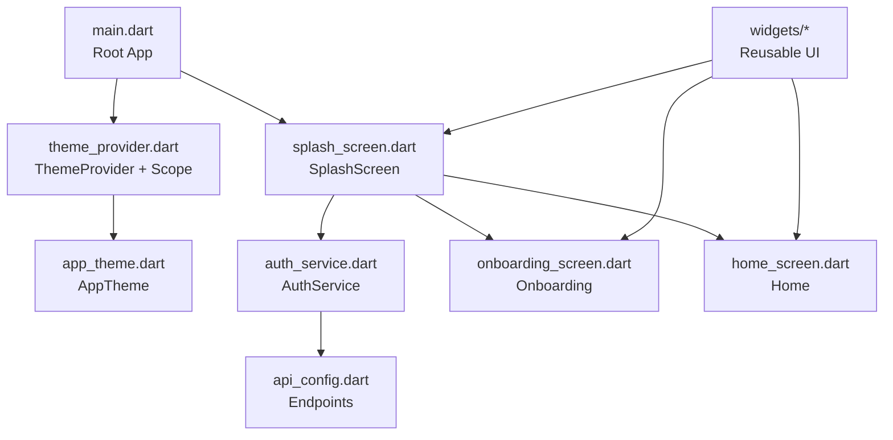

**Diagram sources**
- [main.dart:1-47](file://lib/main.dart#L1-L47)
- [theme_provider.dart:1-63](file://lib/theme/theme_provider.dart#L1-L63)
- [app_theme.dart:1-367](file://lib/theme/app_theme.dart#L1-L367)
- [splash_screen.dart:1-200](file://lib/screens/splash_screen.dart#L1-L200)
- [auth_service.dart:1-258](file://lib/services/auth_service.dart#L1-L258)
- [api_config.dart:1-19](file://lib/config/api_config.dart#L1-L19)
- [onboarding_screen.dart:1-132](file://lib/screens/onboarding_screen.dart#L1-L132)
- [home_screen.dart:52-102](file://lib/screens/home_screen.dart#L52-L102)

**Section sources**
- [main.dart:1-47](file://lib/main.dart#L1-L47)
- [pubspec.yaml:1-31](file://pubspec.yaml#L1-L31)

## Core Components
- Root app and theme scope: The root widget initializes Flutter bindings, creates a ThemeProvider instance, and wraps the app with ThemeProviderScope to provide theme state to descendants. MaterialApp receives themeMode from the provider and applies light/dark themes.
- Theme provider: Manages current theme mode, persists selection using shared preferences, and exposes a convenience method to get the active ThemeData.
- Authentication service: Encapsulates HTTP requests to backend endpoints, stores JWT securely, caches user info locally, and provides methods for login, signup, token verification, and logout.
- Splash screen: Orchestrates initial flow by showing an animation, then verifying the stored token to navigate to Home or Onboarding.
- Login screen: Validates input, triggers AuthService.login, handles success/failure states, and navigates to Home on success.
- Home screen: Loads cached user name via AuthService and displays it; uses snackbars for feedback.
- Reusable widgets: AuthTextField standardizes input fields; ThemeToggle provides a consistent toggle control.

**Section sources**
- [main.dart:12-47](file://lib/main.dart#L12-L47)
- [theme_provider.dart:5-63](file://lib/theme/theme_provider.dart#L5-L63)
- [auth_service.dart:10-258](file://lib/services/auth_service.dart#L10-L258)
- [splash_screen.dart:7-200](file://lib/screens/splash_screen.dart#L7-L200)
- [login_screen.dart:8-444](file://lib/screens/login_screen.dart#L8-L444)
- [home_screen.dart:52-102](file://lib/screens/home_screen.dart#L52-L102)
- [auth_text_field.dart:1-97](file://lib/widgets/auth_text_field.dart#L1-L97)
- [theme_toggle.dart:1-52](file://lib/widgets/theme_toggle.dart#L1-L52)

## Architecture Overview
The app uses a layered architecture:
- Presentation layer (screens and widgets) handles UI and user interactions
- State layer (ThemeProvider) manages global theme state with persistence
- Service layer (AuthService) abstracts network calls and secure storage
- Configuration layer (ApiConfig) centralizes endpoint URLs

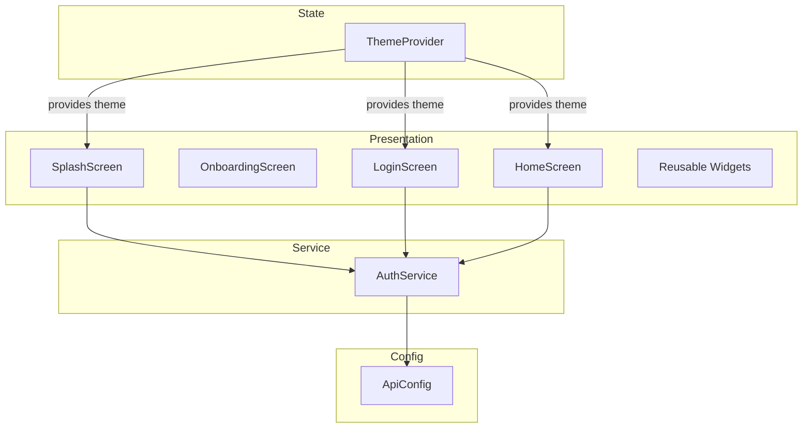

**Diagram sources**
- [splash_screen.dart:1-200](file://lib/screens/splash_screen.dart#L1-L200)
- [onboarding_screen.dart:1-132](file://lib/screens/onboarding_screen.dart#L1-L132)
- [login_screen.dart:1-444](file://lib/screens/login_screen.dart#L1-L444)
- [home_screen.dart:52-102](file://lib/screens/home_screen.dart#L52-L102)
- [theme_provider.dart:1-63](file://lib/theme/theme_provider.dart#L1-L63)
- [auth_service.dart:1-258](file://lib/services/auth_service.dart#L1-L258)
- [api_config.dart:1-19](file://lib/config/api_config.dart#L1-L19)

## Detailed Component Analysis

### Theme System Architecture and Persistence
- ThemeProvider extends ChangeNotifier and holds the current ThemeMode. On construction, it loads the saved mode from SharedPreferences and notifies listeners.
- Methods toggleTheme and setTheme update the mode, persist the choice, and notify listeners to rebuild affected widgets.
- ThemeProviderScope is an InheritedNotifier that exposes ThemeProvider to descendants via a static of method.
- The root app creates a single ThemeProvider instance and wraps the app with ThemeProviderScope, ensuring all screens receive consistent theme updates.

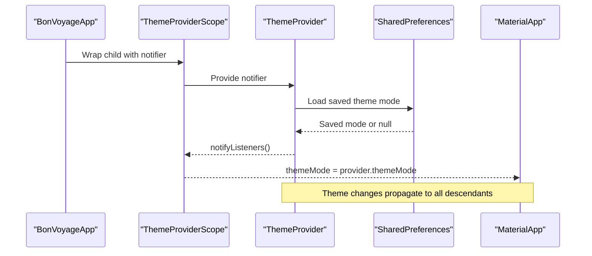

**Diagram sources**
- [main.dart:23-47](file://lib/main.dart#L23-L47)
- [theme_provider.dart:5-63](file://lib/theme/theme_provider.dart#L5-L63)

**Section sources**
- [theme_provider.dart:5-63](file://lib/theme/theme_provider.dart#L5-L63)
- [main.dart:23-47](file://lib/main.dart#L23-L47)

### Splash Screen Orchestration and Authentication Checks
- SplashScreen animates the logo and title, then waits briefly before calling AuthService.verifyToken.
- If verifyToken returns a valid user, the app navigates to HomeScreen; otherwise, it navigates to OnboardingScreen.
- Navigation uses Navigator.pushReplacement to ensure a clean back stack.

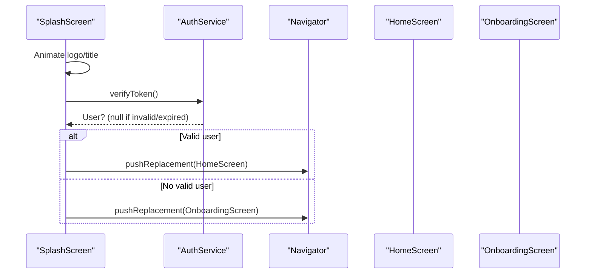

**Diagram sources**
- [splash_screen.dart:28-87](file://lib/screens/splash_screen.dart#L28-L87)
- [auth_service.dart:168-202](file://lib/services/auth_service.dart#L168-L202)

**Section sources**
- [splash_screen.dart:28-87](file://lib/screens/splash_screen.dart#L28-L87)
- [auth_service.dart:168-202](file://lib/services/auth_service.dart#L168-L202)

### Login Flow and Error Handling
- LoginScreen validates email/password, sets loading state, and calls AuthService.login.
- On success, it clears the route stack and navigates to HomeScreen. On failure, it displays an error banner with the message returned by the service.
- AuthService.login posts credentials to the configured endpoint, stores the JWT and user info on success, and returns a standardized result map including success and message.

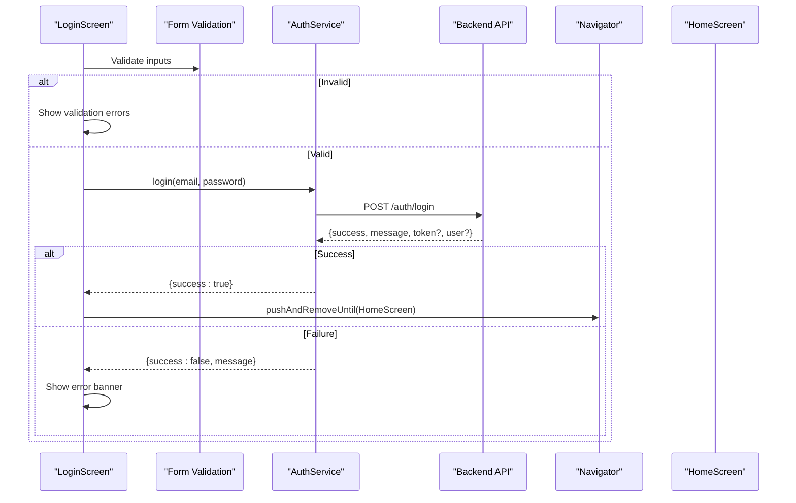

**Diagram sources**
- [login_screen.dart:53-82](file://lib/screens/login_screen.dart#L53-L82)
- [auth_service.dart:117-161](file://lib/services/auth_service.dart#L117-L161)

**Section sources**
- [login_screen.dart:53-82](file://lib/screens/login_screen.dart#L53-L82)
- [auth_service.dart:117-161](file://lib/services/auth_service.dart#L117-L161)

### Home Screen Data Loading and Feedback
- HomeScreen loads the cached user name asynchronously via AuthService.getUserName and updates its local state when available.
- It shows snackbars for temporary feedback, using the current theme’s surface colors for consistency.

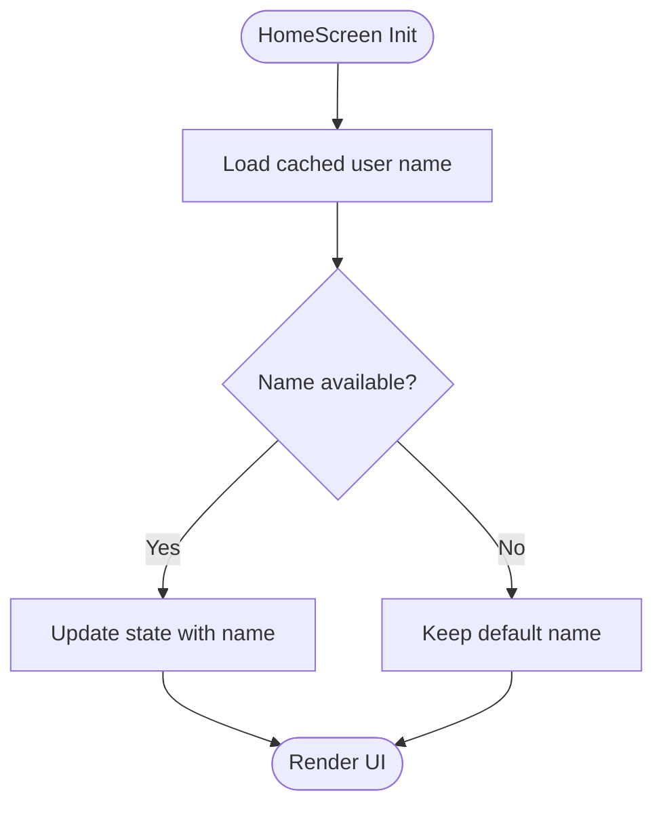

**Diagram sources**
- [home_screen.dart:73-87](file://lib/screens/home_screen.dart#L73-L87)

**Section sources**
- [home_screen.dart:73-87](file://lib/screens/home_screen.dart#L73-L87)

### Widget Composition and Reusability
- AuthTextField encapsulates label, hint, prefix icon, password visibility toggle, and validation behavior, promoting reuse across authentication screens.
- ThemeToggle provides a consistent dark/light mode switch with animations and theme-aware styling.

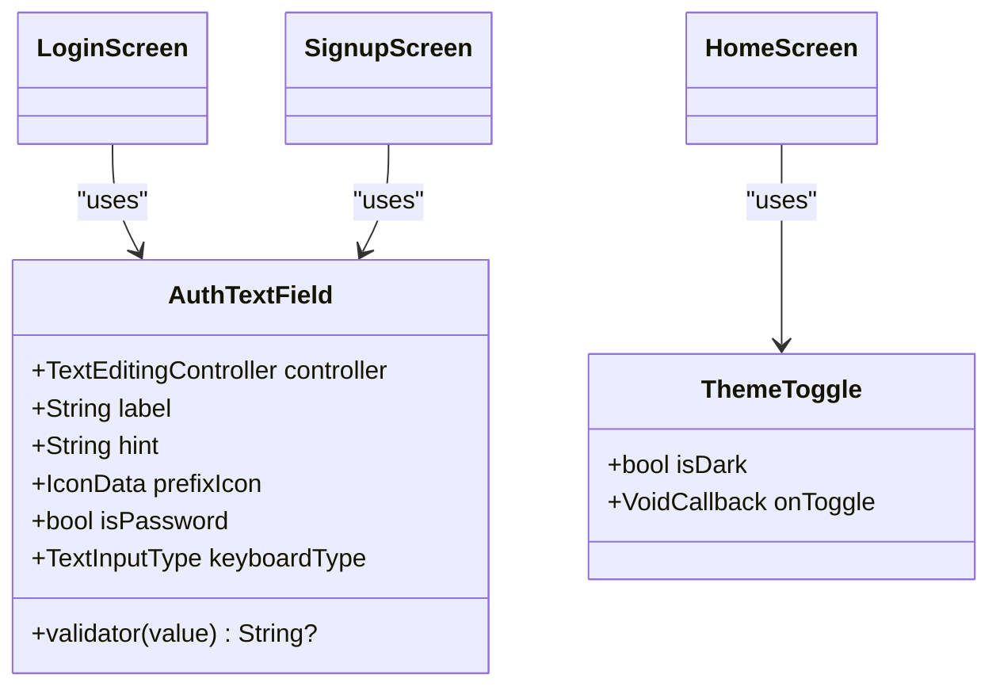

**Diagram sources**
- [auth_text_field.dart:1-97](file://lib/widgets/auth_text_field.dart#L1-L97)
- [theme_toggle.dart:1-52](file://lib/widgets/theme_toggle.dart#L1-L52)
- [login_screen.dart:1-444](file://lib/screens/login_screen.dart#L1-L444)

**Section sources**
- [auth_text_field.dart:1-97](file://lib/widgets/auth_text_field.dart#L1-L97)
- [theme_toggle.dart:1-52](file://lib/widgets/theme_toggle.dart#L1-L52)

### Event-Driven Communication and Callbacks
- ThemeProvider emits change events via ChangeNotifier.notifyListeners; ThemeProviderScope exposes the notifier so any descendant can listen and rebuild accordingly.
- Screens use callbacks (e.g., onToggle) to trigger actions in parent scopes or providers, maintaining unidirectional data flow.

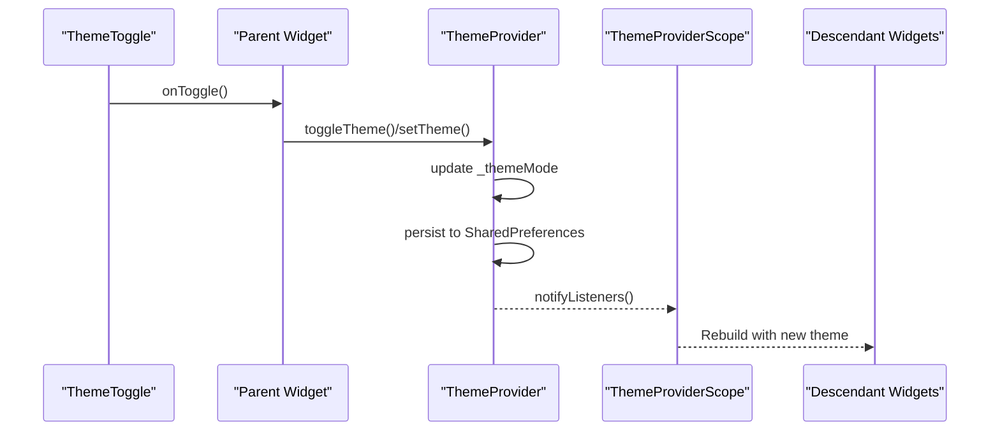

**Diagram sources**
- [theme_provider.dart:29-47](file://lib/theme/theme_provider.dart#L29-L47)
- [theme_toggle.dart:15-52](file://lib/widgets/theme_toggle.dart#L15-L52)

**Section sources**
- [theme_provider.dart:29-47](file://lib/theme/theme_provider.dart#L29-L47)
- [theme_toggle.dart:15-52](file://lib/widgets/theme_toggle.dart#L15-L52)

### Dependency Injection Patterns and Service Initialization
- ThemeProvider is instantiated once in the root widget and provided via ThemeProviderScope, acting as a simple DI container for theme state.
- AuthService is used as a static utility class; endpoints are centralized in ApiConfig, enabling environment-specific configuration without changing callers.

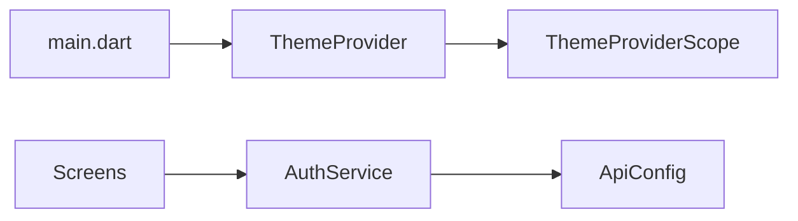

**Diagram sources**
- [main.dart:23-47](file://lib/main.dart#L23-L47)
- [auth_service.dart:1-258](file://lib/services/auth_service.dart#L1-L258)
- [api_config.dart:1-19](file://lib/config/api_config.dart#L1-L19)

**Section sources**
- [main.dart:23-47](file://lib/main.dart#L23-L47)
- [auth_service.dart:1-258](file://lib/services/auth_service.dart#L1-L258)
- [api_config.dart:1-19](file://lib/config/api_config.dart#L1-L19)

### Asynchronous Operations and Error Handling
- All network calls in AuthService use timeouts to prevent indefinite hangs and return standardized maps with success flags and messages.
- Errors are categorized into timeout, connection, and generic errors; token verification failures clear local auth data, while transient network issues preserve tokens for retry.
- Screens handle async results safely by checking mounted state before updating UI and display user-friendly messages.

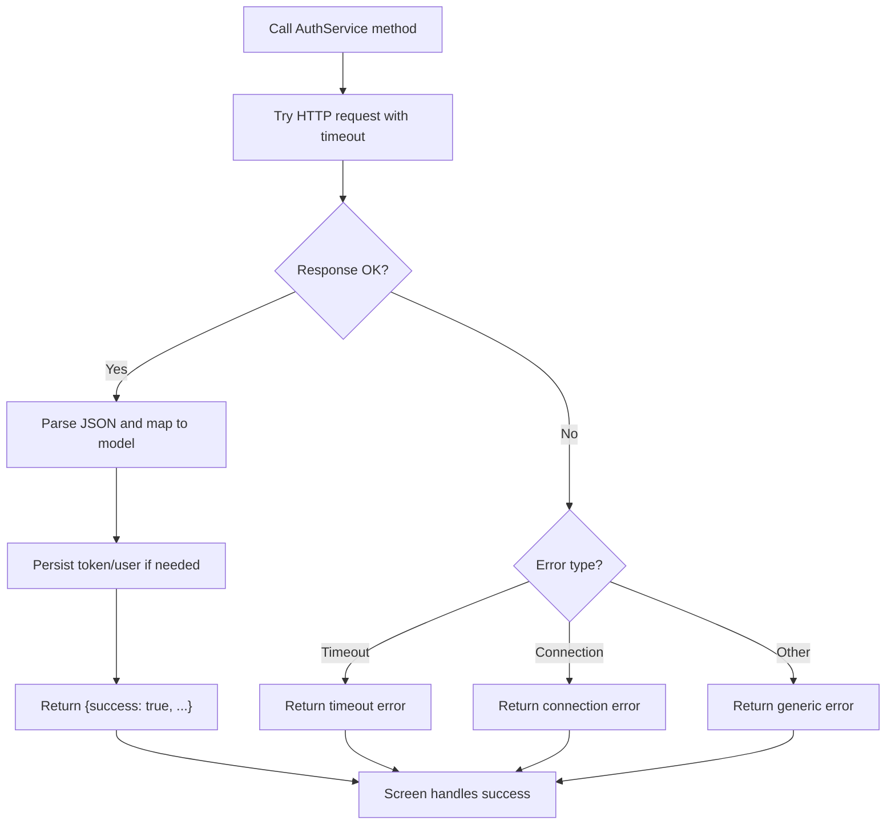

**Diagram sources**
- [auth_service.dart:68-161](file://lib/services/auth_service.dart#L68-L161)
- [auth_service.dart:168-202](file://lib/services/auth_service.dart#L168-L202)
- [auth_service.dart:232-256](file://lib/services/auth_service.dart#L232-L256)

**Section sources**
- [auth_service.dart:68-161](file://lib/services/auth_service.dart#L68-L161)
- [auth_service.dart:168-202](file://lib/services/auth_service.dart#L168-L202)
- [auth_service.dart:232-256](file://lib/services/auth_service.dart#L232-L256)

## Dependency Analysis
- External dependencies include http for networking, flutter_secure_storage for secure token storage, and shared_preferences for theme persistence.
- Internal dependencies:
  - Screens depend on AuthService for authentication and user data
  - ThemeProvider depends on shared_preferences and AppTheme for theme values
  - AuthService depends on ApiConfig for endpoint URLs
  - Widgets depend on AppTheme for consistent styling

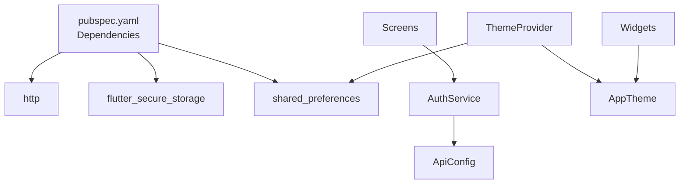

**Diagram sources**
- [pubspec.yaml:9-16](file://pubspec.yaml#L9-L16)
- [auth_service.dart:1-258](file://lib/services/auth_service.dart#L1-L258)
- [api_config.dart:1-19](file://lib/config/api_config.dart#L1-L19)
- [theme_provider.dart:1-63](file://lib/theme/theme_provider.dart#L1-L63)
- [app_theme.dart:1-367](file://lib/theme/app_theme.dart#L1-L367)

**Section sources**
- [pubspec.yaml:9-16](file://pubspec.yaml#L9-L16)
- [auth_service.dart:1-258](file://lib/services/auth_service.dart#L1-L258)
- [api_config.dart:1-19](file://lib/config/api_config.dart#L1-L19)
- [theme_provider.dart:1-63](file://lib/theme/theme_provider.dart#L1-L63)
- [app_theme.dart:1-367](file://lib/theme/app_theme.dart#L1-L367)

## Performance Considerations
- Use minimal setState calls; prefer scoped rebuilds via ListenableBuilder around ThemeProvider to avoid unnecessary widget rebuilds.
- Keep network requests short-lived with timeouts; consider caching strategies for frequently accessed data beyond user profile.
- Avoid heavy computations in build methods; offload to services or isolates where appropriate.
- Reuse widgets like AuthTextField and ThemeToggle to reduce duplication and improve maintainability.

[No sources needed since this section provides general guidance]

## Troubleshooting Guide
- Network connectivity issues: Ensure the backend is reachable at the configured base URL; check device/network settings and firewall rules.
- Token validation failures: If verifyToken returns null due to invalid/expired tokens, local auth data is cleared; users must re-authenticate.
- Timeouts: Requests exceeding the configured timeout return a timeout error; advise users to retry after checking connectivity.
- Theme not persisting: Verify SharedPreferences access and ensure the app has necessary permissions; confirm that setTheme/toggleTheme are called and notifyListeners is invoked.

**Section sources**
- [auth_service.dart:168-202](file://lib/services/auth_service.dart#L168-L202)
- [auth_service.dart:232-256](file://lib/services/auth_service.dart#L232-L256)
- [theme_provider.dart:19-47](file://lib/theme/theme_provider.dart#L19-L47)

## Conclusion
The Bon Voyage Pakistan application demonstrates a clear separation of concerns:
- Theme management via a provider pattern ensures consistent UI across sessions
- Authentication flows are encapsulated in a dedicated service with robust error handling
- Screens focus on presentation and navigation, delegating business logic to services
- Reusable widgets promote consistency and reduce duplication
- Centralized configuration simplifies environment changes and maintenance

This structure supports scalability, testability, and a smooth user experience across different devices and networks.

[No sources needed since this section summarizes without analyzing specific files]