# Data Flow Patterns

<cite>
**Referenced Files in This Document**
- [main.dart](file://lib/main.dart)
- [api_config.dart](file://lib/config/api_config.dart)
- [auth_service.dart](file://lib/services/auth_service.dart)
- [user.dart](file://lib/models/user.dart)
- [login_screen.dart](file://lib/screens/login_screen.dart)
- [signup_screen.dart](file://lib/screens/signup_screen.dart)
- [home_screen.dart](file://lib/screens/home_screen.dart)
- [app.py](file://backend/app.py)
- [database.py](file://backend/database.py)
- [test_api.py](file://backend/test_api.py)
</cite>

## Table of Contents
1. Introduction
2. Project Structure
3. Core Components
4. Architecture Overview
5. Detailed Component Analysis
6. Dependency Analysis
7. Performance Considerations
8. Troubleshooting Guide
9. Conclusion

## Introduction
This document explains the end-to-end data flow for the Bon Voyage Pakistan application, from Flutter user interactions through service layers to Flask endpoints and SQLite database operations. It covers authentication flows (registration, login, token verification, logout), request-response patterns between screens and APIs, error handling across the stack, JSON-to-Dart model transformations, caching strategies using secure local storage, and state synchronization between frontend and backend.

## Project Structure
The application consists of:
- Flutter frontend with screens, services, models, and configuration
- Flask backend with routes, JWT handling, and a SQLite database

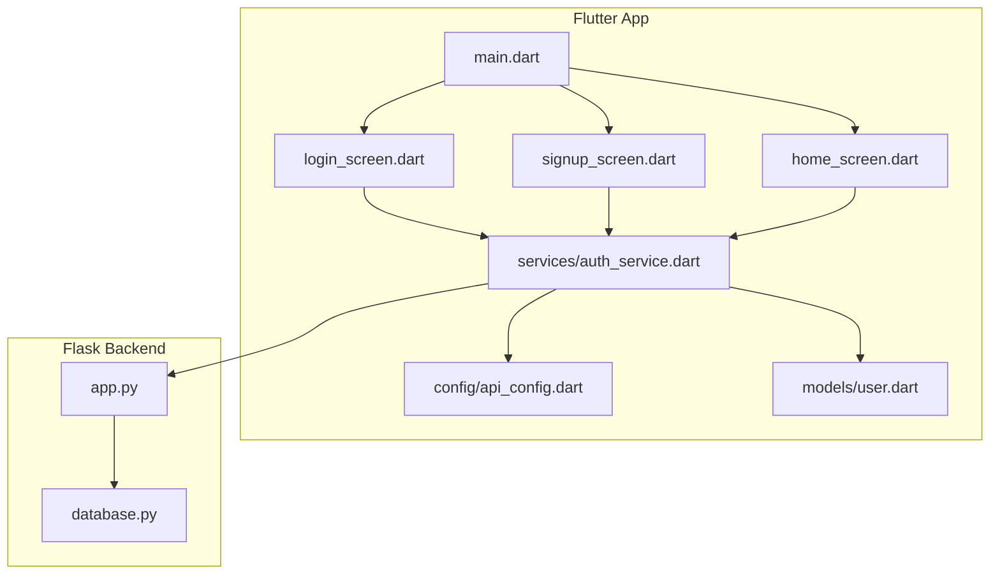

**Diagram sources**
- [main.dart:1-47](file://lib/main.dart#L1-L47)
- [login_screen.dart:1-444](file://lib/screens/login_screen.dart#L1-L444)
- [signup_screen.dart:1-480](file://lib/screens/signup_screen.dart#L1-L480)
- [home_screen.dart:1-800](file://lib/screens/home_screen.dart#L1-L800)
- [auth_service.dart:1-258](file://lib/services/auth_service.dart#L1-L258)
- [api_config.dart:1-20](file://lib/config/api_config.dart#L1-L20)
- [user.dart:1-29](file://lib/models/user.dart#L1-L29)
- [app.py:1-226](file://backend/app.py#L1-L226)
- [database.py:1-75](file://backend/database.py#L1-L75)

**Section sources**
- [main.dart:1-47](file://lib/main.dart#L1-L47)
- [api_config.dart:1-20](file://lib/config/api_config.dart#L1-L20)

## Core Components
- Authentication Service: Encapsulates HTTP calls, secure token storage, and local user cache.
- Models: Strongly typed Dart representation of API payloads.
- Screens: UI entry points that trigger auth flows and display results.
- Backend Routes: REST endpoints for signup, login, profile retrieval, and logout.
- Database Layer: SQLite schema and queries for user persistence.

Key responsibilities:
- Frontend validation and UX state management in screens
- Network requests, timeouts, and error normalization in the service layer
- Secure token and profile caching on device
- Backend input validation, password hashing, JWT issuance, and protected route enforcement
- Database CRUD operations for users

**Section sources**
- [auth_service.dart:1-258](file://lib/services/auth_service.dart#L1-L258)
- [user.dart:1-29](file://lib/models/user.dart#L1-L29)
- [login_screen.dart:1-444](file://lib/screens/login_screen.dart#L1-L444)
- [signup_screen.dart:1-480](file://lib/screens/signup_screen.dart#L1-L480)
- [home_screen.dart:1-800](file://lib/screens/home_screen.dart#L1-L800)
- [app.py:1-226](file://backend/app.py#L1-L226)
- [database.py:1-75](file://backend/database.py#L1-L75)

## Architecture Overview
The system follows a layered architecture:
- Presentation: Flutter screens handle user input and render feedback
- Service: Auth service manages network I/O, token lifecycle, and local cache
- API: Flask routes validate inputs, enforce authentication, and return JSON
- Storage: SQLite stores user records; secure storage holds tokens locally

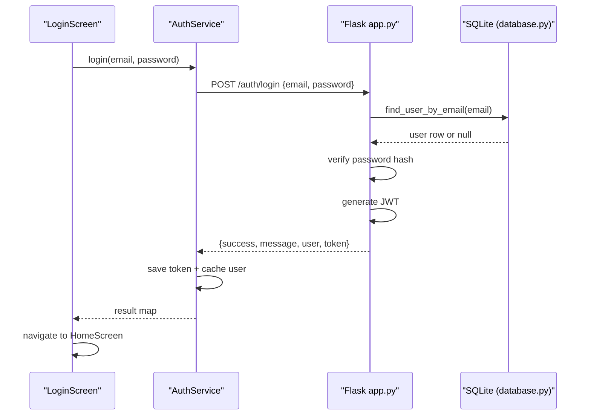

**Diagram sources**
- [login_screen.dart:53-82](file://lib/screens/login_screen.dart#L53-L82)
- [auth_service.dart:117-161](file://lib/services/auth_service.dart#L117-L161)
- [app.py:156-183](file://backend/app.py#L156-L183)
- [database.py:57-64](file://backend/database.py#L57-L64)

## Detailed Component Analysis

### Authentication Data Flow
- Registration:
  - Screen collects name, email, password
  - Service posts to /auth/signup
  - Backend validates, hashes password, inserts user, returns JWT and user
  - Service stores token securely and caches user info
  - Screen navigates to home
- Login:
  - Screen posts credentials to /auth/login
  - Backend verifies credentials, issues JWT
  - Service persists token and caches user
  - Screen navigates to home
- Token Verification:
  - Service reads stored token and calls GET /auth/me
  - Backend decodes JWT, looks up user, returns profile
  - On success, service refreshes cached user; on failure, clears local state
- Logout:
  - Service attempts best-effort call to /auth/logout
  - Clears all local auth data

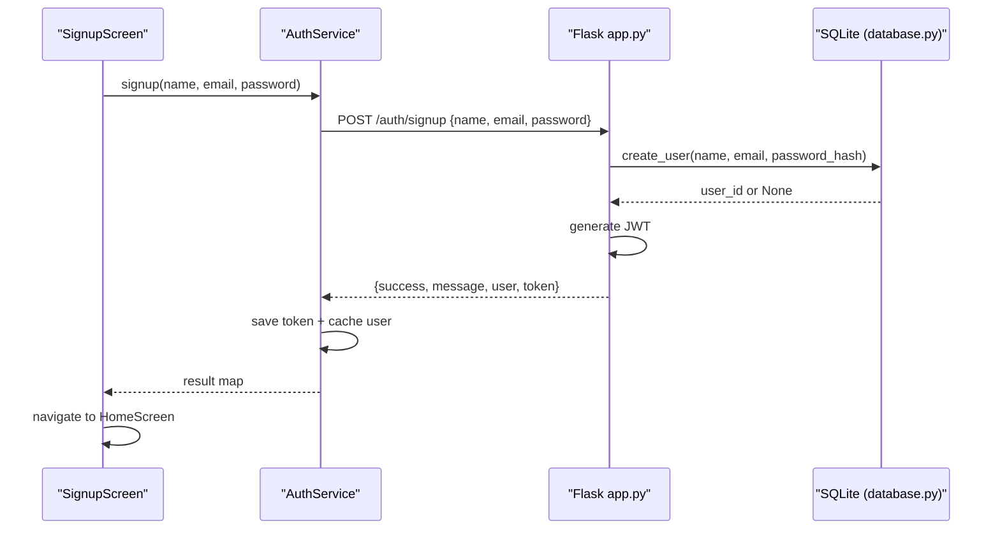

**Diagram sources**
- [signup_screen.dart:57-87](file://lib/screens/signup_screen.dart#L57-L87)
- [auth_service.dart:68-115](file://lib/services/auth_service.dart#L68-L115)
- [app.py:109-153](file://backend/app.py#L109-L153)
- [database.py:39-54](file://backend/database.py#L39-L54)

**Section sources**
- [auth_service.dart:68-226](file://lib/services/auth_service.dart#L68-L226)
- [app.py:109-206](file://backend/app.py#L109-L206)
- [database.py:39-75](file://backend/database.py#L39-L75)

### Request-Response Patterns Between Flutter Screens and Flask Endpoints
- Endpoints used:
  - POST /auth/signup
  - POST /auth/login
  - GET /auth/me (requires Authorization: Bearer <token>)
  - POST /auth/logout
- Payloads:
  - Signup: name, email, password
  - Login: email, password
  - Me: Authorization header with JWT
- Responses:
  - Success: {success: true, message, user?, token?}
  - Failure: {success: false, message, errors?}

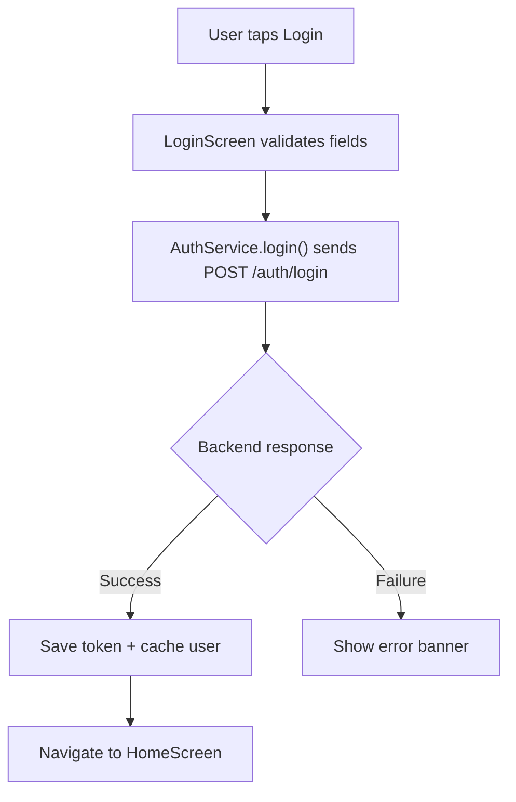

**Diagram sources**
- [login_screen.dart:53-82](file://lib/screens/login_screen.dart#L53-L82)
- [auth_service.dart:117-161](file://lib/services/auth_service.dart#L117-L161)
- [app.py:156-183](file://backend/app.py#L156-L183)

**Section sources**
- [api_config.dart:1-20](file://lib/config/api_config.dart#L1-L20)
- [auth_service.dart:68-226](file://lib/services/auth_service.dart#L68-L226)
- [app.py:109-206](file://backend/app.py#L109-L206)

### Error Handling Flows and Exception Propagation
- Frontend:
  - Timeouts and connection errors are caught and normalized into consistent error maps
  - Screens display messages via banners or snackbar-like UI elements
  - Token verification failures clear local state to force re-authentication
- Backend:
  - Input validation returns structured errors with status codes
  - Authentication decorator handles missing, expired, or invalid tokens
  - Duplicate registration returns conflict responses

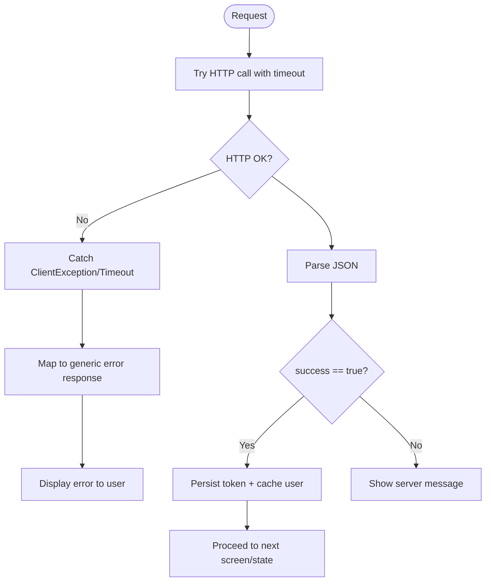

**Diagram sources**
- [auth_service.dart:105-114](file://lib/services/auth_service.dart#L105-L114)
- [auth_service.dart:151-160](file://lib/services/auth_service.dart#L151-L160)
- [auth_service.dart:194-201](file://lib/services/auth_service.dart#L194-L201)
- [app.py:120-134](file://backend/app.py#L120-L134)
- [app.py:166-173](file://backend/app.py#L166-L173)
- [app.py:49-60](file://backend/app.py#L49-L60)

**Section sources**
- [auth_service.dart:105-201](file://lib/services/auth_service.dart#L105-L201)
- [app.py:49-60](file://backend/app.py#L49-L60)
- [app.py:120-173](file://backend/app.py#L120-L173)

### Data Transformation: JSON to Dart Models
- User model provides fromJson/toJson for safe conversion
- Service constructs User objects from API payloads when available
- Local cache stores lightweight fields (name, email) for quick UI rendering

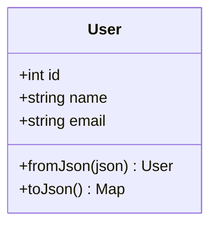

**Diagram sources**
- [user.dart:1-29](file://lib/models/user.dart#L1-L29)

**Section sources**
- [user.dart:1-29](file://lib/models/user.dart#L1-L29)
- [auth_service.dart:95-101](file://lib/services/auth_service.dart#L95-L101)
- [auth_service.dart:141-147](file://lib/services/auth_service.dart#L141-L147)
- [auth_service.dart:183-188](file://lib/services/auth_service.dart#L183-L188)

### Caching Strategies and State Synchronization
- Secure local storage:
  - JWT token persisted securely on device
  - Cached user name and email for fast UI updates without network calls
- Synchronization:
  - On successful auth, token and user are saved
  - On token verification failure, local state is cleared to prevent stale sessions
  - Home screen loads cached user name on startup for immediate personalization

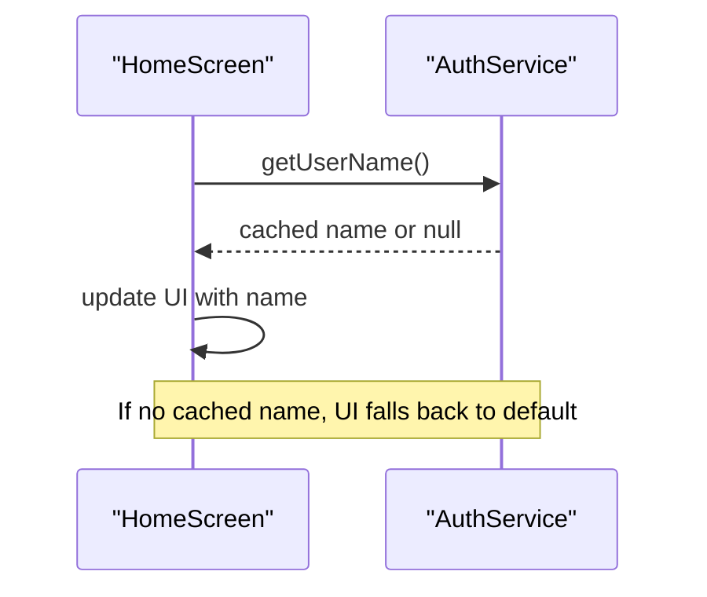

**Diagram sources**
- [home_screen.dart:73-87](file://lib/screens/home_screen.dart#L73-L87)
- [auth_service.dart:41-55](file://lib/services/auth_service.dart#L41-L55)

**Section sources**
- [auth_service.dart:31-62](file://lib/services/auth_service.dart#L31-L62)
- [home_screen.dart:73-87](file://lib/screens/home_screen.dart#L73-L87)

### Typical User Workflows

#### Registration Workflow
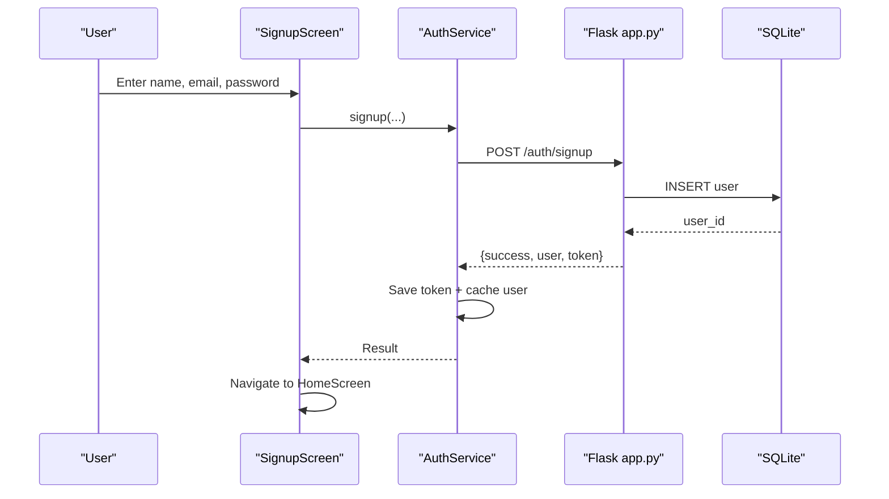

**Diagram sources**
- [signup_screen.dart:57-87](file://lib/screens/signup_screen.dart#L57-L87)
- [auth_service.dart:68-115](file://lib/services/auth_service.dart#L68-L115)
- [app.py:109-153](file://backend/app.py#L109-L153)
- [database.py:39-54](file://backend/database.py#L39-L54)

#### Login Workflow
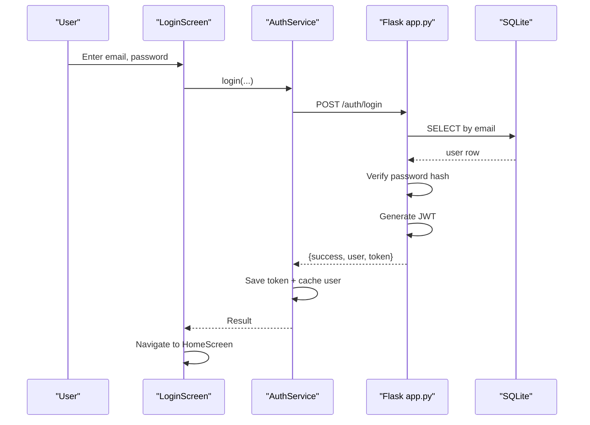

**Diagram sources**
- [login_screen.dart:53-82](file://lib/screens/login_screen.dart#L53-L82)
- [auth_service.dart:117-161](file://lib/services/auth_service.dart#L117-L161)
- [app.py:156-183](file://backend/app.py#L156-L183)
- [database.py:57-64](file://backend/database.py#L57-L64)

#### Profile Update Workflow (GET /auth/me)
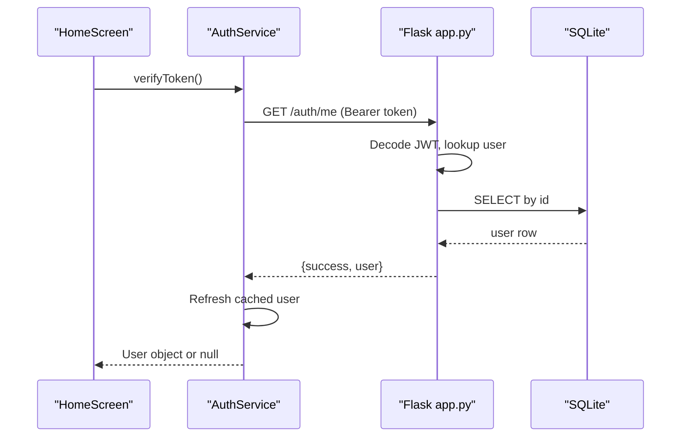

**Diagram sources**
- [auth_service.dart:163-202](file://lib/services/auth_service.dart#L163-L202)
- [app.py:186-193](file://backend/app.py#L186-L193)
- [database.py:67-74](file://backend/database.py#L67-L74)

## Dependency Analysis
- Flutter dependencies:
  - Screens depend on AuthService for all network operations
  - AuthService depends on ApiConfig for endpoint URLs and User model for DTO mapping
  - HomeScreen depends on AuthService for cached user data and logout
- Backend dependencies:
  - app.py depends on database.py for user persistence
  - JWT library used for token creation and verification
  - CORS enabled for cross-origin requests

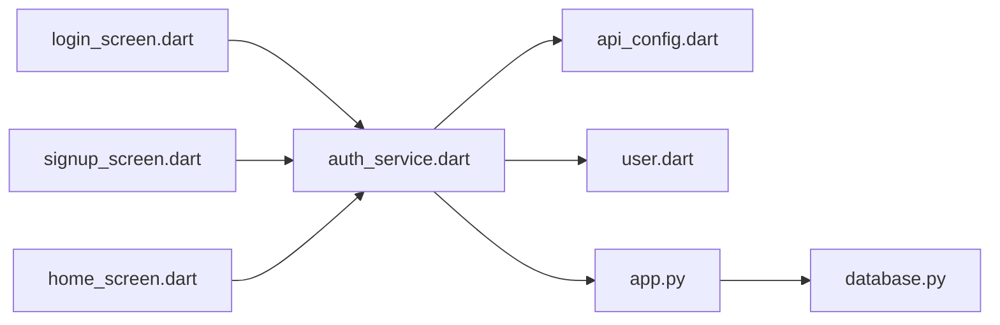

**Diagram sources**
- [login_screen.dart:1-444](file://lib/screens/login_screen.dart#L1-L444)
- [signup_screen.dart:1-480](file://lib/screens/signup_screen.dart#L1-L480)
- [home_screen.dart:1-800](file://lib/screens/home_screen.dart#L1-L800)
- [auth_service.dart:1-258](file://lib/services/auth_service.dart#L1-L258)
- [api_config.dart:1-20](file://lib/config/api_config.dart#L1-L20)
- [user.dart:1-29](file://lib/models/user.dart#L1-L29)
- [app.py:1-226](file://backend/app.py#L1-L226)
- [database.py:1-75](file://backend/database.py#L1-L75)

**Section sources**
- [auth_service.dart:1-258](file://lib/services/auth_service.dart#L1-L258)
- [app.py:1-226](file://backend/app.py#L1-L226)
- [database.py:1-75](file://backend/database.py#L1-L75)

## Performance Considerations
- Network timeouts: All HTTP requests use a fixed timeout to avoid indefinite hangs
- Secure storage: Tokens and sensitive data are stored using platform-secured storage
- Minimal payload: Only necessary fields are cached locally to reduce storage overhead
- Stateless backend: JWT-based authentication avoids server-side session storage, improving scalability
- Database indexing: Unique constraint on email prevents duplicates and supports efficient lookups

[No sources needed since this section provides general guidance]

## Troubleshooting Guide
- Cannot connect to server:
  - Ensure backend is running and reachable at the configured base URL
  - Check firewall and network settings for emulator/device connectivity
- Token missing or expired:
  - Re-authenticate to obtain a new token
  - Verify Authorization header format on subsequent requests
- Invalid credentials:
  - Confirm email and password correctness
  - Backend returns a generic error to prevent enumeration
- Duplicate registration:
  - Email already exists; use login instead
- Debugging tips:
  - Use the provided test script to validate backend endpoints independently
  - Inspect logs in the service layer for detailed error messages

**Section sources**
- [auth_service.dart:232-256](file://lib/services/auth_service.dart#L232-L256)
- [app.py:49-60](file://backend/app.py#L49-L60)
- [app.py:120-173](file://backend/app.py#L120-L173)
- [test_api.py:1-62](file://backend/test_api.py#L1-L62)

## Conclusion
Bon Voyage Pakistan implements a clean separation of concerns with robust authentication, secure token handling, and resilient error management. The Flutter frontend communicates with a stateless Flask backend using well-defined JSON contracts, while SQLite persists user data. Caching strategies ensure responsive UIs and reduced network usage. The documented flows provide a foundation for extending features such as profile updates and additional authenticated endpoints.