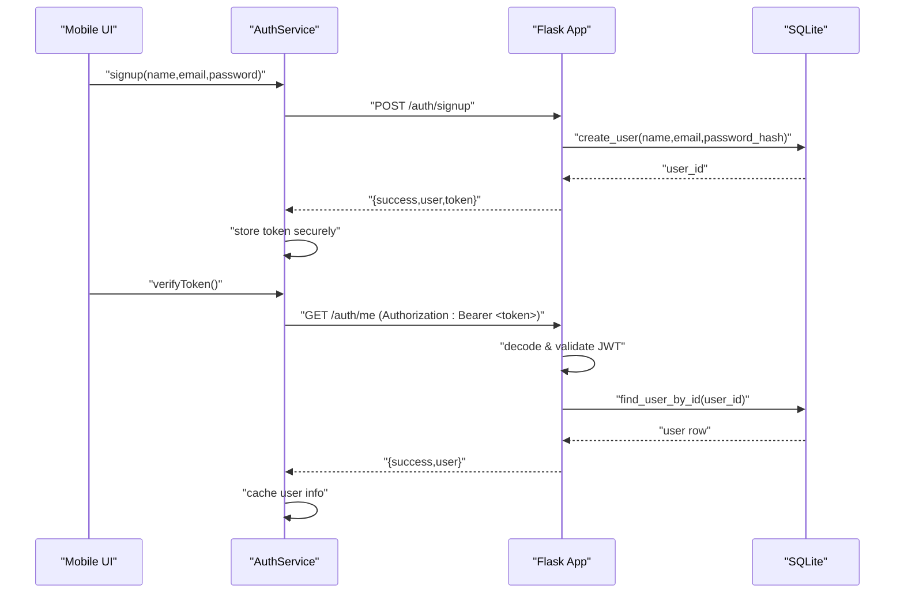
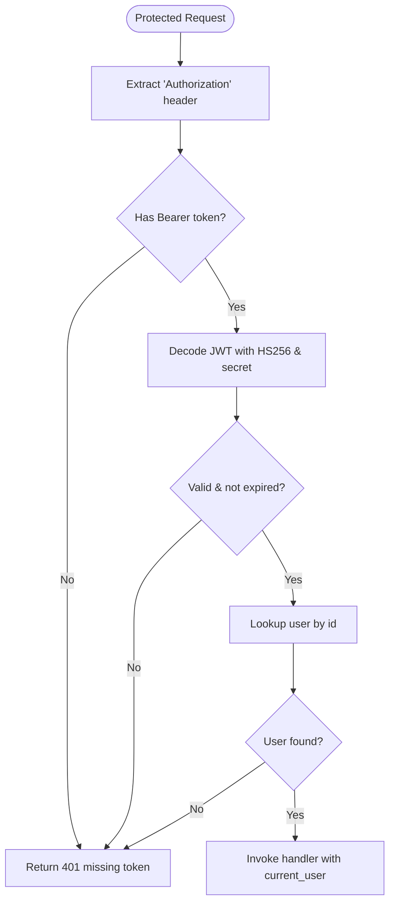
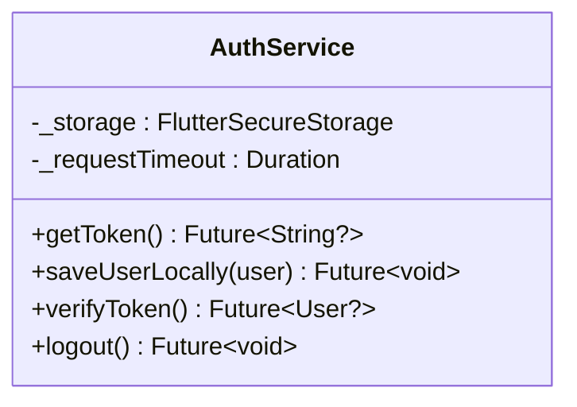
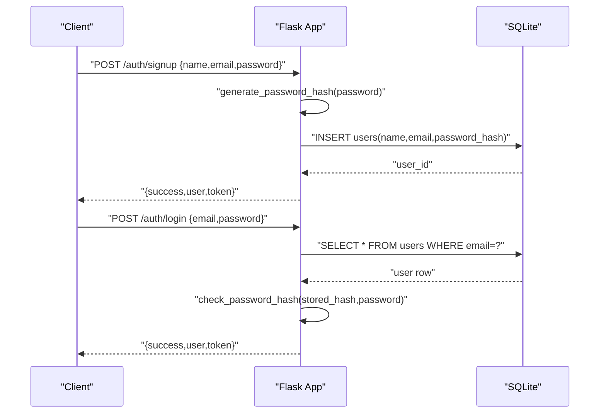
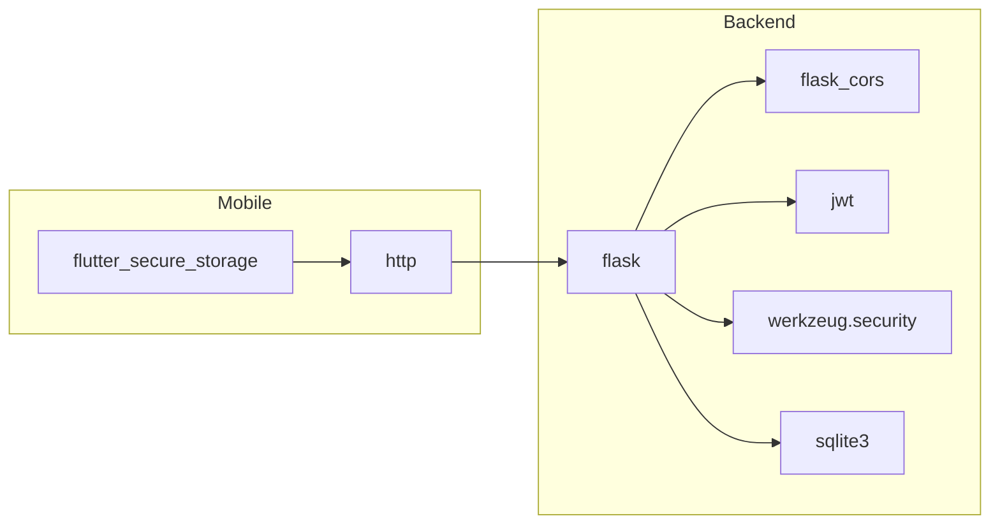

# Security Architecture

<cite>
**Referenced Files in This Document**
- [app.py](file://backend/app.py)
- [database.py](file://backend/database.py)
- [auth_service.dart](file://lib/services/auth_service.dart)
- [api_config.dart](file://lib/config/api_config.dart)
- [AndroidManifest.xml](file://android/app/src/main/AndroidManifest.xml)
- [pubspec.yaml](file://pubspec.yaml)
</cite>

## Table of Contents
1. Introduction
2. Project Structure
3. Core Components
4. Architecture Overview
5. Detailed Component Analysis
6. Dependency Analysis
7. Performance Considerations
8. Troubleshooting Guide
9. Conclusion
10. Appendices

## Introduction
This document describes the security architecture of the Bon Voyage Pakistan application, focusing on JWT-based authentication, secure token storage on mobile devices, password hashing on the backend, CORS configuration, input validation and sanitization, network security settings, session management, token expiration handling, logout mechanisms, and recommended best practices for mobile app and API security. It also outlines threat mitigation strategies and monitoring approaches applicable to this codebase.

## Project Structure
The project is a Flutter mobile app with a Flask backend:
- Backend (Flask): Implements authentication endpoints, JWT issuance/validation, password hashing, and SQLite-backed user storage.
- Mobile App (Flutter): Handles user registration/login flows, securely stores tokens using FlutterSecureStorage, and attaches Authorization headers to protected requests.

```mermaid
graph TB
subgraph "Mobile App"
A["AuthService<br/>Token storage & HTTP calls"]
B["ApiConfig<br/>Base URL & endpoints"]
end
subgraph "Backend"
C["Flask App<br/>Routes & JWT logic"]
D["Database Module<br/>SQLite queries"]
end
A --> |HTTP POST /auth/signup, /auth/login| C
A --> |HTTP GET /auth/me (Bearer)| C
C --> D
B --> A
```

**Diagram sources**
- [auth_service.dart:14-26](file://lib/services/auth_service.dart#L14-L26)
- [api_config.dart:5-19](file://lib/config/api_config.dart#L5-L19)
- [app.py:10-26](file://backend/app.py#L10-L26)
- [database.py:13-17](file://backend/database.py#L13-L17)

**Section sources**
- [app.py:10-26](file://backend/app.py#L10-L26)
- [auth_service.dart:14-26](file://lib/services/auth_service.dart#L14-L26)
- [api_config.dart:5-19](file://lib/config/api_config.dart#L5-L19)

## Core Components
- Authentication service (mobile): Manages signup/login flows, persists JWT securely, validates tokens by calling protected endpoints, and handles logout.
- Backend authentication: Provides signup/login routes, issues JWTs, validates tokens via decorator, and enforces minimal input validation.
- Secure storage: Uses FlutterSecureStorage with Android encrypted preferences to store tokens and cached user data.
- Database layer: SQLite schema with parameterized queries to prevent SQL injection; stores only password hashes.

Key responsibilities:
- Token lifecycle: creation, storage, verification, and cleanup.
- Password handling: server-side hashing and verification.
- Network security: timeouts, HTTPS guidance, and platform-level cleartext traffic considerations.

**Section sources**
- [auth_service.dart:14-62](file://lib/services/auth_service.dart#L14-L62)
- [app.py:33-82](file://backend/app.py#L33-L82)
- [database.py:20-74](file://backend/database.py#L20-L74)
- [pubspec.yaml:9-15](file://pubspec.yaml#L9-L15)

## Architecture Overview
The authentication flow uses stateless JWTs:
- On signup or login, the backend issues a signed JWT containing user identity and expiration.
- The mobile app stores the JWT securely and includes it in the Authorization header for protected requests.
- The backend validates the token on protected routes and returns user data if valid.



**Diagram sources**
- [auth_service.dart:73-115](file://lib/services/auth_service.dart#L73-L115)
- [auth_service.dart:168-202](file://lib/services/auth_service.dart#L168-L202)
- [app.py:109-153](file://backend/app.py#L109-L153)
- [app.py:186-193](file://backend/app.py#L186-L193)
- [database.py:39-64](file://backend/database.py#L39-L64)

## Detailed Component Analysis

### JWT Issuance and Validation (Backend)
- Token generation: Encodes user identifier and timestamps with an expiration derived from configuration.
- Token validation: Extracts Bearer token from Authorization header, decodes using HS256 and configured secret, resolves user, and handles expired or invalid tokens.
- Protected route pattern: Decorator injects current user into handlers.



**Diagram sources**
- [app.py:33-65](file://backend/app.py#L33-L65)
- [app.py:72-82](file://backend/app.py#L72-L82)

**Section sources**
- [app.py:33-82](file://backend/app.py#L33-L82)

### Secure Token Storage and Usage (Mobile)
- Storage: Uses FlutterSecureStorage with Android encrypted preferences to persist tokens and cached user fields.
- Usage: Attaches Authorization header when verifying or accessing protected endpoints; clears all auth data on logout or invalidation.
- Timeouts: All HTTP calls use a fixed timeout to avoid indefinite hangs.



**Diagram sources**
- [auth_service.dart:14-62](file://lib/services/auth_service.dart#L14-L62)
- [auth_service.dart:168-226](file://lib/services/auth_service.dart#L168-L226)

**Section sources**
- [auth_service.dart:14-62](file://lib/services/auth_service.dart#L14-L62)
- [auth_service.dart:168-226](file://lib/services/auth_service.dart#L168-L226)
- [pubspec.yaml:9-15](file://pubspec.yaml#L9-L15)

### Password Hashing and Verification (Backend)
- Registration: Passwords are hashed before storage using Werkzeug utilities.
- Login: Provided passwords are verified against stored hashes using secure comparison.



**Diagram sources**
- [app.py:109-153](file://backend/app.py#L109-L153)
- [app.py:156-183](file://backend/app.py#L156-L183)
- [database.py:39-64](file://backend/database.py#L39-L64)

**Section sources**
- [app.py:109-183](file://backend/app.py#L109-L183)
- [database.py:39-64](file://backend/database.py#L39-L64)

### Input Validation and Sanitization
- Email format validation on signup.
- Basic presence checks for required fields.
- Parameterized SQL queries to prevent SQL injection.
- Safe response mapping excludes sensitive fields like password hashes.

Recommendations:
- Enforce stronger password policies server-side.
- Add comprehensive input validation libraries and rate limiting.
- Implement consistent error messages that do not leak information.

**Section sources**
- [app.py:98-134](file://backend/app.py#L98-L134)
- [database.py:39-74](file://backend/database.py#L39-L74)

### CORS Configuration
- CORS is enabled globally for the Flask app. For production, restrict allowed origins to known domains and consider enabling credentials handling only when necessary.

**Section sources**
- [app.py:10-22](file://backend/app.py#L10-L22)

### Network Security and HTTPS
- Android manifest currently allows cleartext traffic. In production, enforce HTTPS-only communication and remove cleartext allowance.
- Configure ApiConfig to point to HTTPS endpoints in production environments.

**Section sources**
- [AndroidManifest.xml:5-9](file://android/app/src/main/AndroidManifest.xml#L5-L9)
- [api_config.dart:8-12](file://lib/config/api_config.dart#L8-L12)

### Session Management, Expiration, and Logout
- Stateless sessions via JWT with configurable expiration.
- Client verifies token validity by calling protected endpoint; invalid/expired tokens trigger local cleanup.
- Logout clears local storage and performs a best-effort call to the backend logout endpoint.

**Section sources**
- [app.py:24-26](file://backend/app.py#L24-L26)
- [app.py:196-206](file://backend/app.py#L196-L206)
- [auth_service.dart:168-226](file://lib/services/auth_service.dart#L168-L226)

## Dependency Analysis
- Mobile depends on http and flutter_secure_storage for networking and secure storage.
- Backend depends on Flask, flask-cors, PyJWT, Werkzeug, and sqlite3.
- Data persistence uses SQLite with parameterized queries.



**Diagram sources**
- [pubspec.yaml:9-15](file://pubspec.yaml#L9-L15)
- [app.py:10-16](file://backend/app.py#L10-L16)
- [database.py:6-7](file://backend/database.py#L6-L7)

**Section sources**
- [pubspec.yaml:9-15](file://pubspec.yaml#L9-L15)
- [app.py:10-16](file://backend/app.py#L10-L16)
- [database.py:6-7](file://backend/database.py#L6-L7)

## Performance Considerations
- Use short-lived JWTs with refresh strategies to limit exposure window.
- Apply request timeouts on the client to prevent UI freezes during network issues.
- Cache minimal user profile locally to reduce repeated network calls.
- Ensure database connections are closed promptly (already implemented).

[No sources needed since this section provides general guidance]

## Troubleshooting Guide
Common issues and mitigations:
- Missing or invalid token: Ensure Authorization header is set and token is present; verify backend secret and algorithm match.
- Expired token: Refresh or re-authenticate; client clears invalid tokens automatically.
- Network connectivity: Check device network and backend availability; timeouts are handled gracefully.
- Cleartext traffic: If deploying over HTTP, ensure Android manifest permits cleartext; otherwise migrate to HTTPS.

**Section sources**
- [auth_service.dart:168-226](file://lib/services/auth_service.dart#L168-L226)
- [AndroidManifest.xml:5-9](file://android/app/src/main/AndroidManifest.xml#L5-L9)

## Conclusion
The Bon Voyage Pakistan application implements a secure, stateless authentication model using JWTs with server-side password hashing and secure client-side token storage. Input validation and parameterized queries mitigate common injection risks. Production hardening should include strict CORS policies, HTTPS enforcement, strong secrets, rate limiting, and enhanced logging/monitoring.

[No sources needed since this section summarizes without analyzing specific files]

## Appendices

### Security Best Practices Checklist
- Enforce HTTPS everywhere; remove cleartext allowances in production.
- Rotate and protect JWT signing secrets; never embed secrets in source.
- Restrict CORS to trusted origins; avoid wildcard origins in production.
- Implement rate limiting and account lockout for authentication endpoints.
- Add structured logging and monitoring for auth events and anomalies.
- Validate and sanitize all inputs; prefer allowlists where possible.
- Keep dependencies updated and audit for vulnerabilities.

[No sources needed since this section provides general guidance]