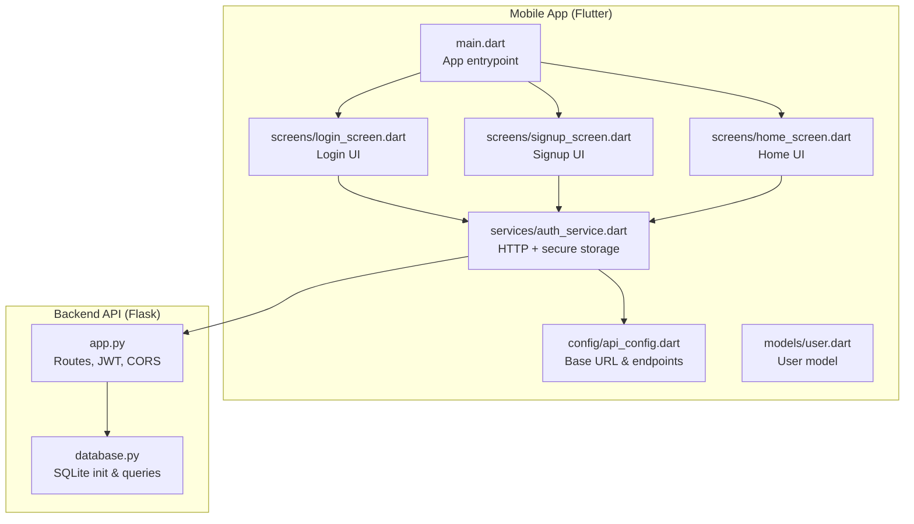
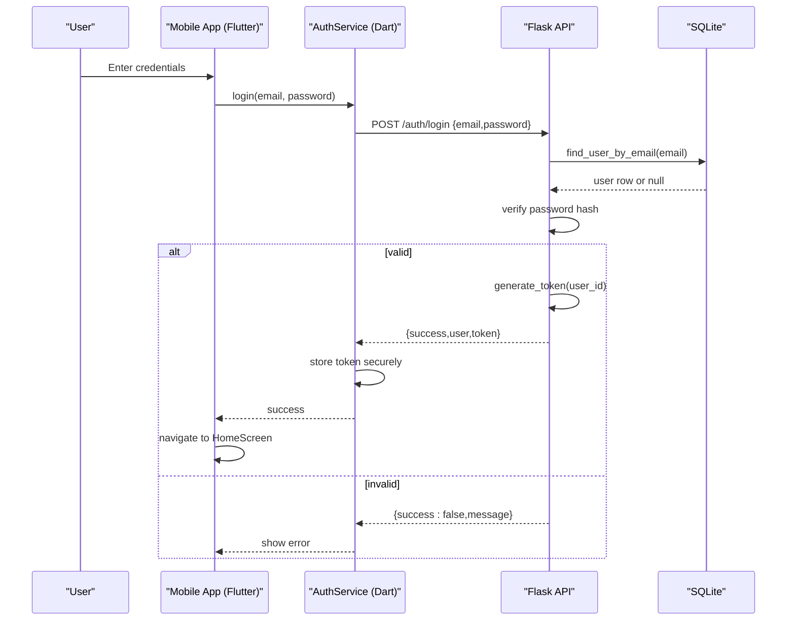
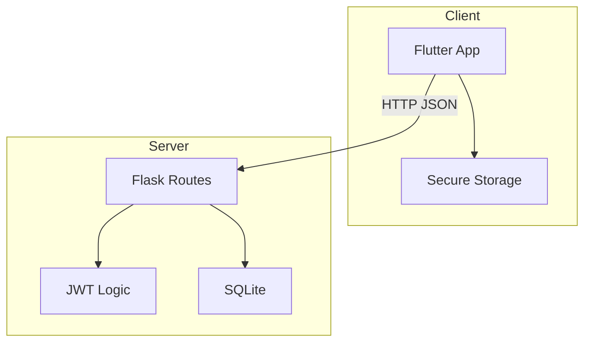
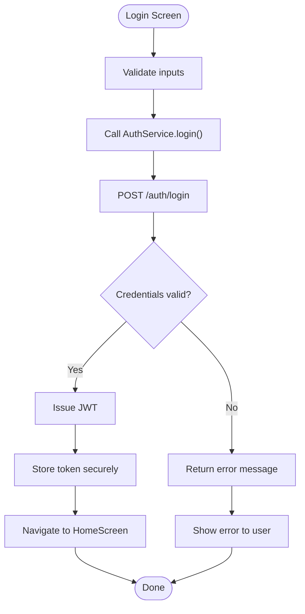
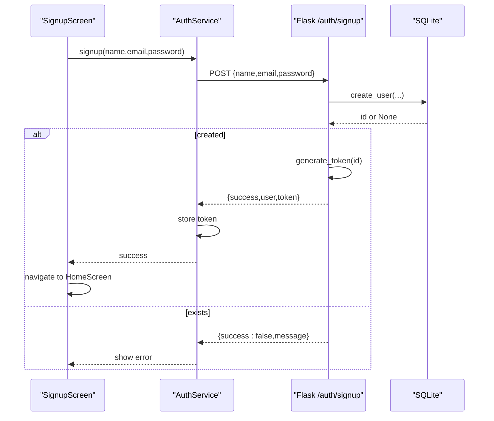
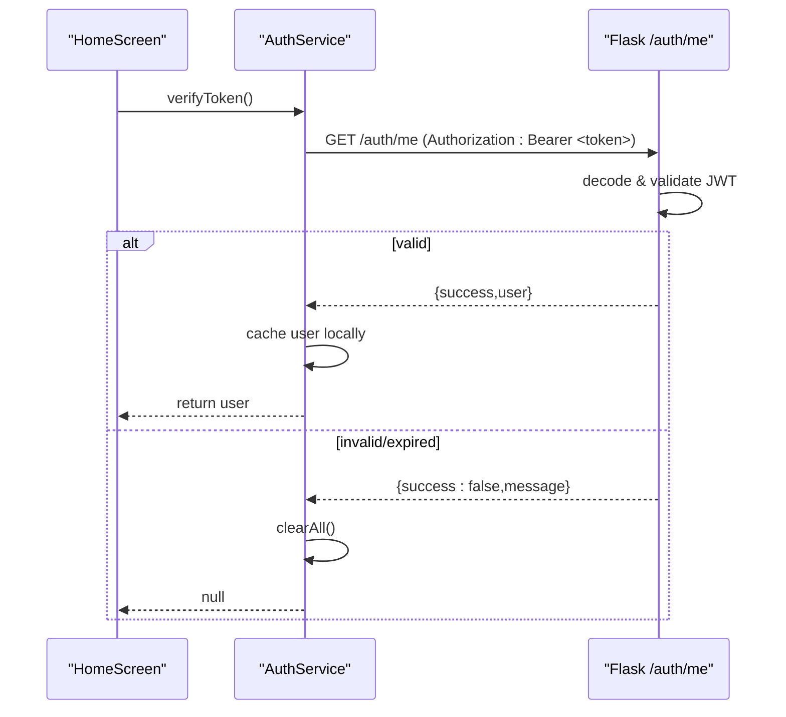
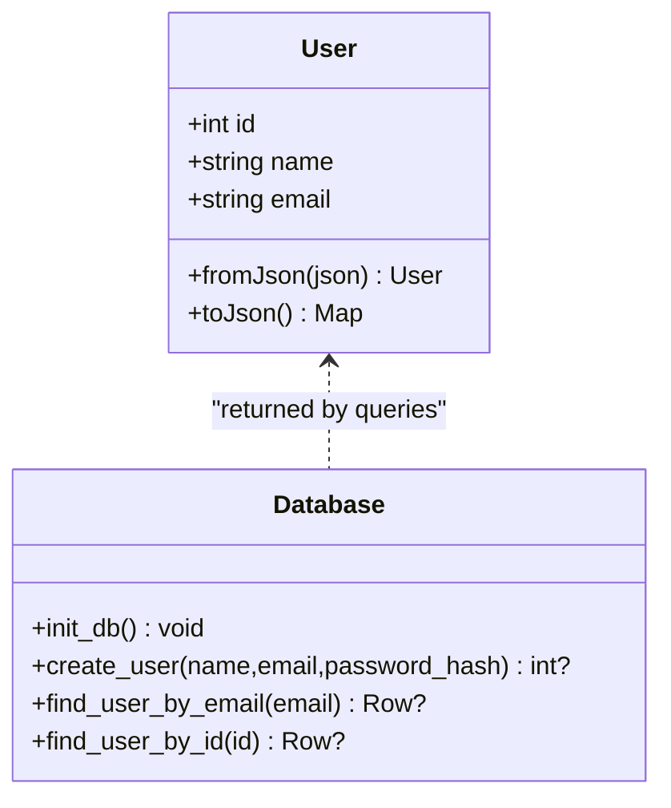
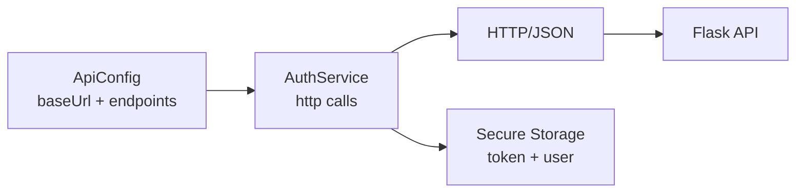
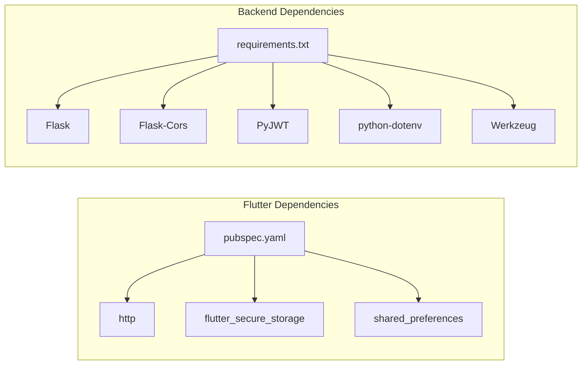

# System Architecture

<cite>
**Referenced Files in This Document**
- [app.py](file://backend/app.py)
- [database.py](file://backend/database.py)
- [requirements.txt](file://backend/requirements.txt)
- [main.dart](file://lib/main.dart)
- [api_config.dart](file://lib/config/api_config.dart)
- [auth_service.dart](file://lib/services/auth_service.dart)
- [user.dart](file://lib/models/user.dart)
- [login_screen.dart](file://lib/screens/login_screen.dart)
- [signup_screen.dart](file://lib/screens/signup_screen.dart)
- [home_screen.dart](file://lib/screens/home_screen.dart)
- [pubspec.yaml](file://pubspec.yaml)
</cite>

## Table of Contents
1. Introduction
2. Project Structure
3. Core Components
4. Architecture Overview
5. Detailed Component Analysis
6. Dependency Analysis
7. Performance Considerations
8. Troubleshooting Guide
9. Conclusion
10. Appendices

## Introduction
This document describes the system architecture for Bon Voyage Pakistan, a cross-platform mobile application built with Flutter and Dart that communicates with a Flask-based backend API server using REST over HTTP. The backend provides user authentication via JSON Web Tokens (JWT), persists user data in an SQLite database, and exposes endpoints for signup, login, profile retrieval, and logout. The mobile client manages secure token storage, handles network errors and timeouts, and orchestrates navigation between screens based on authentication state.

## Project Structure
The repository is organized into two primary layers:
- Mobile frontend (Flutter/Dart): Entry point, configuration, services, models, and UI screens.
- Backend API (Flask/Python): Authentication routes, JWT handling, and SQLite persistence.

**Diagram sources**
- [main.dart:1-47](file://lib/main.dart#L1-L47)
- [api_config.dart:1-20](file://lib/config/api_config.dart#L1-L20)
- [auth_service.dart:1-258](file://lib/services/auth_service.dart#L1-L258)
- [user.dart:1-29](file://lib/models/user.dart#L1-L29)
- [login_screen.dart:1-444](file://lib/screens/login_screen.dart#L1-L444)
- [signup_screen.dart:1-200](file://lib/screens/signup_screen.dart#L1-L200)
- [home_screen.dart:1-200](file://lib/screens/home_screen.dart#L1-L200)
- [app.py:1-226](file://backend/app.py#L1-L226)
- [database.py:1-75](file://backend/database.py#L1-L75)

**Section sources**
- [main.dart:1-47](file://lib/main.dart#L1-L47)
- [pubspec.yaml:1-31](file://pubspec.yaml#L1-L31)
- [app.py:1-226](file://backend/app.py#L1-L226)
- [database.py:1-75](file://backend/database.py#L1-L75)

## Core Components
- Mobile app entrypoint initializes theme and renders the root widget.
- Configuration centralizes the backend base URL and endpoint paths for consistent client calls.
- Authentication service encapsulates HTTP requests, secure token storage, and error handling.
- User model represents the authenticated user payload from the backend.
- Screens implement UI flows for login, signup, and home navigation, invoking the auth service.
- Backend defines RESTful routes for authentication, JWT issuance/validation, and a health check.
- Database module initializes SQLite schema and provides CRUD helpers for users.

**Section sources**
- [main.dart:1-47](file://lib/main.dart#L1-L47)
- [api_config.dart:1-20](file://lib/config/api_config.dart#L1-L20)
- [auth_service.dart:1-258](file://lib/services/auth_service.dart#L1-L258)
- [user.dart:1-29](file://lib/models/user.dart#L1-L29)
- [login_screen.dart:1-444](file://lib/screens/login_screen.dart#L1-L444)
- [signup_screen.dart:1-200](file://lib/screens/signup_screen.dart#L1-L200)
- [home_screen.dart:1-200](file://lib/screens/home_screen.dart#L1-L200)
- [app.py:1-226](file://backend/app.py#L1-L226)
- [database.py:1-75](file://backend/database.py#L1-L75)

## Architecture Overview
Bon Voyage Pakistan follows a client-server architecture:
- Flutter mobile app acts as the client, presenting UI and delegating authentication to the backend.
- Flask backend exposes REST endpoints under /auth/* for authentication operations.
- Communication uses HTTP with JSON payloads; protected endpoints require a Bearer JWT in the Authorization header.
- SQLite stores user credentials securely hashed on the server side.

**Diagram sources**
- [auth_service.dart:117-161](file://lib/services/auth_service.dart#L117-L161)
- [app.py:156-183](file://backend/app.py#L156-L183)
- [database.py:57-64](file://backend/database.py#L57-L64)

**Diagram sources**
- [api_config.dart:1-20](file://lib/config/api_config.dart#L1-L20)
- [auth_service.dart:1-258](file://lib/services/auth_service.dart#L1-L258)
- [app.py:1-226](file://backend/app.py#L1-L226)
- [database.py:1-75](file://backend/database.py#L1-L75)

## Detailed Component Analysis

### Authentication Flow (Login)
- The login screen collects email and password, then calls the authentication service.
- The service sends a POST request to the backend login endpoint.
- The backend validates credentials, issues a JWT, and returns user info.
- The service stores the token securely and navigates to the home screen.

**Diagram sources**
- [login_screen.dart:53-82](file://lib/screens/login_screen.dart#L53-L82)
- [auth_service.dart:117-161](file://lib/services/auth_service.dart#L117-L161)
- [app.py:156-183](file://backend/app.py#L156-L183)

**Section sources**
- [login_screen.dart:53-82](file://lib/screens/login_screen.dart#L53-L82)
- [auth_service.dart:117-161](file://lib/services/auth_service.dart#L117-L161)
- [app.py:156-183](file://backend/app.py#L156-L183)

### Authentication Flow (Signup)
- The signup screen gathers name, email, and password, then invokes the auth service.
- The backend creates a user record with a hashed password and returns a JWT.
- The service stores the token and navigates to the home screen.

**Diagram sources**
- [signup_screen.dart:57-87](file://lib/screens/signup_screen.dart#L57-L87)
- [auth_service.dart:68-115](file://lib/services/auth_service.dart#L68-L115)
- [app.py:109-153](file://backend/app.py#L109-L153)
- [database.py:39-54](file://backend/database.py#L39-L54)

**Section sources**
- [signup_screen.dart:57-87](file://lib/screens/signup_screen.dart#L57-L87)
- [auth_service.dart:68-115](file://lib/services/auth_service.dart#L68-L115)
- [app.py:109-153](file://backend/app.py#L109-L153)
- [database.py:39-54](file://backend/database.py#L39-L54)

### Protected Endpoint Access (/auth/me)
- On app start or when needed, the client verifies the stored token by calling GET /auth/me.
- The backend validates the JWT and returns the current user if valid.
- If invalid or expired, the client clears local auth state.

**Diagram sources**
- [auth_service.dart:163-202](file://lib/services/auth_service.dart#L163-L202)
- [app.py:186-193](file://backend/app.py#L186-L193)

**Section sources**
- [auth_service.dart:163-202](file://lib/services/auth_service.dart#L163-L202)
- [app.py:186-193](file://backend/app.py#L186-L193)

### Data Models and Persistence
- The User model maps backend JSON responses to a strongly typed object on the client.
- The backend persists users in SQLite with a unique email constraint and hashed passwords.

**Diagram sources**
- [user.dart:1-29](file://lib/models/user.dart#L1-L29)
- [database.py:20-75](file://backend/database.py#L20-L75)

**Section sources**
- [user.dart:1-29](file://lib/models/user.dart#L1-L29)
- [database.py:20-75](file://backend/database.py#L20-L75)

### Client-Server Communication Pattern
- Base URL and endpoints are centralized in configuration to support environment changes.
- All HTTP requests use JSON content type and include timeouts to prevent indefinite hangs.
- Secure storage holds the JWT and cached user details on the device.

**Diagram sources**
- [api_config.dart:1-20](file://lib/config/api_config.dart#L1-L20)
- [auth_service.dart:1-258](file://lib/services/auth_service.dart#L1-L258)

**Section sources**
- [api_config.dart:1-20](file://lib/config/api_config.dart#L1-L20)
- [auth_service.dart:1-258](file://lib/services/auth_service.dart#L1-L258)

## Dependency Analysis
- Flutter dependencies include HTTP client, secure storage, and shared preferences for local state.
- Backend dependencies include Flask, CORS, PyJWT, python-dotenv, and Werkzeug for routing, security, and configuration.

**Diagram sources**
- [pubspec.yaml:1-31](file://pubspec.yaml#L1-L31)
- [requirements.txt:1-6](file://backend/requirements.txt#L1-L6)

**Section sources**
- [pubspec.yaml:1-31](file://pubspec.yaml#L1-L31)
- [requirements.txt:1-6](file://backend/requirements.txt#L1-L6)

## Performance Considerations
- Timeouts: The client applies a timeout to all HTTP requests to avoid hanging UI during network issues.
- Local caching: User details are cached locally to reduce unnecessary network calls.
- Stateless tokens: JWT enables scalable authentication without server-side session storage.
- Minimal payload: Only necessary fields are sent and returned to reduce bandwidth.

[No sources needed since this section provides general guidance]

## Troubleshooting Guide
Common issues and resolutions:
- Cannot connect to server: Ensure the backend is running and the device/emulator can reach the configured base URL. Check firewall and network settings.
- Token missing or expired: Re-authenticate; the client clears invalid tokens automatically.
- Invalid credentials: Verify email and password; the backend returns a generic error to prevent enumeration.
- Timeout errors: Increase network reliability or adjust timeout behavior if needed.

**Section sources**
- [auth_service.dart:232-256](file://lib/services/auth_service.dart#L232-L256)
- [app.py:49-60](file://backend/app.py#L49-L60)
- [app.py:170-173](file://backend/app.py#L170-L173)

## Conclusion
Bon Voyage Pakistan employs a clean separation between a Flutter mobile frontend and a Flask backend API. The client manages secure token storage and robust error handling, while the backend enforces authentication via JWT and persists user data in SQLite. This design supports straightforward development workflows and can be adapted for production deployment with appropriate infrastructure and configuration changes.

[No sources needed since this section summarizes without analyzing specific files]

## Appendices

### Technology Stack
- Frontend: Flutter (cross-platform), Dart
- Backend: Flask (Python), PyJWT, Flask-CORS, Werkzeug, python-dotenv
- Database: SQLite
- Security: Password hashing with Werkzeug, JWT for stateless authentication

**Section sources**
- [pubspec.yaml:1-31](file://pubspec.yaml#L1-L31)
- [requirements.txt:1-6](file://backend/requirements.txt#L1-L6)
- [app.py:1-226](file://backend/app.py#L1-L226)

### Infrastructure Requirements
- Python environment: Install dependencies listed in requirements.txt; ensure Python version compatible with Flask 3.x.
- Flutter SDK: Install Flutter SDK and configure environment for target platforms (Android/iOS).
- Development tools: IDE with Flutter and Dart support; Android Studio or VS Code recommended.
- Environment variables: Configure SECRET_KEY and JWT_EXPIRATION_HOURS via .env for the backend.

**Section sources**
- [requirements.txt:1-6](file://backend/requirements.txt#L1-L6)
- [pubspec.yaml:1-31](file://pubspec.yaml#L1-L31)
- [app.py:24-26](file://backend/app.py#L24-L26)

### Deployment Topology
- Development:
  - Run Flask locally on port 5000; set baseUrl in ApiConfig to host IP or emulator loopback (e.g., 10.0.2.2 for Android Emulator).
  - Use debug mode for hot reload and detailed logs.
- Production:
  - Host Flask behind a reverse proxy (e.g., Nginx) with HTTPS termination.
  - Set a strong SECRET_KEY and appropriate JWT expiration.
  - Configure CORS to restrict origins to your domain(s).
  - Persist SQLite on reliable storage and consider backups; evaluate migration to a managed database for scale.

**Section sources**
- [api_config.dart:1-20](file://lib/config/api_config.dart#L1-L20)
- [app.py:21-26](file://backend/app.py#L21-L26)