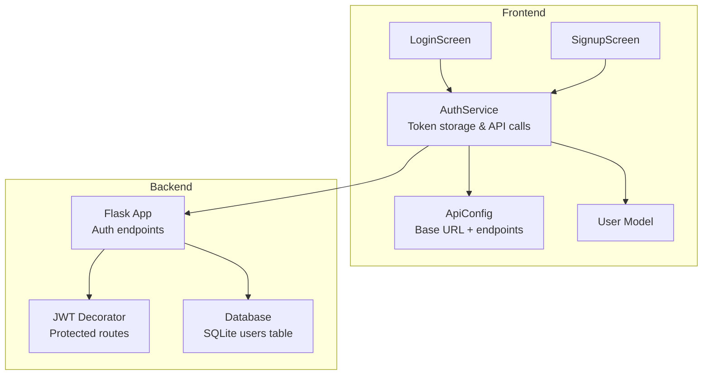
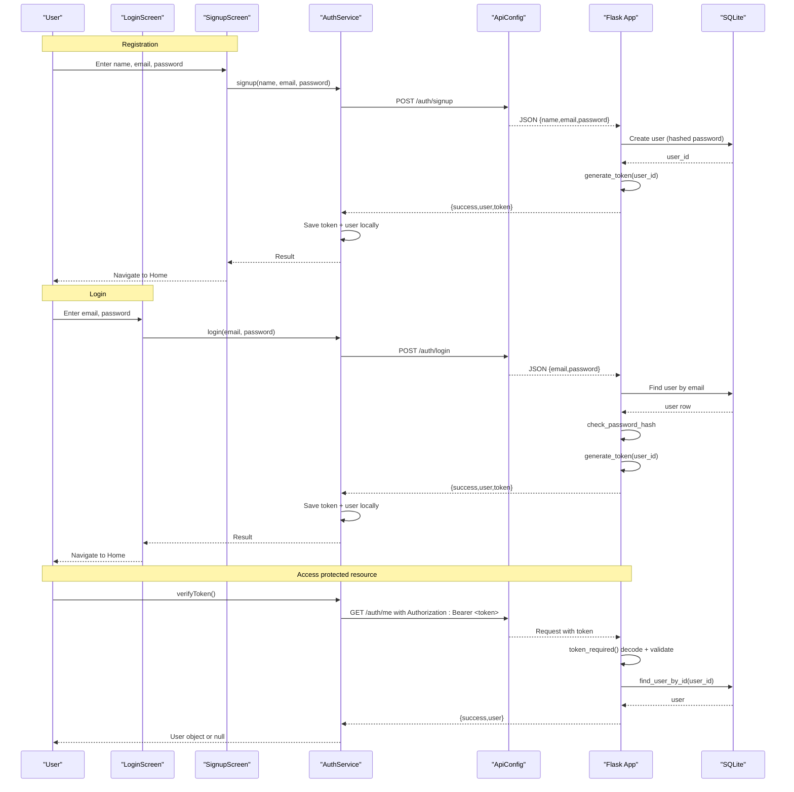
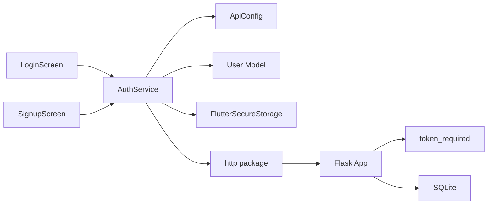

# Authentication System

<cite>
**Referenced Files in This Document**
- [auth_service.dart](file://lib/services/auth_service.dart)
- [app.py](file://backend/app.py)
- [database.py](file://backend/database.py)
- [user.dart](file://lib/models/user.dart)
- [api_config.dart](file://lib/config/api_config.dart)
- [login_screen.dart](file://lib/screens/login_screen.dart)
- [signup_screen.dart](file://lib/screens/signup_screen.dart)
- [main.dart](file://lib/main.dart)
</cite>

## Table of Contents
1. [Introduction](#introduction)
2. [Project Structure](#project-structure)
3. [Core Components](#core-components)
4. [Architecture Overview](#architecture-overview)
5. [Detailed Component Analysis](#detailed-component-analysis)
6. [Dependency Analysis](#dependency-analysis)
7. [Performance Considerations](#performance-considerations)
8. [Troubleshooting Guide](#troubleshooting-guide)
9. [Conclusion](#conclusion)

## Introduction
This document explains the complete authentication system for the Bon Voyage Pakistan application, covering user registration, login, session management, and JWT token handling across Flutter and Flask. It details how tokens are generated and validated, how secure storage is implemented using FlutterSecureStorage, and how protected routes are enforced on the backend. It also provides practical guidance for implementing authentication in custom screens, handling errors, and managing sessions across app restarts.

## Project Structure
The authentication system spans both frontend (Flutter) and backend (Flask):
- Frontend: AuthService orchestrates API calls and secure storage; Login/Signup screens drive user flows; ApiConfig centralizes endpoints; User model represents profile data.
- Backend: Flask app exposes auth endpoints, validates inputs, hashes passwords, issues JWTs, and protects routes with a decorator. SQLite stores user credentials securely via hashed passwords.

**Diagram sources**
- [auth_service.dart:10-26](file://lib/services/auth_service.dart#L10-L26)
- [api_config.dart:8-18](file://lib/config/api_config.dart#L8-L18)
- [app.py:21-26](file://backend/app.py#L21-L26)
- [app.py:33-65](file://backend/app.py#L33-L65)
- [database.py:20-36](file://backend/database.py#L20-L36)
- [user.dart:1-29](file://lib/models/user.dart#L1-L29)

**Section sources**
- [auth_service.dart:10-26](file://lib/services/auth_service.dart#L10-L26)
- [api_config.dart:8-18](file://lib/config/api_config.dart#L8-L18)
- [app.py:21-26](file://backend/app.py#L21-L26)
- [database.py:20-36](file://backend/database.py#L20-L36)
- [user.dart:1-29](file://lib/models/user.dart#L1-L29)

## Core Components
- AuthService (Flutter): Encapsulates signup, login, token verification, logout, and secure storage of JWT and cached user info. Uses FlutterSecureStorage with Android encrypted preferences. All HTTP requests use a timeout to prevent UI hangs.
- Flask Auth Endpoints: /auth/signup, /auth/login, /auth/me (protected), /auth/logout. Input validation, password hashing with Werkzeug, JWT generation, and error responses are centralized.
- Protected Route Decorator: Extracts Bearer token from Authorization header, decodes with HS256, verifies expiration, resolves current user, and injects it into route handlers.
- Database Layer: SQLite schema for users with unique email and hashed password. Provides create/find operations used by auth endpoints.
- User Model: Represents user identity fields returned by the backend and parsed on the client.

Key responsibilities:
- Registration: Validate input, hash password, create user, issue JWT, return user and token.
- Login: Validate input, verify password against stored hash, issue JWT, return user and token.
- Session Management: Store token securely, verify on app start or before protected actions, clear on logout or invalid/expired token.
- Security: Password hashing, token expiration, minimal error messages to avoid enumeration, secure storage on device.

**Section sources**
- [auth_service.dart:31-62](file://lib/services/auth_service.dart#L31-L62)
- [auth_service.dart:68-161](file://lib/services/auth_service.dart#L68-L161)
- [auth_service.dart:163-226](file://lib/services/auth_service.dart#L163-L226)
- [app.py:98-103](file://backend/app.py#L98-L103)
- [app.py:109-153](file://backend/app.py#L109-L153)
- [app.py:156-183](file://backend/app.py#L156-L183)
- [app.py:186-206](file://backend/app.py#L186-L206)
- [database.py:20-36](file://backend/database.py#L20-L36)
- [database.py:39-74](file://backend/database.py#L39-L74)
- [user.dart:1-29](file://lib/models/user.dart#L1-L29)

## Architecture Overview
End-to-end flow from registration to protected access:

**Diagram sources**
- [signup_screen.dart:57-87](file://lib/screens/signup_screen.dart#L57-L87)
- [login_screen.dart:53-82](file://lib/screens/login_screen.dart#L53-L82)
- [auth_service.dart:68-161](file://lib/services/auth_service.dart#L68-L161)
- [auth_service.dart:163-202](file://lib/services/auth_service.dart#L163-L202)
- [api_config.dart:8-18](file://lib/config/api_config.dart#L8-L18)
- [app.py:109-153](file://backend/app.py#L109-L153)
- [app.py:156-183](file://backend/app.py#L156-L183)
- [app.py:186-193](file://backend/app.py#L186-L193)
- [database.py:39-74](file://backend/database.py#L39-L74)

## Detailed Component Analysis

### Frontend AuthService
Responsibilities:
- Secure storage: Reads/writes token and cached user info using FlutterSecureStorage with Android encrypted preferences.
- API integration: Posts to signup and login endpoints; attaches Bearer token for verification; handles timeouts and connection errors.
- Token lifecycle: Saves token on success; clears all local auth data on logout or when token is invalid/expired; supports verifying token presence and validity.

Key methods:
- signup: Sends registration payload; persists token and user if successful; returns standardized result map.
- login: Authenticates user; persists token and user if successful; returns standardized result map.
- verifyToken: Calls /auth/me with Bearer token; updates cached user; clears local state if invalid/expired.
- logout: Best-effort call to /auth/logout; always clears local auth data.

Error handling:
- TimeoutException: Returns a user-friendly message indicating server unresponsiveness.
- ClientException: Indicates connectivity issues (e.g., wrong network or backend not running).
- Generic catch-all: Handles unexpected errors like JSON parsing failures.

Security considerations:
- Tokens are stored in encrypted SharedPreferences on Android.
- Requests include a 15-second timeout to avoid indefinite waits.
- On invalid/expired token, local state is cleared to force re-authentication.

**Section sources**
- [auth_service.dart:10-26](file://lib/services/auth_service.dart#L10-L26)
- [auth_service.dart:31-62](file://lib/services/auth_service.dart#L31-L62)
- [auth_service.dart:68-161](file://lib/services/auth_service.dart#L68-L161)
- [auth_service.dart:163-226](file://lib/services/auth_service.dart#L163-L226)
- [auth_service.dart:228-256](file://lib/services/auth_service.dart#L228-L256)

### Backend Authentication Endpoints
Endpoints:
- POST /auth/signup: Validates inputs, hashes password, creates user, generates JWT, returns user and token.
- POST /auth/login: Validates inputs, verifies password against stored hash, generates JWT, returns user and token.
- GET /auth/me: Protected route requiring valid Bearer token; returns current user.
- POST /auth/logout: Stateless endpoint for completeness; actual logout occurs on client by clearing token.

Password hashing:
- Uses Werkzeug’s generate_password_hash and check_password_hash to store and verify passwords securely.

JWT implementation:
- generate_token creates a payload with user_id, exp (expiration), and iat (issued at); encodes with HS256 using SECRET_KEY from environment.
- token_required extracts Bearer token, decodes with HS256, checks expiration, resolves user, and passes it to protected routes.

Input validation:
- Signup enforces non-empty name, valid email format, and minimum password length.
- Login ensures email and password are present.
- Errors avoid revealing whether an account exists to prevent enumeration.

Environment configuration:
- SECRET_KEY and JWT_EXPIRATION_HOURS loaded from .env; defaults provided for development.

**Section sources**
- [app.py:21-26](file://backend/app.py#L21-L26)
- [app.py:33-65](file://backend/app.py#L33-L65)
- [app.py:72-83](file://backend/app.py#L72-L83)
- [app.py:98-103](file://backend/app.py#L98-L103)
- [app.py:109-153](file://backend/app.py#L109-L153)
- [app.py:156-183](file://backend/app.py#L156-L183)
- [app.py:186-206](file://backend/app.py#L186-L206)

### Database Layer
Schema:
- users table includes id (auto-increment), name, email (unique), password_hash, created_at.

Operations:
- init_db: Creates the users table if missing.
- create_user: Inserts a new user; returns None on duplicate email.
- find_user_by_email/email lookup for login.
- find_user_by_id: Used by token_required to resolve current user.

Security notes:
- Only password_hash is stored; plaintext passwords never persisted.
- Unique constraint prevents duplicate accounts.

**Section sources**
- [database.py:20-36](file://backend/database.py#L20-L36)
- [database.py:39-74](file://backend/database.py#L39-L74)

### User Model
Represents user identity fields returned by the backend:
- Fields: id, name, email.
- Methods: fromJson for parsing backend responses; toJson for safe serialization (no sensitive fields).

Usage:
- Parsed in AuthService after successful signup/login and during token verification to update cached user info.

**Section sources**
- [user.dart:1-29](file://lib/models/user.dart#L1-L29)

### UI Integration: Login and Signup Screens
LoginScreen:
- Validates form inputs and calls AuthService.login.
- On success, navigates to HomeScreen; otherwise displays error banner.

SignupScreen:
- Enforces stronger password requirements on the client side.
- Calls AuthService.signup; on success, navigates to HomeScreen; otherwise shows error.

Both screens:
- Use loading states and animations for better UX.
- Handle navigation between Login and Signup.

**Section sources**
- [login_screen.dart:53-82](file://lib/screens/login_screen.dart#L53-L82)
- [signup_screen.dart:57-87](file://lib/screens/signup_screen.dart#L57-L87)

### Application Entry Point
main.dart initializes Flutter bindings and runs the root widget, which sets up theme management and renders the SplashScreen as the initial screen. Authentication state can be checked at startup (e.g., in SplashScreen) to route users appropriately.

**Section sources**
- [main.dart:1-47](file://lib/main.dart#L1-L47)

## Dependency Analysis
Component relationships:
- LoginScreen and SignupScreen depend on AuthService for authentication logic.
- AuthService depends on ApiConfig for endpoint URLs and uses http package for networking.
- AuthService persists tokens via FlutterSecureStorage and parses responses into User model.
- Backend Flask app depends on database module for user CRUD and uses Werkzeug for password hashing and PyJWT for token handling.
- Protected routes depend on token_required decorator to enforce authentication.

**Diagram sources**
- [login_screen.dart:53-82](file://lib/screens/login_screen.dart#L53-L82)
- [signup_screen.dart:57-87](file://lib/screens/signup_screen.dart#L57-L87)
- [auth_service.dart:68-161](file://lib/services/auth_service.dart#L68-L161)
- [api_config.dart:8-18](file://lib/config/api_config.dart#L8-L18)
- [user.dart:1-29](file://lib/models/user.dart#L1-L29)
- [app.py:33-65](file://backend/app.py#L33-L65)
- [database.py:39-74](file://backend/database.py#L39-L74)

**Section sources**
- [auth_service.dart:68-161](file://lib/services/auth_service.dart#L68-L161)
- [app.py:33-65](file://backend/app.py#L33-L65)
- [database.py:39-74](file://backend/database.py#L39-L74)

## Performance Considerations
- Network timeouts: All HTTP requests in AuthService have a fixed timeout to prevent UI freezes.
- Minimal payloads: Only necessary fields are sent/received; passwords are never echoed back.
- Local caching: Cached user info reduces repeated network calls for display purposes.
- Efficient storage: FlutterSecureStorage writes are lightweight; batched where appropriate.
- Backend efficiency: Single-pass validation and hashing; direct SQL queries without N+1 patterns.

[No sources needed since this section provides general guidance]

## Troubleshooting Guide
Common issues and resolutions:
- Cannot connect to server:
  - Ensure backend is running and reachable from the device/emulator.
  - Verify ApiConfig baseUrl matches your environment (e.g., 10.0.2.2 for Android emulator).
  - Check firewall/network settings and CORS configuration on the backend.
- Token expired or invalid:
  - verifyToken clears local state on invalid/expired tokens; re-login required.
  - Confirm JWT_EXPIRATION_HOURS and SECRET_KEY are consistent between client expectations and backend config.
- Duplicate email on signup:
  - Backend returns conflict when email already exists; prompt user to log in instead.
- Invalid email format:
  - Both frontend and backend validate email formats; ensure correct input.
- Password too short or weak:
  - Follow client-side requirements and backend constraints; guide users with hints.
- Logout not clearing session:
  - Logout always clears local state; if issues persist, ensure clearAll is called and no stale references remain.

Operational tips:
- Use health endpoint to confirm backend availability.
- Log request endpoints and outcomes for debugging (already instrumented in AuthService).
- Keep SECRET_KEY secret and rotate periodically in production.

**Section sources**
- [auth_service.dart:228-256](file://lib/services/auth_service.dart#L228-L256)
- [api_config.dart:8-18](file://lib/config/api_config.dart#L8-L18)
- [app.py:109-153](file://backend/app.py#L109-L153)
- [app.py:156-183](file://backend/app.py#L156-L183)
- [app.py:186-206](file://backend/app.py#L186-L206)

## Conclusion
The Bon Voyage Pakistan authentication system combines secure client-side storage with robust backend validation and JWT-based protection. Registration and login flows are streamlined through dedicated screens that integrate with AuthService, while the backend enforces security via password hashing, token expiration, and protected routes. By following the documented practices—input validation, secure storage, and proper error handling—you can implement reliable authentication across custom screens and maintain resilient sessions across app restarts.

[No sources needed since this section summarizes without analyzing specific files]