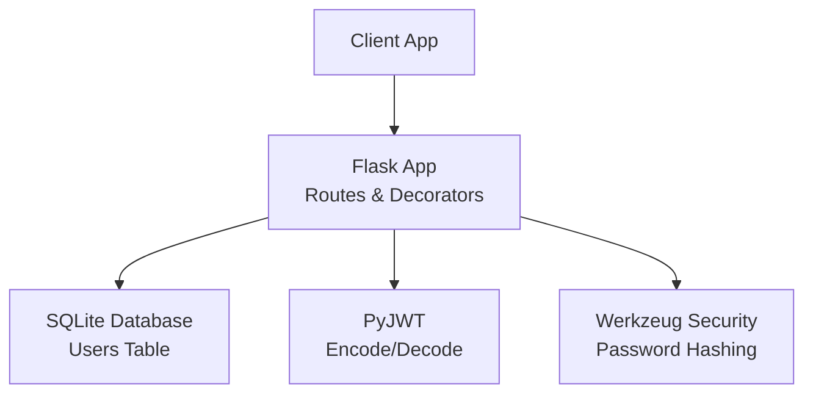
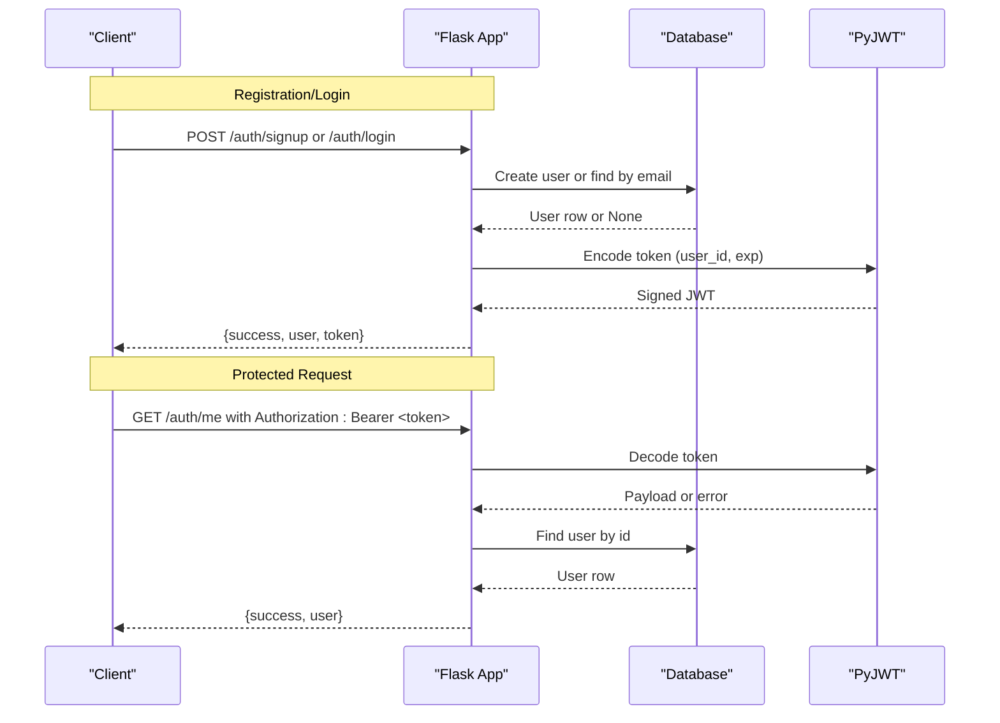
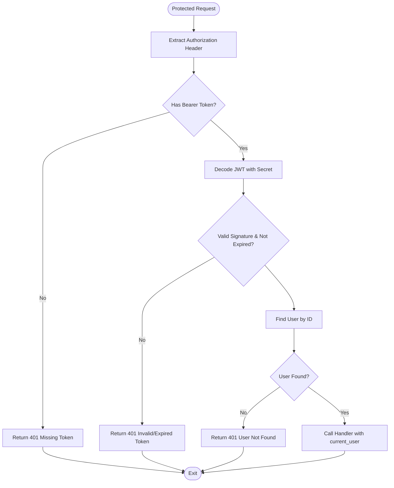
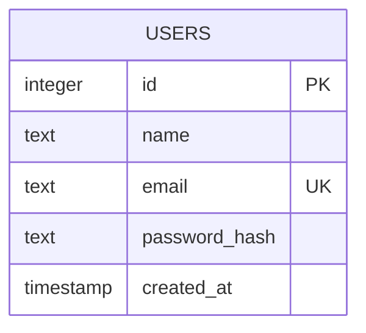
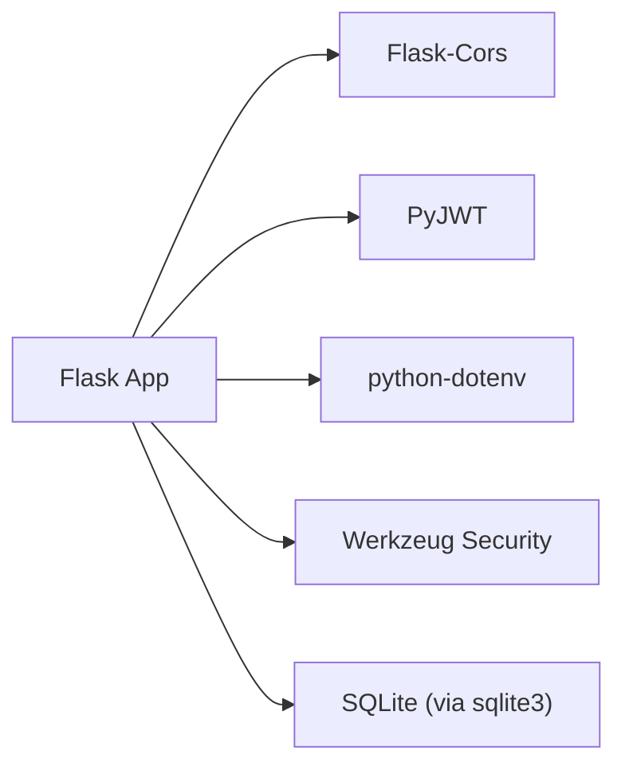

# Backend Authentication

<cite>
**Referenced Files in This Document**
- [app.py](file://backend/app.py)
- [database.py](file://backend/database.py)
- [requirements.txt](file://backend/requirements.txt)
- [test_api.py](file://backend/test_api.py)
</cite>

## Table of Contents
1. [Introduction](#introduction)
2. [Project Structure](#project-structure)
3. [Core Components](#core-components)
4. [Architecture Overview](#architecture-overview)
5. [Detailed Component Analysis](#detailed-component-analysis)
6. [Dependency Analysis](#dependency-analysis)
7. [Performance Considerations](#performance-considerations)
8. [Troubleshooting Guide](#troubleshooting-guide)
9. [Conclusion](#conclusion)
10. [Appendices](#appendices)

## Introduction
This document explains the backend authentication system built with Flask. It covers JWT token generation and validation, password hashing using Werkzeug security utilities, protected route decorators, and the authentication endpoints. It also details database operations for user management, session handling considerations, and security best practices. Finally, it provides guidance on implementing custom middleware, handling authentication errors, and extending the system with role-based access control.

## Project Structure
The authentication logic is implemented in a small, focused backend:
- app.py: Flask application, routes, JWT helpers, and decorator
- database.py: SQLite connection, schema initialization, and user queries
- requirements.txt: Python dependencies
- test_api.py: Quick smoke tests demonstrating endpoint usage

**Diagram sources**
- [app.py:1-226](file://backend/app.py#L1-L226)
- [database.py:1-75](file://backend/database.py#L1-L75)
- [requirements.txt:1-6](file://backend/requirements.txt#L1-L6)

**Section sources**
- [app.py:1-226](file://backend/app.py#L1-L226)
- [database.py:1-75](file://backend/database.py#L1-L75)
- [requirements.txt:1-6](file://backend/requirements.txt#L1-L6)

## Core Components
- JWT Token Lifecycle
  - Generation: A token is created with a payload containing the user identifier and expiration time, signed with a secret key.
  - Validation: Protected routes decode the token from the Authorization header, verify signature and expiry, and resolve the current user from the database.
- Password Hashing
  - Registration hashes passwords using secure hashing utilities before storing them in the database.
  - Login verifies provided passwords against stored hashes without exposing which field failed.
- Protected Route Decorator
  - Extracts Bearer tokens, decodes and validates them, resolves the user, and injects the authenticated user into protected handlers.
- Database Layer
  - Initializes the users table and provides functions to create users and look them up by email or id.

Key implementation references:
- JWT generation and decoding: [app.py:72-82](file://backend/app.py#L72-L82), [app.py:52-60](file://backend/app.py#L52-L60)
- Password hashing and verification: [app.py:136-137](file://backend/app.py#L136-L137), [app.py:172](file://backend/app.py#L172)
- Protected route decorator: [app.py:33-65](file://backend/app.py#L33-L65)
- User database operations: [database.py:20-36](file://backend/database.py#L20-L36), [database.py:39-54](file://backend/database.py#L39-L54), [database.py:57-74](file://backend/database.py#L57-L74)

**Section sources**
- [app.py:33-82](file://backend/app.py#L33-L82)
- [database.py:20-74](file://backend/database.py#L20-L74)

## Architecture Overview
The authentication flow uses stateless JWTs. Clients obtain a token via registration or login and include it in subsequent requests to protected endpoints. The server validates the token and authorizes access based on the embedded user identity.

**Diagram sources**
- [app.py:109-183](file://backend/app.py#L109-L183)
- [app.py:186-193](file://backend/app.py#L186-L193)
- [app.py:72-82](file://backend/app.py#L72-L82)
- [app.py:52-60](file://backend/app.py#L52-L60)
- [database.py:39-74](file://backend/database.py#L39-L74)

## Detailed Component Analysis

### Authentication Endpoints

#### POST /auth/signup
- Purpose: Register a new user and return a JWT.
- Request body: name, email, password.
- Behavior:
  - Validates presence and format of fields.
  - Hashes password securely.
  - Creates user in the database; returns conflict if duplicate email.
  - Generates and returns a JWT along with sanitized user info.
- Responses:
  - 201 Created: success, message, user, token
  - 400 Bad Request: validation errors
  - 409 Conflict: duplicate email

References:
- Endpoint and logic: [app.py:109-153](file://backend/app.py#L109-L153)
- Email validation helper: [app.py:98-102](file://backend/app.py#L98-L102)
- Password hashing: [app.py:136-137](file://backend/app.py#L136-L137)
- User creation: [database.py:39-54](file://backend/database.py#L39-L54)

#### POST /auth/login
- Purpose: Authenticate an existing user and return a JWT.
- Request body: email, password.
- Behavior:
  - Validates required fields.
  - Looks up user by email and verifies password hash.
  - Returns generic error for invalid credentials to prevent enumeration.
  - Generates and returns a JWT along with sanitized user info.
- Responses:
  - 200 OK: success, message, user, token
  - 400 Bad Request: missing fields
  - 401 Unauthorized: invalid credentials

References:
- Endpoint and logic: [app.py:156-183](file://backend/app.py#L156-L183)
- Password verification: [app.py:172](file://backend/app.py#L172)
- User lookup: [database.py:57-64](file://backend/database.py#L57-L64)

#### GET /auth/me
- Purpose: Return the currently authenticated user’s profile.
- Authorization: Requires valid Bearer token.
- Behavior:
  - Decodes token and resolves user from the database.
  - Returns sanitized user data.
- Responses:
  - 200 OK: success, user
  - 401 Unauthorized: missing, expired, or invalid token; user not found

References:
- Protected route and response: [app.py:186-193](file://backend/app.py#L186-L193)
- Token validation and user resolution: [app.py:33-65](file://backend/app.py#L33-L65)

#### POST /auth/logout
- Purpose: Logout endpoint for API completeness.
- Behavior:
  - Stateless logout; client should discard its token.
- Responses:
  - 200 OK: success, message

References:
- Endpoint: [app.py:196-206](file://backend/app.py#L196-L206)

Note: The repository implements /auth/signup rather than /auth/register. Functionally they serve the same purpose.

**Section sources**
- [app.py:109-206](file://backend/app.py#L109-L206)
- [database.py:39-74](file://backend/database.py#L39-L74)

### JWT Token Generation and Validation

- Generation
  - Encodes user_id and expiration into a signed token using HS256.
  - Expiration duration is configurable via environment variable.
- Validation
  - Extracts Bearer token from Authorization header.
  - Decodes and verifies signature and expiration.
  - Resolves user by id from the database and injects it into protected handlers.

**Diagram sources**
- [app.py:33-65](file://backend/app.py#L33-L65)
- [app.py:72-82](file://backend/app.py#L72-L82)

**Section sources**
- [app.py:33-82](file://backend/app.py#L33-L82)

### Password Hashing and Verification
- Registration hashes passwords before storage using secure hashing utilities.
- Login compares provided plaintext against stored hashes.
- Errors are generic to avoid leaking whether an email exists.

References:
- Hashing at signup: [app.py:136-137](file://backend/app.py#L136-L137)
- Verification at login: [app.py:172](file://backend/app.py#L172)

**Section sources**
- [app.py:136-137](file://backend/app.py#L136-L137)
- [app.py:172](file://backend/app.py#L172)

### Database Operations and Schema
- Schema: users table with id, name, email (unique), password_hash, created_at.
- Functions:
  - init_db: creates table if missing
  - create_user: inserts user and returns id or None on duplicate
  - find_user_by_email/email lookup
  - find_user_by_id/id lookup

**Diagram sources**
- [database.py:25-33](file://backend/database.py#L25-L33)

**Section sources**
- [database.py:20-74](file://backend/database.py#L20-L74)

### Protected Route Decorator
- Extracts Bearer token from Authorization header.
- Decodes token, checks expiration, and resolves user.
- Injects current_user into protected handlers.
- Returns standardized 401 responses for common auth failures.

References:
- Decorator implementation: [app.py:33-65](file://backend/app.py#L33-L65)

**Section sources**
- [app.py:33-65](file://backend/app.py#L33-L65)

## Dependency Analysis
External dependencies used by the authentication system:
- Flask and Flask-Cors for routing and CORS
- PyJWT for token encoding/decoding
- python-dotenv for loading configuration
- Werkzeug for secure password hashing

**Diagram sources**
- [requirements.txt:1-6](file://backend/requirements.txt#L1-L6)
- [app.py:10-16](file://backend/app.py#L10-L16)
- [database.py:6-17](file://backend/database.py#L6-L17)

**Section sources**
- [requirements.txt:1-6](file://backend/requirements.txt#L1-L6)
- [app.py:10-16](file://backend/app.py#L10-L16)
- [database.py:6-17](file://backend/database.py#L6-L17)

## Performance Considerations
- Use short-lived JWTs and refresh strategies to limit exposure window.
- Ensure SECRET_KEY is strong and managed via environment variables.
- Keep database connections short-lived; reuse where appropriate.
- Add rate limiting on sensitive endpoints (login/signup) to mitigate brute-force attempts.
- Consider adding request logging and monitoring for auth events.

[No sources needed since this section provides general guidance]

## Troubleshooting Guide
Common issues and resolutions:
- Missing token on protected routes: ensure Authorization header includes Bearer token.
- Invalid or expired token: regenerate token after login; check server clock and expiration settings.
- Duplicate email during signup: use unique email per account.
- Generic credential errors: verify correct email/password; errors intentionally do not reveal which field failed.

References:
- Error handling in decorator: [app.py:49-60](file://backend/app.py#L49-L60)
- Signup duplicate handling: [app.py:140-142](file://backend/app.py#L140-L142), [database.py:52-54](file://backend/database.py#L52-L54)
- Login generic error: [app.py:170-173](file://backend/app.py#L170-L173)

**Section sources**
- [app.py:49-60](file://backend/app.py#L49-L60)
- [app.py:140-142](file://backend/app.py#L140-L142)
- [database.py:52-54](file://backend/database.py#L52-L54)
- [app.py:170-173](file://backend/app.py#L170-L173)

## Conclusion
The backend provides a minimal, secure authentication system using Flask, JWT, and Werkzeug. Tokens are generated on successful registration or login and validated on protected routes. Passwords are hashed securely, and database operations are straightforward. To extend the system, add role-based access control, refresh tokens, and enhanced rate limiting and audit logging.

[No sources needed since this section summarizes without analyzing specific files]

## Appendices

### API Reference Summary
- POST /auth/signup
  - Request: name, email, password
  - Response: success, message, user, token
  - Status codes: 201, 400, 409
- POST /auth/login
  - Request: email, password
  - Response: success, message, user, token
  - Status codes: 200, 400, 401
- GET /auth/me
  - Headers: Authorization: Bearer <token>
  - Response: success, user
  - Status codes: 200, 401
- POST /auth/logout
  - Response: success, message
  - Status code: 200

References:
- Endpoints and responses: [app.py:109-206](file://backend/app.py#L109-L206)

**Section sources**
- [app.py:109-206](file://backend/app.py#L109-L206)

### Extending with Role-Based Access Control (RBAC)
- Add roles to the users table and include role claims in the JWT payload.
- Create a role_required decorator that checks the user’s role from the resolved current_user.
- Apply role_required alongside token_required on protected endpoints.

Conceptual steps:
- Extend schema to store role(s).
- Include role in token payload during generation.
- Validate role in a new decorator before allowing access.

[No sources needed since this section describes conceptual extension]

### Custom Middleware Example Concept
- Implement a middleware function that inspects incoming requests for Authorization headers.
- Decode and validate tokens early in the pipeline.
- Attach current_user to the request context for downstream handlers.

[No sources needed since this section describes conceptual middleware]

### Session Handling Notes
- The system is stateless; no server-side sessions are maintained.
- Clients must store and send tokens securely (e.g., HTTP-only cookies or secure storage).
- Logout is client-driven; the server does not revoke tokens until they expire.

[No sources needed since this section provides general guidance]

### Running and Testing
- Use the included test script to exercise endpoints end-to-end.
- Ensure the server is running and reachable at the configured base URL.

References:
- Test script usage: [test_api.py:1-62](file://backend/test_api.py#L1-L62)

**Section sources**
- [test_api.py:1-62](file://backend/test_api.py#L1-L62)