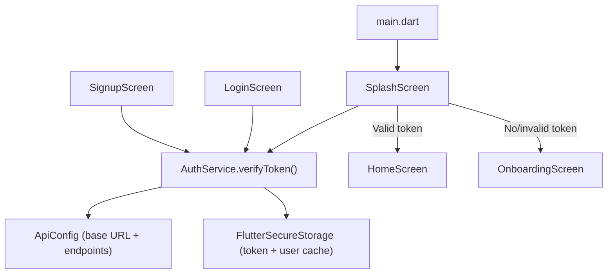
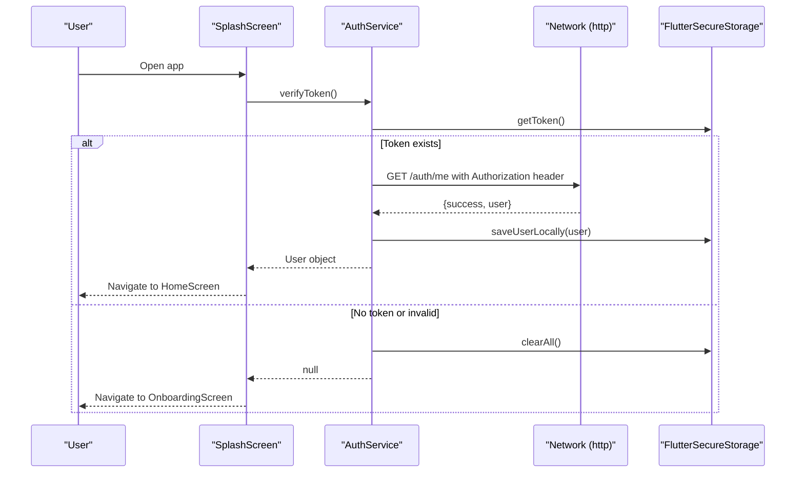
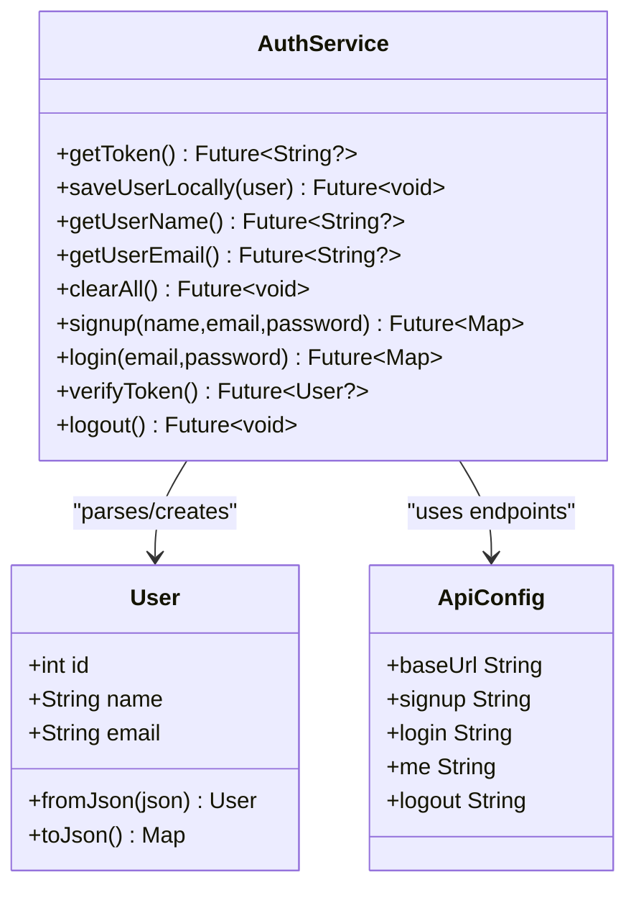
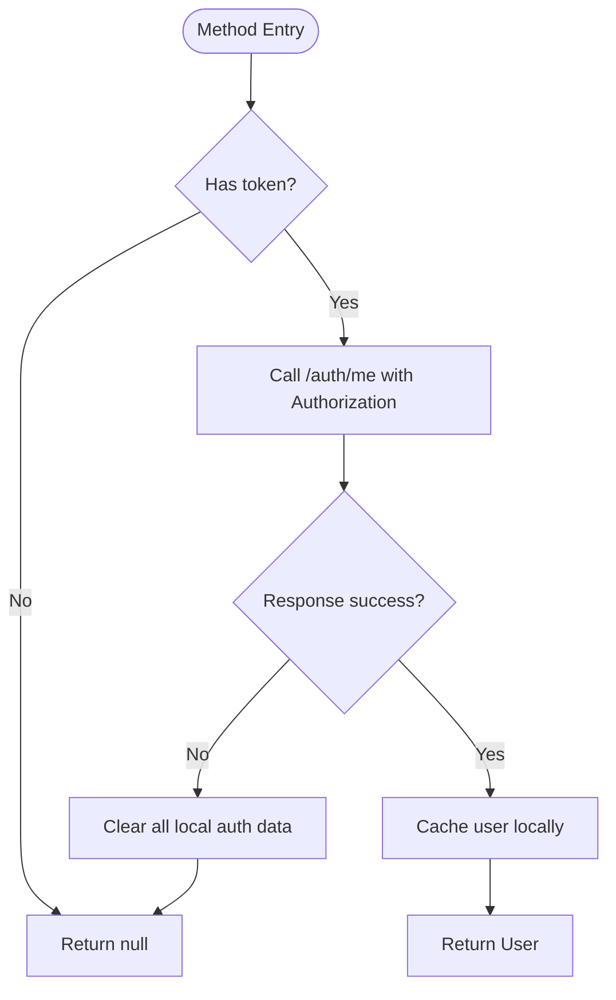
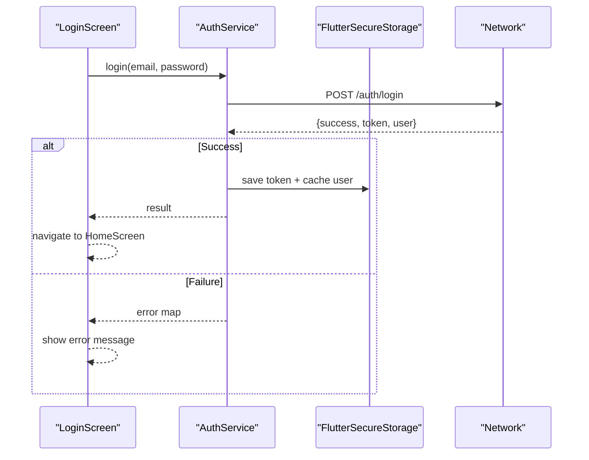
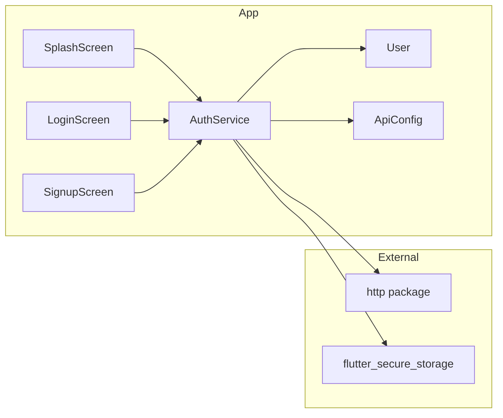

# Frontend Authentication

<cite>
**Referenced Files in This Document**
- [auth_service.dart](file://lib/services/auth_service.dart)
- [user.dart](file://lib/models/user.dart)
- [api_config.dart](file://lib/config/api_config.dart)
- [splash_screen.dart](file://lib/screens/splash_screen.dart)
- [login_screen.dart](file://lib/screens/login_screen.dart)
- [signup_screen.dart](file://lib/screens/signup_screen.dart)
- [main.dart](file://lib/main.dart)
- [pubspec.yaml](file://pubspec.yaml)
</cite>

## Table of Contents
1. Introduction
2. Project Structure
3. Core Components
4. Architecture Overview
5. Detailed Component Analysis
6. Dependency Analysis
7. Performance Considerations
8. Troubleshooting Guide
9. Conclusion

## Introduction
This document explains the frontend authentication implementation for the Bon Voyage Pakistan Flutter application. It focuses on the AuthService class, secure storage of JWT tokens and user data using FlutterSecureStorage, HTTP request handling with timeouts and error strategies, and how screens integrate authentication flows to manage user sessions across app restarts. It also covers the User model structure, API configuration management, and integration patterns with other components.

## Project Structure
The authentication logic is organized into focused layers:
- Services: AuthService encapsulates all authentication operations and secure storage interactions.
- Models: User represents the authenticated user entity returned by the backend.
- Config: ApiConfig centralizes base URL and endpoint definitions.
- Screens: SplashScreen orchestrates initial routing based on token validity; LoginScreen and SignupScreen implement user-facing flows.
- App entry: main.dart initializes the app and provides the root widget tree.

**Diagram sources**
- [main.dart:1-47](file://lib/main.dart#L1-L47)
- [splash_screen.dart:1-45](file://lib/screens/splash_screen.dart#L1-L45)
- [auth_service.dart:10-62](file://lib/services/auth_service.dart#L10-L62)
- [api_config.dart:1-20](file://lib/config/api_config.dart#L1-L20)

**Section sources**
- [main.dart:1-47](file://lib/main.dart#L1-L47)
- [splash_screen.dart:1-45](file://lib/screens/splash_screen.dart#L1-L45)
- [auth_service.dart:10-62](file://lib/services/auth_service.dart#L10-L62)
- [api_config.dart:1-20](file://lib/config/api_config.dart#L1-L20)

## Core Components
- AuthService: Static service providing signup, login, logout, token verification, and secure storage helpers. All HTTP calls use a consistent timeout and centralized error mapping.
- User: Immutable model with id, name, email and JSON serialization helpers used to parse backend responses.
- ApiConfig: Centralized constants for base URL and auth endpoints, making environment changes straightforward.

Key responsibilities:
- Securely store and retrieve JWT tokens and cached user info via FlutterSecureStorage.
- Perform network requests with timeouts and structured error responses.
- Maintain session state by validating tokens at app start and clearing them on logout or invalidation.

**Section sources**
- [auth_service.dart:10-62](file://lib/services/auth_service.dart#L10-L62)
- [user.dart:1-29](file://lib/models/user.dart#L1-L29)
- [api_config.dart:1-20](file://lib/config/api_config.dart#L1-L20)

## Architecture Overview
Authentication follows a clear separation of concerns:
- UI screens trigger actions (login, signup, logout).
- AuthService handles networking, persistence, and error mapping.
- ApiConfig defines endpoints and base URL.
- SplashScreen determines initial route based on token validity.

**Diagram sources**
- [splash_screen.dart:1-45](file://lib/screens/splash_screen.dart#L1-L45)
- [auth_service.dart:163-202](file://lib/services/auth_service.dart#L163-L202)
- [api_config.dart:14-18](file://lib/config/api_config.dart#L14-L18)

## Detailed Component Analysis

### AuthService
Responsibilities:
- Secure storage: read/write/delete token and cached user fields.
- Authentication methods: signup, login, logout, verifyToken.
- Networking: HTTP POST/GET with JSON payloads and Authorization headers where needed.
- Error handling: TimeoutException, ClientException, and generic errors mapped to consistent response shapes.

Important behaviors:
- Every HTTP call uses a fixed timeout to prevent indefinite hangs.
- Successful signup/login persists token and caches user details locally.
- verifyToken validates the stored token; on failure it clears local state.
- logout attempts a best-effort server notification but always clears local state.

**Diagram sources**
- [auth_service.dart:10-62](file://lib/services/auth_service.dart#L10-L62)
- [auth_service.dart:68-226](file://lib/services/auth_service.dart#L68-L226)
- [user.dart:1-29](file://lib/models/user.dart#L1-L29)
- [api_config.dart:1-20](file://lib/config/api_config.dart#L1-L20)

#### Authentication Methods
- signup: Sends name, email, password to the backend. On success, stores token and caches user info. Returns a standardized map indicating success/failure and message.
- login: Sends email and password. On success, stores token and caches user info. Returns a standardized map.
- verifyToken: Reads stored token and calls /auth/me. If valid, updates cached user and returns the User; otherwise clears local state and returns null.
- logout: Best-effort call to /auth/logout with Authorization header if token exists, then clears all local auth data.

HTTP and error handling:
- Timeouts: Each request applies a fixed timeout to avoid hanging.
- Errors: TimeoutException maps to a timeout message; ClientException maps to connection error; other exceptions map to a generic error message.
- Headers: Content-Type set to application/json; Authorization header included for protected endpoints.

**Diagram sources**
- [auth_service.dart:163-202](file://lib/services/auth_service.dart#L163-L202)

**Section sources**
- [auth_service.dart:68-226](file://lib/services/auth_service.dart#L68-L226)
- [auth_service.dart:228-258](file://lib/services/auth_service.dart#L228-L258)

### User Model
- Fields: id (int), name (String), email (String).
- Serialization: fromJson constructs a User from backend JSON; toJson outputs safe fields (no passwords).
- Usage: Parsed from signup/login/me responses and cached locally for quick display.

**Section sources**
- [user.dart:1-29](file://lib/models/user.dart#L1-L29)

### API Configuration
- Centralizes baseUrl and auth endpoints (/auth/signup, /auth/login, /auth/me, /auth/logout).
- Enables easy switching between development, emulator, LAN, and production environments.

**Section sources**
- [api_config.dart:1-20](file://lib/config/api_config.dart#L1-L20)

### Screen Integration and Session Management
- SplashScreen: On app start, verifies token and navigates to HomeScreen if valid, otherwise to OnboardingScreen.
- LoginScreen: Triggers AuthService.login and handles loading states and error messages.
- SignupScreen: Triggers AuthService.signup and handles loading states and error messages.
- main.dart: Initializes the app and sets up the root widget tree.

**Diagram sources**
- [login_screen.dart:1-46](file://lib/screens/login_screen.dart#L1-L46)
- [auth_service.dart:117-161](file://lib/services/auth_service.dart#L117-L161)
- [api_config.dart:14-18](file://lib/config/api_config.dart#L14-L18)

**Section sources**
- [splash_screen.dart:1-45](file://lib/screens/splash_screen.dart#L1-L45)
- [login_screen.dart:1-46](file://lib/screens/login_screen.dart#L1-L46)
- [signup_screen.dart:1-42](file://lib/screens/signup_screen.dart#L1-L42)
- [main.dart:1-47](file://lib/main.dart#L1-L47)

## Dependency Analysis
External dependencies relevant to authentication:
- http: Used for HTTP requests with timeouts and JSON encoding/decoding.
- flutter_secure_storage: Provides encrypted secure storage for tokens and user cache.
- shared_preferences: Available in project (not used directly by AuthService).

**Diagram sources**
- [pubspec.yaml:9-16](file://pubspec.yaml#L9-L16)
- [auth_service.dart:1-8](file://lib/services/auth_service.dart#L1-L8)
- [auth_service.dart:10-62](file://lib/services/auth_service.dart#L10-L62)

**Section sources**
- [pubspec.yaml:9-16](file://pubspec.yaml#L9-L16)
- [auth_service.dart:1-8](file://lib/services/auth_service.dart#L1-L8)

## Performance Considerations
- Request timeout: A fixed timeout prevents long-running requests from blocking the UI.
- Local caching: Storing user name and email reduces unnecessary network calls for profile displays.
- Minimal payload: Only necessary fields are sent/received to reduce bandwidth.
- Best-effort logout: Network failure during logout does not block UI; local state is cleared regardless.

[No sources needed since this section provides general guidance]

## Troubleshooting Guide
Common issues and resolutions:
- Timeout errors: Occur when the backend is unreachable or slow. Ensure the backend is running and accessible from the device/emulator. The service returns a user-friendly message.
- Connection errors: Indicate network reachability problems. Verify Wi-Fi/network settings and that the base URL matches the environment.
- Invalid/expired token: verifyToken clears local state automatically. Re-authenticate to obtain a new token.
- Logout failures: Even if the server call fails, local state is cleared. If issues persist, clear app data or reinstall.

Operational tips:
- Confirm ApiConfig.baseUrl matches your deployment target (emulator vs physical device vs production).
- Use developer logs emitted by AuthService to diagnose request flow and errors.

**Section sources**
- [auth_service.dart:228-258](file://lib/services/auth_service.dart#L228-L258)
- [api_config.dart:1-20](file://lib/config/api_config.dart#L1-L20)

## Conclusion
The authentication system centers around a robust AuthService that manages secure storage, HTTP communication with timeouts, and consistent error handling. Screens integrate seamlessly by invoking service methods and reacting to results. ApiConfig centralizes environment-specific endpoints, while the User model standardizes data structures. Together, these components provide a reliable, maintainable foundation for user sessions across app restarts.

[No sources needed since this section summarizes without analyzing specific files]