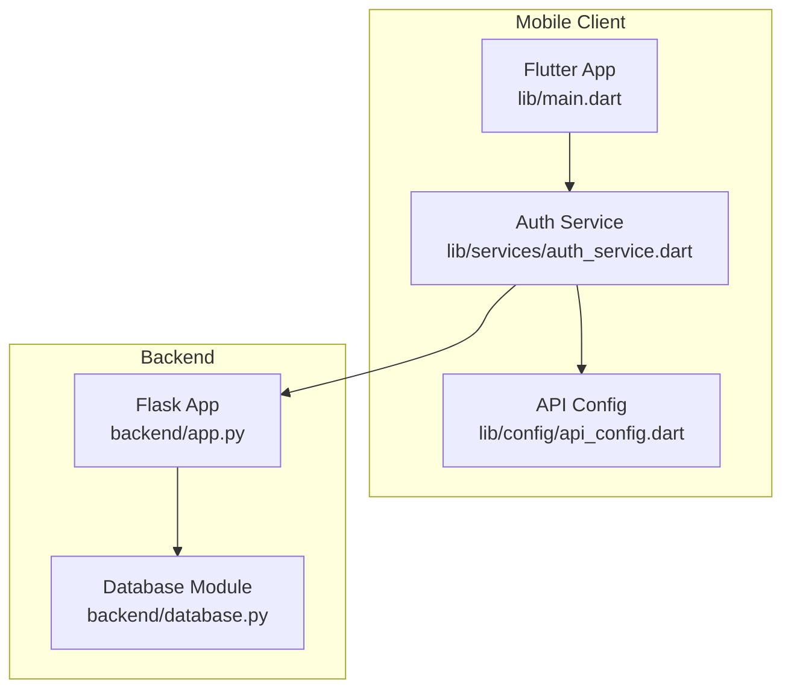
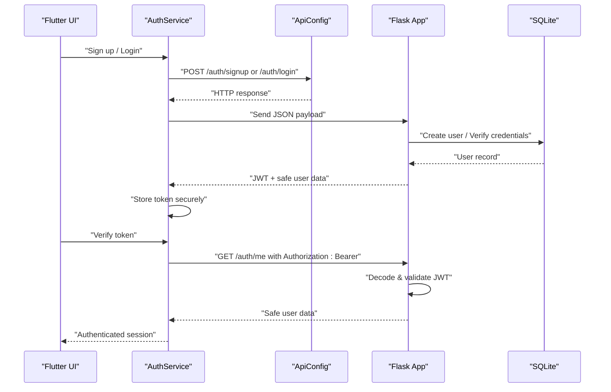
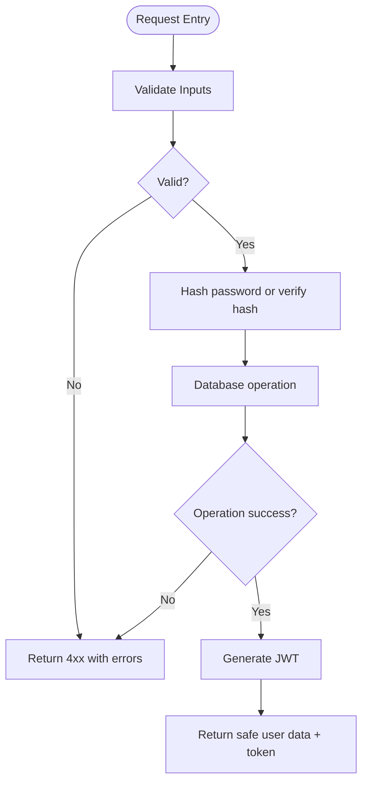
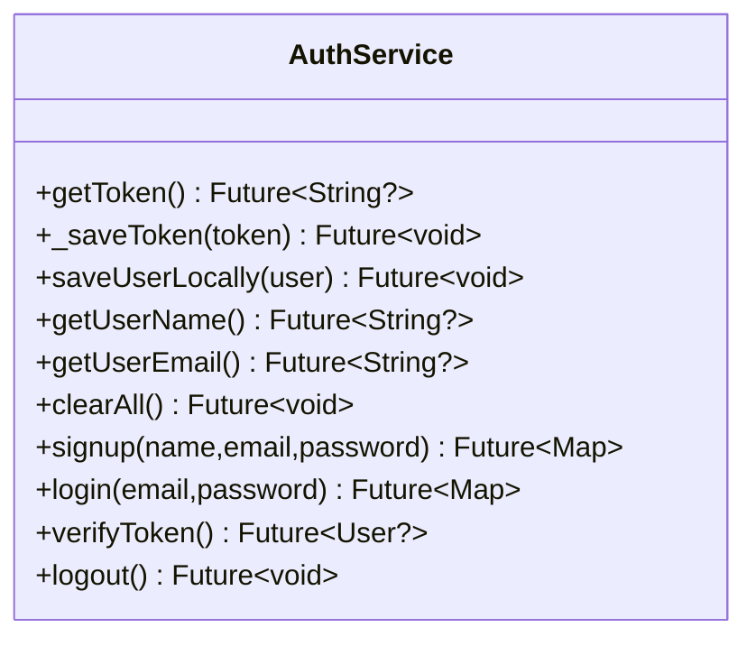
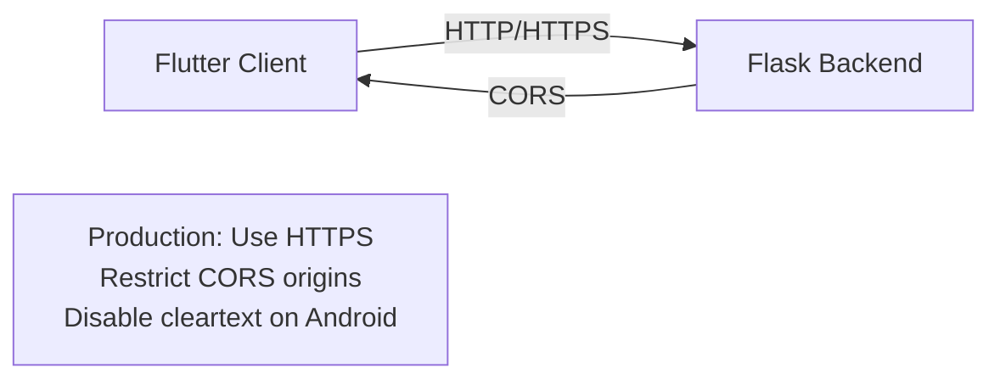
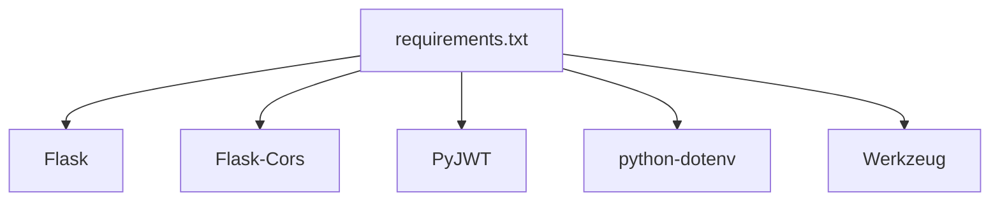

# Security Considerations

<cite>
**Referenced Files in This Document**
- [app.py](file://backend/app.py)
- [database.py](file://backend/database.py)
- [requirements.txt](file://backend/requirements.txt)
- [auth_service.dart](file://lib/services/auth_service.dart)
- [api_config.dart](file://lib/config/api_config.dart)
- [AndroidManifest.xml](file://android/app/src/main/AndroidManifest.xml)
- [Info.plist](file://ios/Runner/Info.plist)
- [main.dart](file://lib/main.dart)
</cite>

## Table of Contents
1. [Introduction](#introduction)
2. [Project Structure](#project-structure)
3. [Core Components](#core-components)
4. [Architecture Overview](#architecture-overview)
5. [Detailed Component Analysis](#detailed-component-analysis)
6. [Dependency Analysis](#dependency-analysis)
7. [Performance Considerations](#performance-considerations)
8. [Troubleshooting Guide](#troubleshooting-guide)
9. [Conclusion](#conclusion)
10. [Appendices](#appendices)

## Introduction
This document provides comprehensive security guidance for the authentication system of the Bon Voyage Pakistan application. It covers password hashing with Werkzeug, secure token storage using FlutterSecureStorage on mobile clients, protection against common authentication attacks, input validation and sanitization, secure API communication practices, CORS configuration, network security settings, and guidelines for secure coding, vulnerability assessment, and testing. It also addresses data protection, privacy considerations, and compliance requirements when handling user authentication data.

## Project Structure
The application consists of:
- A Flask backend that implements authentication endpoints, JWT issuance and verification, and SQLite-based user storage.
- A Flutter frontend that performs sign-up, login, token verification, and logout flows while securely storing tokens and minimal user profile data.

**Diagram sources**
- [main.dart:1-47](file://lib/main.dart#L1-L47)
- [auth_service.dart:1-257](file://lib/services/auth_service.dart#L1-L257)
- [api_config.dart:1-20](file://lib/config/api_config.dart#L1-L20)
- [app.py:1-226](file://backend/app.py#L1-L226)
- [database.py:1-75](file://backend/database.py#L1-L75)

**Section sources**
- [main.dart:1-47](file://lib/main.dart#L1-L47)
- [auth_service.dart:1-257](file://lib/services/auth_service.dart#L1-L257)
- [api_config.dart:1-20](file://lib/config/api_config.dart#L1-L20)
- [app.py:1-226](file://backend/app.py#L1-L226)
- [database.py:1-75](file://backend/database.py#L1-L75)

## Core Components
- Backend authentication endpoints:
  - Sign-up: validates inputs, hashes passwords, creates user, issues JWT.
  - Login: validates inputs, verifies credentials, issues JWT.
  - Protected route: /auth/me requires a valid JWT via Authorization header.
  - Logout: best-effort notification; stateless JWT removal occurs on client.
- Secure token storage:
  - FlutterSecureStorage used to persist JWT and minimal user info on device.
  - Android uses encrypted SharedPreferences for secure storage.
- Database:
  - SQLite stores users with hashed passwords and unique email constraint.
  - Parameterized queries prevent SQL injection.

Key security properties observed:
- Passwords are hashed server-side using Werkzeug before storage.
- JWTs are signed with HS256 using a secret key loaded from environment variables.
- Token verification enforces expiration checks and invalid token handling.
- User responses exclude sensitive fields (e.g., password hash).

**Section sources**
- [app.py:29-83](file://backend/app.py#L29-L83)
- [app.py:109-183](file://backend/app.py#L109-L183)
- [app.py:186-206](file://backend/app.py#L186-L206)
- [database.py:20-75](file://backend/database.py#L20-L75)
- [auth_service.dart:14-62](file://lib/services/auth_service.dart#L14-L62)
- [auth_service.dart:68-161](file://lib/services/auth_service.dart#L68-L161)
- [auth_service.dart:168-226](file://lib/services/auth_service.dart#L168-L226)

## Architecture Overview
The authentication flow involves the Flutter client communicating with the Flask backend over HTTP. Tokens are stored securely on-device and included in subsequent requests to protected endpoints. The backend validates tokens and returns safe user data.

**Diagram sources**
- [auth_service.dart:68-161](file://lib/services/auth_service.dart#L68-L161)
- [auth_service.dart:168-226](file://lib/services/auth_service.dart#L168-L226)
- [app.py:109-183](file://backend/app.py#L109-L183)
- [app.py:186-206](file://backend/app.py#L186-L206)
- [database.py:20-75](file://backend/database.py#L20-L75)

## Detailed Component Analysis

### Backend Authentication and Token Handling
- Password hashing:
  - Uses Werkzeug’s generate_password_hash and check_password_hash for secure storage and verification.
- JWT issuance and verification:
  - Encodes user_id and timestamps with HS256 using a secret key from environment variables.
  - Decodes tokens with explicit algorithm enforcement and handles expired/invalid tokens.
- Input validation:
  - Validates presence and format of name, email, and password during sign-up.
  - Enforces minimum password length.
- Safe responses:
  - Excludes password hashes from user payloads.
- Error handling:
  - Returns generic messages to avoid leaking information about account existence or token validity.

**Diagram sources**
- [app.py:98-103](file://backend/app.py#L98-L103)
- [app.py:109-153](file://backend/app.py#L109-L153)
- [app.py:156-183](file://backend/app.py#L156-L183)
- [app.py:29-83](file://backend/app.py#L29-L83)

**Section sources**
- [app.py:29-83](file://backend/app.py#L29-L83)
- [app.py:98-103](file://backend/app.py#L98-L103)
- [app.py:109-183](file://backend/app.py#L109-L183)

### Secure Token Storage on Mobile Clients
- FlutterSecureStorage is configured with encrypted SharedPreferences on Android to store the JWT and minimal user profile data.
- All HTTP requests include timeouts to prevent indefinite hangs.
- Token verification calls /auth/me to ensure the token remains valid; invalid/expired tokens trigger local cleanup.
- Logout clears local state regardless of backend response.

**Diagram sources**
- [auth_service.dart:14-62](file://lib/services/auth_service.dart#L14-L62)
- [auth_service.dart:68-226](file://lib/services/auth_service.dart#L68-L226)

**Section sources**
- [auth_service.dart:14-62](file://lib/services/auth_service.dart#L14-L62)
- [auth_service.dart:68-226](file://lib/services/auth_service.dart#L68-L226)

### Network Security and Configuration
- CORS:
  - Enabled globally on the Flask app, allowing cross-origin requests. For production, restrict origins to known domains.
- Base URL:
  - Flutter config points to an HTTP endpoint for development; ensure HTTPS in production.
- Android cleartext traffic:
  - Cleartext is enabled in the manifest for development; disable it in production and enforce HTTPS.
- iOS configuration:
  - No explicit ATS restrictions found; configure App Transport Security to enforce HTTPS in production.

**Diagram sources**
- [app.py:21-22](file://backend/app.py#L21-L22)
- [api_config.dart:8-18](file://lib/config/api_config.dart#L8-L18)
- [AndroidManifest.xml:1-10](file://android/app/src/main/AndroidManifest.xml#L1-L10)

**Section sources**
- [app.py:21-22](file://backend/app.py#L21-L22)
- [api_config.dart:8-18](file://lib/config/api_config.dart#L8-L18)
- [AndroidManifest.xml:1-10](file://android/app/src/main/AndroidManifest.xml#L1-L10)
- [Info.plist:1-71](file://ios/Runner/Info.plist#L1-L71)

### Data Protection and Privacy
- Sensitive data minimization:
  - Responses exclude password hashes and only return safe user fields.
- Secure storage:
  - JWT and minimal user info stored via FlutterSecureStorage with encryption on Android.
- Database integrity:
  - Unique email constraint prevents duplicate accounts.
  - Parameterized queries mitigate SQL injection risks.

**Section sources**
- [app.py:85-91](file://backend/app.py#L85-L91)
- [database.py:20-75](file://backend/database.py#L20-L75)
- [auth_service.dart:14-62](file://lib/services/auth_service.dart#L14-L62)

## Dependency Analysis
External dependencies relevant to security:
- Flask and Flask-Cors for web framework and CORS handling.
- PyJWT for token signing and verification.
- python-dotenv for loading secrets from environment files.
- Werkzeug for password hashing utilities.

**Diagram sources**
- [requirements.txt:1-6](file://backend/requirements.txt#L1-L6)

**Section sources**
- [requirements.txt:1-6](file://backend/requirements.txt#L1-L6)

## Performance Considerations
- Request timeouts:
  - All HTTP requests use a fixed timeout to avoid hanging the UI.
- Minimal payloads:
  - Responses contain only necessary fields to reduce bandwidth and exposure.
- Stateless tokens:
  - JWTs enable scalable authentication without server-side sessions.

[No sources needed since this section provides general guidance]

## Troubleshooting Guide
Common issues and mitigations:
- Missing or invalid tokens:
  - Backend returns 401 with generic messages; client clears local state on failure.
- Expired tokens:
  - Backend detects expiration and rejects requests; client should prompt re-authentication.
- Network connectivity:
  - Client logs connection errors and timeouts; ensure backend is reachable and base URL is correct.
- CORS errors:
  - Ensure allowed origins match the client domain; restrict to trusted origins in production.

**Section sources**
- [app.py:49-60](file://backend/app.py#L49-L60)
- [auth_service.dart:168-226](file://lib/services/auth_service.dart#L168-L226)
- [api_config.dart:8-18](file://lib/config/api_config.dart#L8-L18)

## Conclusion
The Bon Voyage Pakistan authentication system implements core security measures including server-side password hashing, secure token storage on devices, parameterized database queries, and basic input validation. To harden the system further, adopt HTTPS-only communication, restrict CORS origins, enforce strong secret management, add rate limiting and account lockout mechanisms, implement robust security headers, and conduct regular vulnerability assessments and penetration testing.

[No sources needed since this section summarizes without analyzing specific files]

## Appendices

### Security Headers and CORS Recommendations
- Add security headers such as Content-Security-Policy, X-Content-Type-Options, X-Frame-Options, and Strict-Transport-Security at the reverse proxy or application level.
- Restrict CORS to known domains in production to prevent unauthorized cross-origin access.

[No sources needed since this section provides general guidance]

### Secure Coding Practices
- Never log or expose sensitive data (passwords, tokens, PII).
- Validate and sanitize all inputs on both client and server.
- Use parameterized queries to prevent SQL injection.
- Apply least privilege principles for service accounts and database access.
- Rotate secrets regularly and store them in secure vaults.

[No sources needed since this section provides general guidance]

### Vulnerability Assessment and Testing Procedures
- Conduct static and dynamic analysis to identify vulnerabilities in code and runtime behavior.
- Perform penetration testing focusing on authentication flows, token handling, and API endpoints.
- Test for common weaknesses: broken access control, insecure defaults, insufficient logging, and misconfigured CORS.
- Validate secure storage of tokens on mobile platforms and ensure proper cleanup on logout.

[No sources needed since this section provides general guidance]

### Compliance and Privacy Considerations
- Minimize collection and retention of personal data; only store what is necessary.
- Provide clear privacy notices and obtain consent where required.
- Implement data protection controls consistent with applicable regulations (e.g., GDPR, CCPA).
- Ensure secure transmission and storage of authentication data across all components.

[No sources needed since this section provides general guidance]