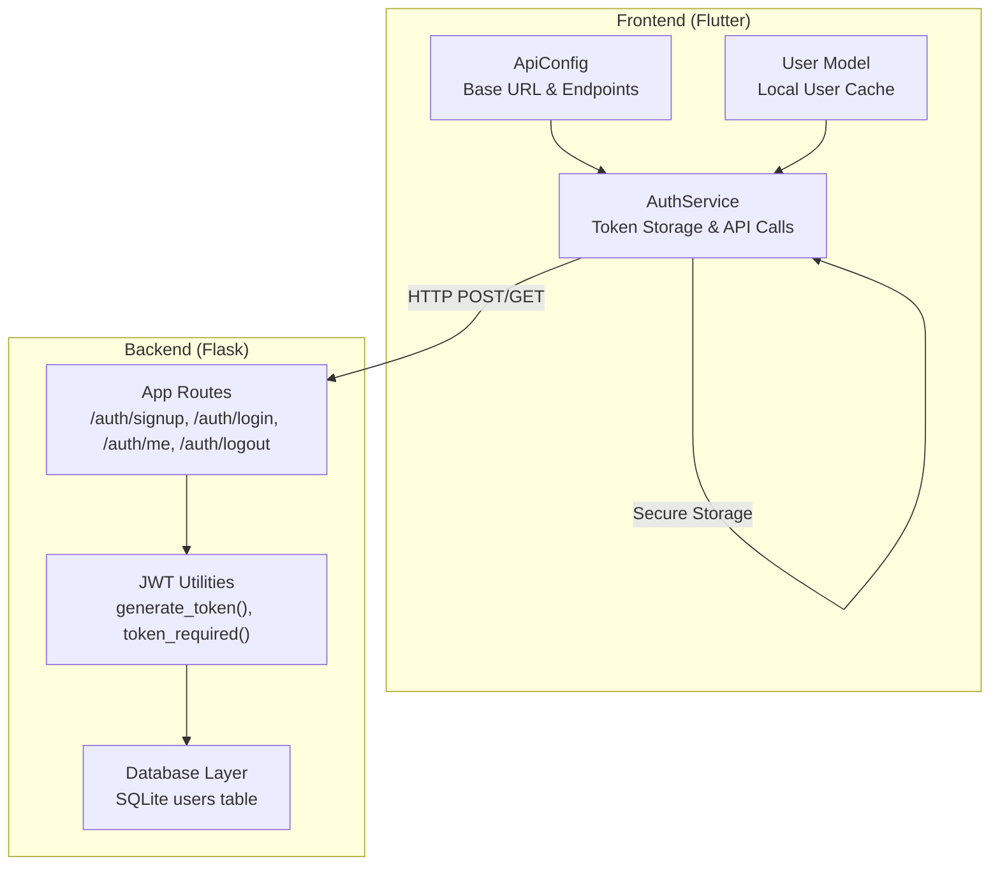
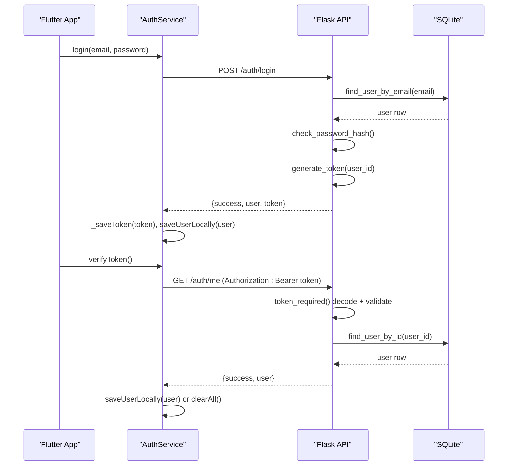
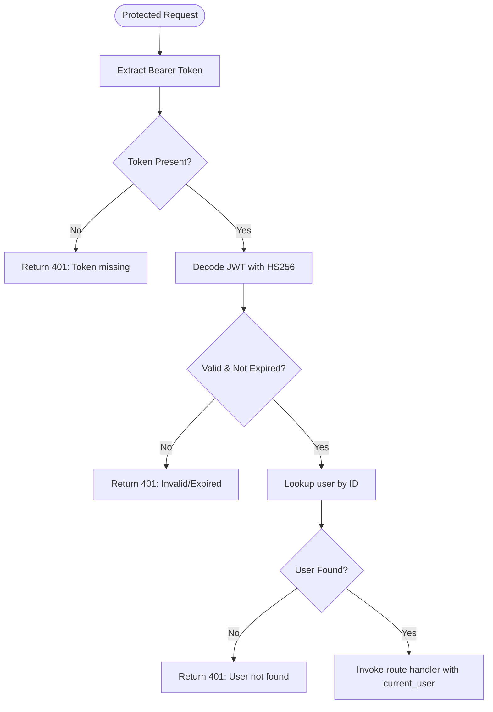
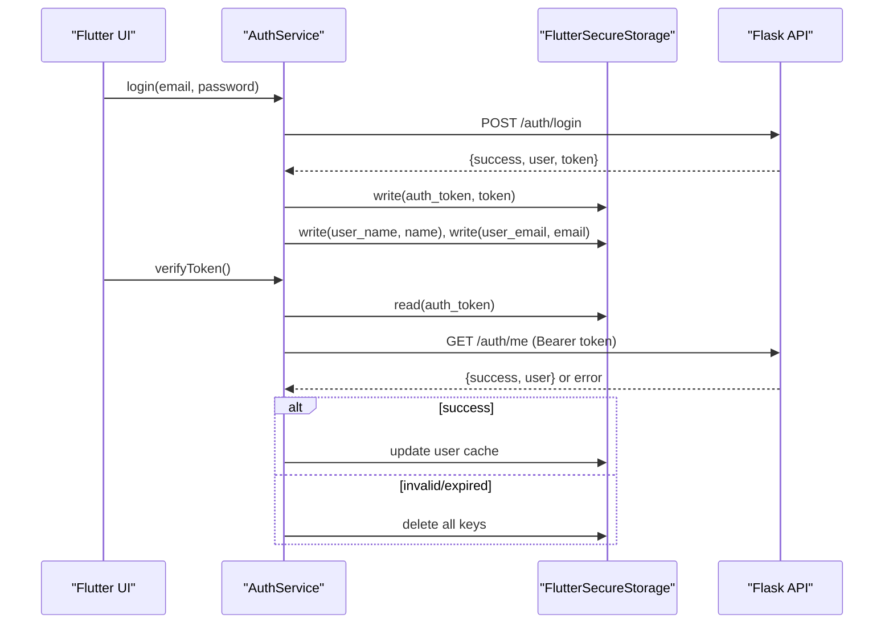
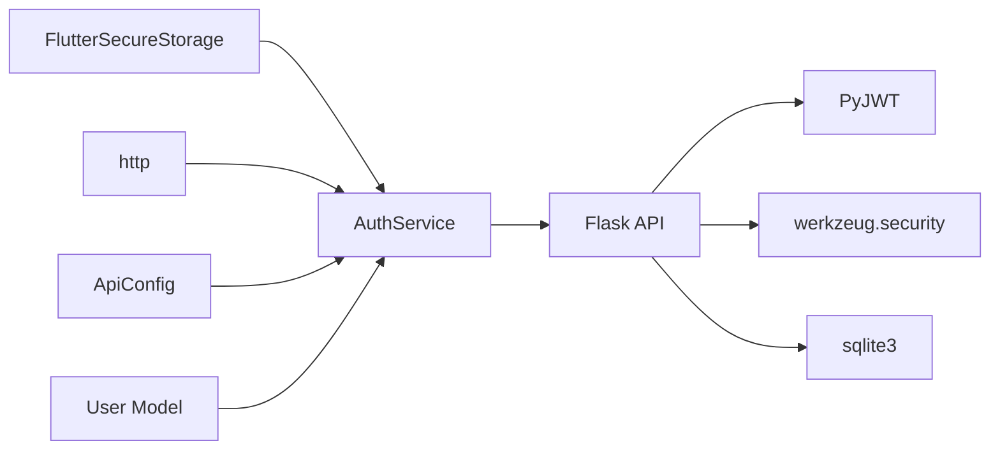

# Token Management

<cite>
**Referenced Files in This Document**
- [app.py](file://backend/app.py)
- [database.py](file://backend/database.py)
- [auth_service.dart](file://lib/services/auth_service.dart)
- [api_config.dart](file://lib/config/api_config.dart)
- [user.dart](file://lib/models/user.dart)
- [main.dart](file://lib/main.dart)
</cite>

## Table of Contents
1. [Introduction](#introduction)
2. [Project Structure](#project-structure)
3. [Core Components](#core-components)
4. [Architecture Overview](#architecture-overview)
5. [Detailed Component Analysis](#detailed-component-analysis)
6. [Dependency Analysis](#dependency-analysis)
7. [Performance Considerations](#performance-considerations)
8. [Troubleshooting Guide](#troubleshooting-guide)
9. [Conclusion](#conclusion)
10. [Appendices](#appendices)

## Introduction
This document explains the end-to-end token management for the application, focusing on JWT lifecycle from creation to expiration, storage mechanisms on both frontend and backend, validation processes, refresh strategies, security best practices, token structure and payload, and practical guidance for handling expiration gracefully. It also includes debugging techniques and performance considerations for token operations.

## Project Structure
The token system spans a Flask backend and a Flutter frontend:
- Backend (Flask): issues and validates JWTs, protects routes with a decorator, and stores user data in SQLite.
- Frontend (Flutter): securely stores tokens using FlutterSecureStorage, attaches tokens to requests, verifies sessions, and handles logout.

**Diagram sources**
- [auth_service.dart:14-62](file://lib/services/auth_service.dart#L14-L62)
- [api_config.dart:5-19](file://lib/config/api_config.dart#L5-L19)
- [user.dart:1-29](file://lib/models/user.dart#L1-L29)
- [app.py:21-26](file://backend/app.py#L21-L26)
- [app.py:33-82](file://backend/app.py#L33-L82)
- [database.py:20-75](file://backend/database.py#L20-L75)

**Section sources**
- [main.dart:6-47](file://lib/main.dart#L6-L47)
- [api_config.dart:5-19](file://lib/config/api_config.dart#L5-L19)

## Core Components
- Backend JWT issuance and validation:
  - Token generation with configurable expiration and HS256 signing.
  - Route protection via a decorator that extracts Bearer tokens, decodes them, checks expiry, and resolves the current user from the database.
- Frontend secure storage and session verification:
  - Securely persists tokens and cached user info using FlutterSecureStorage with encrypted preferences on Android.
  - Verifies token validity by calling a protected endpoint; clears local state when invalid or expired.
  - Provides login, signup, logout, and token verification flows with timeouts and error handling.

**Section sources**
- [app.py:33-82](file://backend/app.py#L33-L82)
- [auth_service.dart:14-62](file://lib/services/auth_service.dart#L14-L62)
- [auth_service.dart:68-226](file://lib/services/auth_service.dart#L68-L226)

## Architecture Overview
The token flow involves these key steps:
- Signup/Login: Frontend sends credentials; backend authenticates and returns a JWT. Frontend stores it securely.
- Protected Requests: Frontend attaches the JWT as an Authorization header; backend validates and resolves the user.
- Session Verification: On app start or before sensitive actions, the frontend verifies the token server-side and clears local state if invalid/expired.
- Logout: Frontend calls logout (best-effort), then clears local auth data.

**Diagram sources**
- [auth_service.dart:117-202](file://lib/services/auth_service.dart#L117-L202)
- [app.py:156-193](file://backend/app.py#L156-L193)
- [app.py:33-82](file://backend/app.py#L33-L82)
- [database.py:57-75](file://backend/database.py#L57-L75)

## Detailed Component Analysis

### Backend Token Lifecycle
- Token Creation:
  - Payload includes user identifier, issued-at timestamp, and expiration time computed from a configurable hours setting.
  - Signed with HS256 using a secret loaded from environment variables.
- Token Validation:
  - Extracted from Authorization header with Bearer scheme.
  - Decoded and verified; expired or invalid tokens return explicit errors.
  - Resolves current user by ID from the database to ensure the user still exists.
- Expiration Handling:
  - Expired tokens are rejected with a specific message.
  - The client is expected to handle this by clearing local state and prompting re-authentication.

**Diagram sources**
- [app.py:33-65](file://backend/app.py#L33-L65)
- [app.py:72-82](file://backend/app.py#L72-L82)

**Section sources**
- [app.py:21-26](file://backend/app.py#L21-L26)
- [app.py:33-82](file://backend/app.py#L33-L82)
- [database.py:57-75](file://backend/database.py#L57-L75)

### Frontend Token Storage and Validation
- Secure Storage:
  - Uses FlutterSecureStorage with encrypted preferences on Android.
  - Stores token under a dedicated key and caches minimal user info for quick UI rendering.
- Login/Signup Flow:
  - Sends credentials to backend; on success, stores token and user profile locally.
  - Applies a request timeout to avoid indefinite hangs.
- Token Verification:
  - Calls a protected endpoint with the stored token; if successful, updates local user cache.
  - If the response indicates invalid/expired token, clears all local auth data.
- Logout:
  - Best-effort call to backend to notify logout, then clears local state regardless of network outcome.

**Diagram sources**
- [auth_service.dart:14-62](file://lib/services/auth_service.dart#L14-L62)
- [auth_service.dart:117-202](file://lib/services/auth_service.dart#L117-L202)
- [api_config.dart:5-19](file://lib/config/api_config.dart#L5-L19)

**Section sources**
- [auth_service.dart:14-62](file://lib/services/auth_service.dart#L14-L62)
- [auth_service.dart:68-226](file://lib/services/auth_service.dart#L68-L226)
- [api_config.dart:5-19](file://lib/config/api_config.dart#L5-L19)

### Token Structure and Payload
- Algorithm: HS256
- Secret: Loaded from environment variable; defaults to a development fallback value.
- Payload fields:
  - user_id: numeric identifier used to resolve the user on each request.
  - exp: expiration timestamp (UTC).
  - iat: issued-at timestamp (UTC).
- Security note: No sensitive data (e.g., passwords) is included in the token payload.

**Section sources**
- [app.py:21-26](file://backend/app.py#L21-L26)
- [app.py:72-82](file://backend/app.py#L72-L82)

### Refresh Strategy
Current implementation does not include a separate refresh token flow. Tokens are short-lived based on configuration and validated server-side. Recommended approach for future enhancement:
- Issue a short-lived access token and a long-lived refresh token.
- Store the refresh token securely on the device.
- When an access token expires, use the refresh token to obtain a new access token without requiring re-login.
- Rotate refresh tokens on use and invalidate old ones to mitigate replay attacks.

[No sources needed since this section provides general guidance]

### Security Best Practices
- Use HTTPS in production to protect tokens in transit.
- Keep the JWT secret in environment variables; never hardcode secrets.
- Validate tokens server-side on every protected request.
- Avoid storing sensitive data in tokens; keep payloads minimal.
- Clear local tokens on logout and when invalid/expired.
- Apply timeouts to prevent hanging requests during network issues.
- Ensure CORS is configured appropriately for your domains.

**Section sources**
- [app.py:21-26](file://backend/app.py#L21-L26)
- [app.py:33-65](file://backend/app.py#L33-L65)
- [auth_service.dart:14-22](file://lib/services/auth_service.dart#L14-L22)
- [auth_service.dart:204-226](file://lib/services/auth_service.dart#L204-L226)

### Practical Examples

#### Implementing Token Refresh Flows
- Add a refresh endpoint on the backend that accepts a valid refresh token and returns a new access token.
- On the frontend, intercept responses indicating expired access tokens and retry with a refresh call before reattempting the original request.
- Store refresh tokens securely and rotate them on each use.

[No sources needed since this section provides general guidance]

#### Handling Token Expiration Gracefully
- On receiving an expired token response, clear local auth state and navigate to the login screen.
- Provide user feedback explaining the need to re-authenticate.
- Preserve non-sensitive UI state where possible to improve UX.

**Section sources**
- [auth_service.dart:163-202](file://lib/services/auth_service.dart#L163-L202)
- [app.py:57-60](file://backend/app.py#L57-L60)

#### Securing Tokens Against Common Vulnerabilities
- Enforce HTTPS to prevent token interception.
- Limit token lifetime to reduce exposure window.
- Validate tokens server-side and reject malformed or tampered tokens.
- Avoid logging tokens in plaintext; sanitize logs.
- Use secure storage on the device and restrict access to sensitive keys.

**Section sources**
- [auth_service.dart:14-22](file://lib/services/auth_service.dart#L14-L22)
- [app.py:21-26](file://backend/app.py#L21-L26)

### Debugging Techniques
- Backend:
  - Log token extraction and decoding steps to identify missing or malformed headers.
  - Inspect environment variables for correct secret and expiration settings.
  - Verify database connectivity and user lookup logic.
- Frontend:
  - Check secure storage keys and values during development builds.
  - Use developer logs around HTTP calls to confirm headers and payloads.
  - Test with known expired tokens to validate error handling paths.

**Section sources**
- [app.py:33-65](file://backend/app.py#L33-L65)
- [auth_service.dart:78-114](file://lib/services/auth_service.dart#L78-L114)
- [auth_service.dart:125-160](file://lib/services/auth_service.dart#L125-L160)
- [auth_service.dart:168-202](file://lib/services/auth_service.dart#L168-L202)

## Dependency Analysis
- Frontend dependencies:
  - http package for network requests.
  - flutter_secure_storage for secure persistence.
  - api_config for centralized endpoint URLs.
  - user model for local caching.
- Backend dependencies:
  - Flask and flask_cors for routing and cross-origin support.
  - PyJWT for encoding/decoding tokens.
  - werkzeug.security for password hashing.
  - sqlite3 for persistent user storage.

**Diagram sources**
- [auth_service.dart:1-8](file://lib/services/auth_service.dart#L1-L8)
- [api_config.dart:5-19](file://lib/config/api_config.dart#L5-L19)
- [user.dart:1-29](file://lib/models/user.dart#L1-L29)
- [app.py:10-16](file://backend/app.py#L10-L16)
- [database.py:6-17](file://backend/database.py#L6-L17)

**Section sources**
- [auth_service.dart:1-8](file://lib/services/auth_service.dart#L1-L8)
- [app.py:10-16](file://backend/app.py#L10-L16)

## Performance Considerations
- Timeouts:
  - All HTTP requests apply a fixed timeout to prevent UI hangs and resource leaks.
- Minimal Payloads:
  - Token payloads contain only necessary identifiers and timestamps to minimize size and processing overhead.
- Local Caching:
  - Cached user info reduces repeated network calls for display purposes.
- Database Access:
  - Simple SQLite queries for user lookups; consider indexing and connection pooling at scale.
- Network Efficiency:
  - Batch operations where possible and avoid redundant token verification calls.

**Section sources**
- [auth_service.dart:20-22](file://lib/services/auth_service.dart#L20-L22)
- [auth_service.dart:41-55](file://lib/services/auth_service.dart#L41-L55)
- [database.py:57-75](file://backend/database.py#L57-L75)

## Troubleshooting Guide
Common issues and resolutions:
- Missing token:
  - Ensure Authorization header is set correctly with Bearer scheme.
  - Confirm token was saved after login/signup.
- Expired token:
  - Clear local state and prompt re-authentication.
  - Consider implementing refresh token flow to reduce login prompts.
- Invalid token:
  - Verify secret alignment between frontend expectations and backend configuration.
  - Check for token tampering or corruption in storage.
- Network errors:
  - Handle timeouts and retries gracefully; do not clear tokens on transient failures.
- CORS issues:
  - Ensure backend CORS allows your frontend origin.

**Section sources**
- [app.py:44-60](file://backend/app.py#L44-L60)
- [auth_service.dart:163-202](file://lib/services/auth_service.dart#L163-L202)
- [auth_service.dart:232-256](file://lib/services/auth_service.dart#L232-L256)

## Conclusion
The application implements a robust JWT-based authentication flow with secure token storage on the frontend and strict validation on the backend. While there is no refresh token mechanism currently, the design supports easy extension to add one. Following the recommended security practices and troubleshooting steps will help maintain a reliable and secure token lifecycle.

[No sources needed since this section summarizes without analyzing specific files]

## Appendices

### API Endpoints Summary
- POST /auth/signup: Register and receive JWT.
- POST /auth/login: Authenticate and receive JWT.
- GET /auth/me: Retrieve current user (requires valid JWT).
- POST /auth/logout: Notify logout (best-effort); client clears local state.

**Section sources**
- [app.py:109-206](file://backend/app.py#L109-L206)
- [api_config.dart:14-19](file://lib/config/api_config.dart#L14-L19)