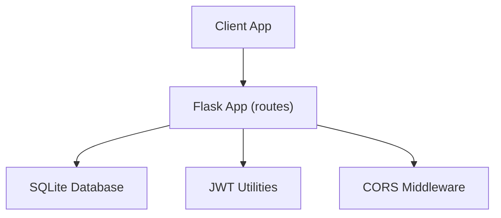
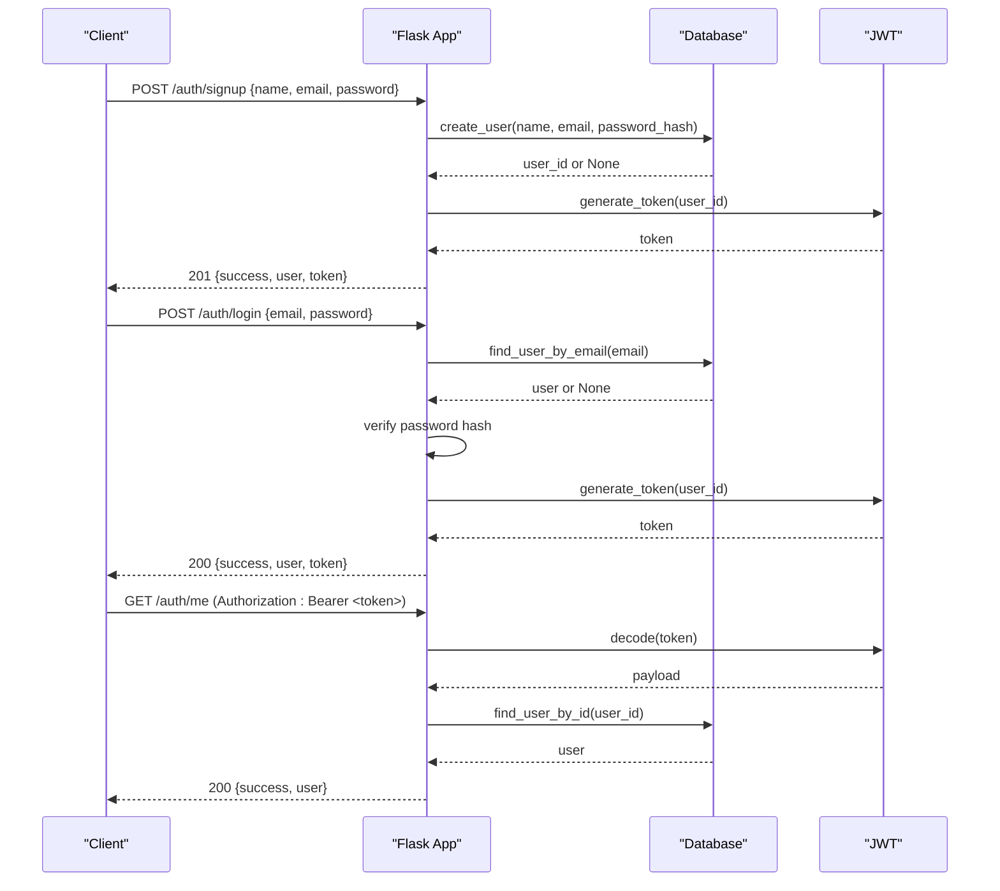
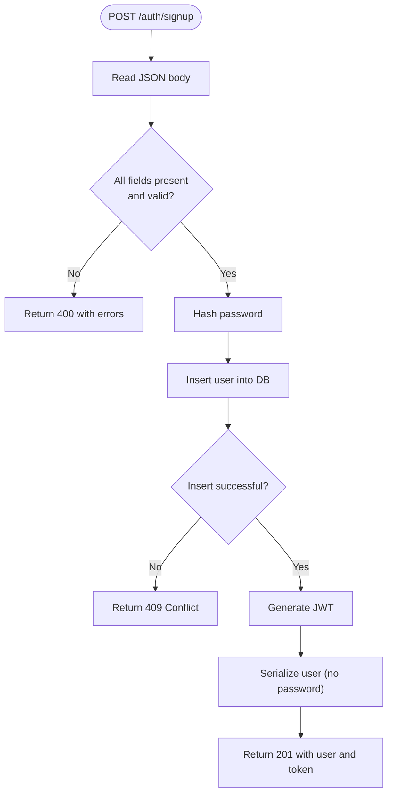
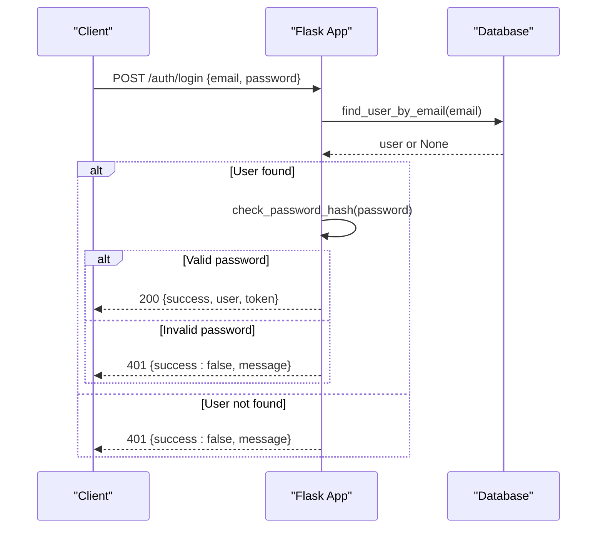
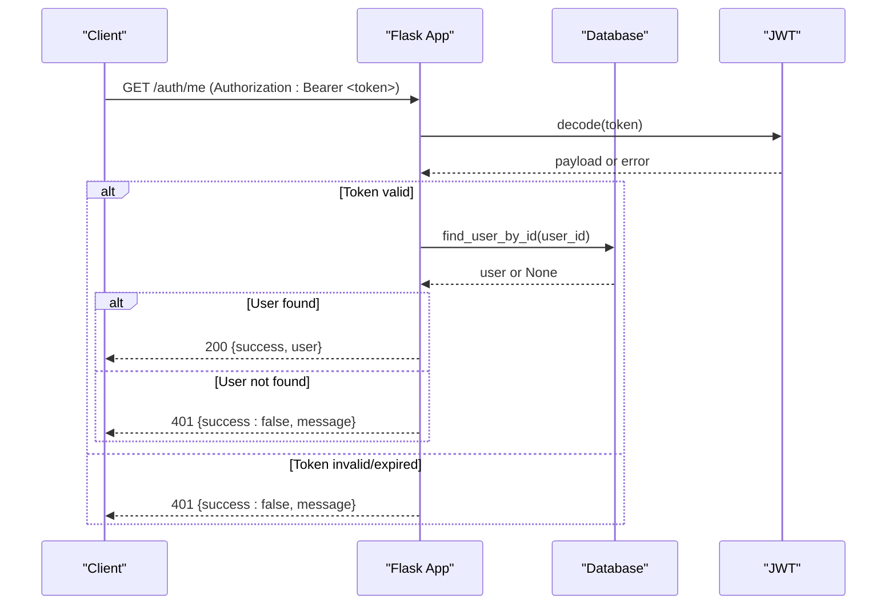
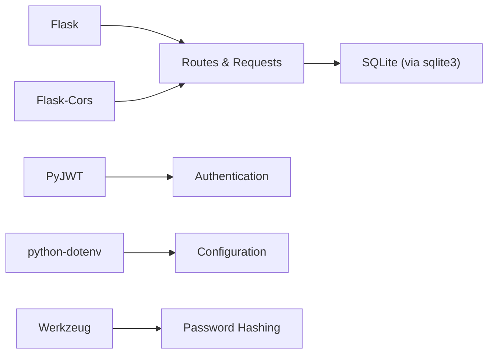

# API Endpoints

<cite>
**Referenced Files in This Document**
- [app.py](file://backend/app.py)
- [database.py](file://backend/database.py)
- [test_api.py](file://backend/test_api.py)
- [requirements.txt](file://backend/requirements.txt)
</cite>

## Table of Contents
1. [Introduction](#introduction)
2. [Project Structure](#project-structure)
3. [Core Components](#core-components)
4. [Architecture Overview](#architecture-overview)
5. [Detailed Component Analysis](#detailed-component-analysis)
6. [Dependency Analysis](#dependency-analysis)
7. [Performance Considerations](#performance-considerations)
8. [Troubleshooting Guide](#troubleshooting-guide)
9. [Conclusion](#conclusion)
10. [Appendices](#appendices)

## Introduction
This document provides detailed API documentation for the Flask-based backend endpoints that handle user authentication and basic application health checks. It covers request/response schemas, validation rules, HTTP status codes, authentication requirements, error handling, usage examples, rate limiting considerations, and API versioning strategies.

## Project Structure
The backend is a minimal Flask application with:
- A single application module defining routes and JWT-based authentication
- A database module using SQLite to store users
- A test script demonstrating endpoint usage
- Requirements listing core dependencies

**Diagram sources**
- [app.py:21-26](file://backend/app.py#L21-L26)
- [database.py:13-36](file://backend/database.py#L13-L36)

**Section sources**
- [app.py:1-226](file://backend/app.py#L1-L226)
- [database.py:1-75](file://backend/database.py#L1-L75)
- [requirements.txt:1-6](file://backend/requirements.txt#L1-L6)

## Core Components
- Authentication decorator validates JWT tokens from the Authorization header and injects the current user into protected routes.
- Token generation creates signed JWTs with configurable expiration.
- User serialization returns safe user data without sensitive fields.
- Email validation ensures proper format before processing.
- Database module manages SQLite connection, schema initialization, and user CRUD operations.

Key implementation references:
- JWT protection and token decoding: [app.py:33-65](file://backend/app.py#L33-L65)
- Token generation: [app.py:72-82](file://backend/app.py#L72-L82)
- User serialization: [app.py:85-91](file://backend/app.py#L85-L91)
- Email validation: [app.py:98-102](file://backend/app.py#L98-L102)
- Database schema and queries: [database.py:20-75](file://backend/database.py#L20-L75)

**Section sources**
- [app.py:33-91](file://backend/app.py#L33-L91)
- [database.py:20-75](file://backend/database.py#L20-L75)

## Architecture Overview
The API follows a stateless JWT authentication model:
- Clients authenticate via /auth/login to obtain a JWT.
- Protected endpoints require a Bearer token in the Authorization header.
- The server validates tokens and resolves the current user for protected routes.
- The database persists user accounts and credentials securely.

**Diagram sources**
- [app.py:109-216](file://backend/app.py#L109-L216)
- [database.py:39-75](file://backend/database.py#L39-L75)

## Detailed Component Analysis

### Endpoint: POST /auth/signup
Purpose: Register a new user account and return a JWT upon success.

- Method: POST
- URL: /auth/signup
- Authentication: Not required
- Request body (JSON):
  - name: string, required, trimmed
  - email: string, required, trimmed and lowercased, must be valid email format
  - password: string, required, minimum length 8 characters
- Validation rules:
  - All fields are validated; errors are aggregated and returned if any fail
  - Email format is checked against a standard pattern
  - Password must meet minimum length requirement
- Success response (201 Created):
  - success: boolean
  - message: string
  - user: object with id, name, email
  - token: string (JWT)
- Error responses:
  - 400 Bad Request: Missing or invalid fields; includes message and errors array
  - 409 Conflict: Duplicate email (unique constraint violation)
- Usage example:
  - See test script demonstrating signup flow: [test_api.py:6-18](file://backend/test_api.py#L6-L18)

Implementation references:
- Route definition and logic: [app.py:109-153](file://backend/app.py#L109-L153)
- Email validation helper: [app.py:98-102](file://backend/app.py#L98-L102)
- Database insertion and duplicate handling: [database.py:39-54](file://backend/database.py#L39-L54)

**Diagram sources**
- [app.py:109-153](file://backend/app.py#L109-L153)
- [database.py:39-54](file://backend/database.py#L39-L54)

**Section sources**
- [app.py:109-153](file://backend/app.py#L109-L153)
- [database.py:39-54](file://backend/database.py#L39-L54)
- [test_api.py:6-18](file://backend/test_api.py#L6-L18)

### Endpoint: POST /auth/login
Purpose: Authenticate a user and return a JWT upon success.

- Method: POST
- URL: /auth/login
- Authentication: Not required
- Request body (JSON):
  - email: string, required, trimmed and lowercased
  - password: string, required
- Validation rules:
  - Both email and password must be provided
- Success response (200 OK):
  - success: boolean
  - message: string
  - user: object with id, name, email
  - token: string (JWT)
- Error responses:
  - 400 Bad Request: Missing email or password
  - 401 Unauthorized: Invalid email or password
- Usage example:
  - Correct login: [test_api.py:26-34](file://backend/test_api.py#L26-L34)
  - Wrong password: [test_api.py:36-43](file://backend/test_api.py#L36-L43)

Implementation references:
- Route definition and logic: [app.py:156-183](file://backend/app.py#L156-L183)
- Password verification: [app.py:172-173](file://backend/app.py#L172-L173)
- User lookup by email: [database.py:57-64](file://backend/database.py#L57-L64)

**Diagram sources**
- [app.py:156-183](file://backend/app.py#L156-L183)
- [database.py:57-64](file://backend/database.py#L57-L64)

**Section sources**
- [app.py:156-183](file://backend/app.py#L156-L183)
- [database.py:57-64](file://backend/database.py#L57-L64)
- [test_api.py:26-43](file://backend/test_api.py#L26-L43)

### Endpoint: GET /auth/me
Purpose: Retrieve information about the currently authenticated user.

- Method: GET
- URL: /auth/me
- Authentication: Required (Bearer token in Authorization header)
- Request headers:
  - Authorization: Bearer <jwt_token>
- Success response (200 OK):
  - success: boolean
  - user: object with id, name, email
- Error responses:
  - 401 Unauthorized: Missing token, expired token, invalid token, or user not found
- Usage example:
  - Verify token after signup: [test_api.py:20-24](file://backend/test_api.py#L20-L24)

Implementation references:
- Protected route and decorator: [app.py:186-193](file://backend/app.py#L186-L193)
- Token validation and user resolution: [app.py:33-65](file://backend/app.py#L33-L65)

**Diagram sources**
- [app.py:33-65](file://backend/app.py#L33-L65)
- [app.py:186-193](file://backend/app.py#L186-L193)
- [database.py:67-75](file://backend/database.py#L67-L75)

**Section sources**
- [app.py:33-65](file://backend/app.py#L33-L65)
- [app.py:186-193](file://backend/app.py#L186-L193)
- [database.py:67-75](file://backend/database.py#L67-L75)
- [test_api.py:20-24](file://backend/test_api.py#L20-L24)

### Endpoint: POST /auth/logout
Purpose: Logout endpoint for API completeness; client-side token removal is recommended since JWTs are stateless.

- Method: POST
- URL: /auth/logout
- Authentication: Not required
- Success response (200 OK):
  - success: boolean
  - message: string
- Notes:
  - No server-side token revocation occurs; clients should clear stored tokens

Implementation references:
- Route definition: [app.py:196-206](file://backend/app.py#L196-L206)

**Section sources**
- [app.py:196-206](file://backend/app.py#L196-L206)

### Endpoint: GET /
Purpose: Health check endpoint to verify service availability.

- Method: GET
- URL: /
- Authentication: Not required
- Success response (200 OK):
  - status: string ("ok")
  - app: string ("Bon Voyage Pakistan API")

Implementation references:
- Route definition: [app.py:213-216](file://backend/app.py#L213-L216)

**Section sources**
- [app.py:213-216](file://backend/app.py#L213-L216)

## Dependency Analysis
External dependencies used by the backend:
- Flask: Web framework for routing and request handling
- Flask-Cors: Cross-origin resource sharing support
- PyJWT: JSON Web Token encoding/decoding
- python-dotenv: Environment variable loading
- Werkzeug: Security utilities for password hashing

**Diagram sources**
- [requirements.txt:1-6](file://backend/requirements.txt#L1-L6)
- [app.py:10-16](file://backend/app.py#L10-L16)
- [database.py:6-17](file://backend/database.py#L6-L17)

**Section sources**
- [requirements.txt:1-6](file://backend/requirements.txt#L1-L6)
- [app.py:10-16](file://backend/app.py#L10-L16)
- [database.py:6-17](file://backend/database.py#L6-L17)

## Performance Considerations
- Database: SQLite is suitable for development and low-concurrency scenarios. For production, consider migrating to a robust RDBMS (e.g., PostgreSQL) and adding connection pooling.
- Authentication: JWT decoding is lightweight; ensure SECRET_KEY is strong and rotation strategy is defined.
- Rate Limiting: Not implemented in the current codebase. Add middleware (e.g., Flask-Limiter) to protect endpoints from abuse, especially /auth/signup and /auth/login.
- CORS: Enabled globally; restrict origins in production to trusted domains.
- Logging: Implement structured logging for security events (login attempts, failed validations).

[No sources needed since this section provides general guidance]

## Troubleshooting Guide
Common issues and resolutions:
- Missing or invalid request body:
  - Ensure Content-Type is application/json and payload contains required fields
  - Check validation error messages in 400 responses
- Duplicate email on signup:
  - Occurs when email already exists; use 409 response to indicate conflict
- Authentication failures:
  - 401 responses indicate missing, expired, or invalid tokens; verify Authorization header format
  - Ensure token is refreshed before expiration based on JWT_EXPIRATION_HOURS
- Database errors:
  - IntegrityError on duplicate emails is handled gracefully; confirm unique constraints
- CORS errors:
  - Verify allowed origins match your frontend domain

Implementation references:
- Validation and error handling: [app.py:120-134](file://backend/app.py#L120-L134), [app.py:166-173](file://backend/app.py#L166-L173)
- JWT error handling: [app.py:52-60](file://backend/app.py#L52-L60)
- Database integrity handling: [database.py:52-54](file://backend/database.py#L52-L54)

**Section sources**
- [app.py:52-60](file://backend/app.py#L52-L60)
- [app.py:120-134](file://backend/app.py#L120-L134)
- [app.py:166-173](file://backend/app.py#L166-L173)
- [database.py:52-54](file://backend/database.py#L52-L54)

## Conclusion
The backend provides a concise set of authentication endpoints using JWTs and SQLite. It supports user registration, login, profile retrieval, logout signaling, and health checks. For production readiness, implement rate limiting, secure CORS configuration, robust logging, and consider upgrading the database layer.

[No sources needed since this section summarizes without analyzing specific files]

## Appendices

### API Versioning Strategies
- URL prefix versioning: e.g., /api/v1/auth/* to allow backward-compatible changes
- Header-based versioning: e.g., Accept-Version: v1
- Deprecation policy: Announce deprecations in advance and provide migration guides

[No sources needed since this section provides general guidance]

### Rate Limiting Recommendations
- Protect sensitive endpoints (/auth/signup, /auth/login) with per-IP and per-user limits
- Use exponential backoff on repeated failures
- Monitor and alert on abnormal traffic patterns

[No sources needed since this section provides general guidance]