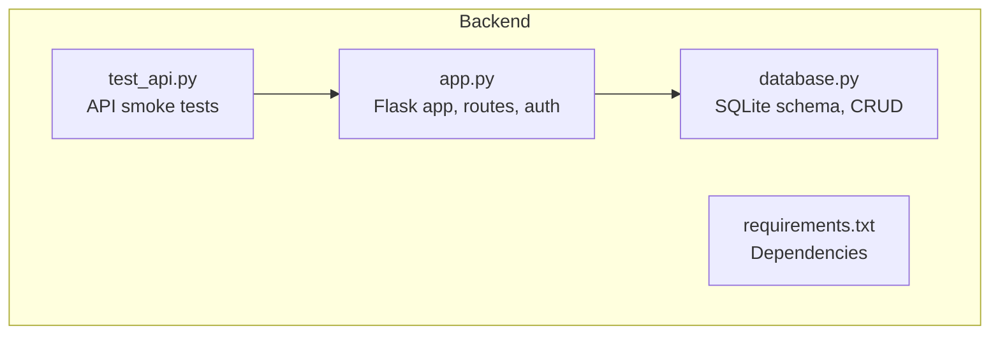
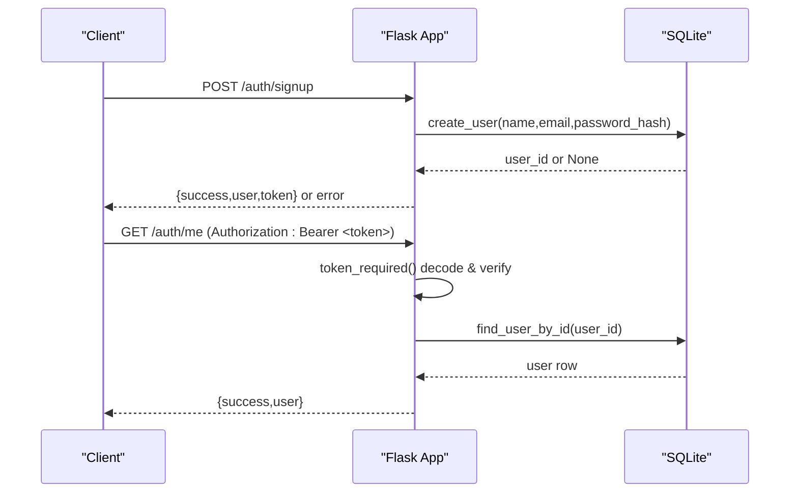
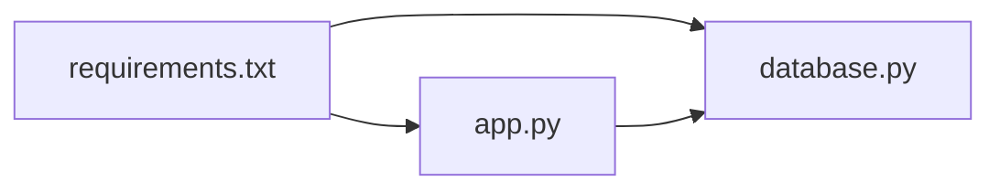

# Backend Architecture (Flask)

<cite>
**Referenced Files in This Document**
- [app.py](file://backend/app.py)
- [database.py](file://backend/database.py)
- [requirements.txt](file://backend/requirements.txt)
- [test_api.py](file://backend/test_api.py)
</cite>

## Table of Contents
1. [Introduction](#introduction)
2. [Project Structure](#project-structure)
3. [Core Components](#core-components)
4. [Architecture Overview](#architecture-overview)
5. [Detailed Component Analysis](#detailed-component-analysis)
6. [Dependency Analysis](#dependency-analysis)
7. [Performance Considerations](#performance-considerations)
8. [Troubleshooting Guide](#troubleshooting-guide)
9. [Conclusion](#conclusion)
10. [Appendices](#appendices)

## Introduction
This document describes the backend architecture for the Bon Voyage Pakistan project, implemented as a Flask API server. It covers application setup, CORS configuration, environment variable management, route organization, JWT-based authentication with Werkzeug password hashing, SQLite database design and connection management, CRUD operations for user management, API endpoint structure, request/response formats, error handling strategies, security considerations, middleware patterns, database interaction patterns, scalability considerations, and production deployment guidance.

## Project Structure
The backend is organized into a minimal set of files:
- Application entry point and routes: app.py
- Database module with SQLite schema and helpers: database.py
- Dependencies: requirements.txt
- Quick integration test script: test_api.py

**Diagram sources**
- [app.py:1-226](file://backend/app.py#L1-L226)
- [database.py:1-75](file://backend/database.py#L1-L75)
- [requirements.txt:1-6](file://backend/requirements.txt#L1-L6)
- [test_api.py:1-62](file://backend/test_api.py#L1-L62)

**Section sources**
- [app.py:1-226](file://backend/app.py#L1-L226)
- [database.py:1-75](file://backend/database.py#L1-L75)
- [requirements.txt:1-6](file://backend/requirements.txt#L1-L6)
- [test_api.py:1-62](file://backend/test_api.py#L1-L62)

## Core Components
- Flask application initialization with CORS enabled globally.
- Environment-driven configuration using python-dotenv for secrets and settings.
- JWT-based authentication with a custom decorator to protect routes.
- Password hashing via Werkzeug’s secure utilities.
- SQLite database layer with connection helper and user CRUD functions.
- Health check endpoint for readiness/liveness probes.

Key implementation references:
- App setup and CORS: [app.py:21-26](file://backend/app.py#L21-L26)
- Environment variables: [app.py:18-26](file://backend/app.py#L18-L26)
- JWT token generation: [app.py:72-82](file://backend/app.py#L72-L82)
- Protected route decorator: [app.py:33-65](file://backend/app.py#L33-L65)
- Password hashing: [app.py:136-137](file://backend/app.py#L136-L137), [app.py:172](file://backend/app.py#L172)
- Database schema and helpers: [database.py:20-75](file://backend/database.py#L20-L75)

**Section sources**
- [app.py:18-82](file://backend/app.py#L18-L82)
- [database.py:13-75](file://backend/database.py#L13-L75)

## Architecture Overview
High-level flow:
- Clients send HTTP requests to Flask endpoints.
- Auth endpoints handle signup/login and return JWTs.
- Protected endpoints validate tokens via a decorator before executing logic.
- Data operations are performed against an SQLite database through a dedicated module.

**Diagram sources**
- [app.py:109-153](file://backend/app.py#L109-L153)
- [app.py:156-183](file://backend/app.py#L156-L183)
- [app.py:186-193](file://backend/app.py#L186-L193)
- [database.py:39-75](file://backend/database.py#L39-L75)

## Detailed Component Analysis

### Flask Application Setup and Configuration
- Initializes Flask and enables CORS globally to allow cross-origin requests from clients.
- Loads environment variables from a .env file using python-dotenv.
- Configures SECRET_KEY and JWT_EXPIRATION_HOURS from environment variables with safe defaults for development.

References:
- [app.py:21-26](file://backend/app.py#L21-L26)
- [app.py:18-19](file://backend/app.py#L18-L19)

Security note:
- Ensure SECRET_KEY is strong and unique in production; never hardcode secrets.

**Section sources**
- [app.py:18-26](file://backend/app.py#L18-L26)

### Authentication System (JWT + Werkzeug)
- Token extraction and validation:
  - Extracts Authorization header, expects Bearer scheme.
  - Decodes JWT using HS256 and configured secret.
  - Resolves current user by ID and injects it into protected handlers.
  - Handles expired and invalid tokens with appropriate 401 responses.
- Token generation:
  - Creates payload with user_id, expiration timestamp, and issued-at time.
  - Encodes token using HS256 and configured secret.
- Password hashing:
  - Uses Werkzeug to hash passwords on signup and verify on login.

References:
- [app.py:33-65](file://backend/app.py#L33-L65)
- [app.py:72-82](file://backend/app.py#L72-L82)
- [app.py:136-137](file://backend/app.py#L136-L137)
- [app.py:172](file://backend/app.py#L172)

Security considerations:
- Use HTTPS in production to protect tokens in transit.
- Set reasonable JWT_EXPIRATION_HOURS based on risk tolerance.
- Rotate SECRET_KEY periodically and manage securely via environment or secret manager.

**Section sources**
- [app.py:33-82](file://backend/app.py#L33-L82)
- [app.py:136-137](file://backend/app.py#L136-L137)
- [app.py:172](file://backend/app.py#L172)

### Route Organization and Endpoints
- Authentication endpoints:
  - POST /auth/signup: registers users, validates input, hashes password, creates user, returns token and user info.
  - POST /auth/login: authenticates users, verifies credentials, returns token and user info.
  - GET /auth/me: protected; returns current user details.
  - POST /auth/logout: stateless logout placeholder for API completeness.
- Health check:
  - GET /: returns status for health monitoring.

Request/response highlights:
- Signup/Login request bodies include name/email/password fields.
- Responses include success flag, message, user object (without password hash), and token where applicable.
- Protected endpoints require Authorization: Bearer <token>.

References:
- [app.py:109-153](file://backend/app.py#L109-L153)
- [app.py:156-183](file://backend/app.py#L156-L183)
- [app.py:186-193](file://backend/app.py#L186-L193)
- [app.py:196-206](file://backend/app.py#L196-L206)
- [app.py:213-216](file://backend/app.py#L213-L216)

Error handling:
- Input validation errors return 400 with descriptive messages.
- Duplicate email returns 409 conflict.
- Invalid or missing tokens return 401 unauthorized.
- Generic failures use consistent JSON envelope with success flag and message.

References:
- [app.py:120-134](file://backend/app.py#L120-L134)
- [app.py:141-142](file://backend/app.py#L141-L142)
- [app.py:49-60](file://backend/app.py#L49-L60)

**Section sources**
- [app.py:109-216](file://backend/app.py#L109-L216)

### Database Layer Design (SQLite)
- Schema:
  - users table with id (auto-increment), name, email (unique), password_hash, created_at.
- Connection management:
  - get_connection opens a new connection per call and sets row_factory to return dictionaries.
- CRUD operations:
  - create_user inserts a new user and returns lastrowid or None on integrity error (duplicate email).
  - find_user_by_email retrieves a user by email.
  - find_user_by_id retrieves a user by id.

References:
- [database.py:20-36](file://backend/database.py#L20-L36)
- [database.py:39-75](file://backend/database.py#L39-L75)

Data access patterns:
- Each function opens a connection, executes SQL, and closes the connection.
- Parameterized queries prevent SQL injection.

Scalability notes:
- SQLite is suitable for low-to-moderate concurrency and single-process deployments.
- For higher concurrency or multi-process servers, consider connection pooling or switching to a client-server RDBMS.

**Section sources**
- [database.py:13-75](file://backend/database.py#L13-L75)

### Middleware Implementation Patterns
- Custom decorator token_required acts as middleware to enforce authentication:
  - Parses Authorization header.
  - Validates and decodes JWT.
  - Resolves user and injects into handler.
  - Returns standardized 401 responses for missing/expired/invalid tokens.

References:
- [app.py:33-65](file://backend/app.py#L33-L65)

Extensibility ideas:
- Add role-based checks within the decorator or as additional decorators.
- Introduce rate limiting or request logging as global middleware.

**Section sources**
- [app.py:33-65](file://backend/app.py#L33-L65)

### API Usage Examples
A quick smoke test demonstrates typical flows:
- Create a user and capture the returned token.
- Access a protected endpoint with the token.
- Login with correct and incorrect credentials.
- Attempt duplicate signup.
- Call logout.

References:
- [test_api.py:6-61](file://backend/test_api.py#L6-L61)

Example usage steps:
- Start the server locally.
- Run the test script to exercise all endpoints.
- Inspect status codes and response payloads.

**Section sources**
- [test_api.py:1-62](file://backend/test_api.py#L1-L62)

## Dependency Analysis
External dependencies are declared in requirements.txt and imported in the application:
- Flask and Flask-Cors for web framework and CORS support.
- PyJWT for token encoding/decoding.
- python-dotenv for environment variable loading.
- Werkzeug for password hashing utilities.

**Diagram sources**
- [requirements.txt:1-6](file://backend/requirements.txt#L1-L6)
- [app.py:10-16](file://backend/app.py#L10-L16)
- [database.py:6-7](file://backend/database.py#L6-L7)

**Section sources**
- [requirements.txt:1-6](file://backend/requirements.txt#L1-L6)
- [app.py:10-16](file://backend/app.py#L10-L16)
- [database.py:6-7](file://backend/database.py#L6-L7)

## Performance Considerations
- Database connections:
  - Current pattern opens/closes a connection per request. For high load, consider connection pooling or a persistent connection strategy.
- Concurrency:
  - SQLite works best with limited concurrent writers. If write-heavy traffic is expected, migrate to PostgreSQL or MySQL and use a proper ORM or connection pooler.
- Caching:
  - Consider caching frequent read-only data (e.g., profiles) with Redis or in-memory cache to reduce DB load.
- Request validation:
  - Centralize validation to avoid redundant checks and improve throughput.
- Logging and metrics:
  - Add structured logging and request timing to identify bottlenecks.

[No sources needed since this section provides general guidance]

## Troubleshooting Guide
Common issues and resolutions:
- Missing or invalid token:
  - Ensure Authorization header uses Bearer scheme and contains a valid token.
  - Check token expiration and that SECRET_KEY matches between issuer and verifier.
  - References: [app.py:44-60](file://backend/app.py#L44-L60)
- Duplicate email during signup:
  - The database enforces uniqueness; expect a conflict response.
  - Reference: [database.py:52-54](file://backend/database.py#L52-L54), [app.py:141-142](file://backend/app.py#L141-L142)
- Invalid credentials:
  - Login fails if email not found or password does not match hashed value.
  - Reference: [app.py:170-173](file://backend/app.py#L170-L173)
- CORS errors:
  - Verify that the frontend origin is allowed; CORS is enabled globally in this setup.
  - Reference: [app.py:21-22](file://backend/app.py#L21-L22)
- Health check:
  - Use GET / to confirm the service is running.
  - Reference: [app.py:213-216](file://backend/app.py#L213-L216)

**Section sources**
- [app.py:44-60](file://backend/app.py#L44-L60)
- [database.py:52-54](file://backend/database.py#L52-L54)
- [app.py:141-142](file://backend/app.py#L141-L142)
- [app.py:170-173](file://backend/app.py#L170-L173)
- [app.py:21-22](file://backend/app.py#L21-L22)
- [app.py:213-216](file://backend/app.py#L213-L216)

## Conclusion
The backend implements a compact, secure Flask API with JWT-based authentication, robust input validation, and a simple SQLite-backed user store. It follows clear separation of concerns between routing, authentication, and data access. For production, prioritize secure secret management, HTTPS, token expiration tuning, and consider scaling the database layer beyond SQLite if required.

[No sources needed since this section summarizes without analyzing specific files]

## Appendices

### Security Checklist
- Use strong, unique SECRET_KEY in production.
- Enforce HTTPS everywhere.
- Keep JWT_EXPIRATION_HOURS conservative.
- Validate and sanitize all inputs at the edge.
- Avoid leaking sensitive data in responses (passwords are excluded).
- Monitor and rotate secrets regularly.

[No sources needed since this section provides general guidance]

### Production Deployment Notes
- Serve via a WSGI server such as Gunicorn or uWSGI behind a reverse proxy (Nginx/Apache).
- Configure environment variables for SECRET_KEY and JWT_EXPIRATION_HOURS.
- Enable logging and health checks (/) for orchestration platforms.
- Back up the SQLite database file regularly if used in production.

[No sources needed since this section provides general guidance]