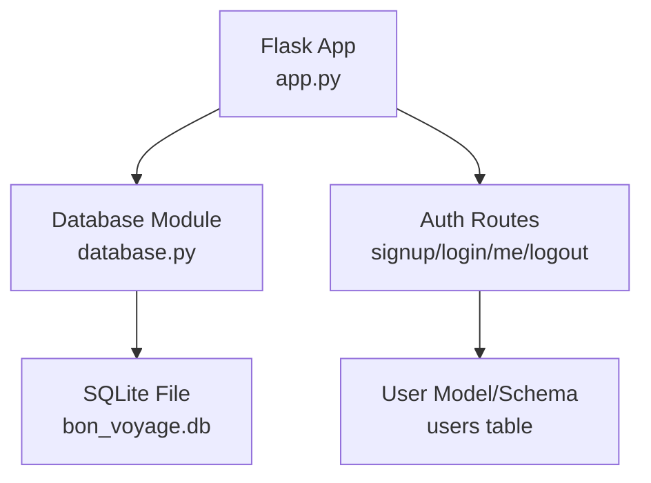
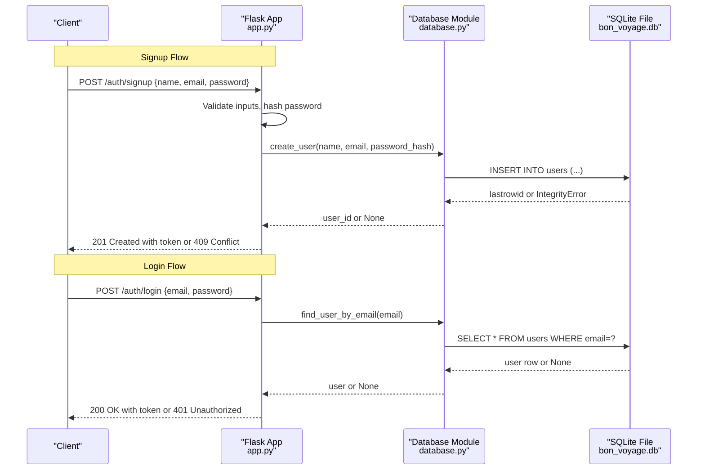
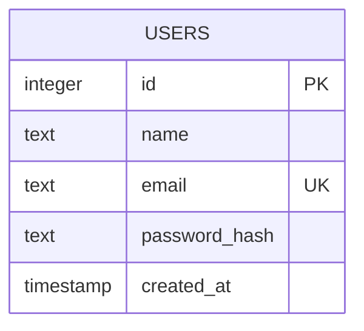
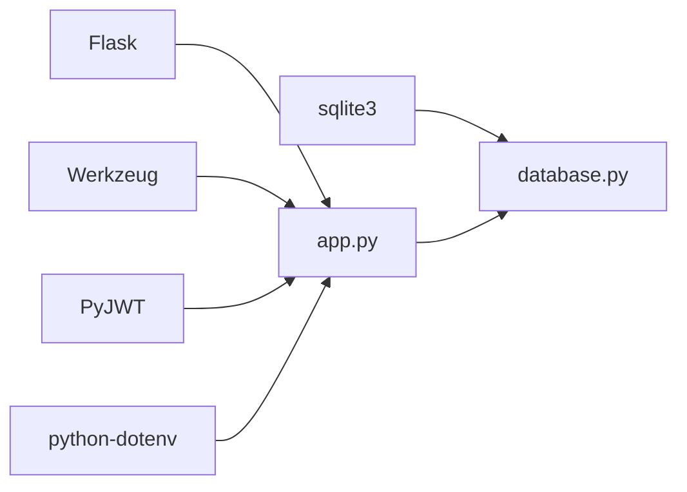

# Database Layer

<cite>
**Referenced Files in This Document**
- [database.py](file://backend/database.py)
- [app.py](file://backend/app.py)
- [requirements.txt](file://backend/requirements.txt)
- [test_api.py](file://backend/test_api.py)
</cite>

## Table of Contents
1. [Introduction](#introduction)
2. [Project Structure](#project-structure)
3. [Core Components](#core-components)
4. [Architecture Overview](#architecture-overview)
5. [Detailed Component Analysis](#detailed-component-analysis)
6. [Dependency Analysis](#dependency-analysis)
7. [Performance Considerations](#performance-considerations)
8. [Troubleshooting Guide](#troubleshooting-guide)
9. [Conclusion](#conclusion)
10. [Appendices](#appendices)

## Introduction
This document describes the SQLite database layer for user management in the backend service. It covers database initialization, connection handling, schema design, and CRUD operations used by authentication endpoints. It also explains error handling strategies, data validation patterns, transaction considerations, and production best practices for using SQLite with a Flask API.

## Project Structure
The backend is a small Flask application that:
- Initializes an SQLite database file on startup
- Exposes authentication routes (signup, login, me, logout)
- Uses parameterized queries to interact with a users table

**Diagram sources**
- [app.py:109-216](file://backend/app.py#L109-L216)
- [database.py:13-74](file://backend/database.py#L13-L74)

**Section sources**
- [app.py:1-226](file://backend/app.py#L1-L226)
- [database.py:1-75](file://backend/database.py#L1-L75)

## Core Components
- Database module provides:
  - Connection factory returning rows as dictionaries
  - Schema initializer creating the users table if missing
  - CRUD functions for user creation and lookup
- Application module wires HTTP routes to database functions and handles validation, hashing, and JWT issuance

Key responsibilities:
- Initialization: ensure schema exists at startup
- Connections: create per-request connections with row_factory set
- Queries: use parameterized SQL to prevent injection
- Validation: enforce input constraints before DB writes
- Security: hash passwords; never return password hashes to clients

**Section sources**
- [database.py:13-74](file://backend/database.py#L13-L74)
- [app.py:98-153](file://backend/app.py#L98-L153)
- [app.py:156-183](file://backend/app.py#L156-L183)

## Architecture Overview
The request flow for user operations involves the Flask app validating inputs, calling database functions, and returning JSON responses. Authentication uses JWTs to protect sensitive endpoints.

**Diagram sources**
- [app.py:109-183](file://backend/app.py#L109-L183)
- [database.py:39-64](file://backend/database.py#L39-L64)

## Detailed Component Analysis

### Database Initialization and Schema
- The database file path is resolved relative to the backend directory.
- On startup, the schema is created if it does not exist.
- The users table includes:
  - id: integer primary key with auto-increment
  - name: text, required
  - email: text, required, unique
  - password_hash: text, required
  - created_at: timestamp defaulting to current time

**Diagram sources**
- [database.py:20-36](file://backend/database.py#L20-L36)

**Section sources**
- [database.py:9-36](file://backend/database.py#L9-L36)

### Connection Management
- get_connection creates a new sqlite3 connection per call and sets row_factory to sqlite3.Row so results are returned as dict-like objects.
- Each function opens its own connection and closes it after use. There is no connection pool or global shared connection.

Implications:
- Simplicity and safety: each operation gets a fresh connection
- No pooling: under high concurrency, many short-lived connections may be opened/closed frequently
- Suitable for low-to-moderate traffic; consider alternatives for heavy load

**Section sources**
- [database.py:13-17](file://backend/database.py#L13-L17)

### CRUD Operations

#### create_user
- Purpose: Insert a new user record
- Parameters:
  - name: string
  - email: string (must be unique)
  - password_hash: string
- Returns:
  - New user id (integer) on success
  - None on failure (e.g., duplicate email)
- Error Handling:
  - Catches IntegrityError and returns None to signal conflict
- Query Pattern:
  - Parameterized INSERT with placeholders

Usage in app:
- Validates inputs and hashes password before calling create_user
- On None result, returns 409 Conflict

**Section sources**
- [database.py:39-54](file://backend/database.py#L39-L54)
- [app.py:109-153](file://backend/app.py#L109-L153)

#### find_user_by_email
- Purpose: Retrieve a user by email
- Parameters:
  - email: string
- Returns:
  - User row (dict-like) if found
  - None if not found
- Query Pattern:
  - Parameterized SELECT with equality filter

Usage in app:
- Used during login to locate the user for password verification

**Section sources**
- [database.py:57-64](file://backend/database.py#L57-L64)
- [app.py:156-183](file://backend/app.py#L156-L183)

#### find_user_by_id
- Purpose: Retrieve a user by id
- Parameters:
  - user_id: integer
- Returns:
  - User row (dict-like) if found
  - None if not found
- Query Pattern:
  - Parameterized SELECT with equality filter

Usage in app:
- Used to resolve current user from JWT payload in protected routes

**Section sources**
- [database.py:67-74](file://backend/database.py#L67-L74)
- [app.py:33-63](file://backend/app.py#L33-L63)

### Data Validation Patterns
- Input validation occurs in the app layer before DB calls:
  - Name and email presence checks
  - Email format validation via regex
  - Password presence and minimum length
- Errors are aggregated and returned as a structured response
- Duplicate email detection relies on database constraint and caught as IntegrityError

**Section sources**
- [app.py:98-134](file://backend/app.py#L98-L134)
- [database.py:52-54](file://backend/database.py#L52-L54)

### Transaction Management
- Each function performs a single statement or simple sequence without explicit transactions.
- create_user commits after insert; read functions do not commit.
- For multi-step operations, wrap related statements in a transaction block to ensure atomicity and consistency.

Recommendation:
- Use context managers or explicit begin/commit/rollback around multiple statements when extending functionality beyond single-row operations.

**Section sources**
- [database.py:39-54](file://backend/database.py#L39-L54)

### Security and Best Practices
- Passwords are hashed server-side before storage; never store plaintext
- Never include password_hash in client-facing responses
- Use parameterized queries to prevent SQL injection
- Enforce unique constraint on email at the database level
- Return generic messages for failed logins to avoid user enumeration

**Section sources**
- [app.py:136-173](file://backend/app.py#L136-L173)
- [database.py:25-33](file://backend/database.py#L25-L33)

## Dependency Analysis
The backend depends on Flask for routing, Werkzeug for password hashing, PyJWT for tokens, and python-dotenv for configuration. The database module uses the standard library sqlite3.

**Diagram sources**
- [requirements.txt:1-6](file://backend/requirements.txt#L1-L6)
- [app.py:10-16](file://backend/app.py#L10-L16)
- [database.py:6-7](file://backend/database.py#L6-L7)

**Section sources**
- [requirements.txt:1-6](file://backend/requirements.txt#L1-L6)
- [app.py:10-16](file://backend/app.py#L10-L16)
- [database.py:6-7](file://backend/database.py#L6-L7)

## Performance Considerations
- Connection model:
  - Per-call connections are safe but can incur overhead under high concurrency
  - Consider connection pooling or a shared connection with careful locking for higher throughput
- Concurrency:
  - SQLite supports concurrent reads; writes are serialized
  - Avoid long-running transactions that hold locks
- Indexes:
  - Unique index on email already exists due to UNIQUE constraint
  - If frequent lookups by other fields arise, add appropriate indexes
- I/O:
  - Place the database file on fast local storage
  - Ensure proper file permissions and backups

[No sources needed since this section provides general guidance]

## Troubleshooting Guide
Common issues and resolutions:
- Duplicate email on signup:
  - Cause: UNIQUE constraint violation
  - Behavior: create_user returns None; app responds with 409 Conflict
  - Resolution: Prompt user to choose another email
- Invalid credentials on login:
  - Cause: Missing user or incorrect password
  - Behavior: App returns 401 Unauthorized
  - Resolution: Verify email/password; ensure password was hashed correctly at signup
- Token errors on protected routes:
  - Cause: Missing, expired, or invalid JWT
  - Behavior: App returns 401 Unauthorized with descriptive message
  - Resolution: Re-authenticate to obtain a new token

Operational tips:
- Confirm database file exists and is writable
- Check logs for IntegrityError or other exceptions
- Validate environment variables (SECRET_KEY, JWT_EXPIRATION_HOURS)

**Section sources**
- [database.py:52-54](file://backend/database.py#L52-L54)
- [app.py:49-63](file://backend/app.py#L49-L63)
- [app.py:140-143](file://backend/app.py#L140-L143)
- [app.py:170-173](file://backend/app.py#L170-L173)

## Conclusion
The database layer provides a straightforward, secure implementation for user management using SQLite. It initializes the schema on startup, manages connections per call, and exposes clear CRUD functions used by authentication endpoints. For production environments, consider adding connection pooling, explicit transaction boundaries for multi-step operations, robust logging, and monitoring to ensure reliability and performance.

[No sources needed since this section summarizes without analyzing specific files]

## Appendices

### API Usage Examples
- Signup: POST /auth/signup with name, email, password
- Login: POST /auth/login with email, password
- Get Current User: GET /auth/me with Authorization: Bearer <token>
- Logout: POST /auth/logout

These flows are demonstrated in the test script.

**Section sources**
- [test_api.py:6-61](file://backend/test_api.py#L6-L61)