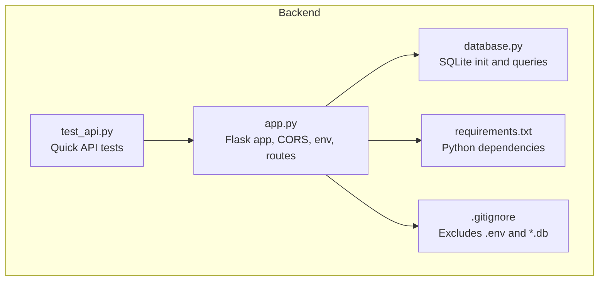
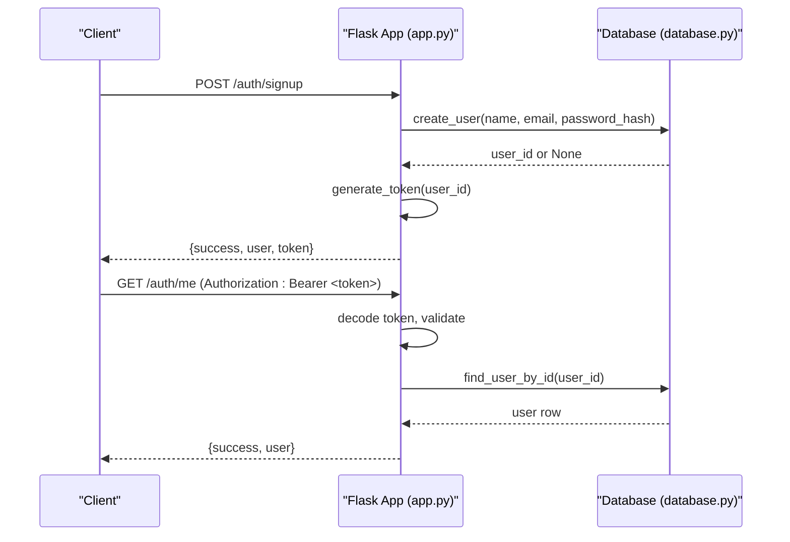
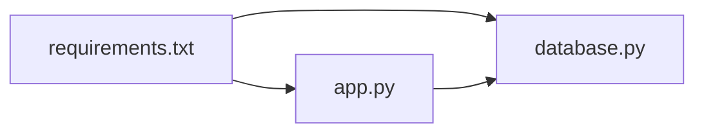

# Flask Application Setup

<cite>
**Referenced Files in This Document**
- [app.py](file://backend/app.py)
- [database.py](file://backend/database.py)
- [requirements.txt](file://backend/requirements.txt)
- [.gitignore](file://backend/.gitignore)
- [test_api.py](file://backend/test_api.py)
</cite>

## Table of Contents
1. [Introduction](#introduction)
2. [Project Structure](#project-structure)
3. [Core Components](#core-components)
4. [Architecture Overview](#architecture-overview)
5. [Detailed Component Analysis](#detailed-component-analysis)
6. [Dependency Analysis](#dependency-analysis)
7. [Performance Considerations](#performance-considerations)
8. [Troubleshooting Guide](#troubleshooting-guide)
9. [Conclusion](#conclusion)
10. [Appendices](#appendices)

## Introduction
This document explains how the Flask backend is initialized and configured, including CORS setup, environment variable management with python-dotenv, and application configuration for secrets and JWT behavior. It also covers the import structure, dependency management via requirements.txt, and guidance for development versus production configurations. Examples are provided to help you set up the Flask environment, configure CORS policies, and manage sensitive values securely.

## Project Structure
The backend is a minimal Flask application with:
- A single application entry point that initializes the app, enables CORS, loads environment variables, configures secrets, and defines routes.
- A database module that manages SQLite connections and user operations.
- A requirements file listing Python dependencies.
- A test script to exercise authentication endpoints.
- A .gitignore that excludes sensitive files like .env and the SQLite database.

**Diagram sources**
- [app.py:1-27](file://backend/app.py#L1-L27)
- [database.py:1-75](file://backend/database.py#L1-L75)
- [requirements.txt:1-6](file://backend/requirements.txt#L1-L6)
- [.gitignore:1-17](file://backend/.gitignore#L1-L17)
- [test_api.py:1-62](file://backend/test_api.py#L1-L62)

**Section sources**
- [app.py:1-27](file://backend/app.py#L1-L27)
- [database.py:1-75](file://backend/database.py#L1-L75)
- [requirements.txt:1-6](file://backend/requirements.txt#L1-L6)
- [.gitignore:1-17](file://backend/.gitignore#L1-L17)
- [test_api.py:1-62](file://backend/test_api.py#L1-L62)

## Core Components
- Flask app initialization and CORS: The application creates a Flask instance and enables CORS globally at startup.
- Environment variables: python-dotenv is used to load variables from a .env file into the process environment before reading them.
- Configuration: SECRET_KEY and JWT_EXPIRATION_HOURS are read from environment variables with safe defaults for development.
- Database: SQLite is used for persistence; the users table is created on first run.
- Authentication: JWT-based token generation and verification protect selected routes.

Key behaviors:
- CORS is enabled globally using the default policy (allows all origins). For production, restrict allowed origins to trusted domains.
- Secrets are loaded from environment variables; never hardcode them in code.
- JWT tokens include an expiration time derived from JWT_EXPIRATION_HOURS.

**Section sources**
- [app.py:10-27](file://backend/app.py#L10-L27)
- [app.py:33-82](file://backend/app.py#L33-L82)
- [database.py:13-36](file://backend/database.py#L13-L36)

## Architecture Overview
The backend exposes REST endpoints for authentication and a health check. Requests flow through Flask, optional JWT validation, and then interact with the SQLite database via the database module.

**Diagram sources**
- [app.py:109-153](file://backend/app.py#L109-L153)
- [app.py:156-183](file://backend/app.py#L156-L183)
- [app.py:186-193](file://backend/app.py#L186-L193)
- [app.py:72-82](file://backend/app.py#L72-L82)
- [database.py:39-74](file://backend/database.py#L39-L74)

## Detailed Component Analysis

### Flask App Initialization and CORS
- The Flask app is created and CORS is enabled globally. By default, this allows cross-origin requests from any origin. In production, configure CORS to allow only trusted origins and methods.
- Environment variables are loaded from .env using python-dotenv prior to reading configuration.

Configuration highlights:
- SECRET_KEY: Used to sign JWTs. Must be strong and unique per deployment.
- JWT_EXPIRATION_HOURS: Controls token lifetime. Defaults to 24 hours if not set.

CORS policy recommendations:
- Restrict allowed_origins to your frontend domain(s).
- Limit allowed_methods to GET, POST, etc., as needed.
- Set appropriate max_age and credentials handling based on your needs.

**Section sources**
- [app.py:10-27](file://backend/app.py#L10-L27)

### Environment Variable Management with python-dotenv
- load_dotenv() is called at startup to populate os.environ from a .env file located in the working directory.
- Sensitive values such as SECRET_KEY should be placed in .env and excluded from version control via .gitignore.
- The .gitignore already excludes .env and *.db files.

Example .env contents (do not commit):
- SECRET_KEY=<strong-random-secret>
- JWT_EXPIRATION_HOURS=24

**Section sources**
- [app.py:18-26](file://backend/app.py#L18-L26)
- [.gitignore:1-17](file://backend/.gitignore#L1-L17)

### Application Configuration: SECRET_KEY and JWT_EXPIRATION_HOURS
- SECRET_KEY is read from the environment with a fallback for development. Replace the fallback with a secure value in production.
- JWT_EXPIRATION_HOURS is parsed as an integer and used to compute token expiration when generating JWTs.

Security notes:
- Never store secrets in source code.
- Use different values per environment (development, staging, production).
- Rotate secrets periodically and invalidate existing tokens when rotating.

**Section sources**
- [app.py:24-26](file://backend/app.py#L24-L26)
- [app.py:72-82](file://backend/app.py#L72-L82)

### Import Structure and Dependency Management
Imports in the application:
- Flask components: Flask, request, jsonify
- CORS: flask_cors.CORS
- Environment: dotenv.load_dotenv
- Security: werkzeug.security for password hashing
- JWT: PyJWT for token encoding/decoding
- Database: local database module for SQLite operations

Dependencies are pinned in requirements.txt to ensure reproducible environments. Install with pip after creating a virtual environment.

**Section sources**
- [app.py:6-16](file://backend/app.py#L6-L16)
- [requirements.txt:1-6](file://backend/requirements.txt#L1-L6)

### Development vs Production Configurations
Development:
- Debug mode is enabled when running directly via the entry point.
- Default CORS allows all origins; suitable for local development.
- Fallback SECRET_KEY exists; replace it with a real secret in production.

Production:
- Disable debug mode.
- Configure CORS to allow only trusted origins.
- Provide a strong SECRET_KEY via environment variables.
- Pin dependencies and use a proper WSGI server (e.g., gunicorn) behind a reverse proxy.
- Ensure .env is present and secured on the host.

**Section sources**
- [app.py:21-27](file://backend/app.py#L21-L27)
- [app.py:223-226](file://backend/app.py#L223-L226)

### Database Initialization and Usage
- The database module initializes a SQLite database file in the backend directory and creates the users table if missing.
- User creation returns the new user id or None on duplicate email.
- Lookup functions retrieve users by email or id.

Operational notes:
- On first run, the application calls init_db to ensure the schema exists.
- The database path is relative to the backend directory.

**Section sources**
- [database.py:9-36](file://backend/database.py#L9-L36)
- [database.py:39-74](file://backend/database.py#L39-L74)
- [app.py:223-226](file://backend/app.py#L223-L226)

### Authentication Flow and Error Handling
- Signup validates input, hashes the password, inserts the user, and returns a JWT.
- Login verifies credentials and returns a JWT.
- Protected routes require a valid Authorization header with a Bearer token; invalid or expired tokens return 401 errors.
- Errors are returned as JSON with success flags and messages.

Error handling examples:
- Missing token: 401 with message indicating token is missing.
- Expired token: 401 with message indicating token has expired.
- Invalid token: 401 with message indicating invalid token.
- Duplicate signup: 409 conflict when email already exists.

**Section sources**
- [app.py:33-65](file://backend/app.py#L33-L65)
- [app.py:109-153](file://backend/app.py#L109-L153)
- [app.py:156-183](file://backend/app.py#L156-L183)
- [app.py:186-193](file://backend/app.py#L186-L193)

## Dependency Analysis
The backend depends on Flask, Flask-Cors, PyJWT, python-dotenv, and Werkzeug. These are declared in requirements.txt and imported in the application.

**Diagram sources**
- [requirements.txt:1-6](file://backend/requirements.txt#L1-L6)
- [app.py:6-16](file://backend/app.py#L6-L16)
- [database.py:6-17](file://backend/database.py#L6-L17)

**Section sources**
- [requirements.txt:1-6](file://backend/requirements.txt#L1-L6)
- [app.py:6-16](file://backend/app.py#L6-L16)
- [database.py:6-17](file://backend/database.py#L6-L17)

## Performance Considerations
- SQLite is simple but not suited for high concurrency. For production workloads, consider a managed relational database and connection pooling.
- Avoid enabling debug mode in production to prevent overhead and information leakage.
- Keep CORS strict to reduce unnecessary preflight requests and exposure.
- Cache frequent reads where appropriate and ensure database indexes exist for lookup fields (e.g., email).

[No sources needed since this section provides general guidance]

## Troubleshooting Guide
Common issues and resolutions:
- CORS errors in browser: Ensure the frontend origin matches the allowed origins. If using global CORS in development, confirm the server is running and accessible. In production, restrict allowed_origins to your frontend domain.
- 401 Unauthorized on protected routes: Verify the Authorization header uses the correct format "Bearer <token>" and that the token is valid and not expired.
- Duplicate email on signup: The database enforces uniqueness on email. Use a different email or handle the conflict gracefully on the client.
- Missing environment variables: Ensure .env contains SECRET_KEY and JWT_EXPIRATION_HOURS. Confirm the .env file is in the working directory when starting the app.

Validation and testing:
- Use the provided test script to verify core flows: signup, login, token verification, duplicate signup, and logout.

**Section sources**
- [app.py:33-65](file://backend/app.py#L33-L65)
- [app.py:109-153](file://backend/app.py#L109-L153)
- [app.py:156-183](file://backend/app.py#L156-L183)
- [app.py:186-193](file://backend/app.py#L186-L193)
- [test_api.py:1-62](file://backend/test_api.py#L1-L62)

## Conclusion
The Flask backend is straightforward and secure by design:
- CORS is enabled globally for convenience in development; restrict it in production.
- Secrets and configuration are managed via environment variables with python-dotenv.
- JWT-based authentication protects sensitive routes with robust error handling.
- SQLite provides a simple data store suitable for development and small-scale usage.

Follow the guidance above to adapt the application for production, including strict CORS policies, strong secrets, and a scalable database solution.

[No sources needed since this section summarizes without analyzing specific files]

## Appendices

### How to Set Up the Flask Environment
- Create a virtual environment and install dependencies from requirements.txt.
- Place a .env file in the backend directory with SECRET_KEY and JWT_EXPIRATION_HOURS.
- Run the application from the backend directory so that .env is loaded automatically.

**Section sources**
- [requirements.txt:1-6](file://backend/requirements.txt#L1-L6)
- [app.py:18-27](file://backend/app.py#L18-L27)
- [.gitignore:1-17](file://backend/.gitignore#L1-L17)

### Example: Configuring CORS Policies
- Development: Global CORS is enabled by default, allowing all origins.
- Production: Configure CORS to allow only trusted origins and necessary HTTP methods. Adjust credentials and preflight caching according to your frontend’s needs.

**Section sources**
- [app.py:21-22](file://backend/app.py#L21-L22)

### Managing Sensitive Configuration Values Securely
- Store SECRET_KEY and other secrets in .env and ensure .gitignore excludes it.
- Load environment variables at startup using python-dotenv.
- Use different values per environment and rotate secrets regularly.

**Section sources**
- [app.py:18-26](file://backend/app.py#L18-L26)
- [.gitignore:1-17](file://backend/.gitignore#L1-L17)