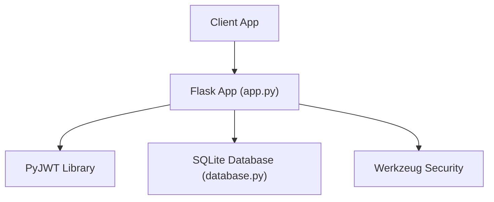
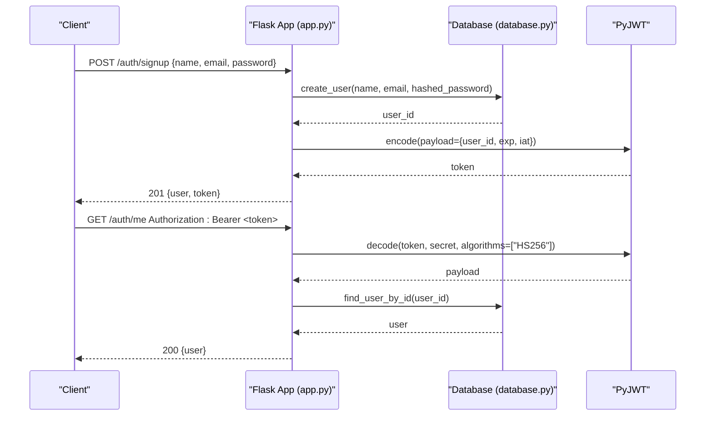
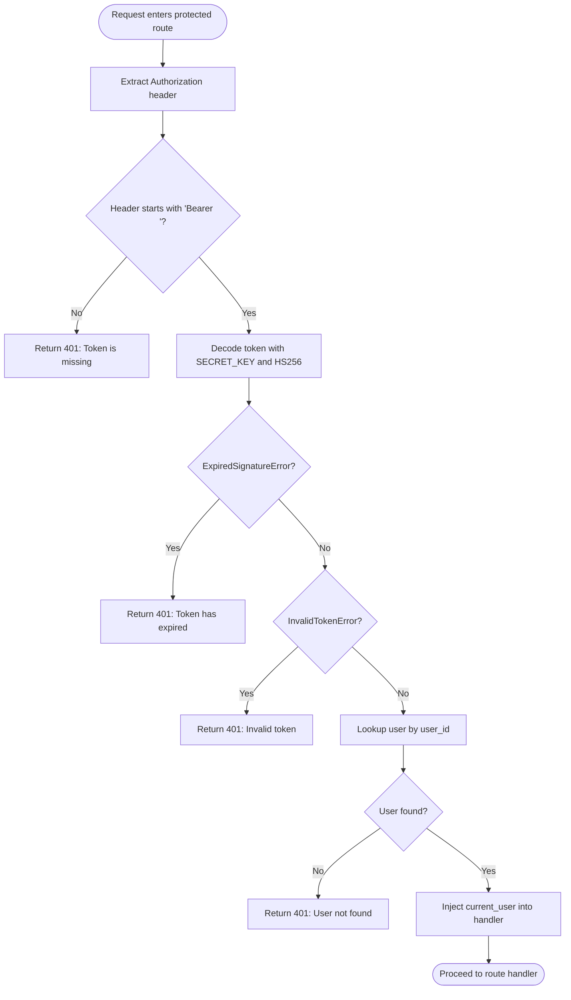
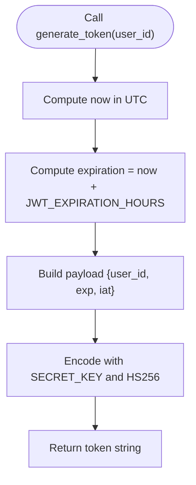
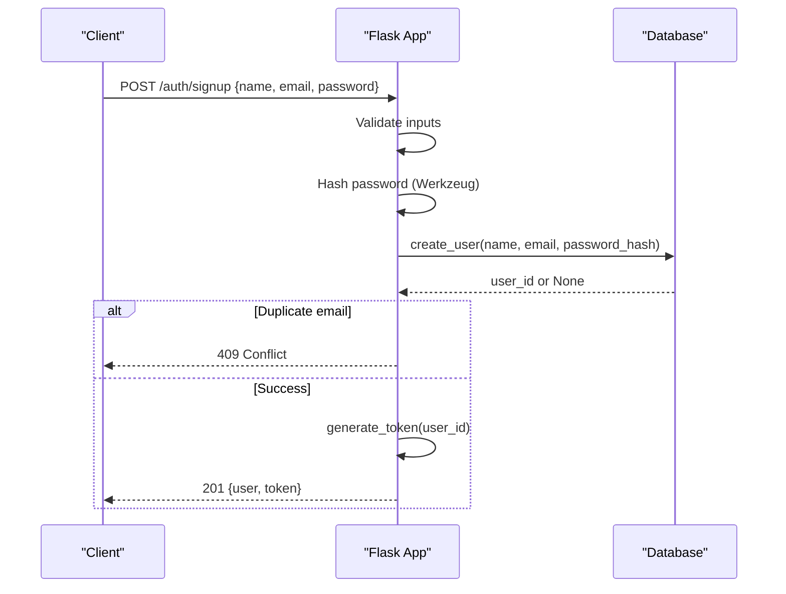
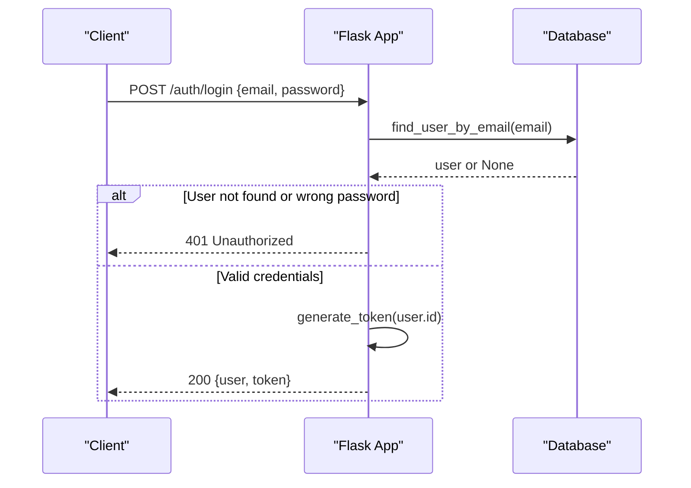
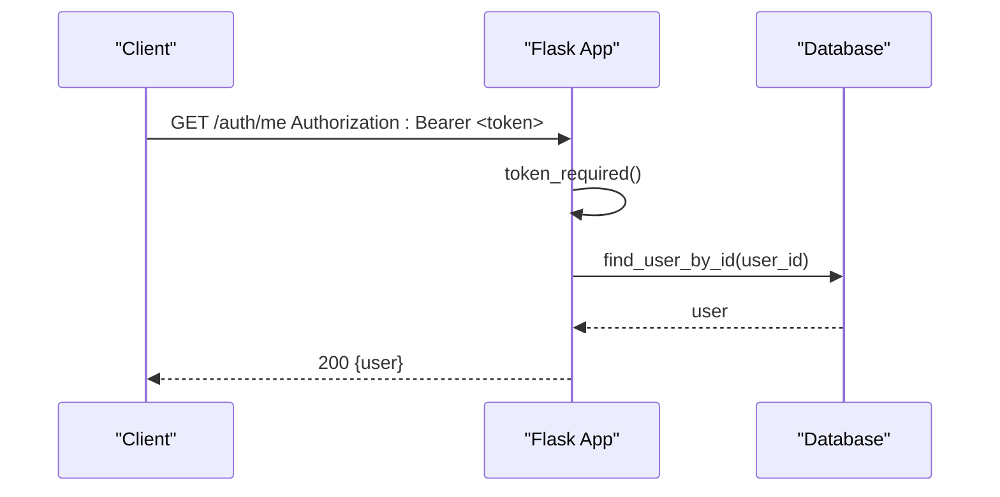
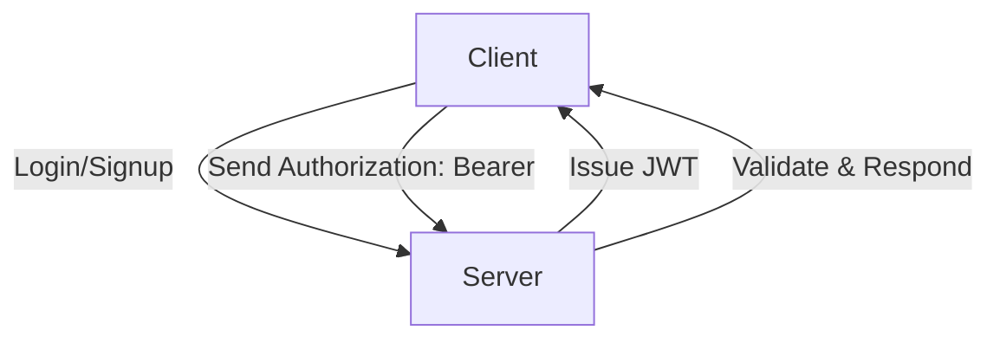
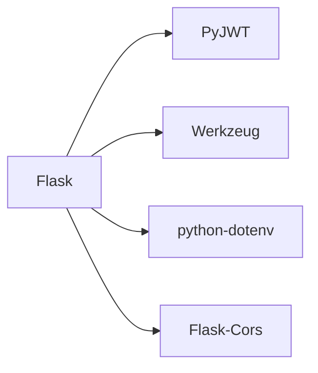

# JWT Authentication System

<cite>
**Referenced Files in This Document**
- [app.py](file://backend/app.py)
- [database.py](file://backend/database.py)
- [requirements.txt](file://backend/requirements.txt)
- [test_api.py](file://backend/test_api.py)
</cite>

## Table of Contents
1. [Introduction](#introduction)
2. [Project Structure](#project-structure)
3. [Core Components](#core-components)
4. [Architecture Overview](#architecture-overview)
5. [Detailed Component Analysis](#detailed-component-analysis)
6. [Dependency Analysis](#dependency-analysis)
7. [Performance Considerations](#performance-considerations)
8. [Troubleshooting Guide](#troubleshooting-guide)
9. [Conclusion](#conclusion)
10. [Appendices](#appendices)

## Introduction
This document explains the JWT-based authentication system implemented in the backend. It focuses on:
- The token_required decorator that protects routes requiring a valid JWT
- How Bearer tokens are extracted from Authorization headers
- Token validation using PyJWT, including expiration and invalid token handling
- Injection of current_user into protected route handlers
- The generate_token function for creating JWTs with user_id, exp, and iat claims
- Security considerations such as secure token storage, password hashing with Werkzeug, and protection against common authentication vulnerabilities

## Project Structure
The authentication logic is implemented in the Flask backend under the backend directory:
- app.py: Main application entry point containing JWT utilities, decorators, and auth routes
- database.py: SQLite database initialization and user queries used by authentication flows
- requirements.txt: Python dependencies including Flask, PyJWT, Werkzeug, and others
- test_api.py: Example client script demonstrating signup, login, token verification, and logout

**Diagram sources**
- [app.py:1-226](file://backend/app.py#L1-L226)
- [database.py:1-75](file://backend/database.py#L1-L75)
- [requirements.txt:1-6](file://backend/requirements.txt#L1-L6)

**Section sources**
- [app.py:1-226](file://backend/app.py#L1-L226)
- [database.py:1-75](file://backend/database.py#L1-L75)
- [requirements.txt:1-6](file://backend/requirements.txt#L1-L6)

## Core Components
- token_required decorator: Protects routes by extracting and validating JWTs from Authorization headers and injecting current_user into protected handlers
- generate_token function: Creates signed JWTs with user_id, exp (expiration), and iat (issued-at) claims
- Auth routes: /auth/signup, /auth/login, /auth/me, /auth/logout
- Password hashing: Uses Werkzeug to hash and verify passwords securely
- Database integration: User creation and lookup via SQLite through database.py

Key implementation references:
- Decorator definition and behavior: [token_required:33-65](file://backend/app.py#L33-L65)
- Token generation: [generate_token:72-82](file://backend/app.py#L72-L82)
- Protected route example: [/auth/me:186-193](file://backend/app.py#L186-L193)
- Signup flow with password hashing and token issuance: [/auth/signup:109-153](file://backend/app.py#L109-L153)
- Login flow with password verification and token issuance: [/auth/login:156-183](file://backend/app.py#L156-L183)

**Section sources**
- [app.py:33-82](file://backend/app.py#L33-L82)
- [app.py:109-183](file://backend/app.py#L109-L183)
- [app.py:186-193](file://backend/app.py#L186-L193)

## Architecture Overview
The authentication architecture follows a stateless JWT pattern:
- Clients authenticate via /auth/signup or /auth/login
- Server issues a signed JWT containing user identity and timestamps
- Clients store the token and include it in subsequent requests as Authorization: Bearer <token>
- Protected routes use token_required to validate tokens and resolve the current user
- Database operations retrieve user details based on token payload

**Diagram sources**
- [app.py:109-153](file://backend/app.py#L109-L153)
- [app.py:186-193](file://backend/app.py#L186-L193)
- [database.py:39-74](file://backend/database.py#L39-L74)

## Detailed Component Analysis

### token_required Decorator
Purpose:
- Extracts Bearer tokens from the Authorization header
- Validates tokens using PyJWT with HS256 algorithm and configured secret key
- Handles expired and invalid tokens with appropriate error responses
- Resolves current_user from the token’s user_id claim and injects it into protected handlers

Behavior:
- If no Authorization header or missing Bearer prefix, returns 401 with a message indicating a missing token
- On jwt.ExpiredSignatureError, returns 401 with an expiration message
- On jwt.InvalidTokenError, returns 401 with an invalid token message
- On successful decode, fetches the user by id; if not found, returns 401 with a user-not-found message
- Injects current_user as the first argument to the wrapped handler

**Diagram sources**
- [app.py:33-65](file://backend/app.py#L33-L65)

**Section sources**
- [app.py:33-65](file://backend/app.py#L33-L65)

### generate_token Function
Purpose:
- Creates a signed JWT for a given user_id
- Includes standard claims:
  - user_id: identifies the authenticated user
  - exp: expiration time calculated from configuration
  - iat: issued-at timestamp in UTC

Implementation highlights:
- Expiration is computed using datetime.timedelta with hours from JWT_EXPIRATION_HOURS config
- Encodes payload with HS256 algorithm using the app’s SECRET_KEY

**Diagram sources**
- [app.py:72-82](file://backend/app.py#L72-L82)

**Section sources**
- [app.py:72-82](file://backend/app.py#L72-L82)

### Auth Routes and Flows

#### /auth/signup
- Validates input fields (name, email, password)
- Hashes password using Werkzeug’s generate_password_hash
- Inserts user into database; handles duplicate emails via IntegrityError
- Generates JWT and returns user data plus token

**Diagram sources**
- [app.py:109-153](file://backend/app.py#L109-L153)
- [database.py:39-54](file://backend/database.py#L39-L54)

**Section sources**
- [app.py:109-153](file://backend/app.py#L109-L153)
- [database.py:39-54](file://backend/database.py#L39-L54)

#### /auth/login
- Validates email and password presence
- Looks up user by email and verifies password using check_password_hash
- Issues JWT upon successful authentication

**Diagram sources**
- [app.py:156-183](file://backend/app.py#L156-L183)
- [database.py:57-64](file://backend/database.py#L57-L64)

**Section sources**
- [app.py:156-183](file://backend/app.py#L156-L183)
- [database.py:57-64](file://backend/database.py#L57-L64)

#### /auth/me (Protected Route)
- Requires a valid JWT via Authorization: Bearer <token>
- Returns current user information after successful token validation

**Diagram sources**
- [app.py:186-193](file://backend/app.py#L186-L193)
- [database.py:67-74](file://backend/database.py#L67-L74)

**Section sources**
- [app.py:186-193](file://backend/app.py#L186-L193)
- [database.py:67-74](file://backend/database.py#L67-L74)

### Conceptual Overview
Conceptually, this system implements a stateless authentication model where:
- Tokens carry minimal identity information and are cryptographically signed
- Servers validate tokens without maintaining session state
- Clients are responsible for storing and sending tokens securely

[No sources needed since this diagram shows conceptual workflow, not actual code structure]

## Dependency Analysis
External dependencies relevant to authentication:
- Flask: Web framework providing request/response handling and routing
- PyJWT: JWT encoding/decoding with HS256 algorithm
- Werkzeug: Secure password hashing and verification utilities
- python-dotenv: Environment variable loading for secrets and configuration
- Flask-Cors: Cross-origin resource sharing support

**Diagram sources**
- [requirements.txt:1-6](file://backend/requirements.txt#L1-L6)

**Section sources**
- [requirements.txt:1-6](file://backend/requirements.txt#L1-L6)

## Performance Considerations
- Token decoding is lightweight and stateless; avoid unnecessary database calls by caching user lookups if high traffic is expected
- Use environment variables for SECRET_KEY and JWT_EXPIRATION_HOURS to prevent hardcoding secrets
- Keep JWT payloads minimal to reduce bandwidth and parsing overhead
- Consider adding rate limiting on authentication endpoints to mitigate brute-force attempts

[No sources needed since this section provides general guidance]

## Troubleshooting Guide
Common issues and resolutions:
- Missing Authorization header: Ensure clients send Authorization: Bearer <token> for protected routes
- Expired tokens: Adjust JWT_EXPIRATION_HOURS or refresh tokens on the client side before expiry
- Invalid tokens: Verify the token was generated with the same SECRET_KEY used for decoding
- User not found: Confirm user_id in token corresponds to an existing user in the database
- Duplicate email during signup: Handle 409 responses and inform users to use a different email

References:
- Error handling in token_required: [app.py:49-60](file://backend/app.py#L49-L60)
- Duplicate email handling in signup: [database.py:52-54](file://backend/database.py#L52-L54)

**Section sources**
- [app.py:49-60](file://backend/app.py#L49-L60)
- [database.py:52-54](file://backend/database.py#L52-L54)

## Conclusion
The JWT-based authentication system provides a secure, stateless approach to protecting API routes. The token_required decorator ensures only valid, non-expired tokens can access protected endpoints, while generate_token creates compact, signed tokens with essential claims. Passwords are securely hashed using Werkzeug, and environment-driven configuration supports safe deployment practices. Following the security recommendations in this document will help maintain robust authentication and protect against common vulnerabilities.

[No sources needed since this section summarizes without analyzing specific files]

## Appendices

### Security Considerations
- Token storage best practices:
  - Store tokens in secure, HTTP-only storage mechanisms when possible (e.g., secure cookies or platform-specific secure storages)
  - Avoid storing tokens in localStorage for long periods; prefer short-lived tokens with refresh strategies
  - Clear tokens on logout and handle token revocation at the client level
- Password hashing:
  - Always hash passwords using Werkzeug’s generate_password_hash and verify with check_password_hash
  - Never store plaintext passwords
- Protection against common vulnerabilities:
  - Use HTTPS to prevent token interception
  - Implement rate limiting on login/signup endpoints to mitigate brute-force attacks
  - Validate and sanitize all inputs to prevent injection attacks
  - Rotate SECRET_KEY periodically and never commit secrets to version control

[No sources needed since this section provides general guidance]

### Usage Examples
End-to-end flow demonstrated in the test script:
- Signup and receive token
- Verify token by accessing /auth/me with Authorization header
- Login and receive new token
- Logout endpoint for API completeness

Reference:
- Test script demonstrating usage: [test_api.py:1-62](file://backend/test_api.py#L1-L62)

**Section sources**
- [test_api.py:1-62](file://backend/test_api.py#L1-L62)