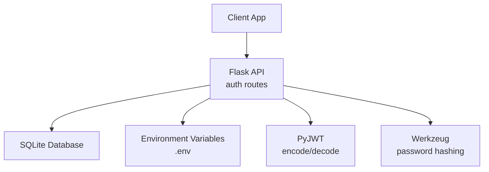
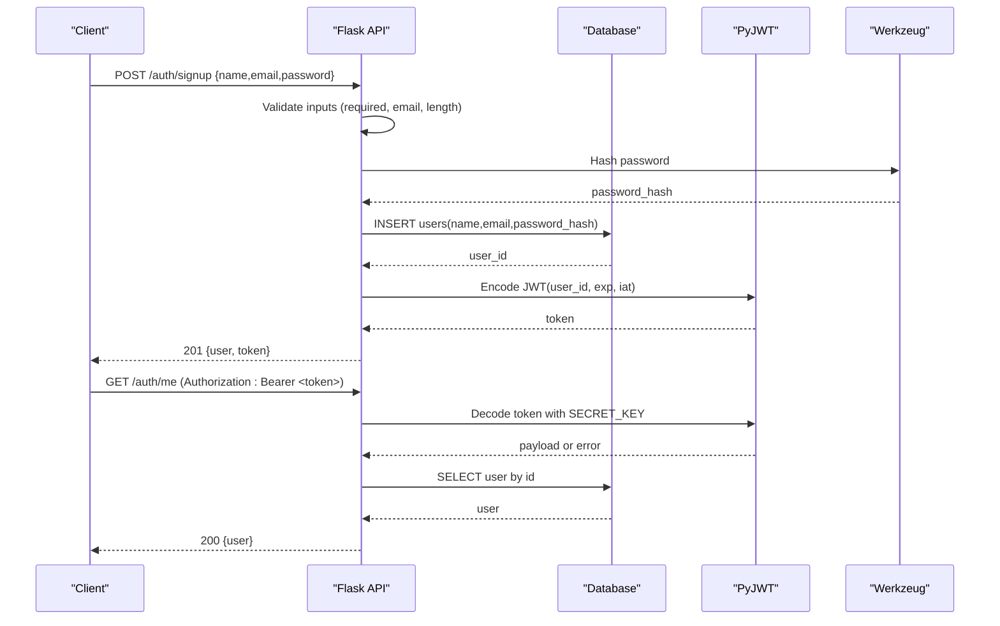
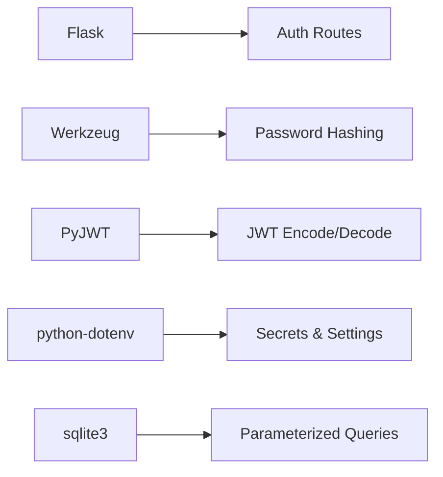

# Security Implementation

<cite>
**Referenced Files in This Document**
- [app.py](file://backend/app.py)
- [database.py](file://backend/database.py)
- [requirements.txt](file://backend/requirements.txt)
- [test_api.py](file://backend/test_api.py)
</cite>

## Table of Contents
1. [Introduction](#introduction)
2. [Project Structure](#project-structure)
3. [Core Components](#core-components)
4. [Architecture Overview](#architecture-overview)
5. [Detailed Component Analysis](#detailed-component-analysis)
6. [Dependency Analysis](#dependency-analysis)
7. [Performance Considerations](#performance-considerations)
8. [Troubleshooting Guide](#troubleshooting-guide)
9. [Conclusion](#conclusion)
10. [Appendices](#appendices)

## Introduction
This document provides a comprehensive security overview of the backend for the Bon Voyage Pakistan application. It focuses on how user credentials are protected, how inputs are validated, how JSON Web Tokens (JWT) are issued and verified, and how SQL injection is prevented. It also outlines production-ready security practices such as environment variable management and safe logging.

## Project Structure
The backend consists of:
- A Flask application that exposes authentication endpoints and enforces JWT-based authorization.
- A database module using SQLite with parameterized queries to prevent SQL injection.
- A requirements file listing dependencies including Flask, PyJWT, Werkzeug, and python-dotenv.
- A test script demonstrating typical API flows.

**Diagram sources**
- [app.py:10-26](file://backend/app.py#L10-L26)
- [database.py:13-17](file://backend/database.py#L13-L17)
- [requirements.txt:1-6](file://backend/requirements.txt#L1-L6)

**Section sources**
- [app.py:1-226](file://backend/app.py#L1-L226)
- [database.py:1-75](file://backend/database.py#L1-L75)
- [requirements.txt:1-6](file://backend/requirements.txt#L1-L6)

## Core Components
- Authentication endpoints: signup, login, me, logout.
- Password hashing via Werkzeug’s secure hashing utilities.
- JWT issuance and verification with expiration and algorithm enforcement.
- Input validation for required fields, email format, and password length.
- Parameterized SQL queries to prevent SQL injection.
- Environment-driven configuration for secrets and token lifetime.

**Section sources**
- [app.py:109-183](file://backend/app.py#L109-L183)
- [app.py:33-82](file://backend/app.py#L33-L82)
- [database.py:39-74](file://backend/database.py#L39-L74)

## Architecture Overview
The authentication flow uses secure password hashing, input validation, and stateless JWTs. Protected routes require a valid Bearer token, which is decoded against a secret key and checked for expiration.

**Diagram sources**
- [app.py:109-153](file://backend/app.py#L109-L153)
- [app.py:156-183](file://backend/app.py#L156-L183)
- [app.py:186-193](file://backend/app.py#L186-L193)
- [app.py:33-82](file://backend/app.py#L33-L82)
- [database.py:39-74](file://backend/database.py#L39-L74)

## Detailed Component Analysis

### Password Security
- Plaintext passwords are never stored. During signup, the provided password is hashed before persistence.
- During login, the stored hash is compared against the submitted password without exposing or storing plaintext.
- The hashing functions used are from Werkzeug’s security utilities.

Key behaviors:
- Signup hashes the password prior to insertion.
- Login verifies the submitted password against the stored hash.
- Responses never include sensitive fields like password hashes.

**Section sources**
- [app.py:136-140](file://backend/app.py#L136-L140)
- [app.py:170-173](file://backend/app.py#L170-L173)
- [database.py:25-33](file://backend/database.py#L25-L33)

### Input Validation
- Required fields: name, email, password are enforced during signup; email and password are required during login.
- Email format is validated using a regex pattern.
- Password must meet a minimum length requirement.
- Errors are returned as a list when multiple issues occur.

Validation highlights:
- Name trimming and normalization.
- Email lowercasing and format check.
- Minimum password length enforcement.

**Section sources**
- [app.py:116-134](file://backend/app.py#L116-L134)
- [app.py:163-168](file://backend/app.py#L163-L168)
- [app.py:98-102](file://backend/app.py#L98-L102)

### JWT Security
- Token issuance includes an expiration time based on a configurable number of hours.
- Tokens are encoded with a symmetric algorithm and signed using a secret key loaded from environment variables.
- Protected routes decode and verify tokens, handling expired or invalid tokens with appropriate errors.
- User lookup occurs after successful decoding to ensure the token references an existing user.

Security notes:
- Expiration prevents indefinite token reuse.
- Algorithm is explicitly specified to avoid downgrade attacks.
- Secret key is read from environment variables to avoid hardcoding.

**Section sources**
- [app.py:24-26](file://backend/app.py#L24-L26)
- [app.py:33-65](file://backend/app.py#L33-L65)
- [app.py:72-82](file://backend/app.py#L72-L82)

### SQL Injection Prevention
- All database operations use parameterized queries with placeholders and bound parameters.
- No string concatenation is used to build SQL statements.
- Database connections are created per operation and closed afterward.

Protection mechanisms:
- Parameter binding in INSERT and SELECT statements.
- Unique constraint on email to prevent duplicates at the database level.

**Section sources**
- [database.py:44-47](file://backend/database.py#L44-L47)
- [database.py:61-62](file://backend/database.py#L61-L62)
- [database.py:71-72](file://backend/database.py#L71-L72)
- [database.py:25-33](file://backend/database.py#L25-L33)

### XSS Protection
- The backend returns JSON responses and does not render HTML templates. This reduces the risk of server-side XSS.
- For full protection, ensure clients enforce Content Security Policy and do not inject untrusted data into DOM without sanitization.

[No sources needed since this section provides general guidance]

### CSRF Considerations
- The current implementation does not include explicit CSRF protections. Since the API is stateless and likely consumed by mobile or SPA clients, CSRF typically applies to browser-based sessions. If serving web pages, consider implementing CSRF tokens for state-changing requests.
- CORS is enabled globally; restrict origins in production to trusted domains only.

**Section sources**
- [app.py:21-22](file://backend/app.py#L21-L22)

### Error Handling and Enumeration Prevention
- Login returns a generic “Invalid email or password” message regardless of whether the email exists or the password is wrong, mitigating user enumeration.
- Duplicate signup attempts return a conflict response.

**Section sources**
- [app.py:170-173](file://backend/app.py#L170-L173)
- [app.py:141-143](file://backend/app.py#L141-L143)

## Dependency Analysis
The backend relies on well-known libraries for security-critical functionality:
- Flask for routing and request handling.
- Werkzeug for secure password hashing.
- PyJWT for token encoding/decoding with explicit algorithms.
- python-dotenv for loading environment variables.
- sqlite3 for local storage with parameterized queries.

**Diagram sources**
- [requirements.txt:1-6](file://backend/requirements.txt#L1-L6)
- [app.py:10-16](file://backend/app.py#L10-L16)
- [database.py:6-17](file://backend/database.py#L6-L17)

**Section sources**
- [requirements.txt:1-6](file://backend/requirements.txt#L1-L6)
- [app.py:10-16](file://backend/app.py#L10-L16)
- [database.py:6-17](file://backend/database.py#L6-L17)

## Performance Considerations
- Password hashing is intentionally CPU-intensive to resist brute-force attacks. Ensure hardware resources are adequate for expected load.
- SQLite is suitable for development and low-to-moderate traffic. For high concurrency, consider a production-grade RDBMS with connection pooling.
- Keep JWT payloads minimal to reduce bandwidth and processing overhead.

[No sources needed since this section provides general guidance]

## Troubleshooting Guide
Common issues and resolutions:
- Missing Authorization header on protected routes: ensure clients send “Authorization: Bearer <token>”.
- Expired tokens: refresh or re-authenticate; adjust JWT_EXPIRATION_HOURS if necessary.
- Invalid token: verify the signing secret matches between encode and decode phases.
- Duplicate email during signup: handle conflicts gracefully on the client side.

Operational checks:
- Health endpoint confirms the service is running.
- Test script demonstrates end-to-end flows for quick validation.

**Section sources**
- [app.py:44-60](file://backend/app.py#L44-L60)
- [app.py:213-216](file://backend/app.py#L213-L216)
- [test_api.py:1-62](file://backend/test_api.py#L1-L62)

## Conclusion
The backend implements strong foundational security measures:
- Secure password hashing ensures plaintext passwords are never stored.
- Input validation protects against malformed or malicious inputs.
- JWTs are issued with expiration and verified with strict algorithm and secret key checks.
- Parameterized queries eliminate SQL injection risks.
For production, further harden the deployment with strict CORS policies, robust secret management, rate limiting, and comprehensive logging that avoids sensitive data exposure.

[No sources needed since this section summarizes without analyzing specific files]

## Appendices

### Production Deployment Checklist
- Secrets management:
  - Store SECRET_KEY and other secrets in environment variables or a secrets manager.
  - Do not commit secrets to version control.
- Token policy:
  - Set appropriate JWT_EXPIRATION_HOURS based on your security model.
  - Implement token refresh flows if long-lived sessions are required.
- Network security:
  - Restrict CORS to trusted origins.
  - Use HTTPS in front of the API server.
- Logging:
  - Avoid logging passwords, tokens, or full PII.
  - Log events like failed logins and token errors for monitoring and alerting.
- Monitoring and resilience:
  - Add rate limiting to protect auth endpoints.
  - Use structured logs and centralized log aggregation.
  - Enable health checks and readiness probes.

[No sources needed since this section provides general guidance]