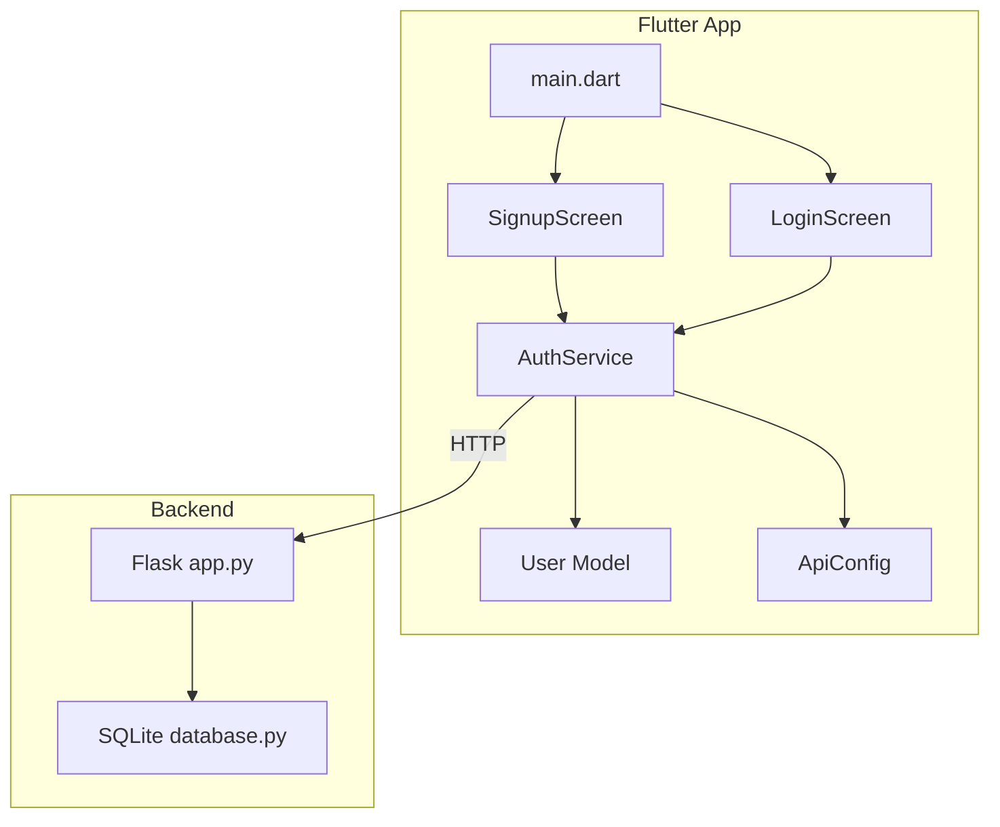
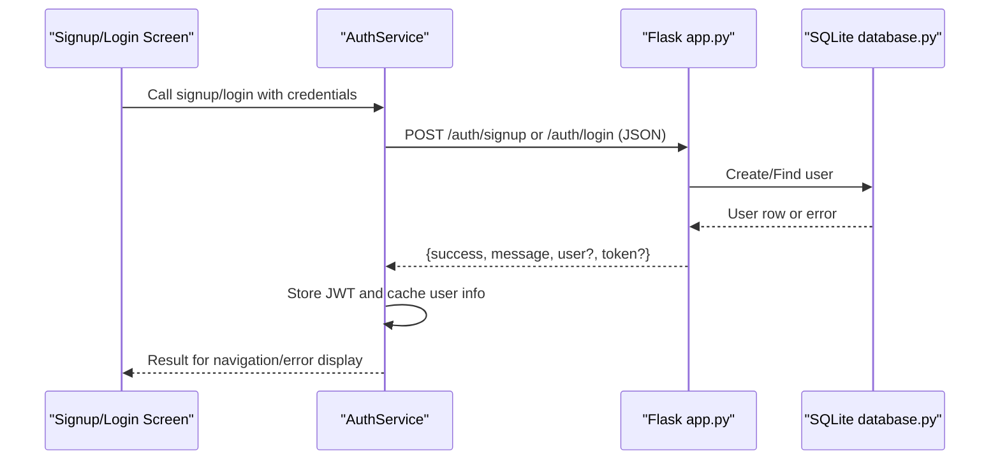
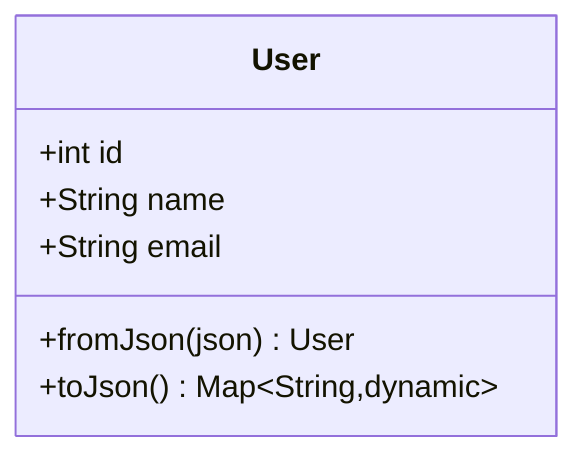
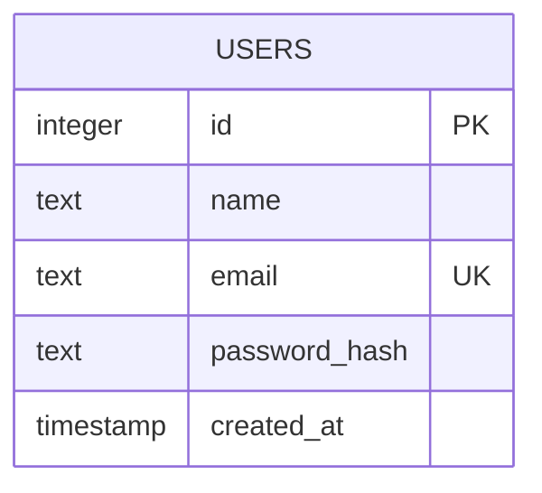
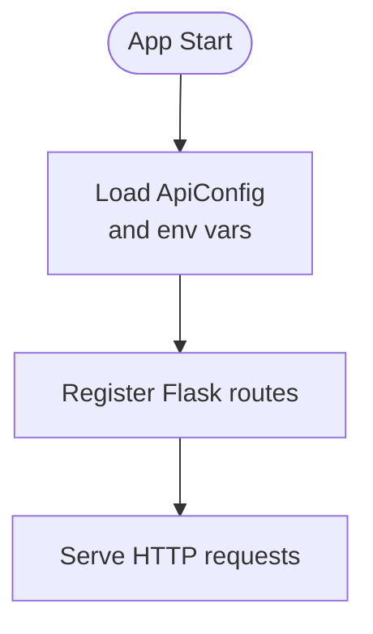
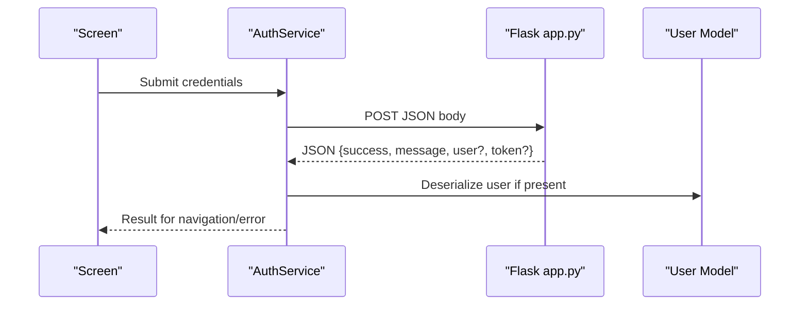
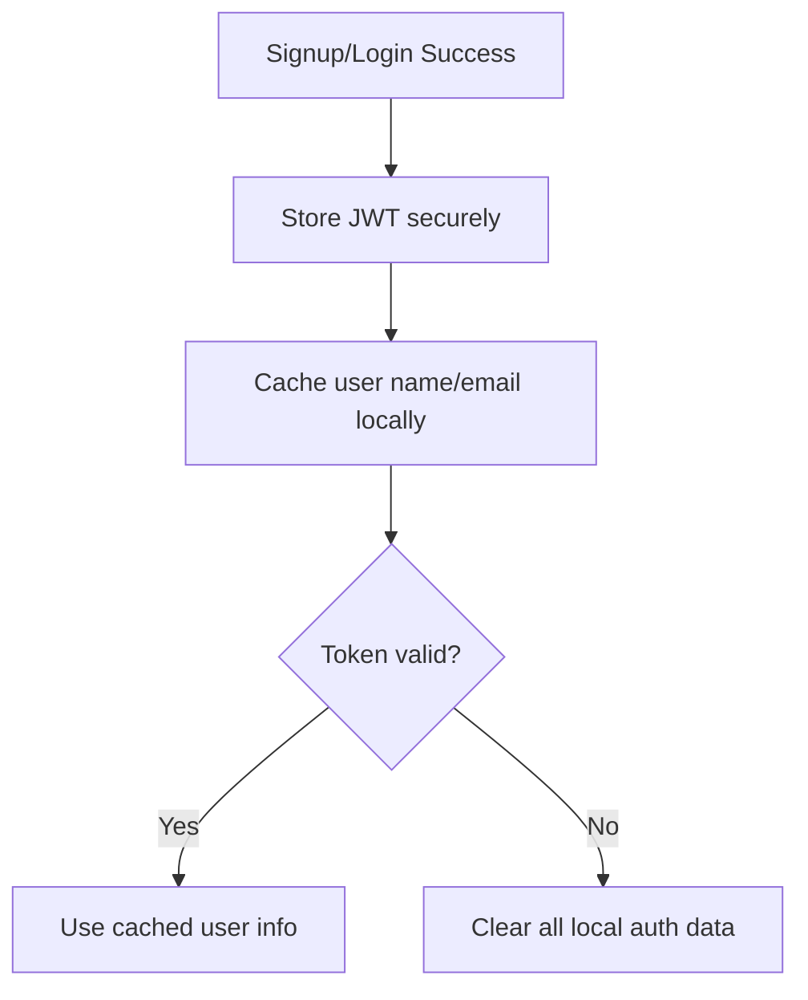
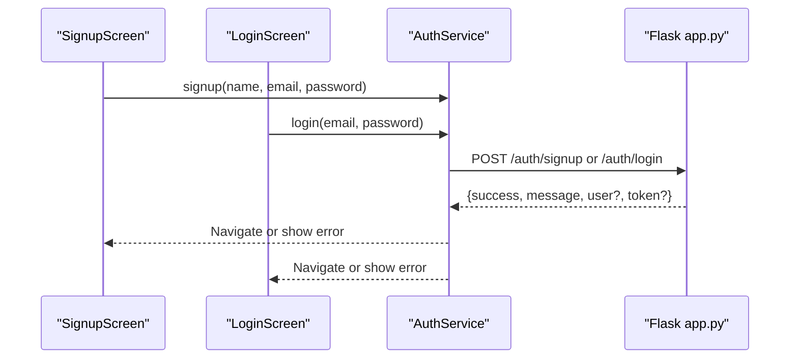
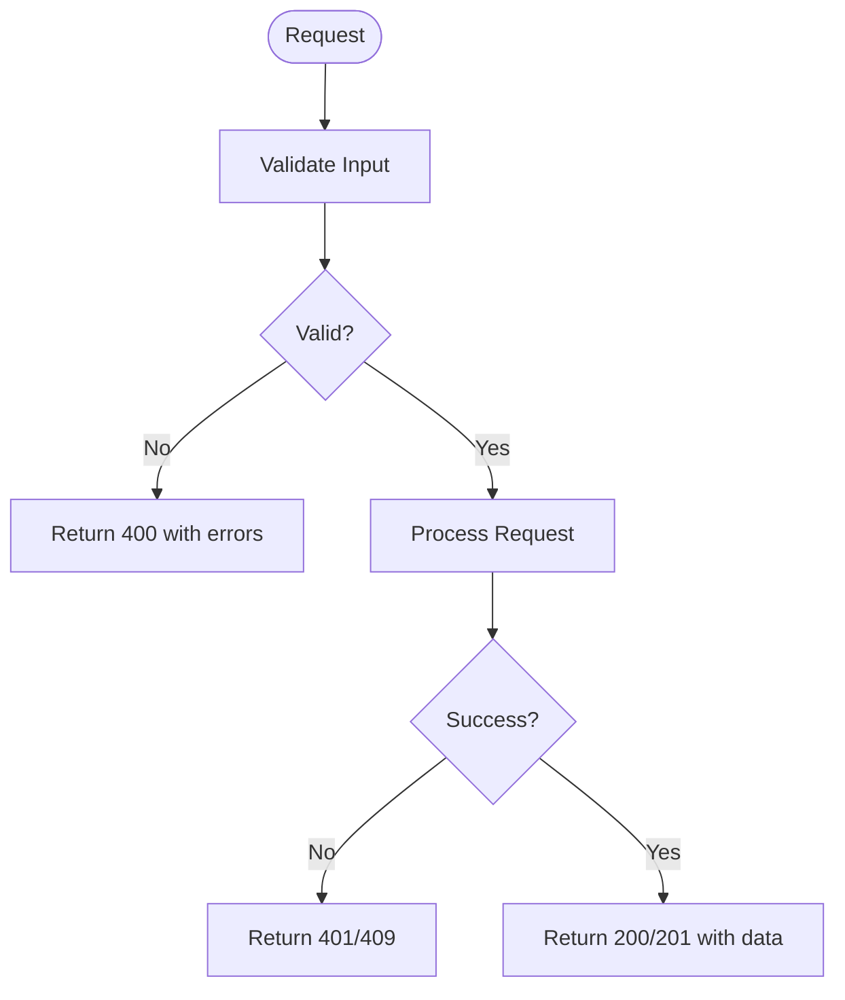
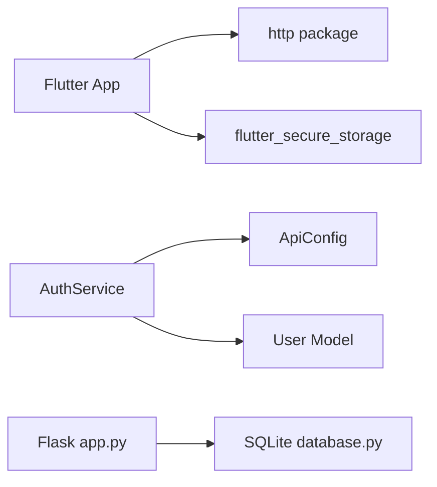

# Data Models and Schemas

<cite>
**Referenced Files in This Document**
- [app.py](file://backend/app.py)
- [database.py](file://backend/database.py)
- [user.dart](file://lib/models/user.dart)
- [api_config.dart](file://lib/config/api_config.dart)
- [auth_service.dart](file://lib/services/auth_service.dart)
- [signup_screen.dart](file://lib/screens/signup_screen.dart)
- [login_screen.dart](file://lib/screens/login_screen.dart)
- [main.dart](file://lib/main.dart)
- [pubspec.yaml](file://pubspec.yaml)
</cite>

## Table of Contents
1. Introduction
2. Project Structure
3. Core Components
4. Architecture Overview
5. Detailed Component Analysis
6. Dependency Analysis
7. Performance Considerations
8. Troubleshooting Guide
9. Conclusion
10. Appendices

## Introduction
This document describes the data models, database schema, API configuration, serialization patterns, and data lifecycle for the Bon Voyage Pakistan application. It focuses on the User model (id, name, email), the SQLite backend schema, environment-specific settings, validation rules, caching and local storage, usage in screens and services, error handling, migration strategies, and security considerations for user information.

## Project Structure
The application is split into a Flutter frontend and a Flask backend:
- Frontend:
  - Models: User model with JSON serialization
  - Services: AuthService handles HTTP calls, token storage, and local caching
  - Config: ApiConfig centralizes base URL and endpoints
  - Screens: SignupScreen and LoginScreen orchestrate user input and navigation
  - Entry point: main.dart initializes the app
- Backend:
  - app.py: Flask routes for authentication, JWT handling, and validation
  - database.py: SQLite connection, schema initialization, and user queries

**Diagram sources**
- [main.dart:6-47](file://lib/main.dart#L6-L47)
- [signup_screen.dart:57-87](file://lib/screens/signup_screen.dart#L57-L87)
- [login_screen.dart:53-82](file://lib/screens/login_screen.dart#L53-L82)
- [auth_service.dart:14-258](file://lib/services/auth_service.dart#L14-L258)
- [user.dart:1-29](file://lib/models/user.dart#L1-L29)
- [api_config.dart:1-20](file://lib/config/api_config.dart#L1-L20)
- [app.py:21-226](file://backend/app.py#L21-L226)
- [database.py:1-75](file://backend/database.py#L1-L75)

**Section sources**
- [main.dart:6-47](file://lib/main.dart#L6-L47)
- [pubspec.yaml:9-16](file://pubspec.yaml#L9-L16)

## Core Components
- User model (frontend):
  - Properties: id (int), name (String), email (String)
  - Serialization: fromJson/toJson mapping to/from backend JSON payloads
- Backend User entity:
  - Database fields: id (INTEGER PK AUTOINCREMENT), name (TEXT NOT NULL), email (TEXT NOT NULL UNIQUE), password_hash (TEXT NOT NULL), created_at (TIMESTAMP DEFAULT CURRENT_TIMESTAMP)
  - API response excludes sensitive fields via a dedicated converter
- Authentication service:
  - Handles signup, login, token verification, logout
  - Stores JWT securely and caches minimal user info locally
- API configuration:
  - Centralized base URL and endpoint constants for consistent routing

**Section sources**
- [user.dart:1-29](file://lib/models/user.dart#L1-L29)
- [database.py:20-36](file://backend/database.py#L20-L36)
- [app.py:85-92](file://backend/app.py#L85-L92)
- [auth_service.dart:14-258](file://lib/services/auth_service.dart#L14-L258)
- [api_config.dart:1-20](file://lib/config/api_config.dart#L1-L20)

## Architecture Overview
End-to-end flow for authentication and data handling:

**Diagram sources**
- [signup_screen.dart:57-87](file://lib/screens/signup_screen.dart#L57-L87)
- [login_screen.dart:53-82](file://lib/screens/login_screen.dart#L53-L82)
- [auth_service.dart:73-161](file://lib/services/auth_service.dart#L73-L161)
- [app.py:109-183](file://backend/app.py#L109-L183)
- [database.py:39-74](file://backend/database.py#L39-L74)

## Detailed Component Analysis

### User Model (Frontend)
- Purpose: Strongly typed representation of the backend user payload
- Fields:
  - id: int
  - name: String
  - email: String
- Serialization:
  - fromJson: maps backend keys to model fields
  - toJson: outputs only non-sensitive fields
- Validation:
  - Type casting ensures correct types; additional validation occurs at UI and backend layers

**Diagram sources**
- [user.dart:1-29](file://lib/models/user.dart#L1-L29)

**Section sources**
- [user.dart:1-29](file://lib/models/user.dart#L1-L29)

### Backend Database Schema
- Storage: SQLite file located next to the backend module
- Table: users
  - id: INTEGER PRIMARY KEY AUTOINCREMENT
  - name: TEXT NOT NULL
  - email: TEXT NOT NULL UNIQUE
  - password_hash: TEXT NOT NULL
  - created_at: TIMESTAMP DEFAULT CURRENT_TIMESTAMP
- Operations:
  - create_user: inserts new user, returns id or None on duplicate
  - find_user_by_email/find_user_by_id: read-only queries returning rows as dictionaries

**Diagram sources**
- [database.py:20-36](file://backend/database.py#L20-L36)

**Section sources**
- [database.py:1-75](file://backend/database.py#L1-L75)

### API Configuration and Environment Settings
- Base URL: centralized constant for development LAN address; can be changed per environment
- Endpoints:
  - /auth/signup
  - /auth/login
  - /auth/me
  - /auth/logout
- Backend environment variables:
  - SECRET_KEY: used for signing JWTs
  - JWT_EXPIRATION_HOURS: token lifetime

**Diagram sources**
- [api_config.dart:1-20](file://lib/config/api_config.dart#L1-L20)
- [app.py:21-27](file://backend/app.py#L21-L27)

**Section sources**
- [api_config.dart:1-20](file://lib/config/api_config.dart#L1-L20)
- [app.py:21-27](file://backend/app.py#L21-L27)

### Data Serialization and Deserialization
- Backend to Frontend:
  - Backend returns JSON with success flag, message, optional user object, and optional token
  - Frontend parses JSON into User model using fromJson
- Frontend to Backend:
  - Screens send JSON payloads with required fields (name/email/password for signup; email/password for login)
  - Service encodes Dart objects to JSON before sending

**Diagram sources**
- [auth_service.dart:73-161](file://lib/services/auth_service.dart#L73-L161)
- [user.dart:13-20](file://lib/models/user.dart#L13-L20)
- [app.py:109-183](file://backend/app.py#L109-L183)

**Section sources**
- [auth_service.dart:73-161](file://lib/services/auth_service.dart#L73-L161)
- [user.dart:13-20](file://lib/models/user.dart#L13-L20)
- [app.py:109-183](file://backend/app.py#L109-L183)

### Data Lifecycle: Creation, Updates, Deletion, Caching, Local Storage
- Creation:
  - Signup creates a user record in SQLite and returns a JWT
  - Frontend stores JWT securely and caches minimal user info locally
- Updates:
  - No update endpoints are implemented in the current codebase
- Deletion:
  - No delete endpoints are implemented in the current codebase
- Caching and Local Storage:
  - JWT stored in secure storage
  - Cached user name and email stored in secure storage for quick access without network calls
  - Token verification clears stale tokens when invalid/expired

**Diagram sources**
- [auth_service.dart:31-62](file://lib/services/auth_service.dart#L31-L62)
- [auth_service.dart:168-202](file://lib/services/auth_service.dart#L168-L202)

**Section sources**
- [auth_service.dart:31-62](file://lib/services/auth_service.dart#L31-L62)
- [auth_service.dart:168-202](file://lib/services/auth_service.dart#L168-L202)

### Usage in Screens and Services
- SignupScreen:
  - Validates inputs (name, email format, password requirements)
  - Calls AuthService.signup and navigates on success or shows errors
- LoginScreen:
  - Validates inputs (email format, password presence)
  - Calls AuthService.login and navigates on success or shows errors
- AuthService:
  - Encodes request bodies, decodes responses, persists tokens, and manages local cache

**Diagram sources**
- [signup_screen.dart:57-87](file://lib/screens/signup_screen.dart#L57-L87)
- [login_screen.dart:53-82](file://lib/screens/login_screen.dart#L53-L82)
- [auth_service.dart:73-161](file://lib/services/auth_service.dart#L73-L161)
- [app.py:109-183](file://backend/app.py#L109-L183)

**Section sources**
- [signup_screen.dart:57-87](file://lib/screens/signup_screen.dart#L57-L87)
- [login_screen.dart:53-82](file://lib/screens/login_screen.dart#L53-L82)
- [auth_service.dart:73-161](file://lib/services/auth_service.dart#L73-L161)

### Error Handling Patterns
- Frontend:
  - Timeouts and connection errors return standardized messages
  - Generic catch-all for unexpected errors
- Backend:
  - Validation errors return structured messages and status codes
  - Duplicate email handled via integrity error mapping
  - Authentication failures return appropriate 401 responses

**Diagram sources**
- [auth_service.dart:232-256](file://lib/services/auth_service.dart#L232-L256)
- [app.py:120-134](file://backend/app.py#L120-L134)
- [app.py:166-183](file://backend/app.py#L166-L183)
- [database.py:52-54](file://backend/database.py#L52-L54)

**Section sources**
- [auth_service.dart:232-256](file://lib/services/auth_service.dart#L232-L256)
- [app.py:120-134](file://backend/app.py#L120-L134)
- [app.py:166-183](file://backend/app.py#L166-L183)
- [database.py:52-54](file://backend/database.py#L52-L54)

### Migration Strategies for Schema Changes
- Current approach:
  - Uses CREATE TABLE IF NOT EXISTS during initialization
- Recommended strategy:
  - Introduce a migrations table to track applied versions
  - Apply incremental SQL scripts to add columns, constraints, or rename tables
  - Ensure idempotent operations and rollback plans for production deployments

[No sources needed since this section provides general guidance]

## Dependency Analysis
Key dependencies and relationships:
- Flutter app depends on http and flutter_secure_storage for networking and secure storage
- AuthService depends on ApiConfig for endpoints and User model for deserialization
- Backend depends on Flask, CORS, JWT, and SQLite

**Diagram sources**
- [pubspec.yaml:9-16](file://pubspec.yaml#L9-L16)
- [auth_service.dart:1-9](file://lib/services/auth_service.dart#L1-L9)
- [api_config.dart:1-20](file://lib/config/api_config.dart#L1-L20)
- [user.dart:1-29](file://lib/models/user.dart#L1-L29)
- [app.py:10-16](file://backend/app.py#L10-L16)
- [database.py:1-17](file://backend/database.py#L1-L17)

**Section sources**
- [pubspec.yaml:9-16](file://pubspec.yaml#L9-L16)
- [auth_service.dart:1-9](file://lib/services/auth_service.dart#L1-L9)
- [api_config.dart:1-20](file://lib/config/api_config.dart#L1-L20)
- [user.dart:1-29](file://lib/models/user.dart#L1-L29)
- [app.py:10-16](file://backend/app.py#L10-L16)
- [database.py:1-17](file://backend/database.py#L1-L17)

## Performance Considerations
- Network timeouts:
  - All HTTP requests use a fixed timeout to prevent indefinite hangs
- Local caching:
  - Minimal user profile cached locally to reduce network calls
- Database:
  - SQLite is lightweight; ensure proper connection management and avoid blocking operations
- Security:
  - Use HTTPS in production and rotate secrets regularly

[No sources needed since this section provides general guidance]

## Troubleshooting Guide
Common issues and resolutions:
- Cannot connect to server:
  - Verify device and backend are on the same network and backend is running
- Token expired or invalid:
  - Re-authenticate; verify backend SECRET_KEY and expiration settings
- Duplicate email:
  - Backend enforces unique constraint; prompt user to use a different email
- Validation errors:
  - Check frontend form validators and backend validation rules

**Section sources**
- [auth_service.dart:232-256](file://lib/services/auth_service.dart#L232-L256)
- [app.py:120-134](file://backend/app.py#L120-L134)
- [app.py:166-183](file://backend/app.py#L166-L183)
- [database.py:52-54](file://backend/database.py#L52-L54)

## Conclusion
The Bon Voyage Pakistan application implements a clear separation between frontend models and backend persistence. The User model aligns with the SQLite schema, while AuthService manages authentication flows, token storage, and local caching. Validation and error handling are enforced on both sides, and environment-specific configuration centralizes API endpoints. For future growth, introduce explicit update/delete endpoints, robust migration management, and enhanced privacy controls.

## Appendices

### API Endpoints Summary
- POST /auth/signup:
  - Request: name, email, password
  - Response: success, message, user (id, name, email), token
- POST /auth/login:
  - Request: email, password
  - Response: success, message, user (id, name, email), token
- GET /auth/me:
  - Header: Authorization: Bearer <token>
  - Response: success, user (id, name, email)
- POST /auth/logout:
  - Response: success, message

**Section sources**
- [app.py:109-206](file://backend/app.py#L109-L206)
- [auth_service.dart:73-226](file://lib/services/auth_service.dart#L73-L226)

### Security and Privacy Considerations
- Passwords:
  - Stored as hashes; never returned in API responses
- Tokens:
  - Signed with SECRET_KEY; short-lived via configurable expiration
- Local storage:
  - JWT and minimal user info stored securely on-device
- Network:
  - Use HTTPS in production; enforce CORS appropriately
- Compliance:
  - Minimize data collection; provide mechanisms for data export and deletion when features are added

**Section sources**
- [app.py:21-27](file://backend/app.py#L21-L27)
- [app.py:85-92](file://backend/app.py#L85-L92)
- [auth_service.dart:14-62](file://lib/services/auth_service.dart#L14-L62)