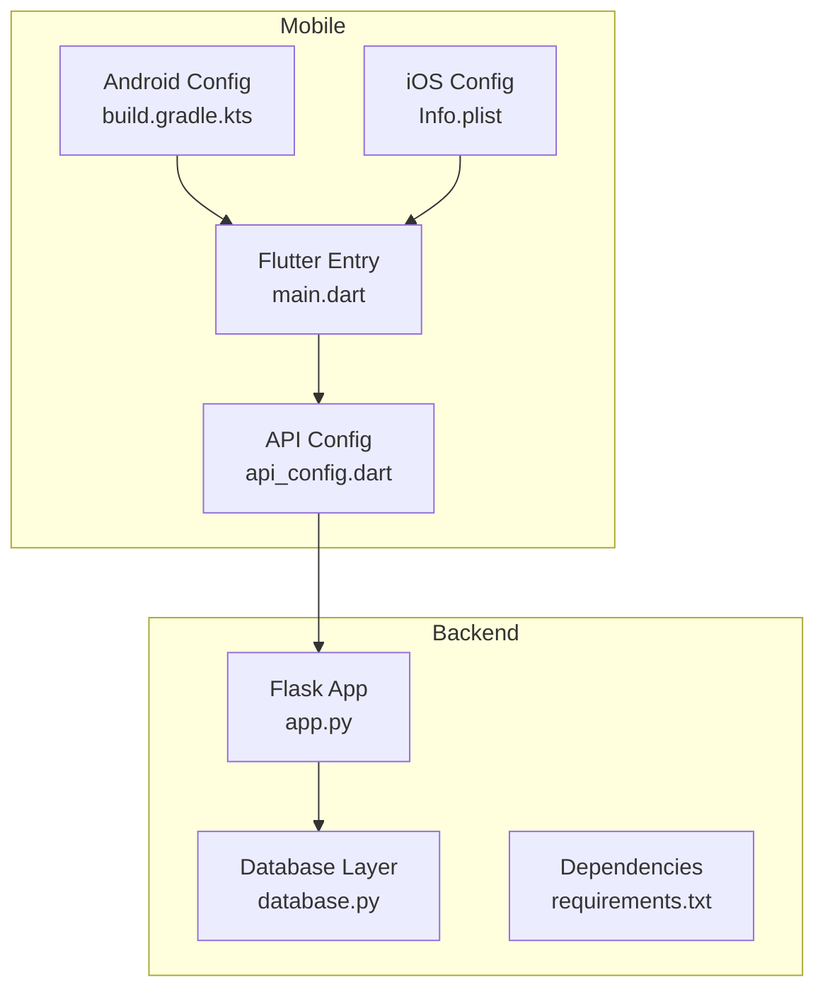
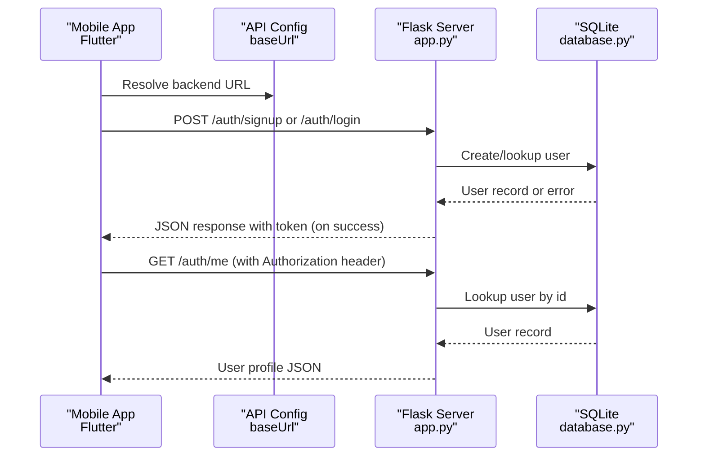
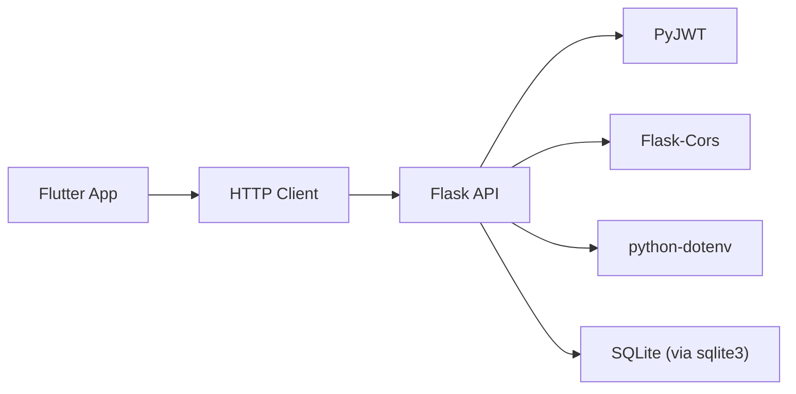

# Deployment Guide

<cite>
**Referenced Files in This Document**
- [README.md](file://README.md)
- [pubspec.yaml](file://pubspec.yaml)
- [lib/main.dart](file://lib/main.dart)
- [lib/config/api_config.dart](file://lib/config/api_config.dart)
- [android/app/build.gradle.kts](file://android/app/build.gradle.kts)
- [android/gradle.properties](file://android/gradle.properties)
- [android/app/src/main/AndroidManifest.xml](file://android/app/src/main/AndroidManifest.xml)
- [ios/Runner/Info.plist](file://ios/Runner/Info.plist)
- [backend/app.py](file://backend/app.py)
- [backend/database.py](file://backend/database.py)
- [backend/requirements.txt](file://backend/requirements.txt)
</cite>

## Table of Contents
1. Introduction
2. Project Structure
3. Core Components
4. Architecture Overview
5. Detailed Component Analysis
6. Dependency Analysis
7. Performance Considerations
8. Troubleshooting Guide
9. Conclusion
10. Appendices

## Introduction
This deployment guide covers production-ready setup for the Bon Voyage Pakistan application, including:
- Mobile app build and distribution (Android via Google Play Store, iOS via Apple App Store)
- Backend deployment for the Flask API with secure configuration and database considerations
- Containerization options, cloud deployment strategies, and CI/CD pipeline guidance
- Production environment configuration, security hardening, monitoring, scaling, and maintenance procedures

The project is a Flutter mobile app with a Python/Flask backend using SQLite for user authentication endpoints.

**Section sources**
- [README.md:1-18](file://README.md#L1-L18)

## Project Structure
High-level structure relevant to deployment:
- Mobile (Flutter): Android and iOS platform configurations, assets, and entry point
- Backend: Flask application with JWT-based authentication and SQLite storage
- Configuration: API base URL and versioning metadata

**Diagram sources**
- [android/app/build.gradle.kts:1-50](file://android/app/build.gradle.kts#L1-L50)
- [ios/Runner/Info.plist:1-71](file://ios/Runner/Info.plist#L1-L71)
- [lib/main.dart:1-47](file://lib/main.dart#L1-L47)
- [lib/config/api_config.dart:1-19](file://lib/config/api_config.dart#L1-L19)
- [backend/app.py:1-226](file://backend/app.py#L1-L226)
- [backend/database.py:1-75](file://backend/database.py#L1-L75)
- [backend/requirements.txt:1-6](file://backend/requirements.txt#L1-L6)

**Section sources**
- [pubspec.yaml:1-31](file://pubspec.yaml#L1-L31)
- [lib/main.dart:1-47](file://lib/main.dart#L1-L47)
- [backend/app.py:1-226](file://backend/app.py#L1-L226)
- [backend/database.py:1-75](file://backend/database.py#L1-L75)

## Core Components
- Mobile app entry and theme initialization
- API configuration pointing to the backend
- Backend authentication routes with JWT handling
- Database layer for user management

Key responsibilities:
- Mobile: UI bootstrap, asset bundling, platform-specific settings
- Backend: REST endpoints for auth, token issuance/validation, health check
- Database: SQLite schema creation and user CRUD operations

**Section sources**
- [lib/main.dart:1-47](file://lib/main.dart#L1-L47)
- [lib/config/api_config.dart:1-19](file://lib/config/api_config.dart#L1-L19)
- [backend/app.py:1-226](file://backend/app.py#L1-L226)
- [backend/database.py:1-75](file://backend/database.py#L1-L75)

## Architecture Overview
End-to-end flow from mobile to backend:

**Diagram sources**
- [lib/config/api_config.dart:1-19](file://lib/config/api_config.dart#L1-L19)
- [backend/app.py:109-193](file://backend/app.py#L109-L193)
- [backend/database.py:20-75](file://backend/database.py#L20-L75)

## Detailed Component Analysis

### Mobile Build and Distribution

#### Android (Google Play Store)
- Application ID and versioning are configured in the Gradle file; version code and name are sourced from pubspec.yaml.
- Release build currently uses debug signing; configure a proper release keystore before publishing.
- Network permissions and cleartext traffic are declared in the manifest; ensure HTTPS in production and remove cleartext if possible.

Recommended steps:
- Generate and configure a release keystore and update the signing config in the Android Gradle file.
- Update applicationId to your unique package identifier.
- Ensure minSdk/targetSdk align with current Google Play requirements.
- Remove cleartext traffic usage by switching the mobile app’s API base URL to HTTPS.
- Build an App Bundle for upload to Google Play Console.

**Section sources**
- [android/app/build.gradle.kts:17-38](file://android/app/build.gradle.kts#L17-L38)
- [android/app/src/main/AndroidManifest.xml:1-50](file://android/app/src/main/AndroidManifest.xml#L1-L50)
- [pubspec.yaml:1-31](file://pubspec.yaml#L1-L31)

#### iOS (Apple App Store)
- Info.plist contains display name, bundle identifiers, and supported orientations.
- Version strings are driven by Flutter build values.

Recommended steps:
- Set a unique Bundle Identifier and update display name if needed.
- Configure code signing identities and provisioning profiles in Xcode.
- Prepare screenshots, descriptions, and keywords for App Store Connect.
- Archive and distribute via Xcode or Transporter/App Store Connect.

**Section sources**
- [ios/Runner/Info.plist:1-71](file://ios/Runner/Info.plist#L1-L71)

### Backend Deployment (Flask)

#### Environment and Security
- Secret key and JWT expiration are loaded from environment variables; provide strong secrets in production.
- CORS is enabled globally; restrict origins to your domain(s) in production.
- Health endpoint is exposed at root.

Production recommendations:
- Use a WSGI server such as Gunicorn behind Nginx.
- Set SECRET_KEY and JWT_EXPIRATION_HOURS via environment variables.
- Restrict CORS to specific domains.
- Serve static files through the web server and reverse proxy TLS termination.

**Section sources**
- [backend/app.py:18-27](file://backend/app.py#L18-L27)
- [backend/app.py:213-216](file://backend/app.py#L213-L216)

#### Database
- SQLite is used with a users table created on init.
- File path is relative to the backend directory.

Production recommendations:
- For low traffic, keep SQLite but ensure filesystem backups and read-only mounts where appropriate.
- For higher concurrency or multi-process deployments, migrate to PostgreSQL or MySQL and adjust the database module accordingly.
- Back up the database regularly and test restore procedures.

**Section sources**
- [backend/database.py:9-17](file://backend/database.py#L9-L17)
- [backend/database.py:20-36](file://backend/database.py#L20-L36)

### Containerization Options
- The backend can be containerized with a Python base image, install dependencies from requirements.txt, and run with a WSGI server.
- Expose the application port and set required environment variables.
- Use Docker Compose to orchestrate backend and any additional services (e.g., database).

Example tasks:
- Create a Dockerfile that installs dependencies and runs the app with a production WSGI server.
- Define environment variables for SECRET_KEY, JWT_EXPIRATION_HOURS, and CORS settings.
- Add health checks and resource limits in your orchestrator.

[No sources needed since this section provides general guidance]

### Cloud Deployment Platforms
- Platform-as-a-Service (PaaS): Deploy the Flask app to platforms that support Python apps; configure environment variables and domain mapping.
- Infrastructure-as-a-Service (IaaS): Run containers on managed Kubernetes or VMs; use load balancers and auto-scaling groups.
- Reverse proxy: Terminate TLS at the edge and forward to the application server.

[No sources needed since this section provides general guidance]

### CI/CD Pipeline Setup
- Lint and analyze Flutter code, then build release artifacts for Android and iOS.
- Run backend tests and build container images.
- Automate deployment to staging and production environments with approvals.
- Store secrets securely and rotate them regularly.

[No sources needed since this section provides general guidance]

## Dependency Analysis
Key runtime dependencies:
- Flutter SDK and plugins for the mobile app
- Python packages for the backend: Flask, Flask-Cors, PyJWT, python-dotenv, Werkzeug

**Diagram sources**
- [backend/requirements.txt:1-6](file://backend/requirements.txt#L1-L6)
- [backend/app.py:10-16](file://backend/app.py#L10-L16)
- [backend/database.py:6-17](file://backend/database.py#L6-L17)

**Section sources**
- [backend/requirements.txt:1-6](file://backend/requirements.txt#L1-L6)

## Performance Considerations
- Mobile:
  - Optimize assets referenced in the Flutter manifest to reduce APK/IPA size.
  - Use network caching strategies and minimize payload sizes.
- Backend:
  - Use a production WSGI server with multiple workers.
  - Enable connection pooling if migrating to a relational database.
  - Cache frequent reads and implement rate limiting at the edge.
- Scaling:
  - Horizontal scaling of stateless backend instances behind a load balancer.
  - Stateless sessions via JWT allow easy scaling without sticky sessions.

[No sources needed since this section provides general guidance]

## Troubleshooting Guide

### Common Issues and Resolutions
- Cannot connect to backend from device/emulator:
  - Verify the API base URL in the mobile configuration matches the running backend address.
  - Ensure network permissions are granted and firewall rules allow access.
- Authentication failures:
  - Confirm SECRET_KEY is consistent between client expectations and server configuration.
  - Check JWT expiration and token presence in requests.
- CORS errors:
  - Restrict allowed origins to your frontend domains in production.
- Database write conflicts:
  - Handle duplicate email insertions gracefully and return appropriate status codes.

**Section sources**
- [lib/config/api_config.dart:1-19](file://lib/config/api_config.dart#L1-L19)
- [android/app/src/main/AndroidManifest.xml:1-50](file://android/app/src/main/AndroidManifest.xml#L1-L50)
- [backend/app.py:109-193](file://backend/app.py#L109-L193)
- [backend/database.py:39-55](file://backend/database.py#L39-L55)

### Rollback Strategies
- Maintain previous versions of mobile builds and backend images.
- Use feature flags to disable problematic features quickly.
- Keep database migrations backward-compatible when possible.

[No sources needed since this section provides general guidance]

### Maintenance Procedures
- Rotate secrets and tokens periodically.
- Monitor disk usage for SQLite and schedule backups.
- Review logs and metrics for anomalies and capacity planning.

[No sources needed since this section provides general guidance]

## Conclusion
This guide outlines how to build, secure, and deploy the Bon Voyage Pakistan application across mobile platforms and a Flask backend. Follow the recommended production configurations, adopt containerization and CI/CD practices, and implement monitoring and scaling strategies to ensure reliability and performance.

[No sources needed since this section summarizes without analyzing specific files]

## Appendices

### Environment Variables
- SECRET_KEY: Strong secret for signing JWTs
- JWT_EXPIRATION_HOURS: Token lifetime in hours
- CORS_ALLOWED_ORIGINS: Comma-separated list of allowed origins (recommended)

[No sources needed since this section provides general guidance]

### API Endpoints Summary
- POST /auth/signup: Register new user
- POST /auth/login: Authenticate and receive JWT
- GET /auth/me: Get current user profile (requires JWT)
- POST /auth/logout: Logout (stateless)
- GET /: Health check

**Section sources**
- [backend/app.py:109-216](file://backend/app.py#L109-L216)