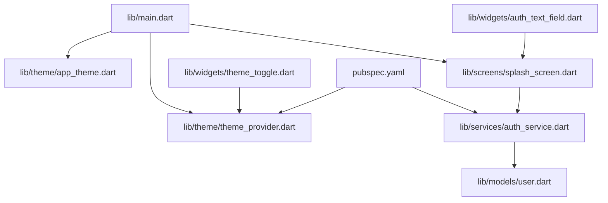
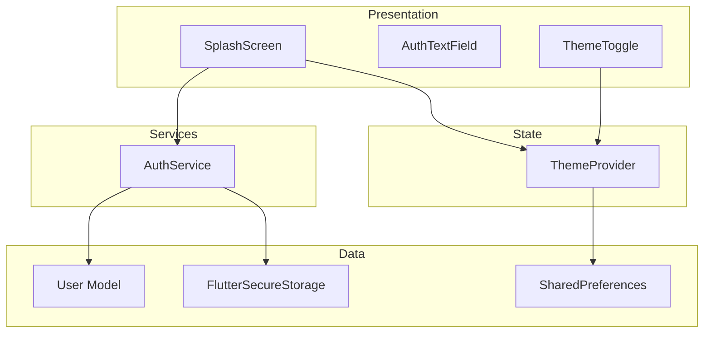
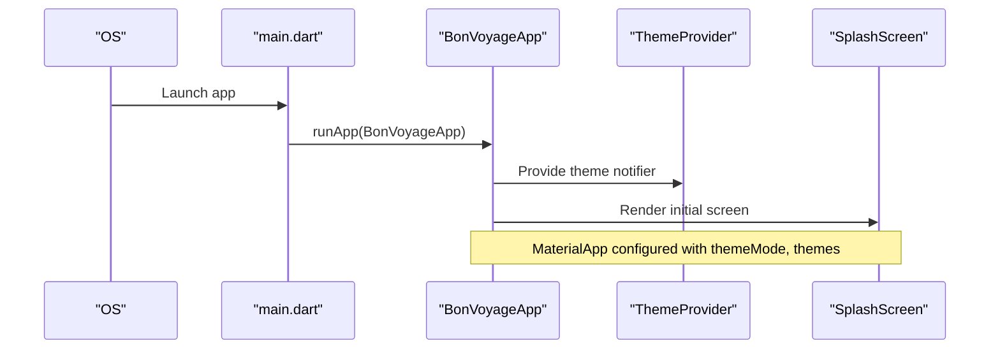
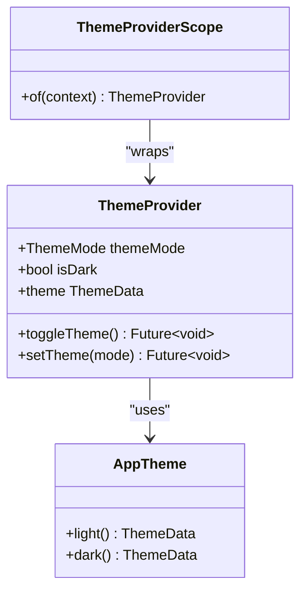
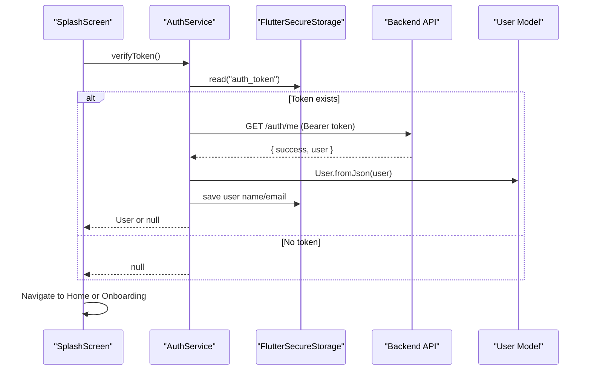
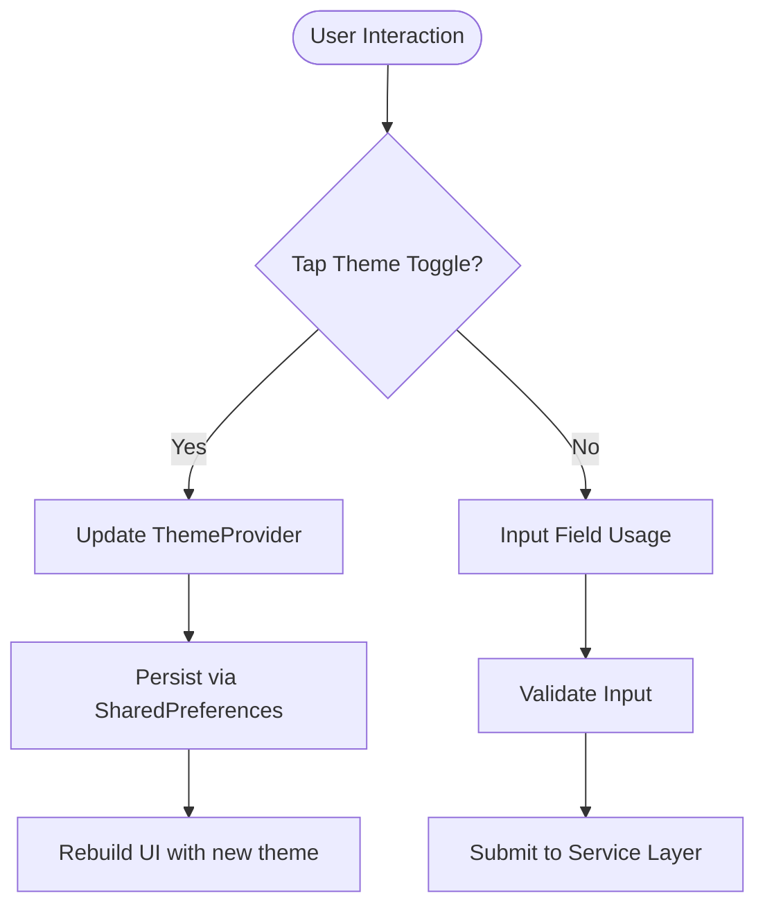
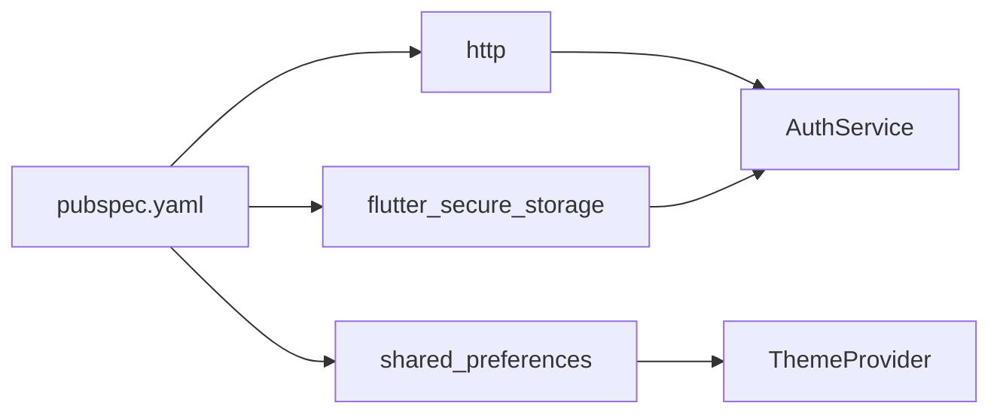

# Application Structure

<cite>
**Referenced Files in This Document**
- [main.dart](file://lib/main.dart)
- [pubspec.yaml](file://pubspec.yaml)
- [app_theme.dart](file://lib/theme/app_theme.dart)
- [theme_provider.dart](file://lib/theme/theme_provider.dart)
- [splash_screen.dart](file://lib/screens/splash_screen.dart)
- [auth_service.dart](file://lib/services/auth_service.dart)
- [user.dart](file://lib/models/user.dart)
- [auth_text_field.dart](file://lib/widgets/auth_text_field.dart)
- [theme_toggle.dart](file://lib/widgets/theme_toggle.dart)
</cite>

## Table of Contents
1. [Introduction](#introduction)
2. [Project Structure](#project-structure)
3. [Core Components](#core-components)
4. [Architecture Overview](#architecture-overview)
5. [Detailed Component Analysis](#detailed-component-analysis)
6. [Dependency Analysis](#dependency-analysis)
7. [Performance Considerations](#performance-considerations)
8. [Troubleshooting Guide](#troubleshooting-guide)
9. [Conclusion](#conclusion)

## Introduction
This document explains the Flutter application structure for Bon Voyage Pakistan. It covers how the project is organized under lib, the entry point and root widget initialization, dependency management via pubspec.yaml, and the overall architecture pattern using Material Design components. The goal is to help developers understand module responsibilities, data flows, and integration points for maintainability and scalability.

## Project Structure
The Flutter source code is organized by feature-oriented folders under lib:
- main.dart: Application entry point and root widget setup
- screens/: UI screens (e.g., splash, onboarding, login, home, profile settings)
- services/: Business logic and API interactions (e.g., authentication service)
- models/: Data structures (e.g., user model)
- widgets/: Reusable UI components (e.g., auth text field, theme toggle)
- theme/: Centralized theming and theme state management

**Diagram sources**
- [main.dart:7-46](file://lib/main.dart#L7-L46)
- [splash_screen.dart:1-200](file://lib/screens/splash_screen.dart#L1-L200)
- [theme_provider.dart:1-64](file://lib/theme/theme_provider.dart#L1-L64)
- [app_theme.dart:1-367](file://lib/theme/app_theme.dart#L1-L367)
- [auth_service.dart:1-258](file://lib/services/auth_service.dart#L1-L258)
- [user.dart:1-29](file://lib/models/user.dart#L1-L29)
- [auth_text_field.dart:1-97](file://lib/widgets/auth_text_field.dart#L1-L97)
- [theme_toggle.dart:1-53](file://lib/widgets/theme_toggle.dart#L1-L53)
- [pubspec.yaml:1-31](file://pubspec.yaml#L1-L31)

**Section sources**
- [main.dart:7-46](file://lib/main.dart#L7-L46)
- [pubspec.yaml:1-31](file://pubspec.yaml#L1-L31)

## Core Components
- Entry point and root widget: main.dart initializes Flutter bindings and runs BonVoyageApp, which sets up theme mode persistence and renders the initial screen.
- Theme system: app_theme.dart defines a cohesive Material 3 design with light/dark palettes; theme_provider.dart manages theme mode and persists it using shared preferences.
- Authentication service: auth_service.dart encapsulates HTTP calls for signup/login/token verification, secure token storage, and error handling.
- Models: user.dart represents the User entity used across authentication flows.
- Widgets: reusable UI building blocks like auth_text_field.dart and theme_toggle.dart support consistent UX and theme-aware controls.

**Section sources**
- [main.dart:7-46](file://lib/main.dart#L7-L46)
- [app_theme.dart:1-367](file://lib/theme/app_theme.dart#L1-L367)
- [theme_provider.dart:1-64](file://lib/theme/theme_provider.dart#L1-L64)
- [auth_service.dart:1-258](file://lib/services/auth_service.dart#L1-L258)
- [user.dart:1-29](file://lib/models/user.dart#L1-L29)
- [auth_text_field.dart:1-97](file://lib/widgets/auth_text_field.dart#L1-L97)
- [theme_toggle.dart:1-53](file://lib/widgets/theme_toggle.dart#L1-L53)

## Architecture Overview
Bon Voyage Pakistan follows a layered architecture with clear separation of concerns:
- Presentation layer: screens and widgets render UI using Material Design components and the centralized theme.
- State layer: theme_provider.dart exposes theme state via ChangeNotifier and InheritedNotifier for reactive updates.
- Domain/Service layer: auth_service.dart handles authentication workflows, network requests, and secure storage.
- Data layer: user.dart models domain entities; persistent storage uses flutter_secure_storage for tokens and shared_preferences for theme preference.

**Diagram sources**
- [splash_screen.dart:1-200](file://lib/screens/splash_screen.dart#L1-L200)
- [auth_text_field.dart:1-97](file://lib/widgets/auth_text_field.dart#L1-L97)
- [theme_toggle.dart:1-53](file://lib/widgets/theme_toggle.dart#L1-L53)
- [theme_provider.dart:1-64](file://lib/theme/theme_provider.dart#L1-L64)
- [auth_service.dart:1-258](file://lib/services/auth_service.dart#L1-L258)
- [user.dart:1-29](file://lib/models/user.dart#L1-L29)

## Detailed Component Analysis

### Entry Point and Root Widget (main.dart)
- Ensures Flutter bindings are initialized before running the app.
- Wraps the app in ThemeProviderScope to provide theme state throughout the widget tree.
- Configures MaterialApp with dynamic themeMode from ThemeProvider and provides both light and dark themes via AppTheme.
- Sets SplashScreen as the initial route.

**Diagram sources**
- [main.dart:7-46](file://lib/main.dart#L7-L46)

**Section sources**
- [main.dart:7-46](file://lib/main.dart#L7-L46)

### Theme System (app_theme.dart, theme_provider.dart)
- app_theme.dart centralizes colors, typography, and component styles using Material 3. Provides static methods to build light and dark ThemeData instances.
- theme_provider.dart implements ChangeNotifier-based state for theme mode, persists selection via SharedPreferences, and exposes an InheritedNotifier scope for easy access.

**Diagram sources**
- [theme_provider.dart:1-64](file://lib/theme/theme_provider.dart#L1-L64)
- [app_theme.dart:1-367](file://lib/theme/app_theme.dart#L1-L367)

**Section sources**
- [app_theme.dart:1-367](file://lib/theme/app_theme.dart#L1-L367)
- [theme_provider.dart:1-64](file://lib/theme/theme_provider.dart#L1-L64)

### Authentication Flow (splash_screen.dart, auth_service.dart, user.dart)
- SplashScreen performs an animation, then verifies the stored JWT via AuthService.verifyToken().
- If valid, navigates to HomeScreen; otherwise, navigates to OnboardingScreen.
- AuthService handles HTTP requests with timeouts, stores tokens securely, caches user info, and returns structured results including error messages.
- User model maps backend JSON to a strongly-typed object.

**Diagram sources**
- [splash_screen.dart:1-200](file://lib/screens/splash_screen.dart#L1-L200)
- [auth_service.dart:1-258](file://lib/services/auth_service.dart#L1-L258)
- [user.dart:1-29](file://lib/models/user.dart#L1-L29)

**Section sources**
- [splash_screen.dart:1-200](file://lib/screens/splash_screen.dart#L1-L200)
- [auth_service.dart:1-258](file://lib/services/auth_service.dart#L1-L258)
- [user.dart:1-29](file://lib/models/user.dart#L1-L29)

### Reusable Widgets (auth_text_field.dart, theme_toggle.dart)
- AuthTextField provides a styled TextFormField with validation, prefix icons, and password visibility toggle, ensuring consistent input UX across auth screens.
- ThemeToggle offers a compact button to switch between light and dark modes with animated transitions and theme-aware styling.

**Diagram sources**
- [theme_toggle.dart:1-53](file://lib/widgets/theme_toggle.dart#L1-L53)
- [theme_provider.dart:1-64](file://lib/theme/theme_provider.dart#L1-L64)
- [auth_text_field.dart:1-97](file://lib/widgets/auth_text_field.dart#L1-L97)

**Section sources**
- [auth_text_field.dart:1-97](file://lib/widgets/auth_text_field.dart#L1-L97)
- [theme_toggle.dart:1-53](file://lib/widgets/theme_toggle.dart#L1-L53)

## Dependency Analysis
Dependencies are declared in pubspec.yaml and include:
- http: Used by AuthService for network requests with timeout handling.
- flutter_secure_storage: Used by AuthService for secure token and user info storage.
- shared_preferences: Used by ThemeProvider to persist theme mode.

**Diagram sources**
- [pubspec.yaml:1-31](file://pubspec.yaml#L1-L31)
- [auth_service.dart:1-258](file://lib/services/auth_service.dart#L1-L258)
- [theme_provider.dart:1-64](file://lib/theme/theme_provider.dart#L1-L64)

**Section sources**
- [pubspec.yaml:1-31](file://pubspec.yaml#L1-L31)

## Performance Considerations
- Network timeouts: All HTTP requests use a fixed timeout to prevent indefinite hangs when the backend is unreachable.
- Secure storage overhead: Storing tokens and small user metadata is lightweight; avoid storing large payloads in secure storage.
- Theme rebuilds: Theme changes propagate through the widget tree via InheritedNotifier; keep theme toggles minimal to reduce unnecessary rebuilds.
- Asset usage: Ensure images are appropriately sized and referenced only where needed to minimize memory footprint.

[No sources needed since this section provides general guidance]

## Troubleshooting Guide
Common issues and resolutions:
- Network connectivity errors: Verify device network and backend availability; check logs for connection errors returned by AuthService.
- Token expiration: If token verification fails, the service clears local auth data; re-authenticate to obtain a new token.
- Timeout errors: If requests exceed the timeout threshold, retry after confirming backend responsiveness.
- Theme not persisting: Ensure SharedPreferences is accessible and that theme mode is saved on toggle/set operations.

**Section sources**
- [auth_service.dart:105-160](file://lib/services/auth_service.dart#L105-L160)
- [auth_service.dart:168-202](file://lib/services/auth_service.dart#L168-L202)
- [auth_service.dart:232-256](file://lib/services/auth_service.dart#L232-L256)
- [theme_provider.dart:19-44](file://lib/theme/theme_provider.dart#L19-L44)

## Conclusion
Bon Voyage Pakistan’s Flutter application follows a clean, layered architecture with clear separation between presentation, state, services, and data. The Material Design–based theme system ensures consistent visuals across light and dark modes. Authentication is handled centrally with secure storage and robust error handling. This structure supports maintainability and scalability as features grow, while keeping dependencies explicit and well-managed.

[No sources needed since this section summarizes without analyzing specific files]