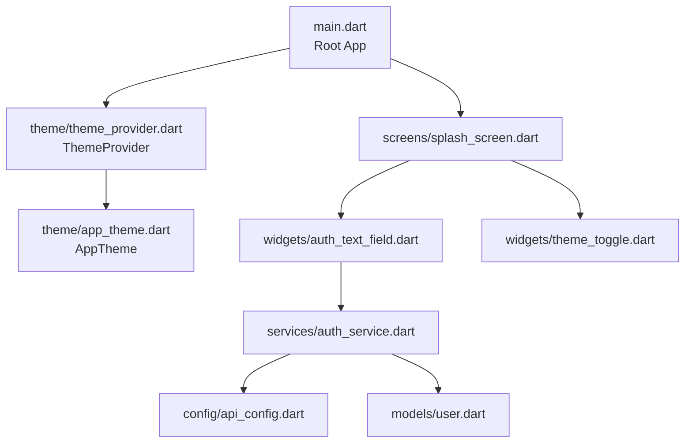
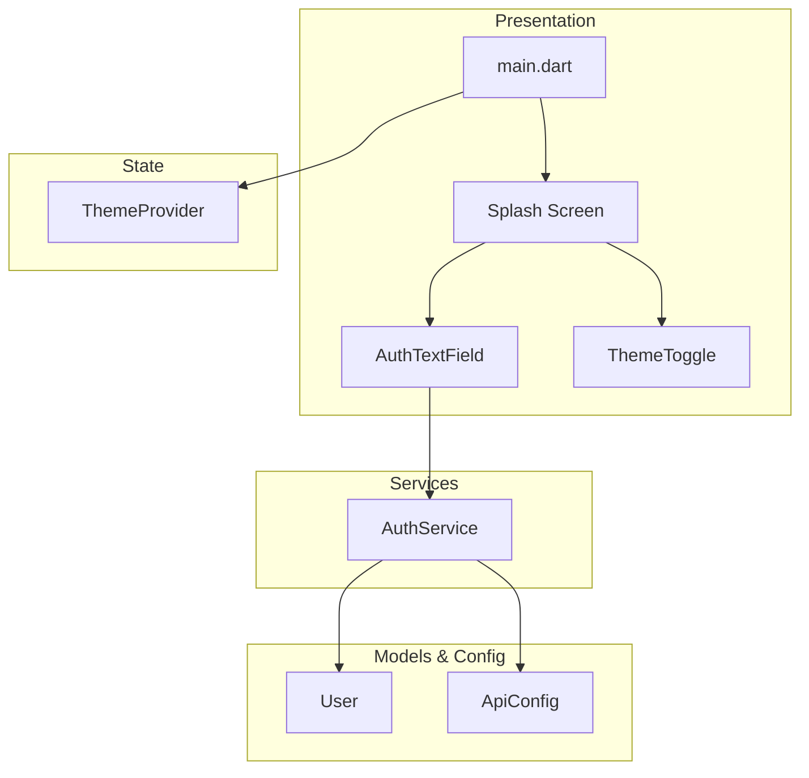
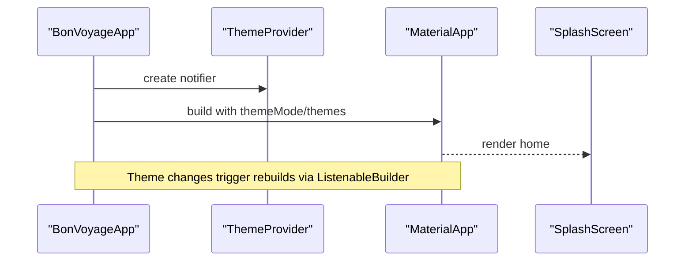
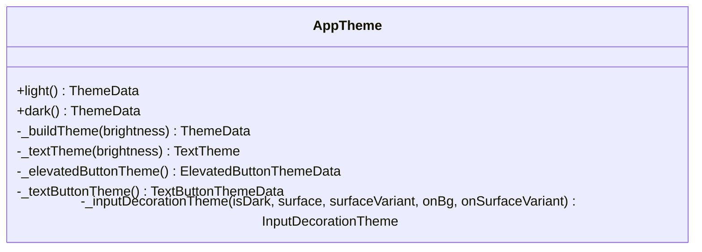
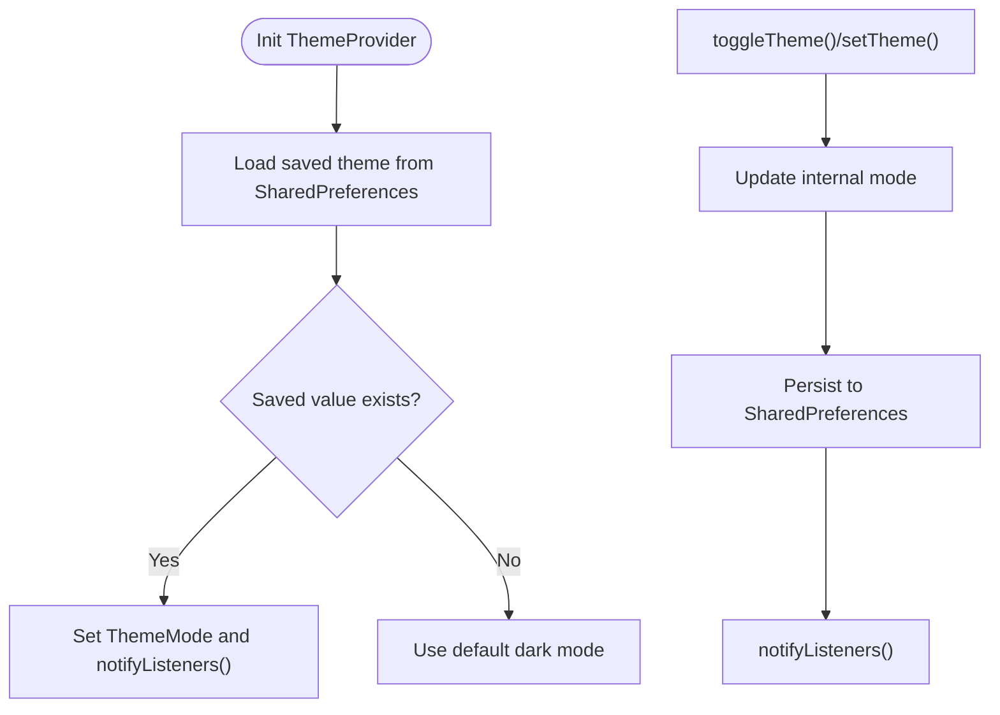
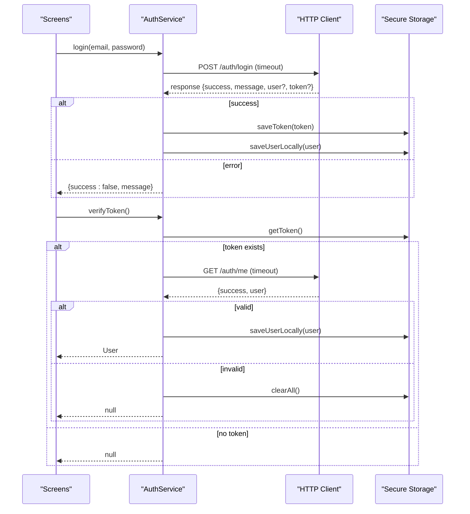
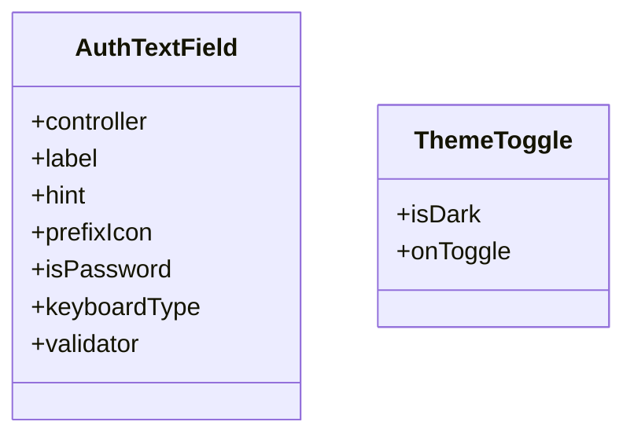
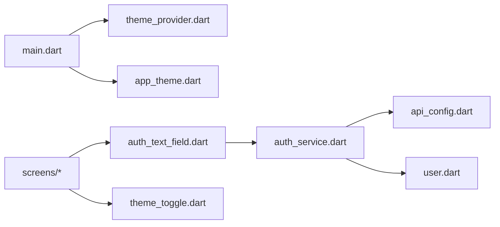

# Frontend Architecture (Flutter)

<cite>
**Referenced Files in This Document**
- [main.dart](file://lib/main.dart)
- [app_theme.dart](file://lib/theme/app_theme.dart)
- [theme_provider.dart](file://lib/theme/theme_provider.dart)
- [auth_service.dart](file://lib/services/auth_service.dart)
- [user.dart](file://lib/models/user.dart)
- [api_config.dart](file://lib/config/api_config.dart)
- [auth_text_field.dart](file://lib/widgets/auth_text_field.dart)
- [theme_toggle.dart](file://lib/widgets/theme_toggle.dart)
- [pubspec.yaml](file://pubspec.yaml)
</cite>

## Table of Contents
1. [Introduction](#introduction)
2. [Project Structure](#project-structure)
3. [Core Components](#core-components)
4. [Architecture Overview](#architecture-overview)
5. [Detailed Component Analysis](#detailed-component-analysis)
6. [Dependency Analysis](#dependency-analysis)
7. [Performance Considerations](#performance-considerations)
8. [Troubleshooting Guide](#troubleshooting-guide)
9. [Conclusion](#conclusion)
10. [Appendices](#appendices)

## Introduction
This document describes the frontend architecture of the Flutter-based Bon Voyage Pakistan application. It explains how the app is organized into screens, services, models, widgets, and theme modules; how the root widget composes the UI; how state is managed using ChangeNotifier for theme switching; and how authentication integrates with a backend service. It also covers reusable widgets, theming with light/dark mode support, and responsive design considerations.

## Project Structure
The Flutter codebase follows a feature-oriented layout under lib:
- main.dart: Application entry point and root widget composition
- theme/: Centralized theming and theme state management
- services/: Backend integration (authentication)
- models/: Data structures (User)
- widgets/: Reusable UI components
- config/: Environment configuration (API endpoints)
- screens/: Feature screens (splash, onboarding, login, signup, home, profile settings, forgot password)

**Diagram sources**
- [main.dart:1-47](file://lib/main.dart#L1-L47)
- [theme_provider.dart:1-64](file://lib/theme/theme_provider.dart#L1-L64)
- [app_theme.dart:1-367](file://lib/theme/app_theme.dart#L1-L367)
- [auth_text_field.dart:1-97](file://lib/widgets/auth_text_field.dart#L1-L97)
- [theme_toggle.dart:1-53](file://lib/widgets/theme_toggle.dart#L1-L53)
- [auth_service.dart:1-258](file://lib/services/auth_service.dart#L1-L258)
- [api_config.dart:1-20](file://lib/config/api_config.dart#L1-L20)
- [user.dart:1-29](file://lib/models/user.dart#L1-L29)

**Section sources**
- [main.dart:1-47](file://lib/main.dart#L1-L47)
- [pubspec.yaml:1-31](file://pubspec.yaml#L1-L31)

## Core Components
- Root App and Theme Scope: The root widget initializes Flutter bindings, creates a ThemeProvider instance, wraps the app with a custom provider scope, and provides MaterialApp with dynamic themeMode and themes.
- Theme System: AppTheme defines color palettes, typography, button styles, input decoration themes, and builds ThemeData for both light and dark modes.
- Theme State Management: ThemeProvider extends ChangeNotifier to manage current theme mode, persist it via SharedPreferences, and expose methods to toggle or set theme. ThemeProviderScope exposes the notifier to descendants.
- Authentication Service: AuthService encapsulates HTTP calls for signup, login, token verification, and logout. It stores JWT tokens and user info securely using FlutterSecureStorage and uses timeouts to avoid hanging requests.
- User Model: A simple immutable model representing user data with JSON serialization helpers.
- API Configuration: Centralized base URL and endpoint constants for auth flows.
- Reusable Widgets: AuthTextField provides consistent, styled inputs with validation and password visibility toggling. ThemeToggle offers an animated light/dark mode switcher.

**Section sources**
- [main.dart:12-47](file://lib/main.dart#L12-L47)
- [app_theme.dart:7-133](file://lib/theme/app_theme.dart#L7-L133)
- [theme_provider.dart:5-48](file://lib/theme/theme_provider.dart#L5-L48)
- [auth_service.dart:10-258](file://lib/services/auth_service.dart#L10-L258)
- [user.dart:1-29](file://lib/models/user.dart#L1-L29)
- [api_config.dart:1-20](file://lib/config/api_config.dart#L1-L20)
- [auth_text_field.dart:1-97](file://lib/widgets/auth_text_field.dart#L1-L97)
- [theme_toggle.dart:1-53](file://lib/widgets/theme_toggle.dart#L1-L53)

## Architecture Overview
The app follows a layered architecture:
- Presentation Layer: Material app, screens, and reusable widgets compose the UI.
- State Layer: ThemeProvider manages theme state; screens can integrate additional providers for session state.
- Domain/Service Layer: AuthService handles network operations and secure storage.
- Configuration Layer: ApiConfig centralizes environment-specific URLs and endpoints.

**Diagram sources**
- [main.dart:12-47](file://lib/main.dart#L12-L47)
- [theme_provider.dart:5-64](file://lib/theme/theme_provider.dart#L5-L64)
- [auth_service.dart:10-258](file://lib/services/auth_service.dart#L10-L258)
- [user.dart:1-29](file://lib/models/user.dart#L1-L29)
- [api_config.dart:1-20](file://lib/config/api_config.dart#L1-L20)
- [auth_text_field.dart:1-97](file://lib/widgets/auth_text_field.dart#L1-L97)
- [theme_toggle.dart:1-53](file://lib/widgets/theme_toggle.dart#L1-L53)

## Detailed Component Analysis

### Root Widget and Composition Pattern
- Entry Point: Initializes Flutter bindings and runs the root app.
- Root Widget: Creates ThemeProvider, wraps children with ThemeProviderScope, and uses ListenableBuilder to react to theme changes. MaterialApp receives themeMode and theme/darkTheme from the provider.
- Home Route: Starts with SplashScreen as the initial screen.

**Diagram sources**
- [main.dart:12-47](file://lib/main.dart#L12-L47)
- [theme_provider.dart:5-48](file://lib/theme/theme_provider.dart#L5-L48)

**Section sources**
- [main.dart:12-47](file://lib/main.dart#L12-L47)

### Theme System and Light/Dark Mode
- Centralized Palette: AppTheme defines primary, secondary, surface, and variant colors for both brightness modes.
- Theme Builder: _buildTheme constructs ThemeData based on brightness, including colorScheme, textTheme, buttons, and input decorations.
- Typography: Custom fonts and sizes are applied across display, headline, title, body, and label styles.
- Input Theming: Consistent rounded borders, focus/error states, and fill colors adapt to theme.

**Diagram sources**
- [app_theme.dart:7-133](file://lib/theme/app_theme.dart#L7-L133)
- [app_theme.dart:135-235](file://lib/theme/app_theme.dart#L135-L235)
- [app_theme.dart:237-367](file://lib/theme/app_theme.dart#L237-L367)

**Section sources**
- [app_theme.dart:7-367](file://lib/theme/app_theme.dart#L7-L367)

### Theme State Management with ChangeNotifier
- ThemeProvider: Holds current ThemeMode, loads persisted preference on init, toggles or sets theme, persists selection, and notifies listeners.
- ThemeProviderScope: InheritedNotifier wrapper exposing ThemeProvider.of(context) for easy access in descendant widgets.

**Diagram sources**
- [theme_provider.dart:5-48](file://lib/theme/theme_provider.dart#L5-L48)

**Section sources**
- [theme_provider.dart:5-64](file://lib/theme/theme_provider.dart#L5-L64)

### Authentication Service and Session Handling
- Endpoints: Uses ApiConfig for signup, login, me, and logout.
- Secure Storage: Stores JWT token and cached user info using FlutterSecureStorage.
- Network Calls: All HTTP requests include a timeout to prevent indefinite hangs.
- Token Verification: Validates stored token by calling /auth/me; clears local state if invalid.
- Logout: Best-effort backend call followed by clearing all local auth data.

**Diagram sources**
- [auth_service.dart:68-226](file://lib/services/auth_service.dart#L68-L226)
- [api_config.dart:1-20](file://lib/config/api_config.dart#L1-L20)
- [user.dart:1-29](file://lib/models/user.dart#L1-L29)

**Section sources**
- [auth_service.dart:10-258](file://lib/services/auth_service.dart#L10-L258)
- [api_config.dart:1-20](file://lib/config/api_config.dart#L1-L20)
- [user.dart:1-29](file://lib/models/user.dart#L1-L29)

### Reusable Widgets
- AuthTextField: Provides consistent styling, validation, prefix icons, and optional password visibility toggle. Integrates well with FormField validation patterns.
- ThemeToggle: Animated sun/moon icon that triggers theme change callbacks; uses theme colors for visual consistency.

**Diagram sources**
- [auth_text_field.dart:1-97](file://lib/widgets/auth_text_field.dart#L1-L97)
- [theme_toggle.dart:1-53](file://lib/widgets/theme_toggle.dart#L1-L53)

**Section sources**
- [auth_text_field.dart:1-97](file://lib/widgets/auth_text_field.dart#L1-L97)
- [theme_toggle.dart:1-53](file://lib/widgets/theme_toggle.dart#L1-L53)

### Responsive Design Considerations
- Use flexible layouts and constraints within screens to adapt to different screen sizes.
- Leverage Material’s built-in responsive behaviors (e.g., adaptive spacing, scalable typography).
- Avoid fixed widths where possible; use Expanded/Flexible and media queries for layout adjustments.
- Ensure touch targets meet accessibility guidelines and remain usable on smaller devices.

[No sources needed since this section provides general guidance]

## Dependency Analysis
High-level dependencies between core modules:

**Diagram sources**
- [main.dart:12-47](file://lib/main.dart#L12-L47)
- [theme_provider.dart:5-64](file://lib/theme/theme_provider.dart#L5-L64)
- [app_theme.dart:7-133](file://lib/theme/app_theme.dart#L7-L133)
- [auth_text_field.dart:1-97](file://lib/widgets/auth_text_field.dart#L1-L97)
- [theme_toggle.dart:1-53](file://lib/widgets/theme_toggle.dart#L1-L53)
- [auth_service.dart:10-258](file://lib/services/auth_service.dart#L10-L258)
- [api_config.dart:1-20](file://lib/config/api_config.dart#L1-L20)
- [user.dart:1-29](file://lib/models/user.dart#L1-L29)

**Section sources**
- [pubspec.yaml:9-16](file://pubspec.yaml#L9-L16)

## Performance Considerations
- Network Timeouts: All HTTP requests use a fixed timeout to prevent UI freezes when the backend is unreachable.
- Secure Storage: Use FlutterSecureStorage for sensitive data to minimize overhead and improve security.
- Theme Rebuilds: Wrap only necessary parts with ListenableBuilder to reduce unnecessary rebuilds.
- Asset Usage: Keep assets optimized and reference them via pubspec to avoid large bundle sizes.

**Section sources**
- [auth_service.dart:20-21](file://lib/services/auth_service.dart#L20-L21)
- [pubspec.yaml:22-31](file://pubspec.yaml#L22-L31)

## Troubleshooting Guide
Common issues and resolutions:
- Backend Connectivity: If login/signup fails with connection errors, ensure the device/emulator can reach the configured baseUrl and that the backend is running.
- Token Validation Failures: If verifyToken returns null due to invalid/expired tokens, the service clears local auth data automatically; re-authenticate to obtain a new token.
- Timeout Errors: Requests exceeding the timeout return a specific message; check network conditions and backend responsiveness.
- Theme Persistence: If theme does not persist across app restarts, verify SharedPreferences usage and permissions.

**Section sources**
- [auth_service.dart:232-256](file://lib/services/auth_service.dart#L232-L256)
- [theme_provider.dart:19-44](file://lib/theme/theme_provider.dart#L19-L44)

## Conclusion
The Bon Voyage Pakistan Flutter app employs a clean, layered architecture with centralized theming, robust authentication services, and reusable UI components. Theme management leverages ChangeNotifier and SharedPreferences for persistence, while AuthService ensures secure and resilient communication with the backend. The modular structure supports scalability and maintainability, enabling straightforward addition of new screens and features.

[No sources needed since this section summarizes without analyzing specific files]

## Appendices
- Dependencies: The app depends on http for networking, flutter_secure_storage for secure token storage, shared_preferences for theme persistence, and cupertino_icons for platform icons.
- Assets: Images referenced in pubspec include logo and onboarding backgrounds used across screens.

**Section sources**
- [pubspec.yaml:9-16](file://pubspec.yaml#L9-L16)
- [pubspec.yaml:22-31](file://pubspec.yaml#L22-L31)