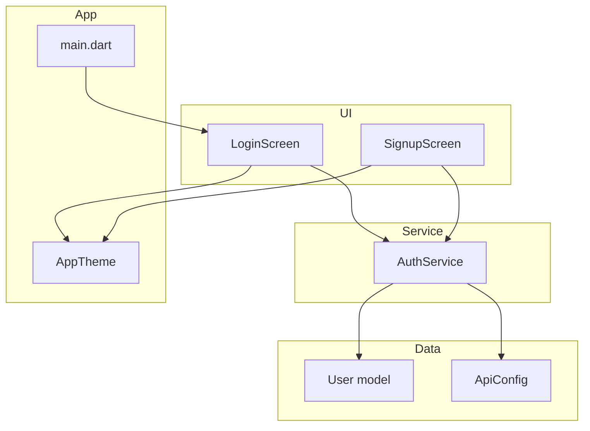
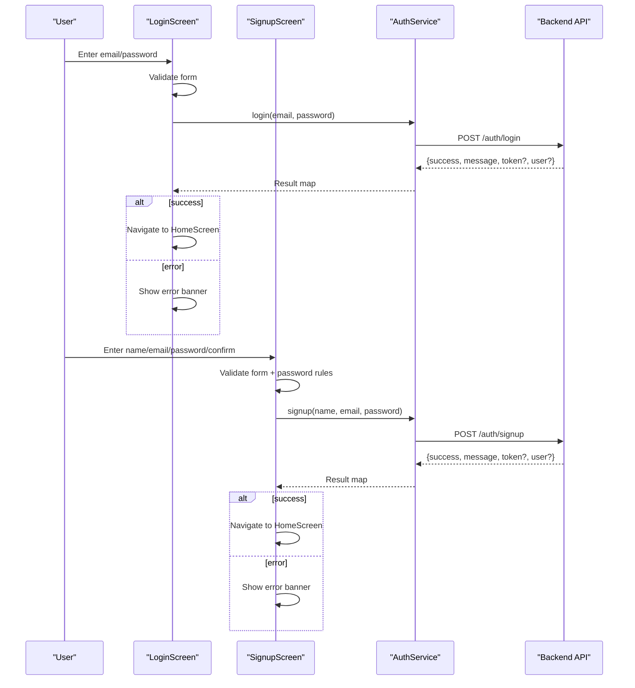
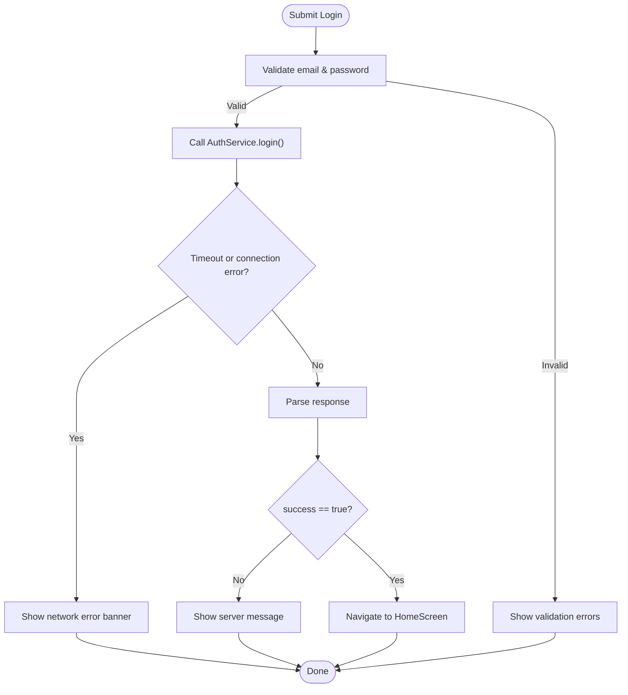
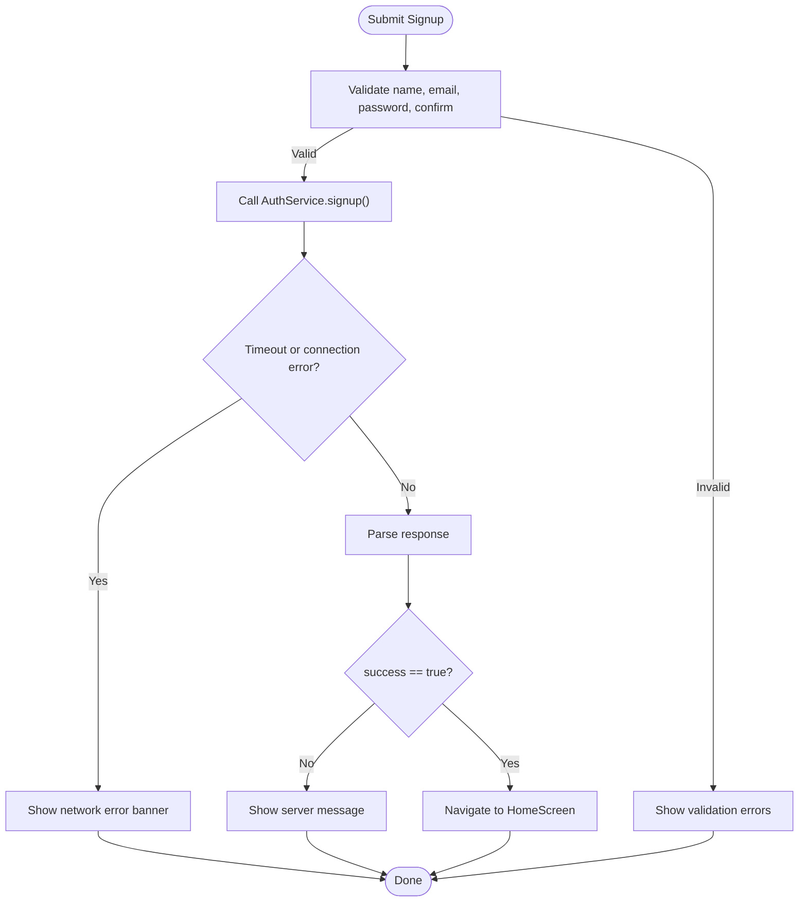
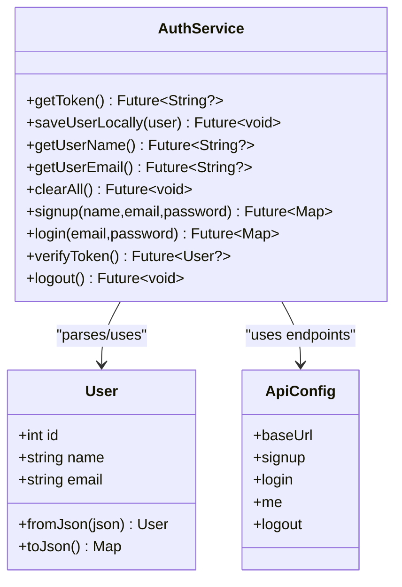
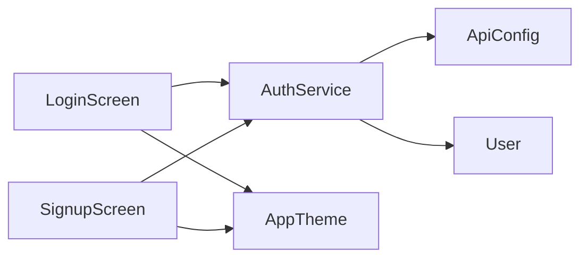

# Authentication Screens

<cite>
**Referenced Files in This Document**
- [login_screen.dart](file://lib/screens/login_screen.dart)
- [signup_screen.dart](file://lib/screens/signup_screen.dart)
- [auth_service.dart](file://lib/services/auth_service.dart)
- [user.dart](file://lib/models/user.dart)
- [api_config.dart](file://lib/config/api_config.dart)
- [app_theme.dart](file://lib/theme/app_theme.dart)
- [main.dart](file://lib/main.dart)
</cite>

## Table of Contents
1. [Introduction](#introduction)
2. [Project Structure](#project-structure)
3. [Core Components](#core-components)
4. [Architecture Overview](#architecture-overview)
5. [Detailed Component Analysis](#detailed-component-analysis)
6. [Dependency Analysis](#dependency-analysis)
7. [Performance Considerations](#performance-considerations)
8. [Troubleshooting Guide](#troubleshooting-guide)
9. [Conclusion](#conclusion)

## Introduction
This document explains the authentication screens for login and signup, focusing on form validation, input handling, error states, loading indicators, navigation between flows, and integration with the AuthService for JWT token management. It also covers API response handling, form state management, user feedback, secure password input patterns, registration flow, login verification, and redirection logic after successful authentication.

## Project Structure
The authentication feature spans UI screens, a service layer, models, configuration, and theming:
- Screens: LoginScreen and SignupScreen handle user inputs, validation, and navigation.
- Service: AuthService performs HTTP requests, manages JWT storage, and returns standardized results to the UI.
- Model: User represents the profile returned by the backend.
- Config: ApiConfig centralizes endpoint URLs.
- Theme: AppTheme provides consistent styling across screens.
- Entry: main.dart initializes the app and sets the initial screen.

**Diagram sources**
- [login_screen.dart:1-444](file://lib/screens/login_screen.dart#L1-L444)
- [signup_screen.dart:1-480](file://lib/screens/signup_screen.dart#L1-L480)
- [auth_service.dart:1-258](file://lib/services/auth_service.dart#L1-L258)
- [user.dart:1-29](file://lib/models/user.dart#L1-L29)
- [api_config.dart:1-20](file://lib/config/api_config.dart#L1-L20)
- [app_theme.dart:1-367](file://lib/theme/app_theme.dart#L1-L367)
- [main.dart:1-47](file://lib/main.dart#L1-L47)

**Section sources**
- [main.dart:1-47](file://lib/main.dart#L1-L47)

## Core Components
- LoginScreen: Collects email/password, validates inputs, shows loading/error states, calls AuthService.login, and navigates to HomeScreen on success or displays errors.
- SignupScreen: Collects name/email/password/confirm-password, enforces password rules, shows live requirement feedback, calls AuthService.signup, and navigates to HomeScreen on success or displays errors.
- AuthService: Encapsulates HTTP calls to /auth/signup, /auth/login, /auth/me, and /auth/logout; stores/retrieves JWT securely; caches user info locally; returns consistent result maps to UI.
- User: Simple data class for user profile parsed from backend responses.
- ApiConfig: Centralized base URL and endpoints for auth APIs.
- AppTheme: Provides colors, typography, and input decoration styles used by both screens.

**Section sources**
- [login_screen.dart:1-444](file://lib/screens/login_screen.dart#L1-L444)
- [signup_screen.dart:1-480](file://lib/screens/signup_screen.dart#L1-L480)
- [auth_service.dart:1-258](file://lib/services/auth_service.dart#L1-L258)
- [user.dart:1-29](file://lib/models/user.dart#L1-L29)
- [api_config.dart:1-20](file://lib/config/api_config.dart#L1-L20)
- [app_theme.dart:1-367](file://lib/theme/app_theme.dart#L1-L367)

## Architecture Overview
The authentication flow uses a layered approach:
- UI screens validate inputs and manage local state (loading, errors).
- On submit, screens call AuthService methods which perform network requests with timeouts and return structured results.
- On success, tokens are stored securely and user info is cached locally; screens navigate to the home screen.
- On failure, screens display user-friendly messages.

**Diagram sources**
- [login_screen.dart:53-88](file://lib/screens/login_screen.dart#L53-L88)
- [signup_screen.dart:57-94](file://lib/screens/signup_screen.dart#L57-L94)
- [auth_service.dart:73-161](file://lib/services/auth_service.dart#L73-L161)
- [api_config.dart:14-18](file://lib/config/api_config.dart#L14-L18)

## Detailed Component Analysis

### LoginScreen
- Form fields: Email and Password with validators for required values and email format.
- Input handling: Controllers manage text; focus is dismissed before submission.
- Loading indicator: Button switches to a spinner while submitting; disabled during processing.
- Error state: Displays an error banner when the backend reports failure or network issues.
- Navigation: On success, clears previous routes and pushes HomeScreen; supports navigation to ForgotPassword and Signup.
- Secure password: Uses obscureText toggle to hide/show password.

**Diagram sources**
- [login_screen.dart:53-88](file://lib/screens/login_screen.dart#L53-L88)
- [auth_service.dart:121-161](file://lib/services/auth_service.dart#L121-L161)

**Section sources**
- [login_screen.dart:18-25](file://lib/screens/login_screen.dart#L18-L25)
- [login_screen.dart:53-88](file://lib/screens/login_screen.dart#L53-L88)
- [login_screen.dart:214-237](file://lib/screens/login_screen.dart#L214-L237)
- [login_screen.dart:254-286](file://lib/screens/login_screen.dart#L254-L286)
- [login_screen.dart:371-417](file://lib/screens/login_screen.dart#L371-L417)
- [login_screen.dart:419-441](file://lib/screens/login_screen.dart#L419-L441)

### SignupScreen
- Form fields: Name, Email, Password, Confirm Password with validators for required values, email format, and password strength.
- Password requirements: Live feedback panel checks length, uppercase, and number/special character presence.
- Input handling: Controllers manage text; focus dismissed before submission; onChanged triggers requirement updates.
- Loading indicator: Button switches to a spinner while submitting; disabled during processing.
- Error state: Displays an error banner when the backend reports failure or network issues.
- Navigation: On success, clears previous routes and pushes HomeScreen; supports back navigation and switching to Login.
- Secure password: Each password field has its own visibility toggle.

**Diagram sources**
- [signup_screen.dart:57-94](file://lib/screens/signup_screen.dart#L57-L94)
- [auth_service.dart:73-115](file://lib/services/auth_service.dart#L73-L115)

**Section sources**
- [signup_screen.dart:17-27](file://lib/screens/signup_screen.dart#L17-L27)
- [signup_screen.dart:57-94](file://lib/screens/signup_screen.dart#L57-L94)
- [signup_screen.dart:210-266](file://lib/screens/signup_screen.dart#L210-L266)
- [signup_screen.dart:268-299](file://lib/screens/signup_screen.dart#L268-L299)
- [signup_screen.dart:305-332](file://lib/screens/signup_screen.dart#L305-L332)
- [signup_screen.dart:370-419](file://lib/screens/signup_screen.dart#L370-L419)
- [signup_screen.dart:421-443](file://lib/screens/signup_screen.dart#L421-L443)
- [signup_screen.dart:446-479](file://lib/screens/signup_screen.dart#L446-L479)

### AuthService
- Token storage: Uses secure storage to persist JWT and cache user name/email locally.
- API calls:
  - signup: Sends name/email/password; on success stores token and user; returns standardized map.
  - login: Sends email/password; on success stores token and user; returns standardized map.
  - verifyToken: Checks token validity via /auth/me; clears invalid/expired tokens.
  - logout: Best-effort backend notification then clears all local auth data.
- Error handling: Timeouts and connection errors return friendly messages; generic exceptions handled safely.

**Diagram sources**
- [auth_service.dart:14-62](file://lib/services/auth_service.dart#L14-L62)
- [auth_service.dart:73-161](file://lib/services/auth_service.dart#L73-L161)
- [auth_service.dart:168-226](file://lib/services/auth_service.dart#L168-L226)
- [user.dart:1-29](file://lib/models/user.dart#L1-L29)
- [api_config.dart:1-20](file://lib/config/api_config.dart#L1-L20)

**Section sources**
- [auth_service.dart:14-62](file://lib/services/auth_service.dart#L14-L62)
- [auth_service.dart:73-115](file://lib/services/auth_service.dart#L73-L115)
- [auth_service.dart:121-161](file://lib/services/auth_service.dart#L121-L161)
- [auth_service.dart:168-226](file://lib/services/auth_service.dart#L168-L226)
- [auth_service.dart:232-256](file://lib/services/auth_service.dart#L232-L256)

### User Model
- Represents user profile with id, name, email.
- Provides JSON serialization/deserialization for backend payloads.

**Section sources**
- [user.dart:1-29](file://lib/models/user.dart#L1-L29)

### Configuration and Theming
- ApiConfig: Defines base URL and auth endpoints for signup, login, me, and logout.
- AppTheme: Supplies consistent colors, typography, and input decorations used by login and signup screens.

**Section sources**
- [api_config.dart:1-20](file://lib/config/api_config.dart#L1-L20)
- [app_theme.dart:1-367](file://lib/theme/app_theme.dart#L1-L367)

## Dependency Analysis
- LoginScreen depends on AuthService for login, AppTheme for styling, and navigates to HomeScreen, SignupScreen, and ForgotPasswordScreen.
- SignupScreen depends on AuthService for signup, AppTheme for styling, and navigates to HomeScreen and LoginScreen.
- AuthService depends on ApiConfig for endpoints, http client for networking, FlutterSecureStorage for token persistence, and User model for parsing profiles.
- All screens use AppTheme for consistent visual design.

**Diagram sources**
- [login_screen.dart:1-444](file://lib/screens/login_screen.dart#L1-L444)
- [signup_screen.dart:1-480](file://lib/screens/signup_screen.dart#L1-L480)
- [auth_service.dart:1-258](file://lib/services/auth_service.dart#L1-L258)
- [api_config.dart:1-20](file://lib/config/api_config.dart#L1-L20)
- [user.dart:1-29](file://lib/models/user.dart#L1-L29)
- [app_theme.dart:1-367](file://lib/theme/app_theme.dart#L1-L367)

**Section sources**
- [login_screen.dart:1-444](file://lib/screens/login_screen.dart#L1-L444)
- [signup_screen.dart:1-480](file://lib/screens/signup_screen.dart#L1-L480)
- [auth_service.dart:1-258](file://lib/services/auth_service.dart#L1-L258)

## Performance Considerations
- Network timeout: All HTTP requests enforce a fixed timeout to prevent indefinite hangs.
- Minimal re-renders: Screens update only necessary state (loading, error) and avoid heavy computations.
- Local caching: User profile is cached locally to reduce repeated network calls for display purposes.
- Efficient navigation: Successful flows clear previous routes to avoid unnecessary stack buildup.

[No sources needed since this section provides general guidance]

## Troubleshooting Guide
Common issues and strategies:
- Network connectivity: If the device cannot reach the backend, a connection error is returned with a user-friendly message. Ensure the device and backend are on the same network and the correct base URL is configured.
- Server timeouts: Requests that exceed the timeout return a specific message instructing users to retry later.
- Invalid credentials: Backend errors surface as messages in the error banner; ensure correct email/password or register first.
- Token validation: If the token is invalid or expired, it is cleared automatically; users must log in again.
- Debugging tips: Check the configured base URL and endpoints; verify backend availability; review logs for request details.

**Section sources**
- [auth_service.dart:105-114](file://lib/services/auth_service.dart#L105-L114)
- [auth_service.dart:151-160](file://lib/services/auth_service.dart#L151-L160)
- [auth_service.dart:168-201](file://lib/services/auth_service.dart#L168-L201)
- [auth_service.dart:232-256](file://lib/services/auth_service.dart#L232-L256)
- [api_config.dart:8-18](file://lib/config/api_config.dart#L8-L18)

## Conclusion
The authentication screens provide robust form validation, clear user feedback, and safe navigation between login and signup flows. The AuthService centralizes API interactions, handles errors gracefully, and manages JWT tokens securely. Together, these components deliver a reliable and user-friendly authentication experience with clear paths to recovery when issues occur.

[No sources needed since this section summarizes without analyzing specific files]