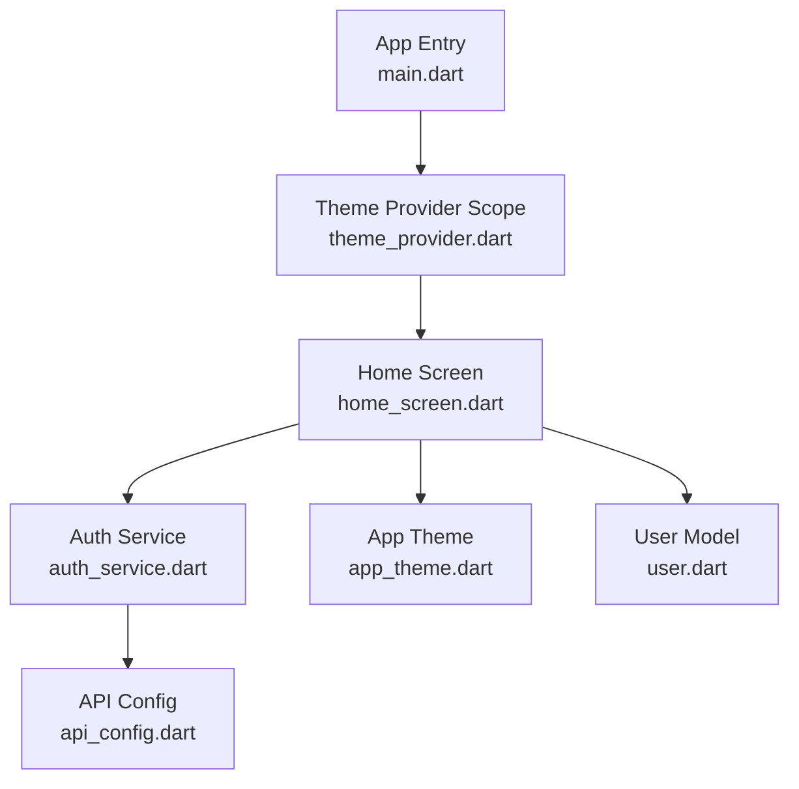
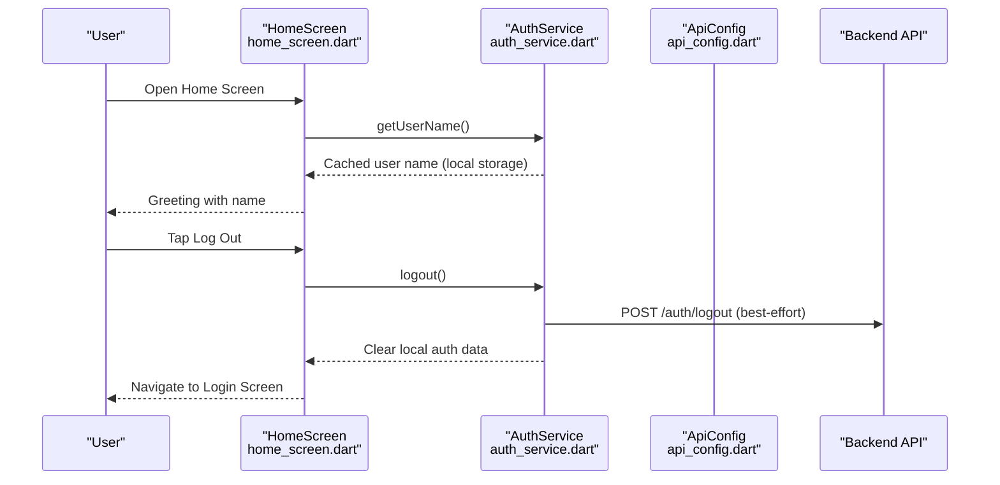
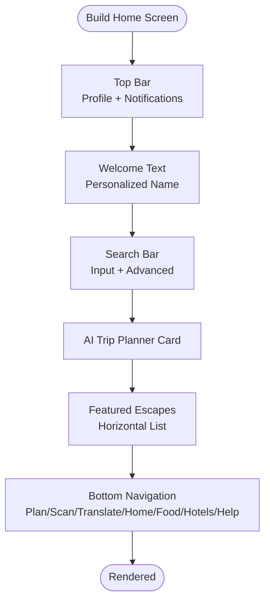
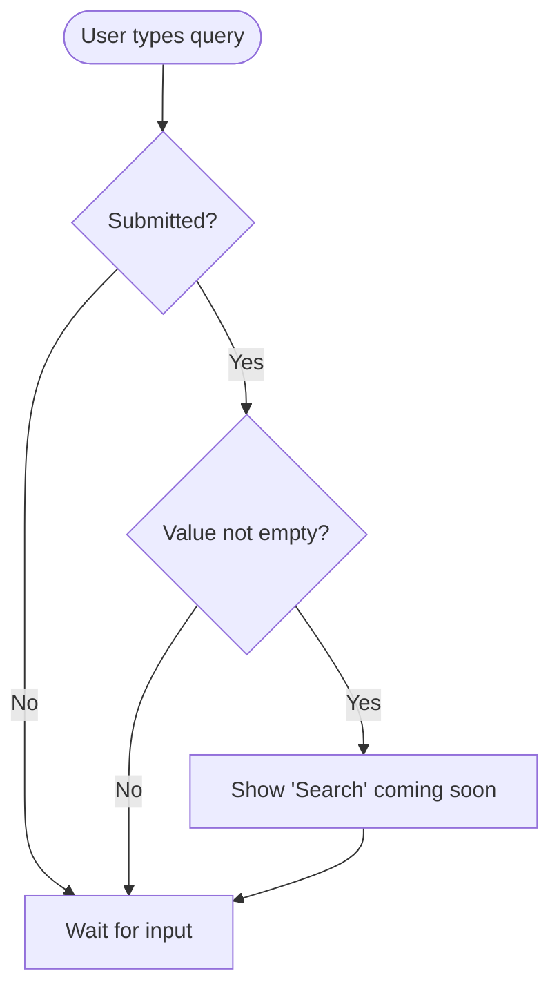
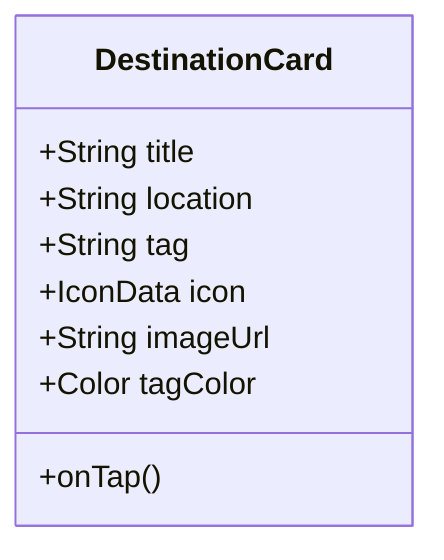
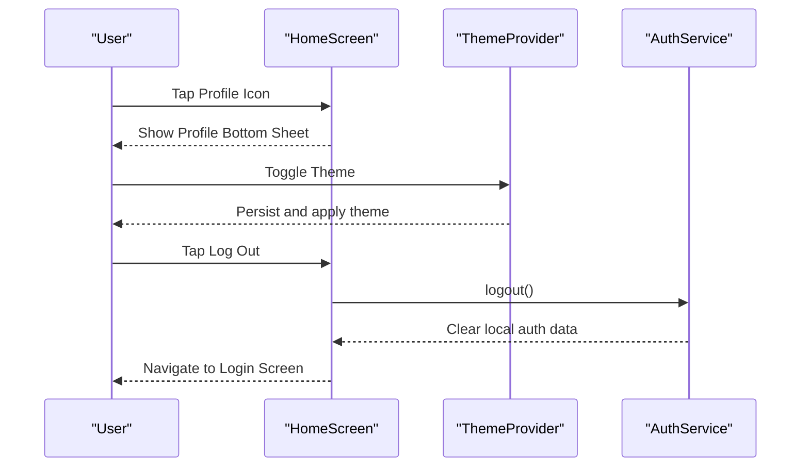
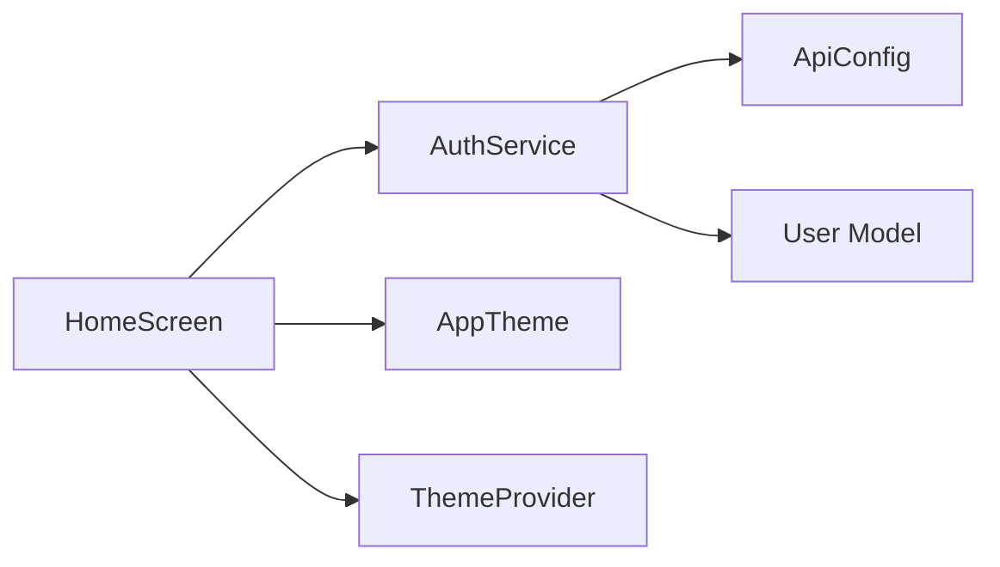
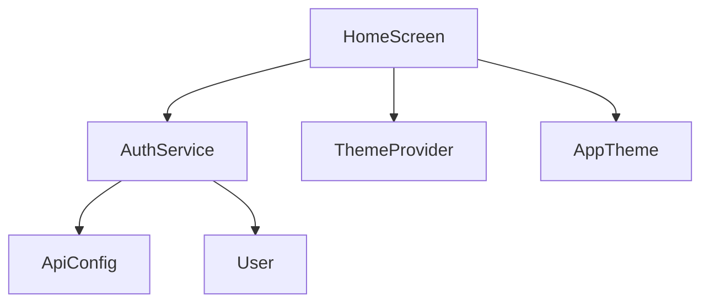

# Home Screen

<cite>
**Referenced Files in This Document**
- [home_screen.dart](file://lib/screens/home_screen.dart)
- [auth_service.dart](file://lib/services/auth_service.dart)
- [api_config.dart](file://lib/config/api_config.dart)
- [user.dart](file://lib/models/user.dart)
- [app_theme.dart](file://lib/theme/app_theme.dart)
- [theme_provider.dart](file://lib/theme/theme_provider.dart)
- [main.dart](file://lib/main.dart)
</cite>

## Table of Contents
1. [Introduction](#introduction)
2. [Project Structure](#project-structure)
3. [Core Components](#core-components)
4. [Architecture Overview](#architecture-overview)
5. [Detailed Component Analysis](#detailed-component-analysis)
6. [Dependency Analysis](#dependency-analysis)
7. [Performance Considerations](#performance-considerations)
8. [Troubleshooting Guide](#troubleshooting-guide)
9. [Conclusion](#conclusion)

## Introduction
The Home Screen is the main dashboard of the Bon Voyage Pakistan application. It provides a welcoming greeting, quick access to key features via a custom bottom navigation, a search bar for destinations, and a featured destinations carousel. It also exposes user profile actions (settings, history, appearance toggle, logout) through a bottom sheet. The screen integrates with backend services for authentication and persists user preferences locally.

## Project Structure
At runtime, the app starts from the entry point and wraps the UI with theme management. The Home Screen composes its layout using slivers for efficient scrolling, a top bar, welcome text, search input, an AI trip planner card, and a horizontal list of destination cards. A custom bottom navigation bar anchors six features around a central home button.

**Diagram sources**
- [main.dart:1-47](file://lib/main.dart#L1-L47)
- [home_screen.dart:1-1065](file://lib/screens/home_screen.dart#L1-L1065)
- [auth_service.dart:1-258](file://lib/services/auth_service.dart#L1-L258)
- [api_config.dart:1-20](file://lib/config/api_config.dart#L1-L20)
- [app_theme.dart:1-367](file://lib/theme/app_theme.dart#L1-L367)
- [user.dart:1-29](file://lib/models/user.dart#L1-L29)

**Section sources**
- [main.dart:1-47](file://lib/main.dart#L1-L47)
- [home_screen.dart:1-1065](file://lib/screens/home_screen.dart#L1-L1065)

## Core Components
- Top Bar: Profile avatar and notifications icon; opens a profile bottom sheet or shows a “coming soon” message.
- Welcome Section: Personalized greeting using the cached user name.
- Search Bar: Text field for searching destinations with an advanced search action.
- AI Trip Planner Card: Prominent call-to-action that navigates to the planning feature.
- Featured Escapes: Horizontal scrollable list of destination cards with images, tags, and locations.
- Custom Bottom Navigation: Six tabs (Plan, Scan, Translate, Home, Food, Hotels, Help) with a prominent center Home button.
- Profile Bottom Sheet: Settings, Activity & History, Appearance toggle, and Log Out.

Key implementation highlights:
- Uses a CustomScrollView with Sliver widgets for performant scrolling.
- Animations on load via FadeTransition and SlideTransition.
- Local state for selected tab and loading indicators.
- Integration with AuthService to read cached user name and handle logout.

**Section sources**
- [home_screen.dart:425-1065](file://lib/screens/home_screen.dart#L425-L1065)
- [home_screen.dart:1067-1324](file://lib/screens/home_screen.dart#L1067-L1324)

## Architecture Overview
The Home Screen orchestrates UI interactions and delegates data operations to AuthService. Authentication flows persist tokens and user info securely, while the UI reads cached user details for personalization. Theme management is provided by ThemeProvider and AppTheme.

**Diagram sources**
- [home_screen.dart:171-254](file://lib/screens/home_screen.dart#L171-L254)
- [auth_service.dart:204-226](file://lib/services/auth_service.dart#L204-L226)
- [api_config.dart:14-18](file://lib/config/api_config.dart#L14-L18)

## Detailed Component Analysis

### Home Screen Layout and Navigation
- Layout: A Scaffold with a Stack containing a scrollable body and a fixed bottom navigation area.
- Navigation: A custom bottom navigation with three items on each side and a centered Home button. Selection state drives visual feedback and behavior.
- Interactions: Non-core features show a “coming soon” snackbar until implemented.

**Diagram sources**
- [home_screen.dart:425-1065](file://lib/screens/home_screen.dart#L425-L1065)

**Section sources**
- [home_screen.dart:425-1065](file://lib/screens/home_screen.dart#L425-L1065)

### Search Functionality
- Input: A TextField inside a rounded container with a search icon and hint text.
- Behavior: On submit, if the value is not empty, it triggers a “coming soon” notification for the search action. An advanced search button is available for future expansion.

**Diagram sources**
- [home_screen.dart:593-680](file://lib/screens/home_screen.dart#L593-L680)

**Section sources**
- [home_screen.dart:593-680](file://lib/screens/home_screen.dart#L593-L680)

### Featured Destinations Display
- Data: Hardcoded list of destination cards with title, location, tag, image URL, and tag color.
- Rendering: A horizontal ListView within a fixed-height container, each card showing an image, gradient overlay, tag badge, and text overlay.
- Error Handling: Image.network uses an errorBuilder to display a fallback icon when images fail to load.

**Diagram sources**
- [home_screen.dart:1112-1262](file://lib/screens/home_screen.dart#L1112-L1262)

**Section sources**
- [home_screen.dart:825-884](file://lib/screens/home_screen.dart#L825-L884)
- [home_screen.dart:1112-1262](file://lib/screens/home_screen.dart#L1112-L1262)

### User Profile Access and Actions
- Profile Bottom Sheet: Displays user name, role label, settings, activity/history, appearance toggle, and log out.
- Appearance Toggle: Uses ThemeProviderScope to switch between light and dark modes and persists the choice.
- Logout Flow: Confirms via dialog, calls AuthService.logout(), clears local state, and navigates to the login screen.

**Diagram sources**
- [home_screen.dart:260-419](file://lib/screens/home_screen.dart#L260-L419)
- [home_screen.dart:171-254](file://lib/screens/home_screen.dart#L171-L254)
- [theme_provider.dart:29-44](file://lib/theme/theme_provider.dart#L29-L44)
- [auth_service.dart:204-226](file://lib/services/auth_service.dart#L204-L226)

**Section sources**
- [home_screen.dart:260-419](file://lib/screens/home_screen.dart#L260-L419)
- [home_screen.dart:171-254](file://lib/screens/home_screen.dart#L171-L254)
- [theme_provider.dart:1-64](file://lib/theme/theme_provider.dart#L1-L64)
- [auth_service.dart:204-226](file://lib/services/auth_service.dart#L204-L226)

### Backend Integration and Local State
- User Name Loading: On init, the screen loads the cached user name via AuthService.getUserName() and updates the UI.
- Authentication: AuthService handles signup, login, token verification, and logout with secure storage and HTTP timeouts.
- Configuration: ApiConfig centralizes base URL and endpoints.
- Models: User model maps JSON responses to typed objects.

**Diagram sources**
- [home_screen.dart:73-87](file://lib/screens/home_screen.dart#L73-L87)
- [auth_service.dart:1-258](file://lib/services/auth_service.dart#L1-L258)
- [api_config.dart:1-20](file://lib/config/api_config.dart#L1-L20)
- [user.dart:1-29](file://lib/models/user.dart#L1-L29)
- [app_theme.dart:1-367](file://lib/theme/app_theme.dart#L1-L367)
- [theme_provider.dart:1-64](file://lib/theme/theme_provider.dart#L1-L64)

**Section sources**
- [home_screen.dart:73-87](file://lib/screens/home_screen.dart#L73-L87)
- [auth_service.dart:1-258](file://lib/services/auth_service.dart#L1-L258)
- [api_config.dart:1-20](file://lib/config/api_config.dart#L1-L20)
- [user.dart:1-29](file://lib/models/user.dart#L1-L29)

## Dependency Analysis
- Home Screen depends on:
  - AuthService for user data and logout.
  - ThemeProvider/AppTheme for theming and persistence.
  - ApiConfig for endpoint URLs.
  - User model for type-safe data mapping.
- Services depend on:
  - Flutter Secure Storage for secure token and user info persistence.
  - HTTP client with timeouts for network requests.
- Theme system:
  - ThemeProvider persists mode and notifies listeners.
  - AppTheme defines colors, typography, and component themes.

**Diagram sources**
- [home_screen.dart:1-1065](file://lib/screens/home_screen.dart#L1-L1065)
- [auth_service.dart:1-258](file://lib/services/auth_service.dart#L1-L258)
- [api_config.dart:1-20](file://lib/config/api_config.dart#L1-L20)
- [user.dart:1-29](file://lib/models/user.dart#L1-L29)
- [theme_provider.dart:1-64](file://lib/theme/theme_provider.dart#L1-L64)
- [app_theme.dart:1-367](file://lib/theme/app_theme.dart#L1-L367)

**Section sources**
- [home_screen.dart:1-1065](file://lib/screens/home_screen.dart#L1-L1065)
- [auth_service.dart:1-258](file://lib/services/auth_service.dart#L1-L258)
- [api_config.dart:1-20](file://lib/config/api_config.dart#L1-L20)
- [user.dart:1-29](file://lib/models/user.dart#L1-L29)
- [theme_provider.dart:1-64](file://lib/theme/theme_provider.dart#L1-L64)
- [app_theme.dart:1-367](file://lib/theme/app_theme.dart#L1-L367)

## Performance Considerations
- Efficient Scrolling: Uses CustomScrollView with Sliver components to avoid unnecessary rebuilds and improve scroll performance.
- Image Handling: Images use errorBuilder to provide graceful fallbacks; consider adding caching strategies for production.
- Animation: Lightweight fade/slide animations applied once on load; ensure controllers are disposed to prevent leaks.
- Network Timeouts: All HTTP requests enforce a timeout to prevent UI hangs during poor connectivity.
- Local State: Minimal state changes via setState only where necessary; profile actions and navigation are handled efficiently.

[No sources needed since this section provides general guidance]

## Troubleshooting Guide
- Cannot connect to server:
  - Ensure the backend is running and reachable from the device/emulator.
  - Verify ApiConfig baseUrl matches your environment (e.g., LAN IP or emulator host).
- Token issues:
  - verifyToken will clear invalid/expired tokens automatically; re-authenticate if needed.
- Logout failures:
  - Logout attempts a best-effort backend call; local state is cleared regardless of success.
- Image errors:
  - Destination cards fall back to icons when images fail to load; check URLs and network permissions.

**Section sources**
- [auth_service.dart:163-202](file://lib/services/auth_service.dart#L163-L202)
- [auth_service.dart:204-226](file://lib/services/auth_service.dart#L204-L226)
- [api_config.dart:8-18](file://lib/config/api_config.dart#L8-L18)
- [home_screen.dart:1142-1160](file://lib/screens/home_screen.dart#L1142-L1160)

## Conclusion
The Home Screen delivers a polished, responsive dashboard with personalized greetings, intuitive navigation, and accessible features. It integrates securely with backend services for authentication, manages local state for user preferences, and prepares extensibility points for search, planning, and content discovery. With efficient rendering patterns and robust error handling, it provides a solid foundation for further feature development.