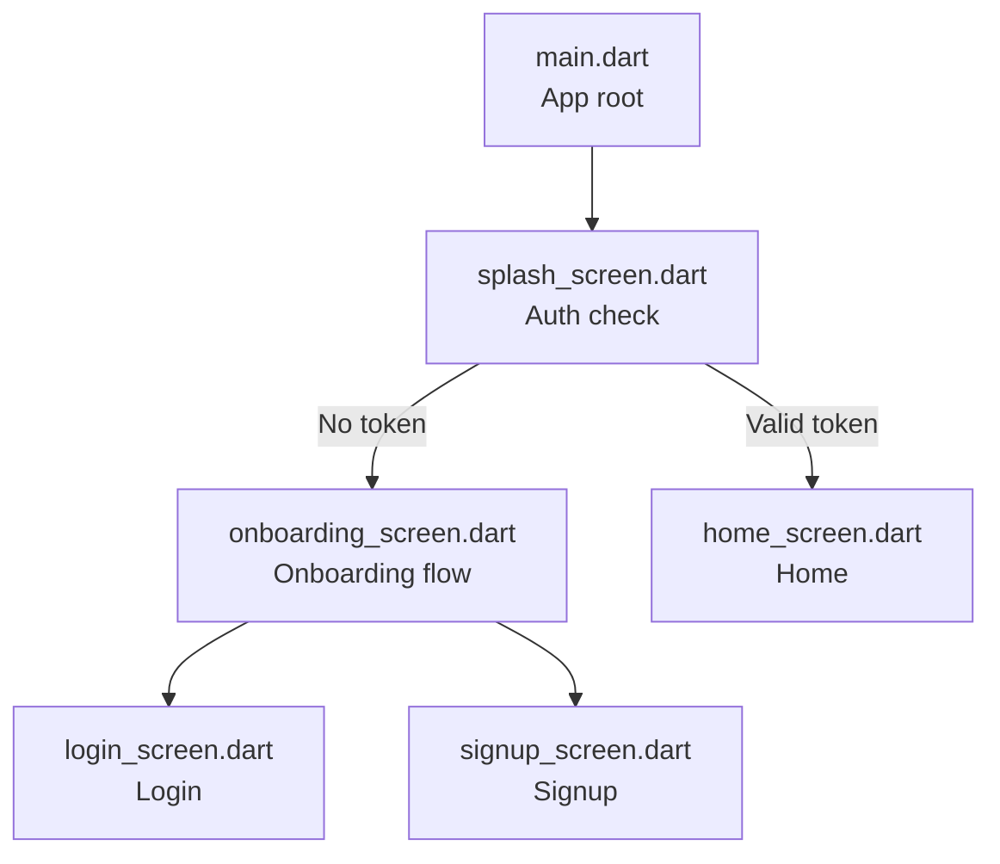
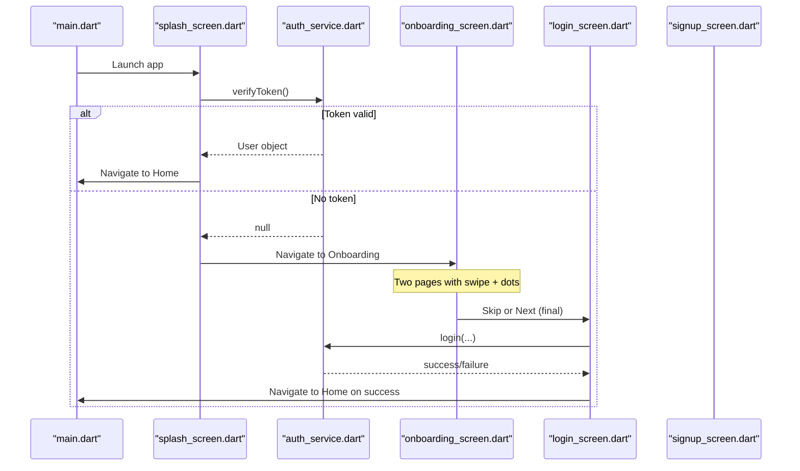
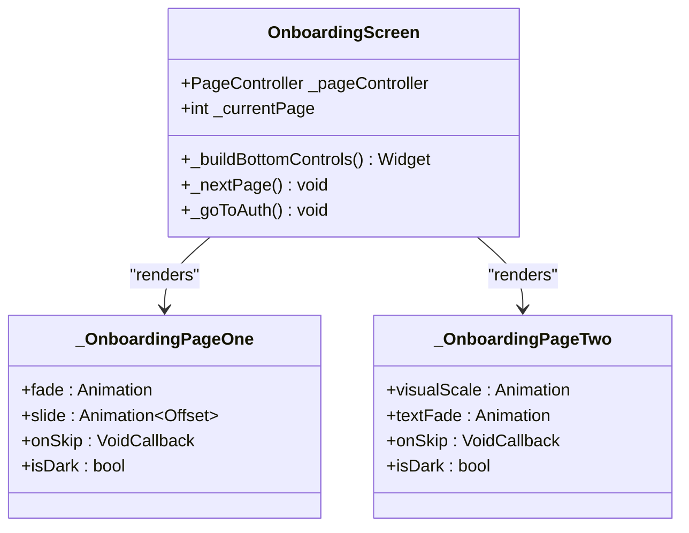
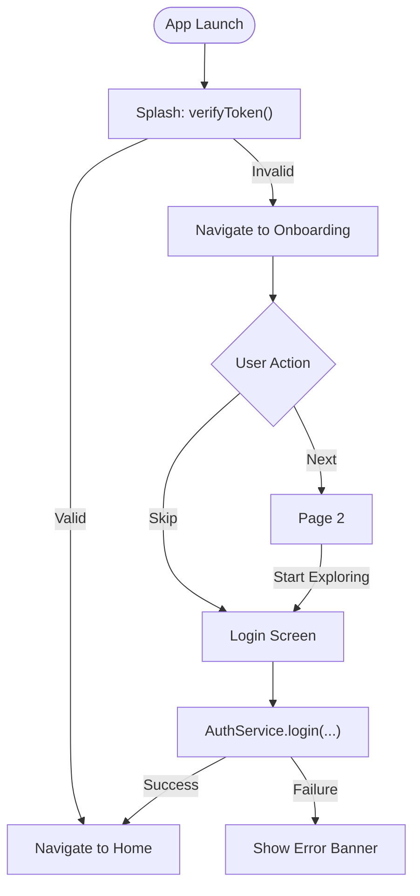
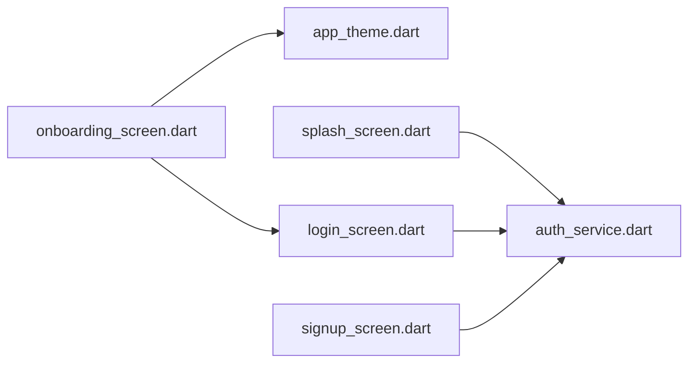

# Onboarding Screen

<cite>
**Referenced Files in This Document**
- [onboarding_screen.dart](file://lib/screens/onboarding_screen.dart)
- [splash_screen.dart](file://lib/screens/splash_screen.dart)
- [login_screen.dart](file://lib/screens/login_screen.dart)
- [signup_screen.dart](file://lib/screens/signup_screen.dart)
- [auth_service.dart](file://lib/services/auth_service.dart)
- [app_theme.dart](file://lib/theme/app_theme.dart)
- [main.dart](file://lib/main.dart)
</cite>

## Table of Contents
1. [Introduction](#introduction)
2. [Project Structure](#project-structure)
3. [Core Components](#core-components)
4. [Architecture Overview](#architecture-overview)
5. [Detailed Component Analysis](#detailed-component-analysis)
6. [Dependency Analysis](#dependency-analysis)
7. [Performance Considerations](#performance-considerations)
8. [Troubleshooting Guide](#troubleshooting-guide)
9. [Conclusion](#conclusion)

## Introduction
This document explains the Onboarding Screen component that guides new users through the Bon Voyage Pakistan application. It covers the onboarding flow, page indicators, swipe gestures, skip functionality, and transition to authentication screens. It also details how the experience introduces core features, displays destination information, and provides navigation controls. Implementation notes include page view management, user progress tracking, and integration with the authentication system.

## Project Structure
The onboarding experience is implemented as a dedicated screen within the Flutter app. The entry point initializes the app theme and starts at a splash screen, which then routes to either the home or onboarding based on authentication state.

**Diagram sources**
- [main.dart:1-47](file://lib/main.dart#L1-L47)
- [splash_screen.dart:1-200](file://lib/screens/splash_screen.dart#L1-L200)
- [onboarding_screen.dart:1-697](file://lib/screens/onboarding_screen.dart#L1-L697)
- [login_screen.dart:1-444](file://lib/screens/login_screen.dart#L1-L444)
- [signup_screen.dart:1-480](file://lib/screens/signup_screen.dart#L1-L480)

**Section sources**
- [main.dart:1-47](file://lib/main.dart#L1-L47)
- [splash_screen.dart:1-200](file://lib/screens/splash_screen.dart#L1-L200)

## Core Components
- OnboardingScreen: Manages a two-page PageView with animations, bottom progress dots, and a primary call-to-action button. Provides skip actions to navigate to login.
- _OnboardingPageOne: Cinematic first page showcasing Northern Pakistan imagery and introductory messaging.
- _OnboardingPageTwo: Second page highlighting AI-powered travel companion features with animated visuals and floating icons.
- Splash screen: Routes to onboarding when no valid token exists.
- Login/Signup screens: Destination after onboarding completion or skip.

Key responsibilities:
- Page view management via PageController and listener for current page changes.
- Animated transitions per page using AnimationController and CurvedAnimation.
- Bottom controls: animated progress dots and Next/Start Exploring button.
- Skip action to authenticate flows.

**Section sources**
- [onboarding_screen.dart:1-697](file://lib/screens/onboarding_screen.dart#L1-L697)
- [splash_screen.dart:1-200](file://lib/screens/splash_screen.dart#L1-L200)
- [login_screen.dart:1-444](file://lib/screens/login_screen.dart#L1-L444)
- [signup_screen.dart:1-480](file://lib/screens/signup_screen.dart#L1-L480)

## Architecture Overview
The onboarding flow integrates with the app’s routing and authentication:

**Diagram sources**
- [splash_screen.dart:69-87](file://lib/screens/splash_screen.dart#L69-L87)
- [auth_service.dart:168-202](file://lib/services/auth_service.dart#L168-L202)
- [onboarding_screen.dart:86-102](file://lib/screens/onboarding_screen.dart#L86-L102)
- [login_screen.dart:53-82](file://lib/screens/login_screen.dart#L53-L82)

## Detailed Component Analysis

### OnboardingScreen
- Page management: Uses a PageController to handle swiping between two pages. A listener updates the current page index and triggers page-specific animations.
- Animations: Per-page animation controllers coordinate fade and slide effects for smooth transitions.
- Navigation:
  - Skip: Navigates directly to the Login screen.
  - Next: Moves to the second page; on the last page, navigates to Login.
- Progress indicators: Animated bottom dots reflect the current page.
- Theming: Adapts colors based on dark/light mode.

**Diagram sources**
- [onboarding_screen.dart:16-138](file://lib/screens/onboarding_screen.dart#L16-L138)
- [onboarding_screen.dart:211-314](file://lib/screens/onboarding_screen.dart#L211-L314)
- [onboarding_screen.dart:319-613](file://lib/screens/onboarding_screen.dart#L319-L613)

**Section sources**
- [onboarding_screen.dart:16-138](file://lib/screens/onboarding_screen.dart#L16-L138)
- [onboarding_screen.dart:140-206](file://lib/screens/onboarding_screen.dart#L140-L206)

### Page One — Cinematic Northern Pakistan
- Visuals: Full-screen background image with gradient overlay for readability.
- Content: Headline and descriptive text introducing exploration of Northern Areas.
- Controls: Skip button positioned in the top-left safe area.
- Animation: Fade-in and slide-up content synchronized with page visibility.

**Section sources**
- [onboarding_screen.dart:211-314](file://lib/screens/onboarding_screen.dart#L211-L314)

### Page Two — Smart Travel Companion
- Visuals: Ambient glows, digital texture overlay, central circular image with pulsing rings and scanning line animation.
- Floating icons: Subtle bobbing icons representing features like restaurant discovery and translation.
- Content: Title and description emphasizing AI-powered assistance.
- Controls: Skip button in the top-left safe area.

**Section sources**
- [onboarding_screen.dart:319-613](file://lib/screens/onboarding_screen.dart#L319-L613)

### Bottom Controls and Page Indicators
- Progress dots: Two animated rectangles indicating current page; active dot expands width and uses primary color.
- Call-to-action button: Displays “Next” on page one and “Start Exploring” on page two; icon changes accordingly.
- Gradient backdrop: Smoothly blends into the page content for visual cohesion.

**Section sources**
- [onboarding_screen.dart:140-206](file://lib/screens/onboarding_screen.dart#L140-L206)

### Swipe Gestures and Page View Management
- PageController drives horizontal swiping with physics tuned for a responsive feel.
- Listener tracks page changes and triggers corresponding animations for each page.
- State updates ensure UI reflects the current page accurately.

**Section sources**
- [onboarding_screen.dart:18-76](file://lib/screens/onboarding_screen.dart#L18-L76)

### Skip Functionality and Transition to Authentication
- Skip action navigates to the Login screen from both pages.
- Final “Start Exploring” also navigates to Login, completing the onboarding flow.

**Section sources**
- [onboarding_screen.dart:86-102](file://lib/screens/onboarding_screen.dart#L86-L102)

### Integration with Authentication System
- Splash screen checks for a stored JWT via AuthService.verifyToken(). If absent or invalid, it routes to OnboardingScreen.
- After successful login or signup, users are directed to the Home screen.
- AuthService handles secure storage of tokens and user info, with timeouts and error handling.

**Diagram sources**
- [splash_screen.dart:69-87](file://lib/screens/splash_screen.dart#L69-L87)
- [auth_service.dart:168-202](file://lib/services/auth_service.dart#L168-L202)
- [login_screen.dart:53-82](file://lib/screens/login_screen.dart#L53-L82)

**Section sources**
- [splash_screen.dart:69-87](file://lib/screens/splash_screen.dart#L69-L87)
- [auth_service.dart:168-202](file://lib/services/auth_service.dart#L168-L202)
- [login_screen.dart:53-82](file://lib/screens/login_screen.dart#L53-L82)

## Dependency Analysis
- OnboardingScreen depends on:
  - Theme definitions for consistent styling across light/dark modes.
  - Login screen for navigation after skip or final step.
- Splash screen depends on AuthService to determine initial route.
- Login/Signup screens depend on AuthService for authentication operations and navigate to Home upon success.

**Diagram sources**
- [onboarding_screen.dart:1-10](file://lib/screens/onboarding_screen.dart#L1-L10)
- [splash_screen.dart:1-10](file://lib/screens/splash_screen.dart#L1-L10)
- [login_screen.dart:1-10](file://lib/screens/login_screen.dart#L1-L10)
- [signup_screen.dart:1-10](file://lib/screens/signup_screen.dart#L1-L10)
- [app_theme.dart:1-50](file://lib/theme/app_theme.dart#L1-L50)
- [auth_service.dart:1-30](file://lib/services/auth_service.dart#L1-L30)

**Section sources**
- [onboarding_screen.dart:1-10](file://lib/screens/onboarding_screen.dart#L1-L10)
- [splash_screen.dart:1-10](file://lib/screens/splash_screen.dart#L1-L10)
- [login_screen.dart:1-10](file://lib/screens/login_screen.dart#L1-L10)
- [signup_screen.dart:1-10](file://lib/screens/signup_screen.dart#L1-L10)
- [app_theme.dart:1-50](file://lib/theme/app_theme.dart#L1-L50)
- [auth_service.dart:1-30](file://lib/services/auth_service.dart#L1-L30)

## Performance Considerations
- Animation Controllers: Each page uses dedicated AnimationControllers; ensure they are disposed to avoid memory leaks.
- PageController: Proper disposal prevents resource retention during navigation.
- Image assets: Large images can impact performance; consider optimizing asset sizes and using appropriate fit modes.
- Network calls: Authentication requests use timeouts to prevent indefinite waits; handle errors gracefully to maintain responsiveness.

[No sources needed since this section provides general guidance]

## Troubleshooting Guide
- Onboarding does not navigate to Login on skip:
  - Verify the skip callback is wired correctly in both pages and that Navigator.pushReplacement is invoked.
  - Ensure LoginScreen is available and import paths are correct.
- Progress dots not updating:
  - Confirm PageController listener updates _currentPage and triggers setState.
  - Check that the bottom controls rebuild based on the current page index.
- Animations not playing:
  - Validate AnimationController forward/reverse calls on page changes.
  - Ensure TickerProviderStateMixin is used and controllers are initialized in initState.
- Authentication failures after onboarding:
  - Inspect network connectivity and backend availability.
  - Review error messages returned by AuthService and displayed in Login/Signup screens.

**Section sources**
- [onboarding_screen.dart:63-76](file://lib/screens/onboarding_screen.dart#L63-L76)
- [onboarding_screen.dart:86-102](file://lib/screens/onboarding_screen.dart#L86-L102)
- [login_screen.dart:53-82](file://lib/screens/login_screen.dart#L53-L82)
- [auth_service.dart:168-202](file://lib/services/auth_service.dart#L168-L202)

## Conclusion
The Onboarding Screen provides an engaging, animated introduction to Bon Voyage Pakistan’s core features, guiding users through two cinematic pages with clear navigation controls. It integrates seamlessly with the app’s authentication flow, ensuring new users are routed appropriately to sign up or log in. Robust page view management, animated indicators, and themed UI elements deliver a polished experience while maintaining performance and accessibility.