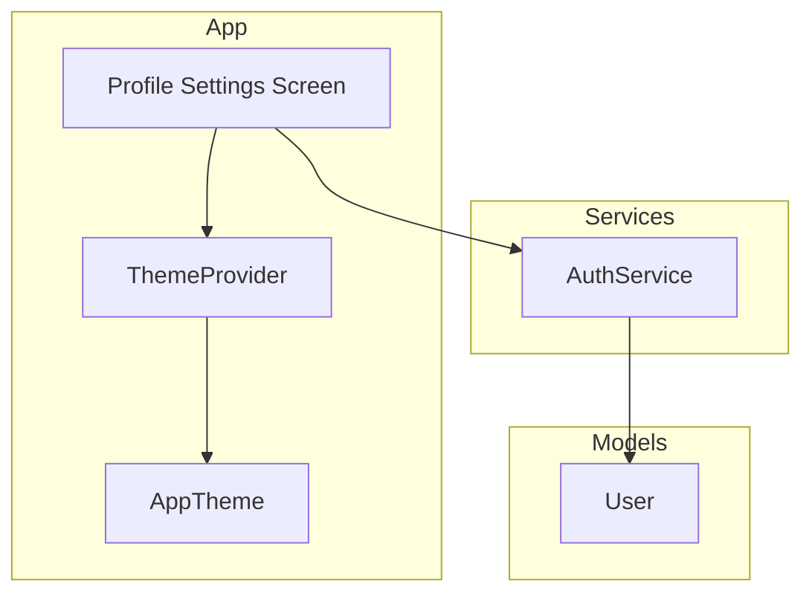
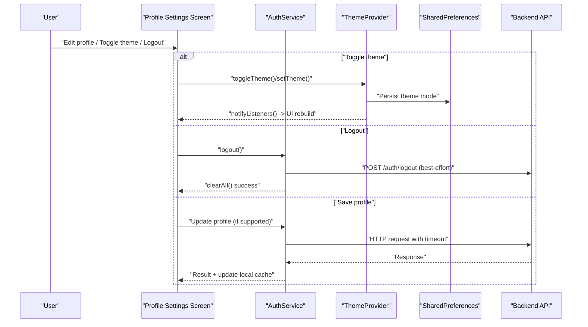
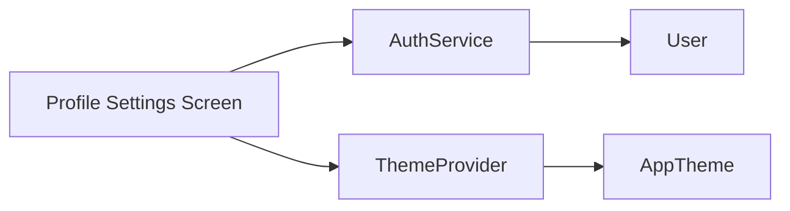

# Profile Settings Screen

<cite>
**Referenced Files in This Document**
- [profile_settings_screen.dart](file://lib/screens/profile_settings_screen.dart)
- [auth_service.dart](file://lib/services/auth_service.dart)
- [user.dart](file://lib/models/user.dart)
- [app_theme.dart](file://lib/theme/app_theme.dart)
- [theme_provider.dart](file://lib/theme/theme_provider.dart)
</cite>

## Table of Contents
1. Introduction
2. Project Structure
3. Core Components
4. Architecture Overview
5. Detailed Component Analysis
6. Dependency Analysis
7. Performance Considerations
8. Troubleshooting Guide
9. Conclusion

## Introduction
This document describes the Profile Settings Screen component that allows users to manage their account information and application preferences. It covers user profile editing capabilities, settings management, theme switching options, and logout functionality. It also explains how the screen synchronizes user data with the backend, manages local storage for preferences, and provides real-time updates to the user interface. Form handling, data validation, error recovery, and security considerations for sensitive operations are included.

## Project Structure
The Profile Settings Screen is implemented as a Flutter screen within the screens directory. It integrates with:
- Authentication service for secure token handling and API calls
- User model for representing profile data
- Theme provider and app theme for managing light/dark mode and persisting preferences

**Diagram sources**
- [profile_settings_screen.dart:1-1](file://lib/screens/profile_settings_screen.dart#L1-L1)
- [auth_service.dart:10-226](file://lib/services/auth_service.dart#L10-L226)
- [user.dart:1-29](file://lib/models/user.dart#L1-L29)
- [theme_provider.dart:5-48](file://lib/theme/theme_provider.dart#L5-L48)
- [app_theme.dart:3-47](file://lib/theme/app_theme.dart#L3-L47)

**Section sources**
- [profile_settings_screen.dart:1-1](file://lib/screens/profile_settings_screen.dart#L1-L1)
- [auth_service.dart:10-226](file://lib/services/auth_service.dart#L10-L226)
- [user.dart:1-29](file://lib/models/user.dart#L1-L29)
- [theme_provider.dart:5-48](file://lib/theme/theme_provider.dart#L5-L48)
- [app_theme.dart:3-47](file://lib/theme/app_theme.dart#L3-L47)

## Core Components
- Profile Settings Screen: UI entry point for editing profile details, toggling theme, and logging out.
- AuthService: Handles authentication flows, secure token storage, and API interactions with timeouts and error handling.
- User Model: Represents the user’s profile data (id, name, email).
- ThemeProvider: Manages and persists light/dark theme preference using SharedPreferences and notifies listeners for real-time UI updates.
- AppTheme: Centralized theme configuration providing dark and light themes.

Key responsibilities:
- Profile editing: Collects and validates user inputs; updates local cache and syncs with backend when applicable.
- Settings management: Persists theme choice locally and applies it immediately across the app.
- Logout: Clears local auth state and optionally notifies the backend.

**Section sources**
- [auth_service.dart:10-226](file://lib/services/auth_service.dart#L10-L226)
- [user.dart:1-29](file://lib/models/user.dart#L1-L29)
- [theme_provider.dart:5-48](file://lib/theme/theme_provider.dart#L5-L48)
- [app_theme.dart:3-47](file://lib/theme/app_theme.dart#L3-L47)

## Architecture Overview
The Profile Settings Screen orchestrates user actions by delegating to services and providers:
- Editing profile triggers validation and optional backend synchronization via AuthService.
- Theme changes are handled by ThemeProvider, which persists the selection and rebuilds affected widgets.
- Logout clears local credentials and resets session state.

**Diagram sources**
- [auth_service.dart:117-226](file://lib/services/auth_service.dart#L117-L226)
- [theme_provider.dart:19-48](file://lib/theme/theme_provider.dart#L19-L48)

## Detailed Component Analysis

### Profile Settings Screen
Responsibilities:
- Present editable fields for name and email
- Validate inputs before submission
- Trigger save operations through AuthService
- Provide theme toggle and logout actions
- Reflect real-time updates after successful operations

Form handling and validation:
- Inputs should be validated for required fields and correct formats
- Errors should be surfaced near relevant fields
- Submit actions should disable controls during network requests to prevent duplicate submissions

Real-time updates:
- Use providers or state management to reflect changes immediately after successful saves or theme toggles

Security considerations:
- Do not store passwords in local storage
- Use secure storage for tokens (handled by AuthService)
- Ensure sensitive operations require re-authentication if needed

**Section sources**
- [profile_settings_screen.dart:1-1](file://lib/screens/profile_settings_screen.dart#L1-L1)
- [auth_service.dart:10-226](file://lib/services/auth_service.dart#L10-L226)
- [theme_provider.dart:5-48](file://lib/theme/theme_provider.dart#L5-L48)

### AuthService
Responsibilities:
- Securely store and retrieve JWT tokens and cached user info
- Perform login, signup, token verification, and logout
- Apply consistent timeouts and structured error responses

Data synchronization:
- On successful login/signup, stores token and caches user name/email locally for quick display
- Token verification refreshes local cache and clears invalid tokens

Error handling:
- TimeoutException and connection errors return user-friendly messages
- Generic catch-all handles unexpected failures

Security:
- Uses secure storage for tokens
- Best-effort logout call does not block on failure

**Section sources**
- [auth_service.dart:10-226](file://lib/services/auth_service.dart#L10-L226)

### User Model
Responsibilities:
- Represent user profile data (id, name, email)
- Convert between JSON and domain object

Complexity:
- O(1) creation and conversion

Usage:
- Deserialized from backend responses and used to populate UI and local cache

**Section sources**
- [user.dart:1-29](file://lib/models/user.dart#L1-L29)

### Theme Provider and App Theme
ThemeProvider:
- Loads persisted theme mode on startup
- Toggles or sets theme mode and persists the choice
- Notifies listeners to trigger UI rebuilds

AppTheme:
- Provides centralized color palette and theme definitions for light and dark modes
- Configures typography, buttons, input decorations, and app bar styles

Real-time updates:
- notifyListeners ensures immediate UI refresh when theme changes

Persistence:
- SharedPreferences stores the selected theme mode

**Section sources**
- [theme_provider.dart:5-48](file://lib/theme/theme_provider.dart#L5-L48)
- [app_theme.dart:3-47](file://lib/theme/app_theme.dart#L3-L47)

## Dependency Analysis
The Profile Settings Screen depends on:
- AuthService for authentication and profile synchronization
- ThemeProvider for theme management and persistence
- User model for data representation

**Diagram sources**
- [profile_settings_screen.dart:1-1](file://lib/screens/profile_settings_screen.dart#L1-L1)
- [auth_service.dart:10-226](file://lib/services/auth_service.dart#L10-L226)
- [theme_provider.dart:5-48](file://lib/theme/theme_provider.dart#L5-L48)
- [app_theme.dart:3-47](file://lib/theme/app_theme.dart#L3-L47)
- [user.dart:1-29](file://lib/models/user.dart#L1-L29)

**Section sources**
- [auth_service.dart:10-226](file://lib/services/auth_service.dart#L10-L226)
- [theme_provider.dart:5-48](file://lib/theme/theme_provider.dart#L5-L48)
- [user.dart:1-29](file://lib/models/user.dart#L1-L29)

## Performance Considerations
- Network requests use a fixed timeout to avoid indefinite waits and improve responsiveness.
- Local caching of user name and email reduces unnecessary network calls for display purposes.
- Theme changes are persisted and applied immediately, minimizing redundant work.
- Avoid blocking the UI thread during async operations; show loading indicators where appropriate.

[No sources needed since this section provides general guidance]

## Troubleshooting Guide
Common issues and resolutions:
- Backend unreachable: The service returns a connection error message; verify device connectivity and backend availability.
- Request timeout: The service returns a timeout message; retry after ensuring the backend is running and reachable.
- Invalid/expired token: Token verification clears local state; prompt the user to log in again.
- Theme not persisting: Ensure SharedPreferences is accessible and the theme key is written successfully.

Operational tips:
- Log and capture error messages from the service layer for diagnostics.
- For logout, even if the backend call fails, local state is cleared to maintain consistency.

**Section sources**
- [auth_service.dart:204-256](file://lib/services/auth_service.dart#L204-L256)
- [theme_provider.dart:19-48](file://lib/theme/theme_provider.dart#L19-L48)

## Conclusion
The Profile Settings Screen integrates with AuthService and ThemeProvider to deliver a robust experience for managing user profiles and application preferences. It leverages secure storage, persistent settings, and real-time UI updates to ensure reliability and usability. Proper form validation, clear error messaging, and secure handling of sensitive data contribute to a safe and responsive user experience.

[No sources needed since this section summarizes without analyzing specific files]