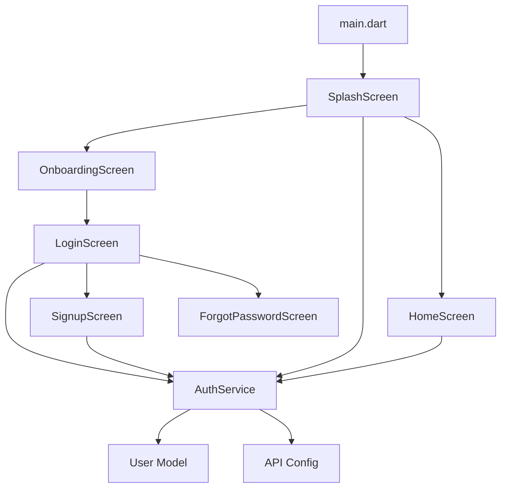
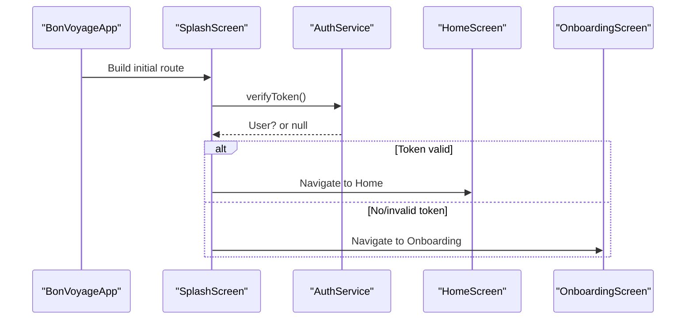
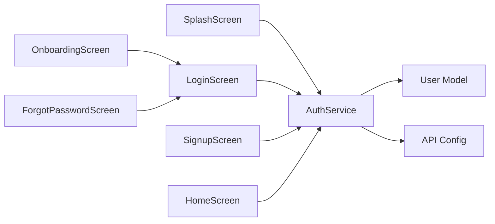

# Screen Components

<cite>
**Referenced Files in This Document**
- [main.dart](file://lib/main.dart)
- [splash_screen.dart](file://lib/screens/splash_screen.dart)
- [onboarding_screen.dart](file://lib/screens/onboarding_screen.dart)
- [login_screen.dart](file://lib/screens/login_screen.dart)
- [signup_screen.dart](file://lib/screens/signup_screen.dart)
- [forgot_password_screen.dart](file://lib/screens/forgot_password_screen.dart)
- [home_screen.dart](file://lib/screens/home_screen.dart)
- [auth_service.dart](file://lib/services/auth_service.dart)
- [user.dart](file://lib/models/user.dart)
- [app_theme.dart](file://lib/theme/app_theme.dart)
- [theme_provider.dart](file://lib/theme/theme_provider.dart)
- [api_config.dart](file://lib/config/api_config.dart)
- [pubspec.yaml](file://pubspec.yaml)
</cite>

## Table of Contents
1. [Introduction](#introduction)
2. [Project Structure](#project-structure)
3. [Core Components](#core-components)
4. [Architecture Overview](#architecture-overview)
5. [Detailed Component Analysis](#detailed-component-analysis)
6. [Dependency Analysis](#dependency-analysis)
7. [Performance Considerations](#performance-considerations)
8. [Troubleshooting Guide](#troubleshooting-guide)
9. [Conclusion](#conclusion)

## Introduction
This document provides a comprehensive guide to all screen components in the Bon Voyage Pakistan Flutter application. It explains each screen’s purpose, user flow, implementation details, navigation patterns, state management, and backend integration points. The app begins with a splash screen that validates authentication, proceeds through an onboarding experience, supports login/signup flows, and presents a home dashboard with profile interactions. Screens communicate with a backend via a centralized authentication service and use secure storage for tokens and cached user data.

## Project Structure
The screens are organized under lib/screens and interact with services, models, theme, and configuration modules:
- Entry point: main.dart initializes theme scope and renders the root app widget with SplashScreen as the initial route.
- Authentication screens: splash_screen.dart, onboarding_screen.dart, login_screen.dart, signup_screen.dart, forgot_password_screen.dart.
- Main app shell: home_screen.dart hosts the primary dashboard and bottom navigation.
- Services: auth_service.dart encapsulates HTTP calls and secure token handling.
- Models: user.dart defines the User entity used across auth flows.
- Theme and config: app_theme.dart and theme_provider.dart manage appearance; api_config.dart centralizes API endpoints.

**Diagram sources**
- [main.dart:12-46](file://lib/main.dart#L12-L46)
- [splash_screen.dart:69-87](file://lib/screens/splash_screen.dart#L69-L87)
- [onboarding_screen.dart:86-101](file://lib/screens/onboarding_screen.dart#L86-L101)
- [login_screen.dart:53-96](file://lib/screens/login_screen.dart#L53-L96)
- [signup_screen.dart:57-94](file://lib/screens/signup_screen.dart#L57-L94)
- [auth_service.dart:73-161](file://lib/services/auth_service.dart#L73-L161)
- [user.dart:1-29](file://lib/models/user.dart#L1-L29)
- [api_config.dart](file://lib/config/api_config.dart)

**Section sources**
- [main.dart:12-46](file://lib/main.dart#L12-L46)
- [pubspec.yaml:9-15](file://pubspec.yaml#L9-L15)

## Core Components
- Splash Screen: Initializes animations, verifies authentication status, and navigates to Home or Onboarding based on token validity.
- Onboarding Screen: Two-page cinematic introduction with animated visuals and navigation to Login.
- Login Screen: Form-based authentication with validation, loading states, error banners, and navigation to Signup/Forgot Password/Home.
- Signup Screen: Registration form with password requirements, validation, and navigation to Home on success.
- Forgot Password Screen: Email reset flow with simulated backend call and success state.
- Home Screen: Dashboard with top bar, search, AI planner card, featured content, and profile menu including logout.

State management within screens uses StatefulWidget with local state (loading, errors, form controllers). Global theme state is managed by ThemeProviderScope. Backend interactions are centralized in AuthService, which handles HTTP requests, timeouts, and secure storage.

**Section sources**
- [splash_screen.dart:20-87](file://lib/screens/splash_screen.dart#L20-L87)
- [onboarding_screen.dart:16-138](file://lib/screens/onboarding_screen.dart#L16-L138)
- [login_screen.dart:16-96](file://lib/screens/login_screen.dart#L16-L96)
- [signup_screen.dart:15-94](file://lib/screens/signup_screen.dart#L15-L94)
- [forgot_password_screen.dart:13-67](file://lib/screens/forgot_password_screen.dart#L13-L67)
- [home_screen.dart:16-165](file://lib/screens/home_screen.dart#L16-L165)
- [auth_service.dart:14-62](file://lib/services/auth_service.dart#L14-L62)

## Architecture Overview
The app follows a layered architecture:
- UI Layer: Screens compose widgets, handle user input, and manage local state.
- Service Layer: AuthService abstracts network calls, token persistence, and error handling.
- Data Layer: User model represents entities returned from the backend.
- Configuration: API endpoints are centralized; theme and provider manage appearance.

**Diagram sources**
- [main.dart:27-46](file://lib/main.dart#L27-L46)
- [splash_screen.dart:69-87](file://lib/screens/splash_screen.dart#L69-L87)
- [auth_service.dart:168-202](file://lib/services/auth_service.dart#L168-L202)

## Detailed Component Analysis

### Splash Screen
Purpose:
- Display branding and animations while validating authentication.
- Route users to Home if authenticated; otherwise, to Onboarding.

User Flow:
- Launch app → show logo/title/subtitle with animations → delay → verify token → navigate accordingly.

Implementation Details:
- Uses AnimationController and CurvedAnimation for fade/slide effects.
- Calls AuthService.verifyToken to check session validity.
- Navigates using Navigator.pushReplacement to ensure clean back stack.

Error Handling:
- Graceful fallback if token verification fails or times out; routes to Onboarding.

Navigation Patterns:
- pushReplacement to Home or Onboarding after verification.

State Management:
- Local state for animation controllers; no persistent UI state beyond navigation.

Backend Integration:
- AuthService.verifyToken performs GET /auth/me with Authorization header.

Code Examples (paths):
- Navigation logic: [splash_screen.dart:69-87](file://lib/screens/splash_screen.dart#L69-L87)
- Animation setup: [splash_screen.dart:28-61](file://lib/screens/splash_screen.dart#L28-L61)

**Section sources**
- [splash_screen.dart:20-87](file://lib/screens/splash_screen.dart#L20-L87)
- [auth_service.dart:168-202](file://lib/services/auth_service.dart#L168-L202)

### Onboarding Screen
Purpose:
- Introduce app features with immersive visuals and guide users to authentication.

User Flow:
- Page 1: Northern Pakistan imagery and value proposition → Next/Skip.
- Page 2: AI companion highlights → Next/Skip → Login.

Implementation Details:
- PageView with two pages; animations per page transition.
- Bottom controls include progress dots and CTA button.
- Skips navigate directly to Login.

Error Handling:
- None specific; relies on subsequent screens for auth errors.

Navigation Patterns:
- pushReplacement to Login when skipping or completing onboarding.

State Management:
- Tracks current page and animates transitions; lightweight local state.

Backend Integration:
- None directly; delegates to Login for auth.

Code Examples (paths):
- Page navigation and skip: [onboarding_screen.dart:86-101](file://lib/screens/onboarding_screen.dart#L86-L101)
- Page controller and animations: [onboarding_screen.dart:18-76](file://lib/screens/onboarding_screen.dart#L18-L76)

**Section sources**
- [onboarding_screen.dart:16-138](file://lib/screens/onboarding_screen.dart#L16-L138)

### Login Screen
Purpose:
- Authenticate existing users with email/password and provide access to Home.

User Flow:
- Enter credentials → validate → submit → show loading → navigate to Home on success or display error banner.

Implementation Details:
- Form validation for email and password.
- Loading indicator during submission.
- Error banner displays messages from backend.
- Links to Signup and Forgot Password.

Error Handling:
- Displays backend-provided messages; resets loading state on failure.

Navigation Patterns:
- pushAndRemoveUntil to Home on success.
- push to Signup and Forgot Password.

State Management:
- Local state for loading, error message, and obscure password toggle.

Backend Integration:
- AuthService.login sends POST request; persists token and user info on success.

Code Examples (paths):
- Login handler: [login_screen.dart:53-82](file://lib/screens/login_screen.dart#L53-L82)
- Navigation to other screens: [login_screen.dart:84-96](file://lib/screens/login_screen.dart#L84-L96)
- Error banner: [login_screen.dart:419-441](file://lib/screens/login_screen.dart#L419-L441)

**Section sources**
- [login_screen.dart:16-96](file://lib/screens/login_screen.dart#L16-L96)
- [auth_service.dart:117-161](file://lib/services/auth_service.dart#L117-L161)

### Signup Screen
Purpose:
- Create new accounts with name, email, and password; navigate to Home upon success.

User Flow:
- Fill form → validate fields (including password requirements) → submit → show loading → navigate to Home or display error.

Implementation Details:
- Password strength hints update dynamically.
- Confirm password validation ensures match.
- Success navigates to Home; errors shown in banner.

Error Handling:
- Validates inputs locally; shows backend messages on failure.

Navigation Patterns:
- pushAndRemoveUntil to Home on success.
- pushReplacement to Login from signup actions.

State Management:
- Local state for loading, error message, and password visibility toggles.

Backend Integration:
- AuthService.signup sends registration payload; stores token and user info on success.

Code Examples (paths):
- Signup handler: [signup_screen.dart:57-87](file://lib/screens/signup_screen.dart#L57-L87)
- Password requirements UI: [signup_screen.dart:268-299](file://lib/screens/signup_screen.dart#L268-L299)
- Error banner: [signup_screen.dart:421-443](file://lib/screens/signup_screen.dart#L421-L443)

**Section sources**
- [signup_screen.dart:15-94](file://lib/screens/signup_screen.dart#L15-L94)
- [auth_service.dart:68-115](file://lib/services/auth_service.dart#L68-L115)

### Forgot Password Screen
Purpose:
- Allow users to request a password reset link via email.

User Flow:
- Enter email → validate → simulate backend call → show success state with confirmation.

Implementation Details:
- Email validation with regex.
- Simulated delay to mimic network call.
- Success state displays confirmation message.

Error Handling:
- Local validation errors; placeholder for backend errors.

Navigation Patterns:
- Back navigation to Login; replace route to Login from success state.

State Management:
- Local state for loading and sent flag.

Backend Integration:
- Placeholder for future email service integration.

Code Examples (paths):
- Submit handler: [forgot_password_screen.dart:48-67](file://lib/screens/forgot_password_screen.dart#L48-L67)
- Success state: [forgot_password_screen.dart:307-332](file://lib/screens/forgot_password_screen.dart#L307-L332)

**Section sources**
- [forgot_password_screen.dart:13-67](file://lib/screens/forgot_password_screen.dart#L13-L67)

### Home Screen
Purpose:
- Provide the main dashboard with quick access to features and profile management.

User Flow:
- View personalized greeting and search bar → explore cards → open profile menu → log out or adjust settings.

Implementation Details:
- Top bar with profile button and notifications.
- Search field with upcoming feature feedback.
- AI Trip Planner card and Featured Escapes section.
- Profile bottom sheet includes Settings, History, Appearance toggle, and Logout.

Error Handling:
- Graceful fallback if user name cannot be loaded.

Navigation Patterns:
- Bottom navigation triggers “coming soon” messages for planned features.
- Logout clears session and returns to Login.

State Management:
- Local state for selected tab, user name, and logout loading.
- Integrates with ThemeProviderScope for theme toggling.

Backend Integration:
- Loads user name via AuthService.getUserName; logout calls AuthService.logout.

Code Examples (paths):
- Load user name: [home_screen.dart:73-87](file://lib/screens/home_screen.dart#L73-L87)
- Logout flow: [home_screen.dart:171-254](file://lib/screens/home_screen.dart#L171-L254)
- Profile menu: [home_screen.dart:260-419](file://lib/screens/home_screen.dart#L260-L419)

**Section sources**
- [home_screen.dart:16-165](file://lib/screens/home_screen.dart#L16-L165)
- [auth_service.dart:41-62](file://lib/services/auth_service.dart#L41-L62)

## Dependency Analysis
Screens depend on AuthService for authentication operations and on theme/provider for appearance. The User model is used to parse backend responses. API endpoints are configured centrally.

**Diagram sources**
- [splash_screen.dart:69-87](file://lib/screens/splash_screen.dart#L69-L87)
- [onboarding_screen.dart:86-101](file://lib/screens/onboarding_screen.dart#L86-L101)
- [login_screen.dart:53-96](file://lib/screens/login_screen.dart#L53-L96)
- [signup_screen.dart:57-94](file://lib/screens/signup_screen.dart#L57-L94)
- [forgot_password_screen.dart:48-67](file://lib/screens/forgot_password_screen.dart#L48-L67)
- [home_screen.dart:73-87](file://lib/screens/home_screen.dart#L73-L87)
- [auth_service.dart:14-62](file://lib/services/auth_service.dart#L14-L62)
- [user.dart:1-29](file://lib/models/user.dart#L1-L29)
- [api_config.dart](file://lib/config/api_config.dart)

**Section sources**
- [auth_service.dart:14-62](file://lib/services/auth_service.dart#L14-L62)
- [user.dart:1-29](file://lib/models/user.dart#L1-L29)
- [api_config.dart](file://lib/config/api_config.dart)

## Performance Considerations
- Animations: Use efficient animation controllers and dispose them properly to avoid memory leaks.
- Network Requests: AuthService applies a 15-second timeout to prevent indefinite hangs.
- State Updates: Minimize setState calls; batch updates where possible.
- Image Assets: Ensure images are optimized; consider caching strategies for repeated loads.
- Secure Storage: Use flutter_secure_storage for tokens to reduce overhead and improve security.

[No sources needed since this section provides general guidance]

## Troubleshooting Guide
Common issues and resolutions:
- Login/Signup failures: Check backend connectivity and ensure correct API endpoints in api_config.dart. Errors are surfaced via message fields in response maps.
- Token verification errors: If verifyToken fails or times out, the app routes to Onboarding; ensure backend is reachable and token is valid.
- Logout not clearing session: Verify AuthService.clearAll is called; confirm secure storage keys are deleted.
- UI freezes: Ensure async operations are awaited and UI state is updated only when mounted.

**Section sources**
- [auth_service.dart:105-114](file://lib/services/auth_service.dart#L105-L114)
- [auth_service.dart:151-160](file://lib/services/auth_service.dart#L151-L160)
- [auth_service.dart:194-201](file://lib/services/auth_service.dart#L194-L201)
- [auth_service.dart:205-226](file://lib/services/auth_service.dart#L205-L226)

## Conclusion
The Bon Voyage Pakistan application implements a clear, modular screen architecture with robust authentication flows and a polished user experience. Screens communicate through a centralized AuthService, ensuring consistent error handling and secure token management. The home dashboard integrates profile management and upcoming features, while theme and configuration modules maintain a cohesive design system. Future enhancements can extend the home screen’s feature set and integrate additional backend services for AI planning, scanning, translation, food exploration, hotel discovery, and emergency assistance.

[No sources needed since this section summarizes without analyzing specific files]