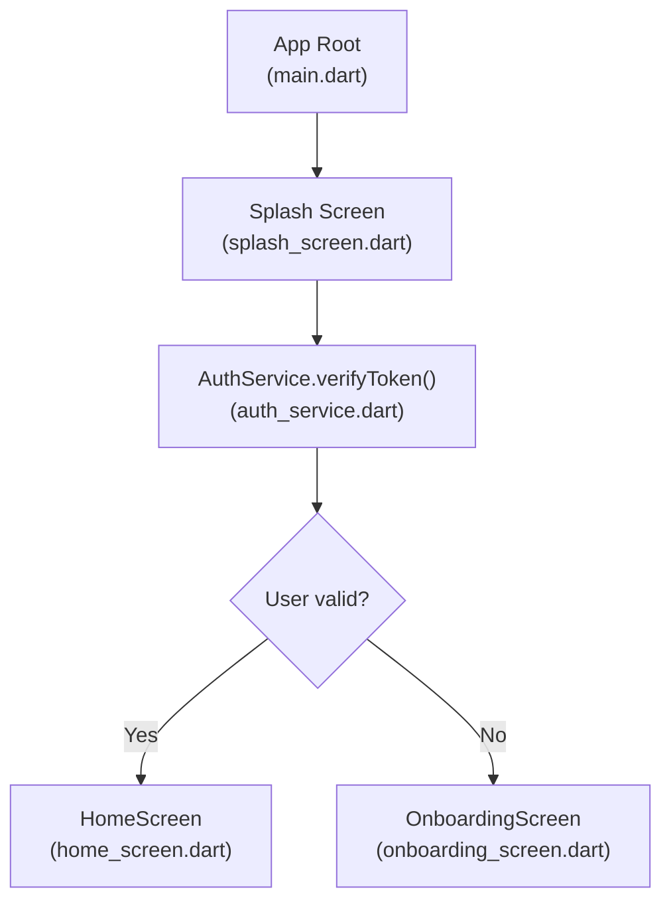
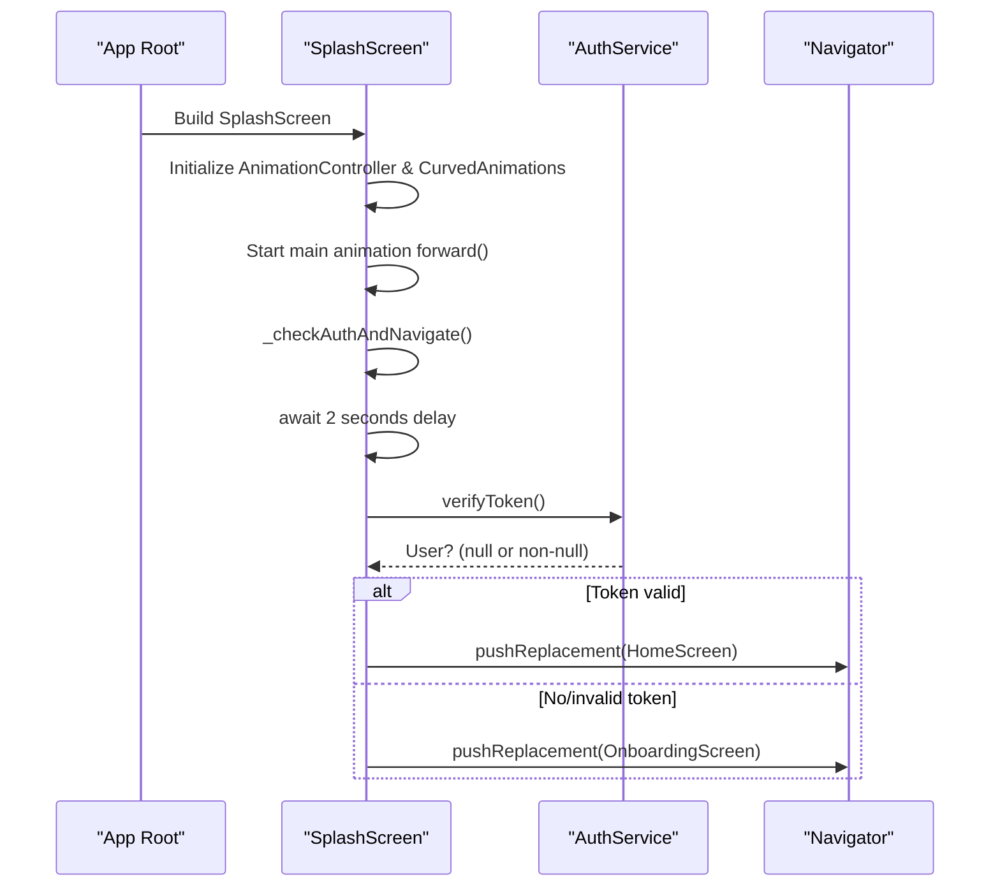
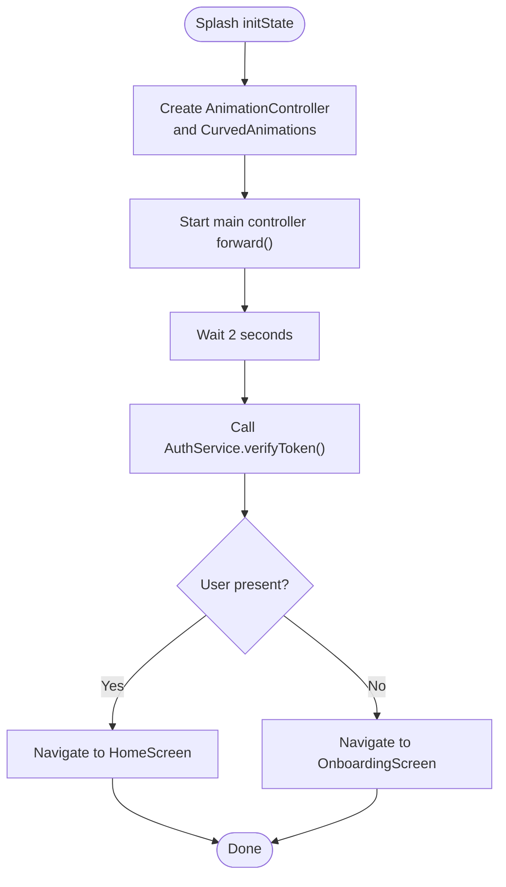
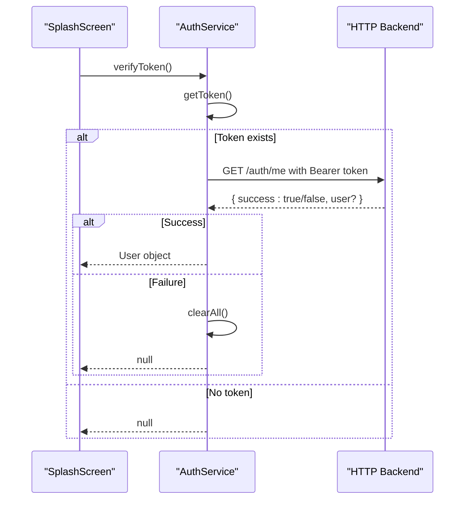
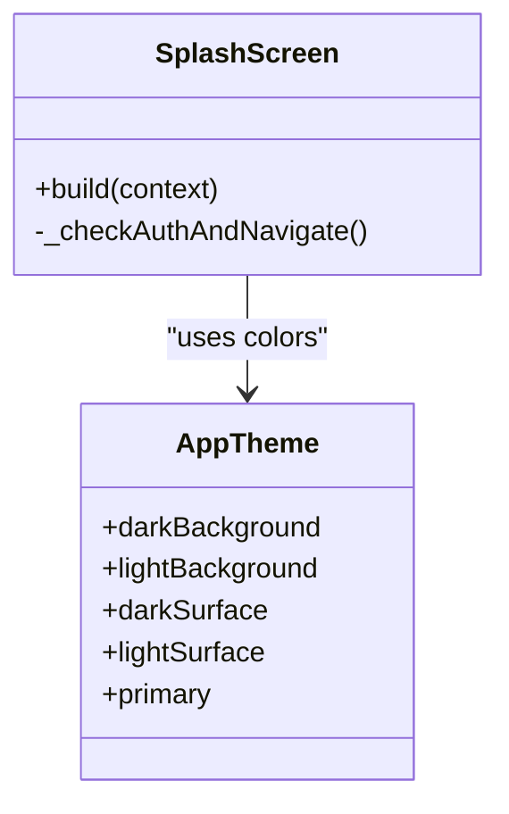
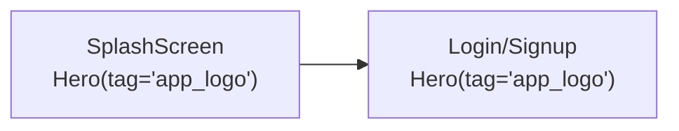
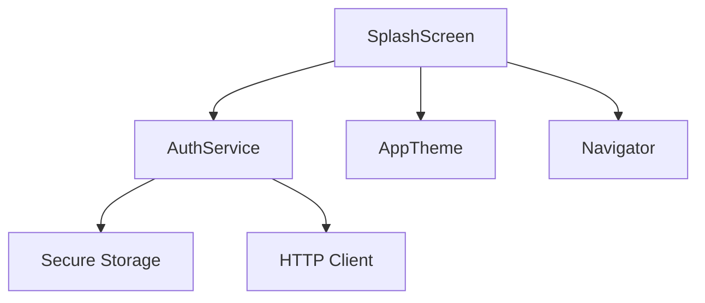

# Splash Screen

<cite>
**Referenced Files in This Document**
- [main.dart](file://lib/main.dart)
- [splash_screen.dart](file://lib/screens/splash_screen.dart)
- [auth_service.dart](file://lib/services/auth_service.dart)
- [app_theme.dart](file://lib/theme/app_theme.dart)
- [home_screen.dart](file://lib/screens/home_screen.dart)
- [onboarding_screen.dart](file://lib/screens/onboarding_screen.dart)
</cite>

## Table of Contents
1. [Introduction](#introduction)
2. [Project Structure](#project-structure)
3. [Core Components](#core-components)
4. [Architecture Overview](#architecture-overview)
5. [Detailed Component Analysis](#detailed-component-analysis)
6. [Dependency Analysis](#dependency-analysis)
7. [Performance Considerations](#performance-considerations)
8. [Troubleshooting Guide](#troubleshooting-guide)
9. [Conclusion](#conclusion)

## Introduction
The Splash Screen is the application entry point for Bon Voyage Pakistan. It presents a branded logo with smooth reveal animations, displays theme-aware gradient backgrounds, and performs an authentication check after a short delay. Based on the presence and validity of a stored JWT token, it navigates users to either the HomeScreen (authenticated) or OnboardingScreen (first-time or unauthenticated). The component orchestrates animation timing, gradient styling, and navigation logic while keeping the UI responsive and consistent with the app’s dark/light themes.

## Project Structure
At runtime, the app bootstraps via the root widget and immediately renders the Splash Screen as the initial route. The splash screen then delegates authentication checks to a dedicated service and navigates to the appropriate destination.

**Diagram sources**
- [main.dart:6-47](file://lib/main.dart#L6-L47)
- [splash_screen.dart:69-87](file://lib/screens/splash_screen.dart#L69-L87)
- [auth_service.dart:163-202](file://lib/services/auth_service.dart#L163-L202)
- [home_screen.dart:9-14](file://lib/screens/home_screen.dart#L9-L14)
- [onboarding_screen.dart:9-14](file://lib/screens/onboarding_screen.dart#L9-L14)

**Section sources**
- [main.dart:6-47](file://lib/main.dart#L6-L47)

## Core Components
- SplashScreen: Entry widget that initializes animations, renders themed visuals, and triggers authentication flow.
- AuthService: Handles secure storage and verification of the JWT token by calling the backend endpoint.
- AppTheme: Provides theme-aware colors and surfaces used by the splash screen for gradients and text.
- HomeScreen and OnboardingScreen: Destination screens based on authentication state.

Key responsibilities:
- Animation system using AnimationController and Tween-based slide/fade transitions.
- Gradient background that adapts to light/dark mode.
- Hero-enabled logo display for consistent branding across screens.
- Authentication gating with a 2-second delay before checking the token.

**Section sources**
- [splash_screen.dart:20-87](file://lib/screens/splash_screen.dart#L20-L87)
- [auth_service.dart:163-202](file://lib/services/auth_service.dart#L163-L202)
- [app_theme.dart:23-37](file://lib/theme/app_theme.dart#L23-L37)

## Architecture Overview
The splash screen lifecycle and navigation flow are coordinated as follows:
- Initialization: An AnimationController drives fade and slide animations for the logo, title, and subtitle.
- Visuals: A gradient container uses theme-aware colors; the logo is wrapped in a Hero widget with a stable tag for cross-screen transitions.
- Authentication: After a fixed delay, the splash screen calls the auth service to verify the token.
- Navigation: If the token is valid, navigate to HomeScreen; otherwise, navigate to OnboardingScreen.

**Diagram sources**
- [splash_screen.dart:28-87](file://lib/screens/splash_screen.dart#L28-L87)
- [auth_service.dart:163-202](file://lib/services/auth_service.dart#L163-L202)

## Detailed Component Analysis

### SplashScreen: Animations, Theming, and Navigation
- Animation initialization:
  - A single AnimationController controls staggered effects:
    - Logo fade-in over the first half of the duration.
    - Logo slide-up from below using a Tween with a curved interval.
    - Title and subtitle fade-ins at later intervals.
  - All animations are driven by CurvedAnimation with easing curves for a polished feel.
- Themed visuals:
  - Background gradient transitions from background color to surface color.
  - Text and accent colors adapt to current brightness via Theme.of(context).brightness.
  - Logo is displayed inside a Hero widget with a stable tag to animate consistently into subsequent screens.
- Authentication flow:
  - A 2-second delay ensures the user perceives the branding animation.
  - Calls AuthService.verifyToken() to validate the stored JWT against the backend.
  - Navigates to HomeScreen if authenticated; otherwise to OnboardingScreen.

**Diagram sources**
- [splash_screen.dart:28-87](file://lib/screens/splash_screen.dart#L28-L87)

**Section sources**
- [splash_screen.dart:20-87](file://lib/screens/splash_screen.dart#L20-L87)
- [splash_screen.dart:89-199](file://lib/screens/splash_screen.dart#L89-L199)

### AuthService: JWT Verification
- Retrieves the stored token securely.
- Sends a GET request to the backend with Authorization header.
- Returns a user object if the token is valid; otherwise clears local data and returns null.
- Handles timeouts and network errors gracefully without clearing tokens on transient failures.

**Diagram sources**
- [auth_service.dart:163-202](file://lib/services/auth_service.dart#L163-L202)

**Section sources**
- [auth_service.dart:163-202](file://lib/services/auth_service.dart#L163-L202)

### Theming and Gradient Backgrounds
- The splash screen determines current brightness and selects appropriate background and surface colors.
- Uses a LinearGradient from top to bottom blending background into surface for depth.
- Applies primary accent color for subtle borders and loading indicator.

**Diagram sources**
- [app_theme.dart:23-37](file://lib/theme/app_theme.dart#L23-L37)
- [splash_screen.dart:89-199](file://lib/screens/splash_screen.dart#L89-L199)

**Section sources**
- [app_theme.dart:23-37](file://lib/theme/app_theme.dart#L23-L37)
- [splash_screen.dart:89-199](file://lib/screens/splash_screen.dart#L89-L199)

### Hero Widget and Cross-Screen Transitions
- The logo is wrapped in a Hero widget with a unique tag, enabling a seamless transition when navigating to other screens that also use the same tag.
- This creates a cohesive visual experience during route changes.

**Diagram sources**
- [splash_screen.dart:112-141](file://lib/screens/splash_screen.dart#L112-L141)
- [login_screen.dart:131-162](file://lib/screens/login_screen.dart#L131-L162)
- [signup_screen.dart:125-153](file://lib/screens/signup_screen.dart#L125-L153)

**Section sources**
- [splash_screen.dart:112-141](file://lib/screens/splash_screen.dart#L112-L141)

## Dependency Analysis
- SplashScreen depends on:
  - AuthService for token verification.
  - AppTheme for colors and surfaces.
  - Navigator for routing to HomeScreen or OnboardingScreen.
- AuthService depends on:
  - Secure storage for token persistence.
  - HTTP client to call backend endpoints.
  - Configuration constants for API URLs.

**Diagram sources**
- [splash_screen.dart:1-5](file://lib/screens/splash_screen.dart#L1-L5)
- [auth_service.dart:1-8](file://lib/services/auth_service.dart#L1-L8)

**Section sources**
- [splash_screen.dart:1-5](file://lib/screens/splash_screen.dart#L1-L5)
- [auth_service.dart:1-8](file://lib/services/auth_service.dart#L1-L8)

## Performance Considerations
- Animation efficiency:
  - Use a single AnimationController to coordinate multiple animations, minimizing overhead.
  - CurvedAnimation with intervals ensures only relevant widgets rebuild during specific phases.
- Network safety:
  - Token verification includes timeouts to prevent indefinite waits.
  - Errors do not clear tokens on transient issues, allowing retries without re-authentication.
- UI responsiveness:
  - The 2-second delay allows animations to play fully before blocking on network I/O.
  - Avoid heavy computations in build; keep layout lightweight.

[No sources needed since this section provides general guidance]

## Troubleshooting Guide
- Splash does not navigate:
  - Ensure the 2-second delay completes and verifyToken() is called.
  - Check network connectivity and backend availability; timeouts will return null and direct to OnboardingScreen.
- Incorrect navigation target:
  - Confirm that verifyToken() returns a user when a valid token exists.
  - Validate that the token is stored securely and not cleared prematurely.
- Animation glitches:
  - Verify that AnimationController is properly disposed.
  - Ensure CurvedAnimation intervals do not overlap excessively.
- Theme inconsistencies:
  - Confirm brightness detection and selection of background/surface colors.
  - Ensure assets and images are available and correctly referenced.

**Section sources**
- [splash_screen.dart:28-87](file://lib/screens/splash_screen.dart#L28-L87)
- [auth_service.dart:163-202](file://lib/services/auth_service.dart#L163-L202)

## Conclusion
The Splash Screen serves as a polished entry point that combines brand presentation with robust authentication gating. Its animation system provides a smooth reveal, its theming ensures consistency across modes, and its navigation logic directs users appropriately based on JWT validation. By leveraging AnimationController, Tween animations, Hero transitions, and a reliable auth service, the splash screen delivers both aesthetic quality and functional correctness.

[No sources needed since this section summarizes without analyzing specific files]