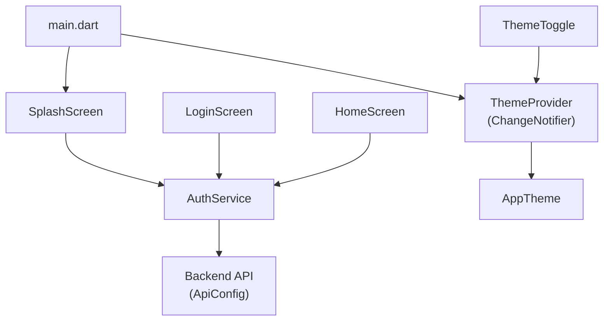
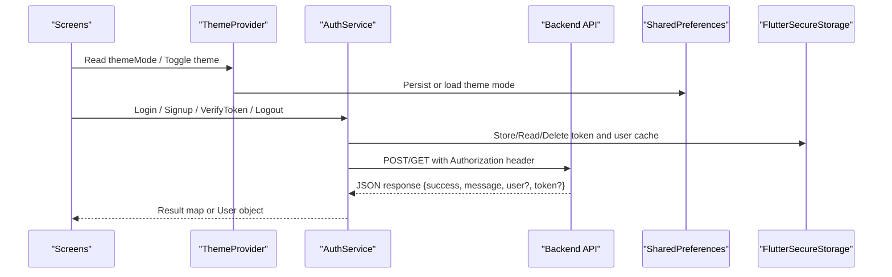
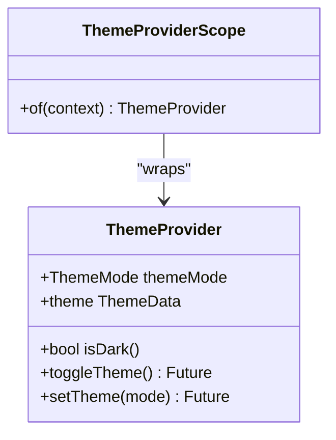
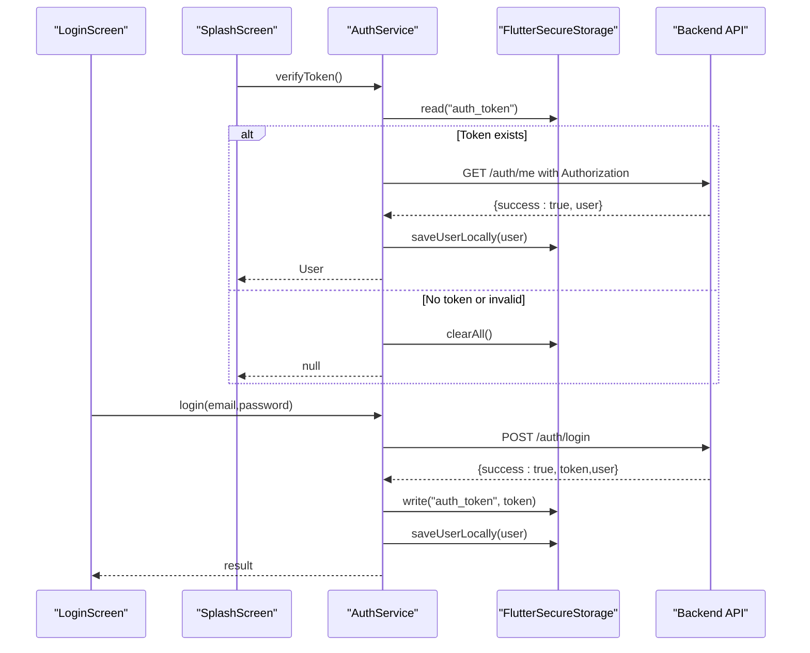
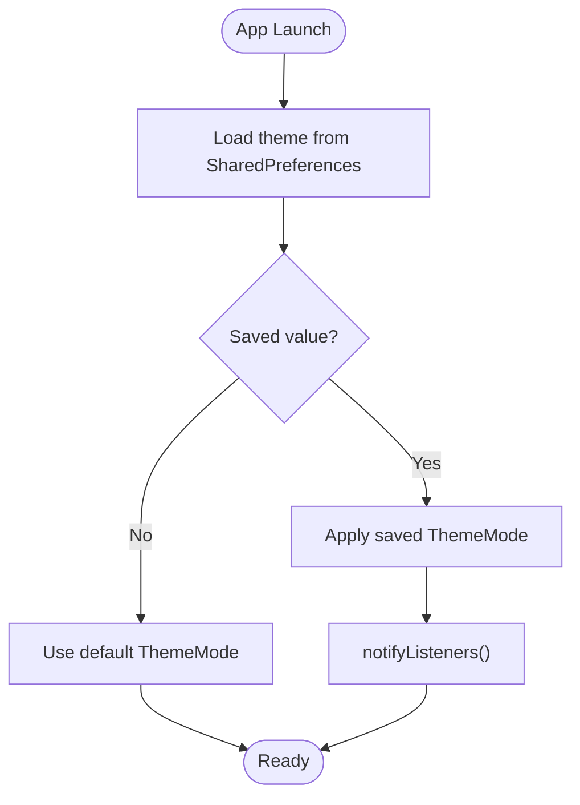
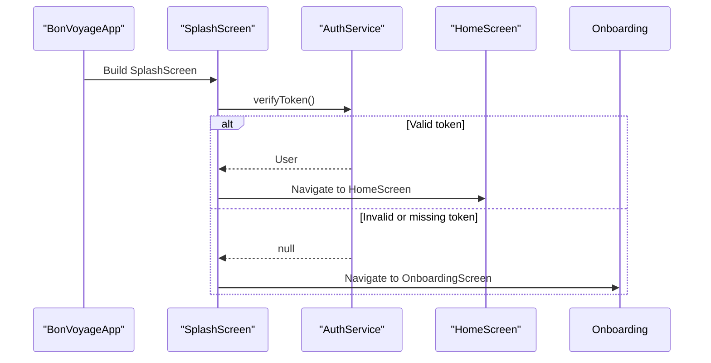
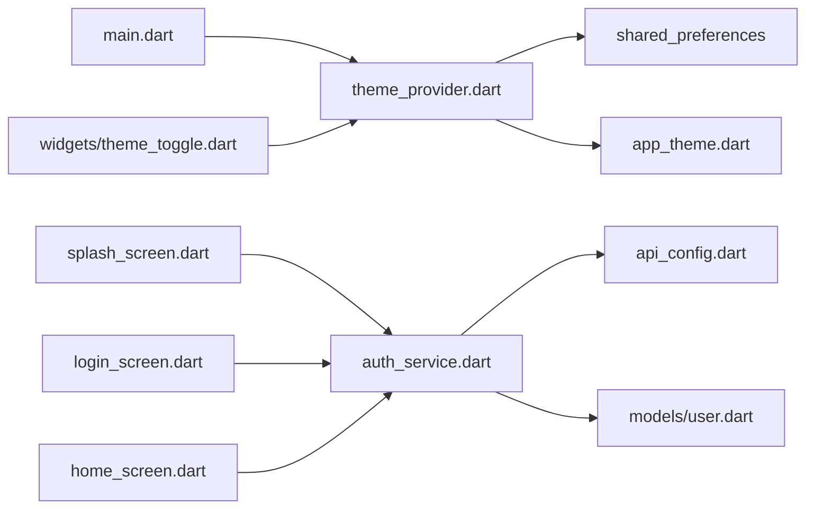

# State Management

<cite>
**Referenced Files in This Document**
- [main.dart](file://lib/main.dart)
- [theme_provider.dart](file://lib/theme/theme_provider.dart)
- [app_theme.dart](file://lib/theme/app_theme.dart)
- [auth_service.dart](file://lib/services/auth_service.dart)
- [splash_screen.dart](file://lib/screens/splash_screen.dart)
- [login_screen.dart](file://lib/screens/login_screen.dart)
- [home_screen.dart](file://lib/screens/home_screen.dart)
- [api_config.dart](file://lib/config/api_config.dart)
- [user.dart](file://lib/models/user.dart)
- [theme_toggle.dart](file://lib/widgets/theme_toggle.dart)
</cite>

## Table of Contents
1. Introduction
2. Project Structure
3. Core Components
4. Architecture Overview
5. Detailed Component Analysis
6. Dependency Analysis
7. Performance Considerations
8. Troubleshooting Guide
9. Conclusion

## Introduction
This document explains how the Bon Voyage Pakistan Flutter application manages state using ChangeNotifier and Provider-like patterns, with a focus on theme switching and user session management. It covers:
- Theme state persistence via shared_preferences
- Secure token handling via flutter_secure_storage
- Synchronization between frontend screens and backend services
- Practical examples for creating custom providers, managing asynchronous updates, and synchronizing state across multiple screens

## Project Structure
The app organizes state-related logic into focused layers:
- UI layer (screens and widgets) consumes theme and auth state
- Theme state is managed by a ChangeNotifier-based provider and persisted locally
- Authentication state and tokens are handled by a service that communicates with the backend and stores sensitive data securely
- Configuration centralizes API endpoints used by services

**Diagram sources**
- [main.dart:1-47](file://lib/main.dart#L1-L47)
- [theme_provider.dart:1-64](file://lib/theme/theme_provider.dart#L1-L64)
- [auth_service.dart:1-258](file://lib/services/auth_service.dart#L1-L258)
- [splash_screen.dart:1-200](file://lib/screens/splash_screen.dart#L1-L200)
- [login_screen.dart:1-444](file://lib/screens/login_screen.dart#L1-L444)
- [home_screen.dart:52-102](file://lib/screens/home_screen.dart#L52-L102)
- [api_config.dart:1-20](file://lib/config/api_config.dart#L1-L20)
- [theme_toggle.dart:1-53](file://lib/widgets/theme_toggle.dart#L1-L53)

**Section sources**
- [main.dart:1-47](file://lib/main.dart#L1-L47)
- [api_config.dart:1-20](file://lib/config/api_config.dart#L1-L20)

## Core Components
- ThemeProvider: A ChangeNotifier that holds the current theme mode, persists it to shared_preferences, and exposes methods to toggle or set themes. It also provides an InheritedNotifier scope for consuming theme state without external packages.
- AuthService: A static service that performs authentication API calls, validates tokens, and stores tokens and cached user info in flutter_secure_storage. It returns structured results to callers and handles timeouts and connection errors gracefully.
- Screens and Widgets: The splash screen checks authentication status on startup; login and home screens interact with AuthService; theme toggle widget triggers theme changes through ThemeProvider.

Key responsibilities:
- Theme state: light/dark mode selection and persistence
- Auth state: secure token storage, user profile caching, logout cleanup
- Backend sync: HTTP requests with timeouts and error mapping
- Cross-screen consistency: navigation decisions based on token validity

**Section sources**
- [theme_provider.dart:1-64](file://lib/theme/theme_provider.dart#L1-L64)
- [auth_service.dart:1-258](file://lib/services/auth_service.dart#L1-L258)
- [splash_screen.dart:1-200](file://lib/screens/splash_screen.dart#L1-L200)
- [login_screen.dart:1-444](file://lib/screens/login_screen.dart#L1-L444)
- [home_screen.dart:52-102](file://lib/screens/home_screen.dart#L52-L102)
- [theme_toggle.dart:1-53](file://lib/widgets/theme_toggle.dart#L1-L53)

## Architecture Overview
The app uses a layered approach:
- UI components consume state from providers or call services directly
- ThemeProvider encapsulates theme state and persistence
- AuthService encapsulates network calls and secure storage
- ApiConfig centralizes endpoint URLs
- User model maps backend JSON to typed objects

**Diagram sources**
- [theme_provider.dart:1-64](file://lib/theme/theme_provider.dart#L1-L64)
- [auth_service.dart:1-258](file://lib/services/auth_service.dart#L1-L258)
- [api_config.dart:1-20](file://lib/config/api_config.dart#L1-L20)

## Detailed Component Analysis

### Theme Management with ChangeNotifier and InheritedNotifier
- ThemeProvider extends ChangeNotifier and maintains the current ThemeMode. On construction, it loads the saved theme from shared_preferences and notifies listeners if a value exists.
- Methods:
  - toggleTheme: switches between light and dark, persists the choice, and notifies listeners
  - setTheme: sets a specific mode, persists it, and notifies listeners
  - theme getter: returns the active ThemeData based on current mode
- ThemeProviderScope wraps InheritedNotifier to expose ThemeProvider to descendants without external packages. Consumers can access the notifier via a static of method.

Practical usage pattern:
- Wrap MaterialApp with ThemeProviderScope and pass the ThemeProvider instance
- Use ListenableBuilder to rebuild UI when theme changes
- Provide a ThemeToggle widget that calls ThemeProvider.toggleTheme or setTheme

**Diagram sources**
- [theme_provider.dart:1-64](file://lib/theme/theme_provider.dart#L1-L64)

**Section sources**
- [theme_provider.dart:1-64](file://lib/theme/theme_provider.dart#L1-L64)
- [main.dart:1-47](file://lib/main.dart#L1-L47)
- [theme_toggle.dart:1-53](file://lib/widgets/theme_toggle.dart#L1-L53)

### Authentication Flow and Secure Token Handling
- AuthService performs signup and login by posting credentials to backend endpoints defined in ApiConfig. On success, it stores the JWT and cached user info in flutter_secure_storage.
- verifyToken reads the stored token and calls GET /auth/me to validate it. If valid, it caches user details; if invalid, it clears all local auth data.
- logout attempts a best-effort server-side logout and then clears local storage.
- All HTTP calls use a timeout to prevent indefinite hangs and return consistent error maps for UI handling.

**Diagram sources**
- [splash_screen.dart:1-200](file://lib/screens/splash_screen.dart#L1-L200)
- [login_screen.dart:1-444](file://lib/screens/login_screen.dart#L1-L444)
- [auth_service.dart:1-258](file://lib/services/auth_service.dart#L1-L258)
- [api_config.dart:1-20](file://lib/config/api_config.dart#L1-L20)

**Section sources**
- [auth_service.dart:1-258](file://lib/services/auth_service.dart#L1-L258)
- [splash_screen.dart:1-200](file://lib/screens/splash_screen.dart#L1-L200)
- [login_screen.dart:1-444](file://lib/screens/login_screen.dart#L1-L444)
- [api_config.dart:1-20](file://lib/config/api_config.dart#L1-L20)

### Local Storage Persistence for Theme
- ThemeProvider uses shared_preferences to persist the selected theme mode across app restarts.
- On initialization, it loads the saved mode and applies it immediately, ensuring consistent UI before user interaction.

**Diagram sources**
- [theme_provider.dart:1-64](file://lib/theme/theme_provider.dart#L1-L64)

**Section sources**
- [theme_provider.dart:1-64](file://lib/theme/theme_provider.dart#L1-L64)

### Asynchronous State Updates Across Screens
- Splash screen checks authentication status at startup and navigates to HomeScreen or OnboardingScreen accordingly.
- Login screen calls AuthService.login, updates loading/error state locally, and navigates on success.
- Home screen loads cached user name from secure storage to display personalized content without extra network calls.

**Diagram sources**
- [splash_screen.dart:1-200](file://lib/screens/splash_screen.dart#L1-L200)
- [auth_service.dart:1-258](file://lib/services/auth_service.dart#L1-L258)
- [home_screen.dart:52-102](file://lib/screens/home_screen.dart#L52-L102)

**Section sources**
- [splash_screen.dart:1-200](file://lib/screens/splash_screen.dart#L1-L200)
- [login_screen.dart:1-444](file://lib/screens/login_screen.dart#L1-L444)
- [home_screen.dart:52-102](file://lib/screens/home_screen.dart#L52-L102)

### Creating Custom Providers and Managing Async Updates
- To create a custom provider similar to ThemeProvider:
  - Extend ChangeNotifier and hold your state
  - Expose getters and async setters that update state and call notifyListeners
  - Persist critical values to shared_preferences or flutter_secure_storage as appropriate
  - Wrap your app or subtree with an InheritedNotifier-based scope to provide the notifier to descendants
- For async updates:
  - Perform network or storage operations inside async methods
  - Update state after successful operations and notify listeners
  - Handle errors and edge cases (timeouts, connectivity issues) and reflect them in UI via local state or returned results

**Section sources**
- [theme_provider.dart:1-64](file://lib/theme/theme_provider.dart#L1-L64)
- [auth_service.dart:1-258](file://lib/services/auth_service.dart#L1-L258)

## Dependency Analysis
- main.dart initializes the app and provides ThemeProviderScope around MaterialApp, enabling theme state consumption throughout the tree.
- ThemeProvider depends on shared_preferences for persistence and references AppTheme for theme definitions.
- AuthService depends on http for network calls, flutter_secure_storage for secure persistence, ApiConfig for endpoints, and User model for type-safe payloads.
- Screens depend on AuthService for auth flows and on ThemeProvider via ThemeProviderScope for theme state.

**Diagram sources**
- [main.dart:1-47](file://lib/main.dart#L1-L47)
- [theme_provider.dart:1-64](file://lib/theme/theme_provider.dart#L1-L64)
- [auth_service.dart:1-258](file://lib/services/auth_service.dart#L1-L258)
- [api_config.dart:1-20](file://lib/config/api_config.dart#L1-L20)
- [user.dart:1-29](file://lib/models/user.dart#L1-L29)
- [splash_screen.dart:1-200](file://lib/screens/splash_screen.dart#L1-L200)
- [login_screen.dart:1-444](file://lib/screens/login_screen.dart#L1-L444)
- [home_screen.dart:52-102](file://lib/screens/home_screen.dart#L52-L102)
- [theme_toggle.dart:1-53](file://lib/widgets/theme_toggle.dart#L1-L53)

**Section sources**
- [main.dart:1-47](file://lib/main.dart#L1-L47)
- [auth_service.dart:1-258](file://lib/services/auth_service.dart#L1-L258)
- [theme_provider.dart:1-64](file://lib/theme/theme_provider.dart#L1-L64)

## Performance Considerations
- Use timeouts on all HTTP requests to avoid blocking the UI indefinitely during network failures.
- Cache minimal user data locally to reduce repeated network calls for display purposes.
- Persist only necessary configuration (e.g., theme mode) to shared_preferences to minimize IO overhead.
- Avoid unnecessary rebuilds by scoping ListenableBuilder or InheritedNotifier consumers to subtrees where they are needed.

[No sources needed since this section provides general guidance]

## Troubleshooting Guide
Common issues and resolutions:
- Network timeouts: Ensure the backend is reachable and the base URL in ApiConfig matches your environment (e.g., emulator vs physical device).
- Connection errors: Verify Wi-Fi/network connectivity and firewall settings; confirm the backend service is running.
- Invalid or expired tokens: verifyToken will clear local auth data; re-authenticate to obtain a new token.
- Theme not persisting: Confirm shared_preferences writes succeed and that the app rebuilds via notifyListeners when toggling themes.

**Section sources**
- [auth_service.dart:105-160](file://lib/services/auth_service.dart#L105-L160)
- [auth_service.dart:168-202](file://lib/services/auth_service.dart#L168-L202)
- [auth_service.dart:204-226](file://lib/services/auth_service.dart#L204-L226)
- [theme_provider.dart:19-44](file://lib/theme/theme_provider.dart#L19-L44)

## Conclusion
The Bon Voyage Pakistan app employs a clean separation of concerns for state management:
- Theme state is managed via a ChangeNotifier-based provider with persistent storage and scoped distribution
- Authentication state and tokens are handled by a dedicated service with secure storage and robust error handling
- Screens coordinate with these components to synchronize UI state with backend services and local storage
This approach ensures predictable state transitions, resilient network interactions, and a smooth user experience across theme changes and authentication flows.

[No sources needed since this section summarizes without analyzing specific files]