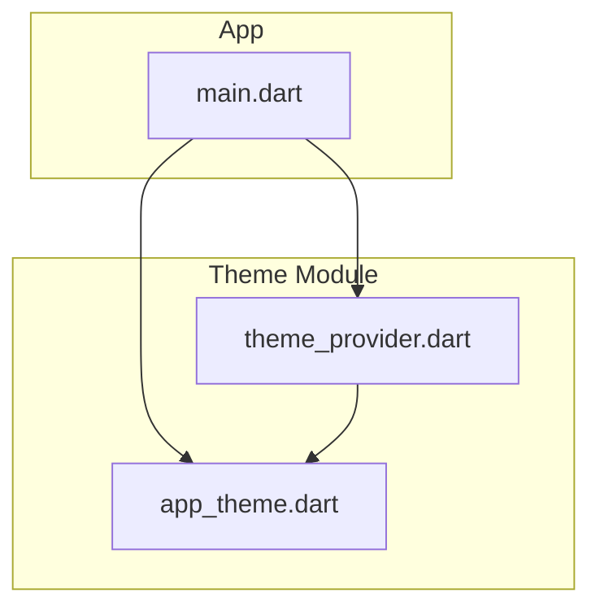
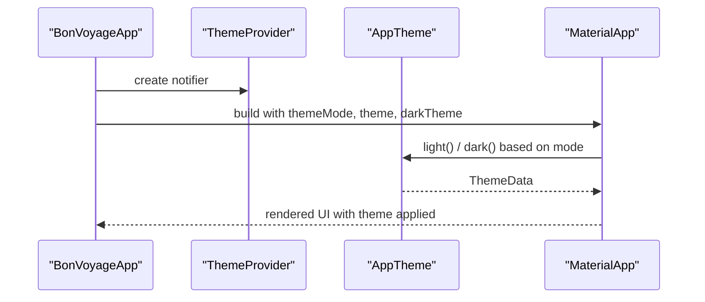
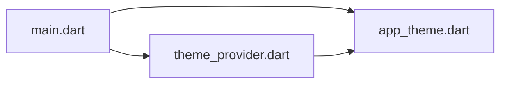

# Theme Configuration

<cite>
**Referenced Files in This Document**
- [app_theme.dart](file://lib/theme/app_theme.dart)
- [theme_provider.dart](file://lib/theme/theme_provider.dart)
- [main.dart](file://lib/main.dart)
- [pubspec.yaml](file://pubspec.yaml)
</cite>

## Table of Contents
1. [Introduction](#introduction)
2. [Project Structure](#project-structure)
3. [Core Components](#core-components)
4. [Architecture Overview](#architecture-overview)
5. [Detailed Component Analysis](#detailed-component-analysis)
6. [Dependency Analysis](#dependency-analysis)
7. [Performance Considerations](#performance-considerations)
8. [Troubleshooting Guide](#troubleshooting-guide)
9. [Conclusion](#conclusion)
10. [Appendices](#appendices)

## Introduction
This document explains the AppTheme configuration used by Bon Voyage Pakistan. It covers the centralized color palette with an olive-green primary accent, complementary secondary colors, and error/success indicators. It also documents light and dark mode schemes (backgrounds, surfaces, text), the typography system using PlusJakartaSans and PlayfairDisplay, and Material 3 theme configuration for buttons, input decorations, and app bars. Finally, it provides guidance on extending or modifying the theme while maintaining design consistency.

## Project Structure
The theme is implemented as a dedicated module under lib/theme with two core files:
- A static theme definition that centralizes colors, typography, and component themes.
- A provider that manages light/dark mode selection and persistence.

**Diagram sources**
- [main.dart:28-39](file://lib/main.dart#L28-L39)
- [theme_provider.dart:6-48](file://lib/theme/theme_provider.dart#L6-L48)
- [app_theme.dart:44-133](file://lib/theme/app_theme.dart#L44-L133)

**Section sources**
- [main.dart:1-47](file://lib/main.dart#L1-L47)
- [theme_provider.dart:1-64](file://lib/theme/theme_provider.dart#L1-L64)
- [app_theme.dart:1-367](file://lib/theme/app_theme.dart#L1-L367)

## Core Components
- AppTheme: Centralized Material 3 theme builder providing color scheme, typography, button themes, input decoration theme, and app bar styling for both light and dark modes.
- ThemeProvider: Manages current theme mode (light/dark), persists user choice, and exposes the active ThemeData to the app.

Key responsibilities:
- Define a consistent color palette centered around an olive-green primary accent.
- Provide cohesive light and dark backgrounds, surfaces, and text colors.
- Configure Material 3 components consistently across the app.
- Persist and switch theme mode at runtime.

**Section sources**
- [app_theme.dart:10-46](file://lib/theme/app_theme.dart#L10-L46)
- [theme_provider.dart:6-48](file://lib/theme/theme_provider.dart#L6-L48)

## Architecture Overview
At runtime, the app initializes with a ThemeProviderScope wrapping MaterialApp. The provider supplies the current themeMode and the corresponding ThemeData from AppTheme.light() or AppTheme.dark(). Screens consume these values via standard Material APIs or directly reference AppTheme constants when needed.

**Diagram sources**
- [main.dart:28-39](file://lib/main.dart#L28-L39)
- [app_theme.dart:44-133](file://lib/theme/app_theme.dart#L44-L133)
- [theme_provider.dart:6-48](file://lib/theme/theme_provider.dart#L6-L48)

## Detailed Component Analysis

### Color Palette and Modes
- Primary accent: Olive green (#5A7328) with a lighter on-primary for contrast.
- Secondary accents: Warm complementary tones for highlights and containers.
- Error and success: Distinct, accessible colors for feedback states.
- Light mode: Soft background, white surface, subtle variant surface; high-contrast text.
- Dark mode: Deep backgrounds, elevated surfaces, muted variant surfaces; readable text.

These are defined as static constants and composed into a Material 3 ColorScheme, ensuring consistent usage across components.

Best practices:
- Use semantic tokens (primary, secondary, surface, error, success) rather than hard-coded hex values in widgets.
- Keep contrast ratios accessible by pairing on-surface variants with appropriate backgrounds.

**Section sources**
- [app_theme.dart:10-41](file://lib/theme/app_theme.dart#L10-L41)
- [app_theme.dart:62-95](file://lib/theme/app_theme.dart#L62-L95)

### Typography System
- Default font family: PlusJakartaSans for body and UI text.
- Display/Headline accents: PlayfairDisplay for headlines to add elegance.
- Weights and sizes:
  - Display styles: bold, large sizes, tight letter spacing.
  - Headlines: bold, medium-large sizes, PlayfairDisplay.
  - Titles: semi-bold, medium sizes.
  - Body: regular weights with comfortable line heights.
  - Labels: medium weights for small labels.
- Colors adapt per brightness to maintain readability.

Usage guidance:
- Prefer TextTheme styles (displayLarge, headlineMedium, bodyLarge, etc.) over ad-hoc TextStyle definitions.
- Reserve PlayfairDisplay for prominent headings; use PlusJakartaSans for general content.

**Section sources**
- [app_theme.dart:97-235](file://lib/theme/app_theme.dart#L97-L235)

### Material 3 Theme Configuration
- Buttons:
  - ElevatedButton: Olive-green background, white foreground, rounded shape, full-width minimum size, strong emphasis.
  - TextButton: Olive-green text for secondary actions.
- Input Decoration:
  - Filled inputs with rounded corners.
  - Focus state uses primary accent border.
  - Error states use error color borders.
  - Consistent padding and label/hint styles.
- App Bar:
  - Transparent background, no elevation, centered title.
  - Title and icons use on-background color for visibility.

Extensibility tips:
- Add new component themes (e.g., OutlinedButton, Chip) following the same pattern.
- Keep visual tokens (colors, radii, elevations) centralized in AppTheme.

**Section sources**
- [app_theme.dart:101-132](file://lib/theme/app_theme.dart#L101-L132)
- [app_theme.dart:237-366](file://lib/theme/app_theme.dart#L237-L366)

### Theme Provider and Persistence
- ThemeProvider holds the current ThemeMode and persists it using shared preferences.
- Exposes methods to toggle or set theme mode and returns the active ThemeData.
- ThemeProviderScope wraps the app to provide theme access throughout the widget tree.

Operational flow:
- On startup, load saved mode and notify listeners.
- When toggled, update mode, persist, and rebuild affected widgets.
- MaterialApp consumes themeMode and applies AppTheme accordingly.

**Section sources**
- [theme_provider.dart:6-48](file://lib/theme/theme_provider.dart#L6-L48)
- [main.dart:28-39](file://lib/main.dart#L28-L39)

### Integration Points and Usage Patterns
- Root setup: MaterialApp receives themeMode, theme, and darkTheme from ThemeProvider and AppTheme.
- Screens can:
  - Consume Theme.of(context) for component themes.
  - Reference AppTheme constants for brand-specific colors when necessary.
  - Use TextTheme styles for consistent typography.

Example references:
- Using AppTheme constants in screens for backgrounds, surfaces, and feedback colors.
- Leveraging ThemeProvider to switch modes dynamically.

**Section sources**
- [main.dart:28-39](file://lib/main.dart#L28-L39)
- [app_theme.dart:62-132](file://lib/theme/app_theme.dart#L62-L132)

## Dependency Analysis
The theme module has minimal external dependencies and clear internal cohesion:
- AppTheme depends only on Flutter Material APIs.
- ThemeProvider depends on shared_preferences for persistence and imports AppTheme.
- main.dart wires them together and configures MaterialApp.

**Diagram sources**
- [main.dart:28-39](file://lib/main.dart#L28-L39)
- [theme_provider.dart:1-48](file://lib/theme/theme_provider.dart#L1-L48)
- [app_theme.dart:1-133](file://lib/theme/app_theme.dart#L1-L133)

**Section sources**
- [pubspec.yaml:9-16](file://pubspec.yaml#L9-L16)
- [theme_provider.dart:1-48](file://lib/theme/theme_provider.dart#L1-L48)

## Performance Considerations
- Centralizing theme in AppTheme avoids repeated computations and ensures single-source-of-truth.
- ThemeProvider notifies listeners only on mode changes, minimizing unnecessary rebuilds.
- Using Material 3 tokens reduces custom style duplication and improves rendering consistency.
- Avoid heavy computations inside theme builders; keep them constant or memoized where possible.

[No sources needed since this section provides general guidance]

## Troubleshooting Guide
Common issues and resolutions:
- Fonts not loading:
  - Ensure fonts are declared in pubspec and properly referenced by name.
  - Verify fontFamily names match those used in AppTheme.
- Incorrect colors in dark/light modes:
  - Confirm brightness-aware selections in theme builder and that on-surface variants are used appropriately.
- Inconsistent input focus/error states:
  - Check that InputDecorationTheme borders are configured for focused and error states.
- Theme not persisting:
  - Validate SharedPreferences integration and ensure toggle/set methods call notifyListeners.

**Section sources**
- [app_theme.dart:97-235](file://lib/theme/app_theme.dart#L97-L235)
- [app_theme.dart:293-366](file://lib/theme/app_theme.dart#L293-L366)
- [theme_provider.dart:15-48](file://lib/theme/theme_provider.dart#L15-L48)

## Conclusion
The AppTheme implementation establishes a robust, accessible, and visually cohesive design system for Bon Voyage Pakistan. With a centralized color palette anchored by an olive-green primary accent, well-defined light and dark modes, a structured typography system, and consistent Material 3 component themes, developers can extend the UI confidently while preserving brand identity. The ThemeProvider adds practical runtime control and persistence, making the theme both flexible and user-friendly.

[No sources needed since this section summarizes without analyzing specific files]

## Appendices

### Extending or Modifying the Theme
Guidelines:
- Add new semantic colors in AppTheme and compose them into the ColorScheme if needed.
- Extend TextTheme with new styles or override existing ones to maintain hierarchy.
- Introduce new component themes (e.g., OutlinedButton, Card) following the established patterns.
- Update AppBarTheme or other global styles centrally to ensure consistency.

References:
- Centralized constants and theme builder structure.
- Button and input decoration theme patterns.

**Section sources**
- [app_theme.dart:10-46](file://lib/theme/app_theme.dart#L10-L46)
- [app_theme.dart:237-366](file://lib/theme/app_theme.dart#L237-L366)