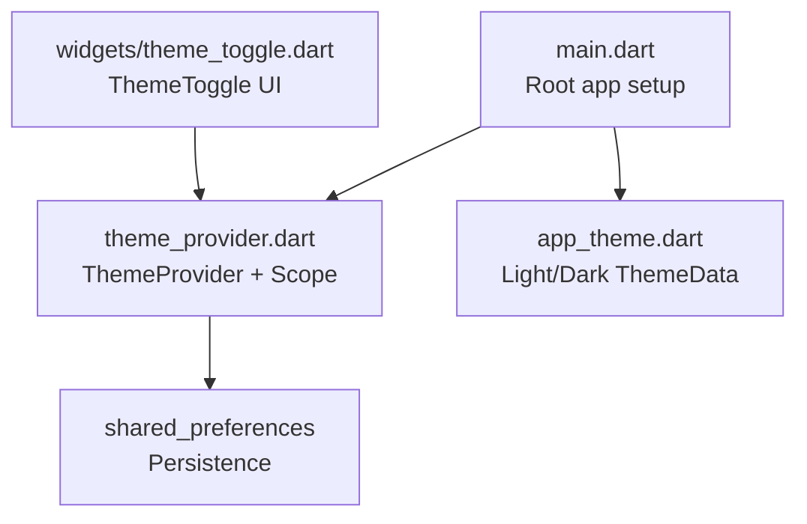
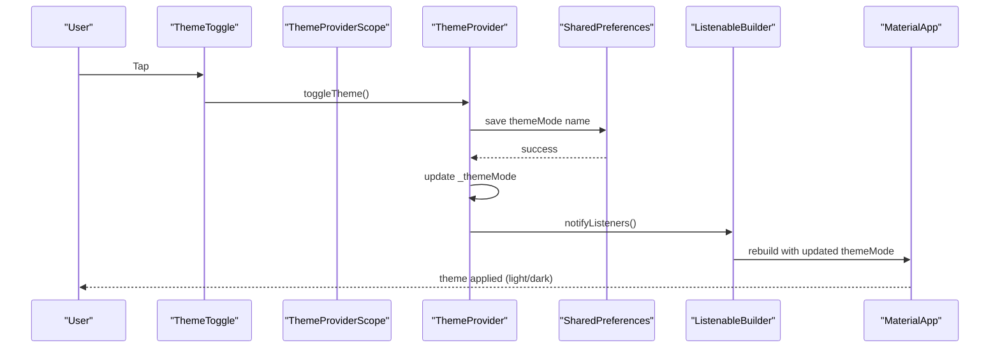
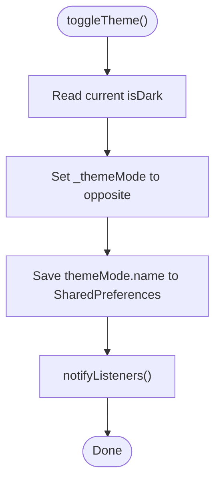
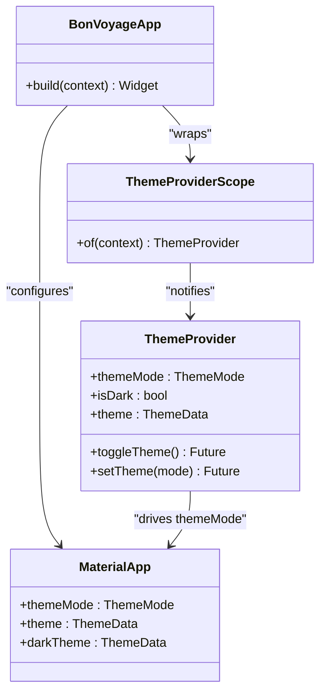
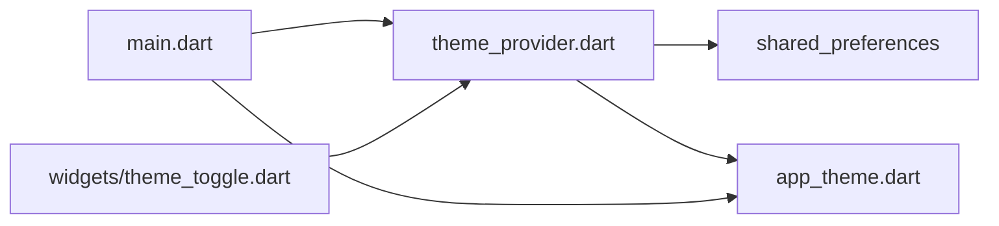

# Theme Provider State Management

<cite>
**Referenced Files in This Document**
- [main.dart](file://lib/main.dart)
- [theme_provider.dart](file://lib/theme/theme_provider.dart)
- [app_theme.dart](file://lib/theme/app_theme.dart)
- [theme_toggle.dart](file://lib/widgets/theme_toggle.dart)
- [pubspec.yaml](file://pubspec.yaml)
</cite>

## Table of Contents
1. [Introduction](#introduction)
2. [Project Structure](#project-structure)
3. [Core Components](#core-components)
4. [Architecture Overview](#architecture-overview)
5. [Detailed Component Analysis](#detailed-component-analysis)
6. [Dependency Analysis](#dependency-analysis)
7. [Performance Considerations](#performance-considerations)
8. [Troubleshooting Guide](#troubleshooting-guide)
9. [Conclusion](#conclusion)

## Introduction
This document explains the ThemeProvider implementation that manages light/dark theme state using Flutter’s ChangeNotifier pattern. It covers how theme changes propagate through the widget tree, how user preferences are persisted with shared_preferences, and how MaterialApp consumes the provider to apply themes. It also includes guidance on consuming the provider in widgets, accessing current theme data, building custom theme-aware components, and performance best practices.

## Project Structure
The theme system is organized into focused modules:
- Application entrypoint wires up the provider and MaterialApp theme configuration.
- Theme provider encapsulates state and persistence logic.
- App theme defines reusable light and dark ThemeData instances.
- A reusable toggle widget demonstrates UI interaction for theme switching.

**Diagram sources**
- [main.dart:1-47](file://lib/main.dart#L1-L47)
- [theme_provider.dart:1-63](file://lib/theme/theme_provider.dart#L1-L63)
- [app_theme.dart:1-367](file://lib/theme/app_theme.dart#L1-L367)
- [theme_toggle.dart:1-53](file://lib/widgets/theme_toggle.dart#L1-L53)

**Section sources**
- [main.dart:1-47](file://lib/main.dart#L1-L47)
- [pubspec.yaml:1-31](file://pubspec.yaml#L1-L31)

## Core Components
- ThemeProvider: A ChangeNotifier that holds the current ThemeMode, loads/saves it via shared_preferences, exposes getters for mode and convenience flags, and provides methods to toggle or set the theme. It also offers a getter that returns the active ThemeData based on the current mode.
- ThemeProviderScope: An InheritedNotifier wrapper around ThemeProvider that allows descendant widgets to access the provider via a static helper method.
- AppTheme: A centralized theme factory providing light() and dark() ThemeData configurations with consistent colors, typography, and component styles.
- ThemeToggle: A reusable UI component that visually represents the current theme and triggers toggling when tapped.

Key responsibilities:
- State management: Encapsulate theme mode and notify listeners on changes.
- Persistence: Save/restore theme preference across sessions.
- Integration: Provide ThemeData to MaterialApp and expose theme mode to the rest of the app.
- UI: Offer a simple toggle control for users to switch themes.

**Section sources**
- [theme_provider.dart:1-63](file://lib/theme/theme_provider.dart#L1-L63)
- [app_theme.dart:1-367](file://lib/theme/app_theme.dart#L1-L367)
- [theme_toggle.dart:1-53](file://lib/widgets/theme_toggle.dart#L1-L53)

## Architecture Overview
At runtime, the root app creates a ThemeProvider instance and wraps the application with ThemeProviderScope. The scope makes the provider available to all descendants. MaterialApp reads the provider’s themeMode to determine which theme to apply. When the theme changes, the provider notifies listeners; ListenableBuilder rebuilds the MaterialApp subtree with the new theme.

**Diagram sources**
- [theme_provider.dart:20-47](file://lib/theme/theme_provider.dart#L20-L47)
- [main.dart:23-44](file://lib/main.dart#L23-L44)
- [theme_toggle.dart:15-52](file://lib/widgets/theme_toggle.dart#L15-L52)

## Detailed Component Analysis

### ThemeProvider (State and Persistence)
- State: Holds an internal ThemeMode and exposes read-only accessors for themeMode and isDark.
- Initialization: Loads saved theme from shared_preferences and updates state if present.
- Mutation:
  - toggleTheme(): Switches between light and dark, persists the new mode, then notifies listeners.
  - setTheme(mode): Sets a specific mode if different from current, persists, then notifies listeners.
- Theme accessor: Returns ThemeData by delegating to AppTheme.light() or AppTheme.dark() based on current mode.

**Diagram sources**
- [theme_provider.dart:29-47](file://lib/theme/theme_provider.dart#L29-L47)

**Section sources**
- [theme_provider.dart:1-63](file://lib/theme/theme_provider.dart#L1-L63)

### ThemeProviderScope (Inherited Notifier)
- Wraps ThemeProvider as an InheritedNotifier so descendants can listen to changes efficiently.
- Provides a static helper to retrieve the provider from BuildContext.

Usage pattern:
- Wrap the app with ThemeProviderScope at the root.
- Access via ThemeProviderScope.of(context) where needed.

**Section sources**
- [theme_provider.dart:50-63](file://lib/theme/theme_provider.dart#L50-L63)

### AppTheme (Theme Data Factory)
- Centralizes color palette, typography, and component themes.
- Exposes light() and dark() factories that return fully configured ThemeData instances.
- Uses Material 3 and consistent styling for buttons, text fields, and app bars.

Integration points:
- ThemeProvider.theme delegates to AppTheme based on current mode.
- MaterialApp receives theme and darkTheme from the root app setup.

**Section sources**
- [app_theme.dart:1-367](file://lib/theme/app_theme.dart#L1-L367)

### ThemeToggle (UI Interaction)
- Displays a circular button with sun/moon icons that animate on theme change.
- Accepts isDark and an onToggle callback to trigger theme switching.
- Styled using AppTheme colors for consistency.

Consumption example concept:
- Place ThemeToggle in any screen.
- Wire onToggle to call ThemeProvider.toggleTheme().

**Section sources**
- [theme_toggle.dart:1-53](file://lib/widgets/theme_toggle.dart#L1-L53)

### Root Integration (main.dart)
- Creates a single ThemeProvider instance.
- Wraps the app with ThemeProviderScope to expose the provider.
- Uses ListenableBuilder to rebuild MaterialApp whenever the provider notifies.
- Configures MaterialApp with:
  - title and debug settings
  - themeMode bound to provider’s themeMode
  - theme and darkTheme sourced from AppTheme
  - home widget as child

**Diagram sources**
- [main.dart:16-44](file://lib/main.dart#L16-L44)
- [theme_provider.dart:6-48](file://lib/theme/theme_provider.dart#L6-L48)

**Section sources**
- [main.dart:1-47](file://lib/main.dart#L1-L47)

## Dependency Analysis
External dependencies and their roles:
- shared_preferences: Persists the selected theme mode string key across app sessions.
- flutter/material: Provides ChangeNotifier, InheritedNotifier, ListenableBuilder, and ThemeData.

**Diagram sources**
- [theme_provider.dart:1-63](file://lib/theme/theme_provider.dart#L1-L63)
- [main.dart:1-47](file://lib/main.dart#L1-L47)
- [app_theme.dart:1-367](file://lib/theme/app_theme.dart#L1-L367)
- [theme_toggle.dart:1-53](file://lib/widgets/theme_toggle.dart#L1-L53)
- [pubspec.yaml:9-16](file://pubspec.yaml#L9-L16)

**Section sources**
- [pubspec.yaml:9-16](file://pubspec.yaml#L9-L16)

## Performance Considerations
- Efficient rebuilds:
  - Use ListenableBuilder around MaterialApp to rebuild only when the provider notifies, minimizing unnecessary work.
  - Keep widget subtrees below the builder small and avoid heavy computations in build.
- Avoid redundant writes:
  - setTheme guards against no-op updates before persisting to shared_preferences.
- Minimize I/O frequency:
  - Persist once per theme change; avoid calling persistence inside tight loops or frequent rebuilds.
- Prefer scoped access:
  - Use ThemeProviderScope.of(context) to access the provider only where needed, reducing dependency chains.
- Reuse theme objects:
  - AppTheme factories produce ThemeData; consider caching if you extend this pattern to avoid recomputation.

[No sources needed since this section provides general guidance]

## Troubleshooting Guide
Common issues and resolutions:
- Theme does not persist after restart:
  - Ensure shared_preferences is initialized and the key used matches the one in ThemeProvider.
  - Verify that toggleTheme/setTheme completes before relying on the persisted value.
- Widgets not rebuilding on theme change:
  - Confirm the provider is wrapped with ThemeProviderScope and accessed via its of(context).
  - Ensure ListenableBuilder listens to the same provider instance used to mutate state.
- Incorrect theme applied:
  - Check that MaterialApp’s themeMode is bound to the provider’s themeMode and that theme/darkTheme are correctly assigned.
- Null or missing context errors:
  - Call ThemeProviderScope.of(context) only within a BuildContext that has the scope ancestor.

**Section sources**
- [theme_provider.dart:19-47](file://lib/theme/theme_provider.dart#L19-L47)
- [main.dart:23-44](file://lib/main.dart#L23-L44)

## Conclusion
The ThemeProvider implementation leverages Flutter’s ChangeNotifier and InheritedNotifier patterns to manage theme state efficiently. It integrates cleanly with MaterialApp via themeMode and provides robust persistence using shared_preferences. By centralizing theme definitions in AppTheme and exposing a simple UI toggle, the solution delivers a maintainable and performant theme system suitable for production apps.

[No sources needed since this section summarizes without analyzing specific files]