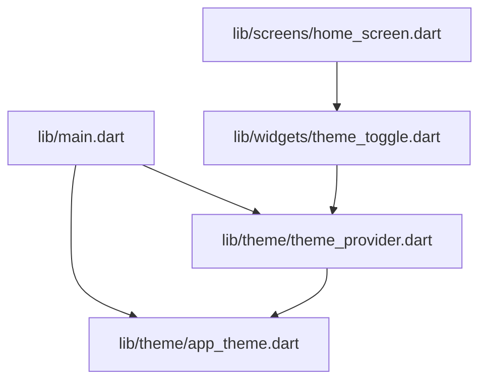
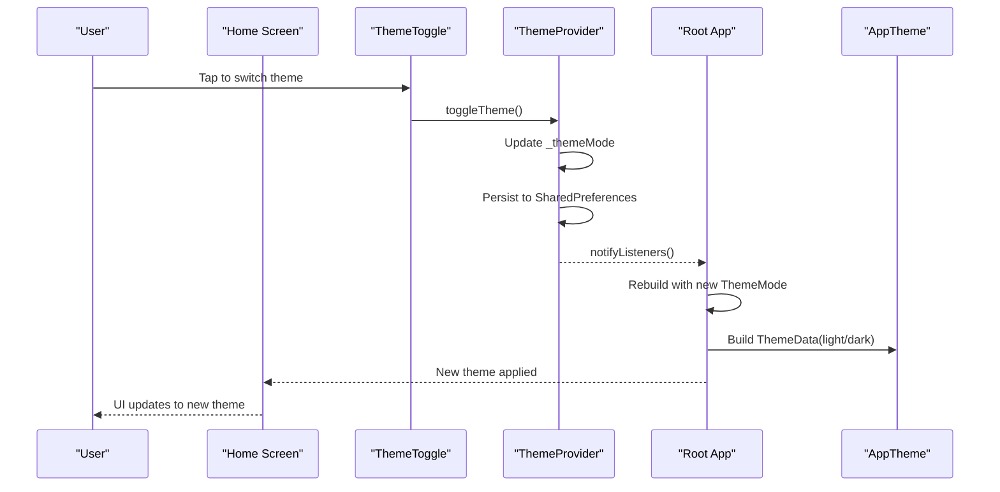
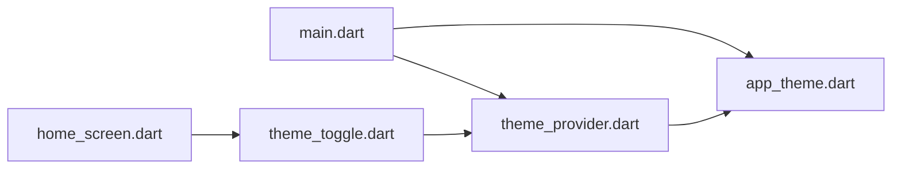

# Theme System

<cite>
**Referenced Files in This Document**
- [main.dart](file://lib/main.dart)
- [app_theme.dart](file://lib/theme/app_theme.dart)
- [theme_provider.dart](file://lib/theme/theme_provider.dart)
- [theme_toggle.dart](file://lib/widgets/theme_toggle.dart)
- [home_screen.dart](file://lib/screens/home_screen.dart)
- [pubspec.yaml](file://pubspec.yaml)
</cite>

## Table of Contents
1. [Introduction](#introduction)
2. [Project Structure](#project-structure)
3. [Core Components](#core-components)
4. [Architecture Overview](#architecture-overview)
5. [Detailed Component Analysis](#detailed-component-analysis)
6. [Dependency Analysis](#dependency-analysis)
7. [Performance Considerations](#performance-considerations)
8. [Troubleshooting Guide](#troubleshooting-guide)
9. [Conclusion](#conclusion)
10. [Appendices](#appendices)

## Introduction
This document explains the theme system implementation in Bon Voyage Pakistan. It covers the AppTheme class structure for light and dark modes, typography definitions, component styling, the ThemeProvider state management using ChangeNotifier, how theme changes propagate through the app, and the ThemeToggle widget that lets users switch between light and dark modes. It also includes guidance on creating custom themes, extending existing ones, and maintaining design consistency.

## Project Structure
The theme system is organized into dedicated modules:
- Theme definitions and color/typography/component styles live under lib/theme.
- State management for theme mode persistence and propagation lives under lib/theme as well.
- A reusable UI toggle for switching themes lives under lib/widgets.
- The root app wires everything together in lib/main.dart.
- Usage of the theme toggle appears in a screen (e.g., home_screen.dart).

**Diagram sources**
- [main.dart:1-47](file://lib/main.dart#L1-L47)
- [theme_provider.dart:1-64](file://lib/theme/theme_provider.dart#L1-L64)
- [app_theme.dart:1-367](file://lib/theme/app_theme.dart#L1-L367)
- [theme_toggle.dart:1-53](file://lib/widgets/theme_toggle.dart#L1-L53)
- [home_screen.dart:380-392](file://lib/screens/home_screen.dart#L380-L392)

**Section sources**
- [main.dart:1-47](file://lib/main.dart#L1-L47)
- [pubspec.yaml:1-31](file://pubspec.yaml#L1-L31)

## Core Components
- AppTheme: Centralized theme factory providing ThemeData for both light and dark modes, including color palette, typography, buttons, text fields, and app bar styling.
- ThemeProvider: ChangeNotifier-based state manager that tracks current ThemeMode, persists user preference via SharedPreferences, and exposes methods to toggle or set theme.
- ThemeProviderScope: Inherited notifier wrapper that exposes ThemeProvider to descendants with a convenient static accessor.
- ThemeToggle: Reusable button widget that visually indicates current mode and triggers theme toggling.

Key responsibilities:
- AppTheme defines consistent colors, fonts, and component styles across the app.
- ThemeProvider manages and persists the active theme mode and notifies listeners on change.
- ThemeProviderScope provides scoped access to the provider from any descendant widget.
- ThemeToggle offers an intuitive UI to switch modes and animates icon transitions.

**Section sources**
- [app_theme.dart:1-367](file://lib/theme/app_theme.dart#L1-L367)
- [theme_provider.dart:1-64](file://lib/theme/theme_provider.dart#L1-L64)
- [theme_toggle.dart:1-53](file://lib/widgets/theme_toggle.dart#L1-L53)

## Architecture Overview
At runtime, the root app initializes the theme provider and wraps the MaterialApp with a listener so that theme changes rebuild the app with the correct theme. Screens consume the theme via Material’s Theme.of(context) and can trigger theme changes through the provider.

**Diagram sources**
- [main.dart:23-44](file://lib/main.dart#L23-L44)
- [theme_provider.dart:29-47](file://lib/theme/theme_provider.dart#L29-L47)
- [theme_toggle.dart:15-51](file://lib/widgets/theme_toggle.dart#L15-L51)
- [home_screen.dart:380-392](file://lib/screens/home_screen.dart#L380-L392)

## Detailed Component Analysis

### AppTheme: Light and Dark Modes, Typography, and Component Styling
AppTheme centralizes the visual identity:
- Color palette: primary accent (olive-green), secondary accents, error/success colors, and distinct surface/background variants for light and dark modes.
- Theme entry points: light() and dark() return ThemeData configured for each brightness.
- Typography: Uses PlusJakartaSans as the base font family and PlayfairDisplay for certain headlines; defines display, headline, title, body, and label styles with appropriate weights, sizes, letter spacing, and line heights.
- Component themes:
  - ElevatedButtonThemeData: full-width rounded buttons with primary background and onPrimary text.
  - TextButtonThemeData: primary-colored text buttons with consistent typography.
  - InputDecorationTheme: filled input fields with rounded corners, focus/error states, and theme-aware fill and border colors.
  - AppBarTheme: transparent background, centered titles, and theme-aware icon/title colors.

Design notes:
- Brightness-aware selection ensures surfaces and text contrast are optimized per mode.
- Consistent corner radii and elevations create a cohesive look.
- Colors are chosen for accessibility and brand alignment.

Best practices:
- Use Theme.of(context).colorScheme and textTheme throughout the app instead of hard-coded colors or fonts.
- Extend or override specific components by wrapping with themed widgets when needed.

**Section sources**
- [app_theme.dart:10-47](file://lib/theme/app_theme.dart#L10-L47)
- [app_theme.dart:49-133](file://lib/theme/app_theme.dart#L49-L133)
- [app_theme.dart:136-235](file://lib/theme/app_theme.dart#L136-L235)
- [app_theme.dart:238-291](file://lib/theme/app_theme.dart#L238-L291)
- [app_theme.dart:294-367](file://lib/theme/app_theme.dart#L294-L367)

### ThemeProvider: State Management with ChangeNotifier
ThemeProvider manages the active theme mode:
- Stores current ThemeMode and exposes getters for themeMode and isDark.
- Persists the selected mode using SharedPreferences under a stable key.
- Provides toggleTheme() to flip between light and dark and setTheme(mode) to explicitly set a mode.
- Exposes a computed ThemeData getter that returns the appropriate theme based on current mode.
- Notifies listeners on every change to trigger UI rebuilds.

Integration:
- Initialized once at the root and wrapped with ThemeProviderScope to expose it to descendants.
- Used by screens to read current mode and trigger changes.

Reliability:
- Initialization loads previously saved preference before first render.
- Guarded setTheme avoids redundant writes and notifications when mode is unchanged.

**Section sources**
- [theme_provider.dart:5-48](file://lib/theme/theme_provider.dart#L5-L48)
- [theme_provider.dart:50-64](file://lib/theme/theme_provider.dart#L50-L64)

### ThemeProviderScope: Scoped Access to ThemeProvider
ThemeProviderScope extends InheritedNotifier to provide a clean API for descendants:
- Wraps a ThemeProvider instance and exposes it via a static of(context) method.
- Ensures type-safe access and asserts presence in context.

Usage pattern:
- Wrap MaterialApp with ThemeProviderScope at the root.
- Call ThemeProviderScope.of(context) anywhere below to access the provider.

**Section sources**
- [theme_provider.dart:50-64](file://lib/theme/theme_provider.dart#L50-L64)
- [main.dart:23-44](file://lib/main.dart#L23-L44)

### ThemeToggle: UI for Switching Themes
ThemeToggle is a lightweight, animated button:
- Displays sun/moon icons based on current mode.
- Applies theme-aware background, border, and shadow using AppTheme colors.
- Animates icon transitions with rotation and fade.
- Delegates action to an onToggle callback provided by the caller.

Integration example:
- In a settings row, the toggle calls ThemeProviderScope.of(context).toggleTheme() to switch modes.

Accessibility and UX:
- Clear visual feedback with smooth animations.
- High-contrast icon colors per mode.

**Section sources**
- [theme_toggle.dart:1-53](file://lib/widgets/theme_toggle.dart#L1-L53)
- [home_screen.dart:380-392](file://lib/screens/home_screen.dart#L380-L392)

### Root Integration: Wiring Everything Together
The root app:
- Creates a single ThemeProvider instance.
- Wraps the child with ThemeProviderScope.
- Listens to provider changes via ListenableBuilder to rebuild MaterialApp with updated themeMode, theme, and darkTheme.
- Uses AppTheme.light() and AppTheme.dark() for Material theme definitions.

This ensures all descendant widgets receive the latest theme automatically.

**Section sources**
- [main.dart:1-47](file://lib/main.dart#L1-L47)

## Dependency Analysis
High-level dependencies:
- main.dart depends on ThemeProviderScope, ThemeProvider, and AppTheme to configure the app.
- theme_provider.dart depends on shared_preferences for persistence and AppTheme for theme data.
- theme_toggle.dart depends on AppTheme for colors and icons.
- home_screen.dart consumes ThemeProviderScope to trigger theme changes and uses Material theme for styling.

**Diagram sources**
- [main.dart:1-47](file://lib/main.dart#L1-L47)
- [theme_provider.dart:1-64](file://lib/theme/theme_provider.dart#L1-L64)
- [app_theme.dart:1-367](file://lib/theme/app_theme.dart#L1-L367)
- [theme_toggle.dart:1-53](file://lib/widgets/theme_toggle.dart#L1-L53)
- [home_screen.dart:380-392](file://lib/screens/home_screen.dart#L380-L392)

**Section sources**
- [pubspec.yaml:9-16](file://pubspec.yaml#L9-L16)

## Performance Considerations
- Minimal rebuilds: Only widgets listening to ThemeProvider (via ListenableBuilder or InheritedNotifier) rebuild on theme changes.
- Efficient persistence: SharedPreferences writes occur only on mode changes.
- Avoid heavy computations inside theme builders: AppTheme constructs ThemeData once per mode; consider caching if you ever move logic elsewhere.
- Prefer theme tokens: Use Theme.of(context).colorScheme and textTheme to avoid redundant style calculations.

[No sources needed since this section provides general guidance]

## Troubleshooting Guide
Common issues and resolutions:
- Theme does not persist across app restarts:
  - Ensure SharedPreferences is initialized and the key matches what ThemeProvider expects.
  - Verify that toggleTheme/setTheme completes and notifyListeners is called.
- No theme change observed after tapping toggle:
  - Confirm that the root app listens to ThemeProvider changes (ListenableBuilder) and updates MaterialApp themeMode/theme/darkTheme.
  - Ensure ThemeProviderScope wraps the MaterialApp and that the call site has access to the scope.
- Incorrect colors/fonts in some screens:
  - Replace hard-coded colors/fonts with Theme.of(context) values.
  - Check that the screen reads brightness or colorScheme correctly.

**Section sources**
- [theme_provider.dart:19-47](file://lib/theme/theme_provider.dart#L19-L47)
- [main.dart:23-44](file://lib/main.dart#L23-L44)

## Conclusion
Bon Voyage Pakistan’s theme system is built around a clear separation of concerns:
- AppTheme defines a consistent, accessible visual language for light and dark modes.
- ThemeProvider manages and persists theme state with ChangeNotifier and SharedPreferences.
- ThemeProviderScope provides ergonomic access to the provider throughout the widget tree.
- ThemeToggle offers an intuitive, animated UI for users to switch modes.
Following the best practices outlined here will help maintain design consistency and scalability as the app grows.

[No sources needed since this section summarizes without analyzing specific files]

## Appendices

### How to Create a Custom Theme
- Define a new ThemeData builder similar to AppTheme._buildTheme, selecting colors and typography based on brightness.
- Expose entry points like customLight() and customDark().
- Integrate by setting MaterialApp’s theme and darkTheme to your custom builders or by swapping them at runtime via ThemeProvider.

Reference paths:
- [app_theme.dart:49-133](file://lib/theme/app_theme.dart#L49-L133)

### How to Extend Existing Themes
- Override specific component themes by wrapping content with themed widgets (e.g., ElevatedButtonTheme, InputDecorationTheme) while inheriting global styles.
- For typography overrides, use Theme.of(context).textTheme and adjust individual styles where necessary.

Reference paths:
- [app_theme.dart:136-235](file://lib/theme/app_theme.dart#L136-L235)
- [app_theme.dart:238-367](file://lib/theme/app_theme.dart#L238-L367)

### Best Practices for Design Consistency
- Centralize all colors, fonts, and spacings in theme definitions.
- Always read theme values from Theme.of(context) rather than hard-coding.
- Keep component themes minimal and composable; prefer overriding small parts instead of duplicating entire themes.
- Test both light and dark modes frequently to ensure contrast and readability.

[No sources needed since this section provides general guidance]