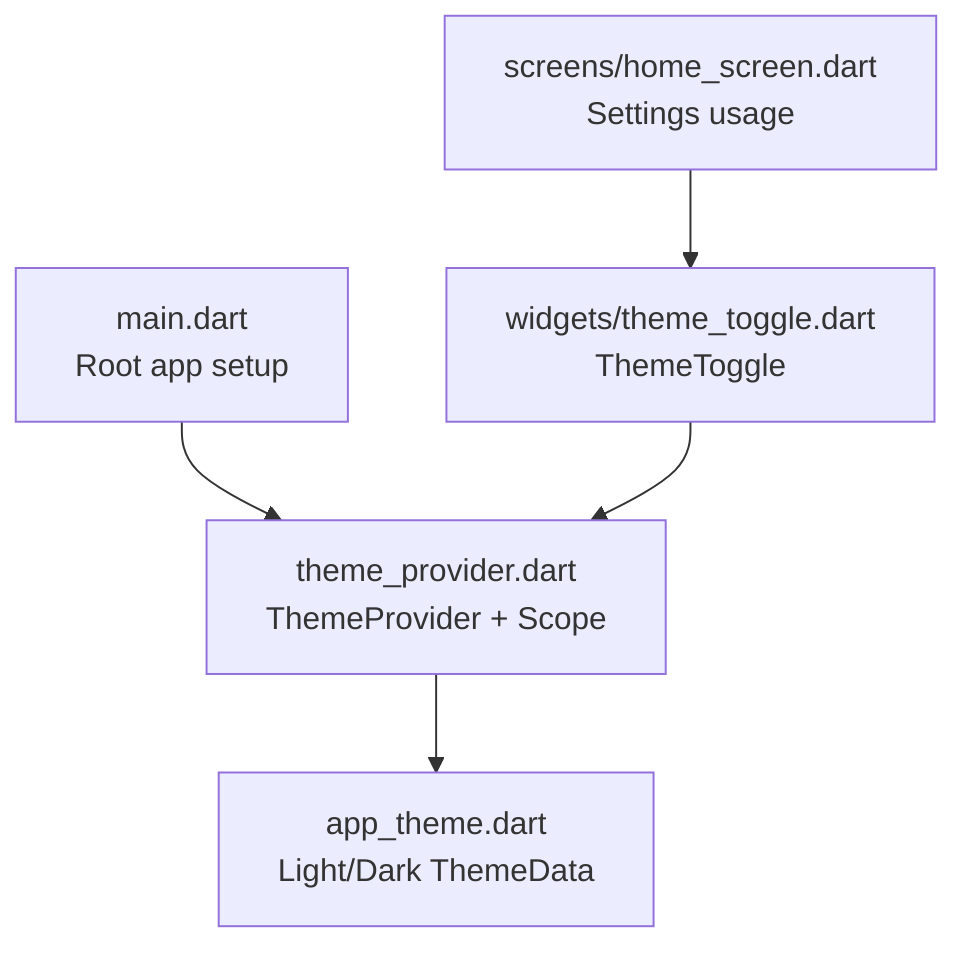
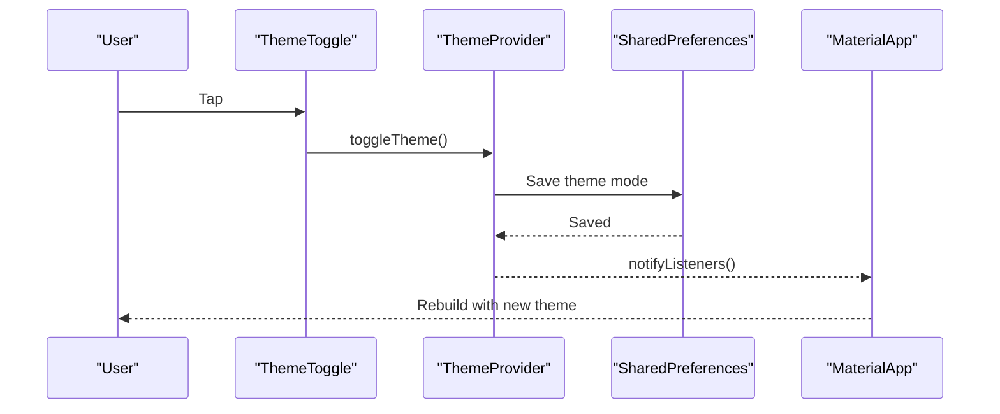
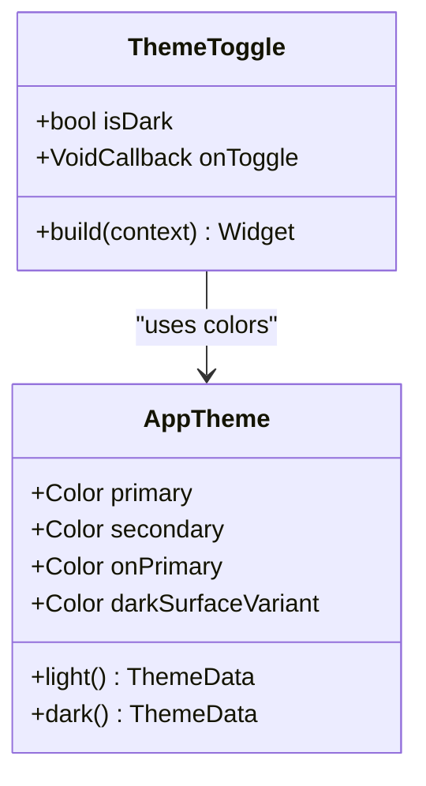
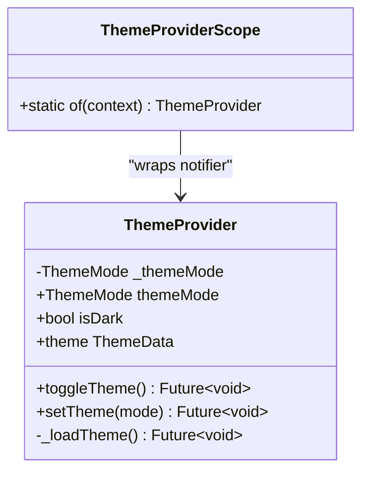
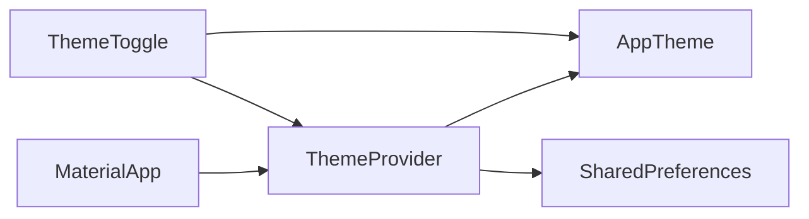

# Theme Toggle Widget

<cite>
**Referenced Files in This Document**
- [main.dart](file://lib/main.dart)
- [theme_provider.dart](file://lib/theme/theme_provider.dart)
- [app_theme.dart](file://lib/theme/app_theme.dart)
- [theme_toggle.dart](file://lib/widgets/theme_toggle.dart)
- [home_screen.dart](file://lib/screens/home_screen.dart)
</cite>

## Table of Contents
1. [Introduction](#introduction)
2. [Project Structure](#project-structure)
3. [Core Components](#core-components)
4. [Architecture Overview](#architecture-overview)
5. [Detailed Component Analysis](#detailed-component-analysis)
6. [Dependency Analysis](#dependency-analysis)
7. [Performance Considerations](#performance-considerations)
8. [Troubleshooting Guide](#troubleshooting-guide)
9. [Conclusion](#conclusion)
10. [Appendices](#appendices)

## Introduction
This document explains the ThemeToggle widget that allows users to switch between light and dark modes. It covers the UI implementation, visual indicators for the current theme state, smooth transition animations, integration with ThemeProvider to trigger theme changes and persist user preferences, customization options (icon selection, size adjustments, positioning), example placements (app bars, settings screens, floating action buttons), accessibility considerations, and guidance for extending the widget with additional theme options or custom styling.

## Project Structure
The theme system is implemented across a small set of focused files:
- Theme provider and scope manage theme mode and persistence
- App theme defines color palettes and Material 3 themes for light/dark
- ThemeToggle is a reusable toggle button widget
- The app root wires up the theme provider and MaterialApp theme configuration
- A usage example shows how to embed the toggle in a settings screen

**Diagram sources**
- [main.dart:12-46](file://lib/main.dart#L12-L46)
- [theme_provider.dart:5-63](file://lib/theme/theme_provider.dart#L5-L63)
- [app_theme.dart:44-132](file://lib/theme/app_theme.dart#L44-L132)
- [theme_toggle.dart:5-52](file://lib/widgets/theme_toggle.dart#L5-L52)
- [home_screen.dart:380-392](file://lib/screens/home_screen.dart#L380-L392)

**Section sources**
- [main.dart:12-46](file://lib/main.dart#L12-L46)
- [theme_provider.dart:5-63](file://lib/theme/theme_provider.dart#L5-L63)
- [app_theme.dart:44-132](file://lib/theme/app_theme.dart#L44-L132)
- [theme_toggle.dart:5-52](file://lib/widgets/theme_toggle.dart#L5-L52)
- [home_screen.dart:380-392](file://lib/screens/home_screen.dart#L380-L392)

## Core Components
- ThemeProvider: Holds current theme mode, persists it via shared preferences, and notifies listeners on change.
- ThemeProviderScope: Inherited notifier wrapper exposing ThemeProvider to descendants.
- AppTheme: Centralized color palette and Material 3 theme builders for light and dark modes.
- ThemeToggle: Reusable circular toggle button with animated sun/moon icons and themed background/border/shadow.

Key responsibilities:
- State management and persistence are handled by ThemeProvider.
- Visual theming is provided by AppTheme.
- User interaction and animation are encapsulated in ThemeToggle.

**Section sources**
- [theme_provider.dart:5-63](file://lib/theme/theme_provider.dart#L5-L63)
- [app_theme.dart:44-132](file://lib/theme/app_theme.dart#L44-L132)
- [theme_toggle.dart:5-52](file://lib/widgets/theme_toggle.dart#L5-L52)

## Architecture Overview
The runtime flow when a user toggles theme:
1. User taps ThemeToggle.
2. ThemeToggle calls onToggle, which invokes ThemeProvider.toggleTheme().
3. ThemeProvider updates internal theme mode, persists it to SharedPreferences, and notifies listeners.
4. List rebuilds the MaterialApp with updated themeMode, applying either light or dark theme from AppTheme.

**Diagram sources**
- [theme_toggle.dart:17-48](file://lib/widgets/theme_toggle.dart#L17-L48)
- [theme_provider.dart:29-44](file://lib/theme/theme_provider.dart#L29-L44)
- [main.dart:27-43](file://lib/main.dart#L27-L43)

## Detailed Component Analysis

### ThemeToggle Widget
- Purpose: Provide a compact, visually clear control to switch between light and dark themes.
- Inputs:
  - isDark: Boolean indicating current theme state.
  - onToggle: Callback invoked on tap to request theme change.
- Visual indicators:
  - Icon switches between sun and moon based on isDark.
  - Background color adapts to theme (semi-transparent surface).
  - Border and shadow use theme-aware colors for subtle depth.
- Animations:
  - AnimatedSwitcher transitions icon changes with combined rotation and fade over a short duration.
- Integration:
  - Typically placed inside app bar trailing, list tile trailing, or any container; wired to ThemeProvider via onToggle.

**Diagram sources**
- [theme_toggle.dart:5-52](file://lib/widgets/theme_toggle.dart#L5-L52)
- [app_theme.dart:10-46](file://lib/theme/app_theme.dart#L10-L46)

**Section sources**
- [theme_toggle.dart:5-52](file://lib/widgets/theme_toggle.dart#L5-L52)

### ThemeProvider and ThemeProviderScope
- ThemeProvider:
  - Maintains current ThemeMode and exposes isDark convenience getter.
  - Persists selection using a string key in SharedPreferences.
  - Provides toggleTheme() and setTheme(mode) to update and persist.
  - Exposes theme getter returning ThemeData based on current mode.
- ThemeProviderScope:
  - Wraps an InheritedNotifier to expose ThemeProvider to descendants.
  - Static helper to retrieve notifier from BuildContext.

**Diagram sources**
- [theme_provider.dart:5-63](file://lib/theme/theme_provider.dart#L5-L63)

**Section sources**
- [theme_provider.dart:5-63](file://lib/theme/theme_provider.dart#L5-L63)

### AppTheme
- Defines a cohesive color palette and Material 3 theme configurations for both brightnesses.
- Provides static methods to build ThemeData instances used by MaterialApp.

**Section sources**
- [app_theme.dart:44-132](file://lib/theme/app_theme.dart#L44-L132)

### Usage Example: Settings Screen
- Demonstrates embedding ThemeToggle in a settings row with a trailing indicator.
- Retrieves current theme state from context and triggers ThemeProvider.toggleTheme() on tap.

**Section sources**
- [home_screen.dart:380-392](file://lib/screens/home_screen.dart#L380-L392)

## Dependency Analysis
- ThemeToggle depends on AppTheme for colors and uses Material widgets for layout and animation.
- ThemeProvider depends on SharedPreferences for persistence and on AppTheme for theme data.
- Root app wires ThemeProvider into MaterialApp so theme changes propagate globally.

**Diagram sources**
- [theme_toggle.dart:1-52](file://lib/widgets/theme_toggle.dart#L1-L52)
- [theme_provider.dart:1-63](file://lib/theme/theme_provider.dart#L1-L63)
- [app_theme.dart:1-132](file://lib/theme/app_theme.dart#L1-L132)
- [main.dart:27-43](file://lib/main.dart#L27-L43)

**Section sources**
- [theme_toggle.dart:1-52](file://lib/widgets/theme_toggle.dart#L1-L52)
- [theme_provider.dart:1-63](file://lib/theme/theme_provider.dart#L1-L63)
- [app_theme.dart:1-132](file://lib/theme/app_theme.dart#L1-L132)
- [main.dart:27-43](file://lib/main.dart#L27-L43)

## Performance Considerations
- Animation efficiency: The toggle uses AnimatedSwitcher with RotationTransition and FadeTransition over a short duration, keeping reflows minimal.
- State updates: ThemeProvider.notifyListeners() triggers only necessary rebuilds; wrapping MaterialApp ensures efficient global theme updates.
- Persistence: SharedPreferences writes occur on each theme change; consider batching if multiple rapid toggles are expected.

[No sources needed since this section provides general guidance]

## Troubleshooting Guide
Common issues and resolutions:
- Theme does not persist after restart:
  - Ensure SharedPreferences is initialized before reading/writing and that keys match.
  - Verify that ThemeProvider._loadTheme runs at startup and calls notifyListeners when a saved value exists.
- Toggle has no effect:
  - Confirm that onToggle calls ThemeProvider.toggleTheme() or setTheme().
  - Ensure MaterialApp receives the correct themeMode from ThemeProvider.
- Icons or colors look incorrect:
  - Check that AppTheme constants are correctly referenced and that brightness matches current mode.
- Accessibility concerns:
  - Add semantic labels and ensure focus handling for keyboard navigation where applicable.

**Section sources**
- [theme_provider.dart:19-44](file://lib/theme/theme_provider.dart#L19-L44)
- [main.dart:27-43](file://lib/main.dart#L27-L43)
- [theme_toggle.dart:17-48](file://lib/widgets/theme_toggle.dart#L17-L48)

## Conclusion
The ThemeToggle widget offers a clean, animated interface for switching between light and dark modes. Integrated with ThemeProvider, it persists user preferences and applies Material 3 themes consistently across the app. With straightforward customization options and flexible placement, it can be embedded in various UI contexts while maintaining performance and accessibility best practices.

[No sources needed since this section summarizes without analyzing specific files]

## Appendices

### Embedding Examples
- App Bar:
  - Place ThemeToggle in the AppBar’s trailing slot to provide quick access to theme switching.
- Settings Screen:
  - Use a ListTile with ThemeToggle as trailing content, mirroring the pattern shown in the home screen settings area.
- Floating Action Button:
  - Wrap ThemeToggle in a FloatingActionButton to create a prominent, always-accessible toggle.

[No sources needed since this section provides conceptual guidance]

### Customization Options
- Icon selection:
  - Swap the icon set based on isDark to reflect different visual metaphors (e.g., sun/moon, eye/sun).
- Size adjustments:
  - Modify the container dimensions and icon size to fit different layouts.
- Positioning:
  - Use Row/Column alignment and padding to position the toggle within headers, sidebars, or drawers.
- Styling:
  - Adjust background opacity, border color, and shadow intensity to match your design system.

[No sources needed since this section provides conceptual guidance]

### Accessibility Considerations
- Labeling:
  - Provide a semantic label describing the current state (e.g., “Switch to light mode” or “Switch to dark mode”) for screen readers.
- Keyboard navigation:
  - Ensure the toggle is focusable and responds to Enter/Space activation.
- Contrast:
  - Verify sufficient contrast between icon and background in both light and dark modes.

[No sources needed since this section provides conceptual guidance]

### Extending with Additional Themes
- Expand ThemeProvider to support more than two modes (e.g., system, high contrast).
- Update AppTheme to include additional ThemeData variants.
- Extend ThemeToggle to cycle through available modes and display appropriate icons and labels.

[No sources needed since this section provides conceptual guidance]