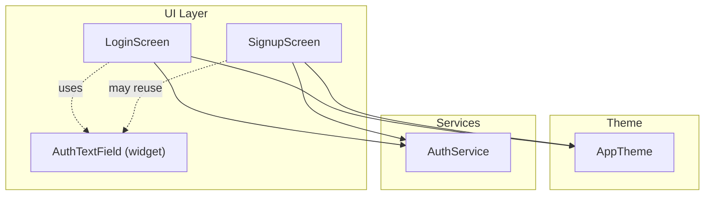
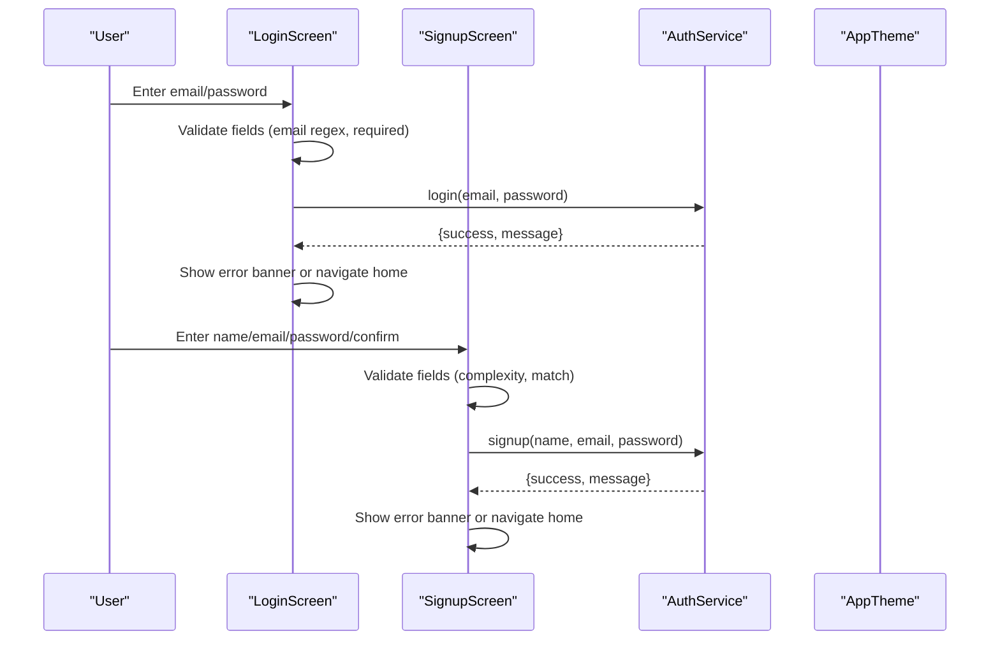
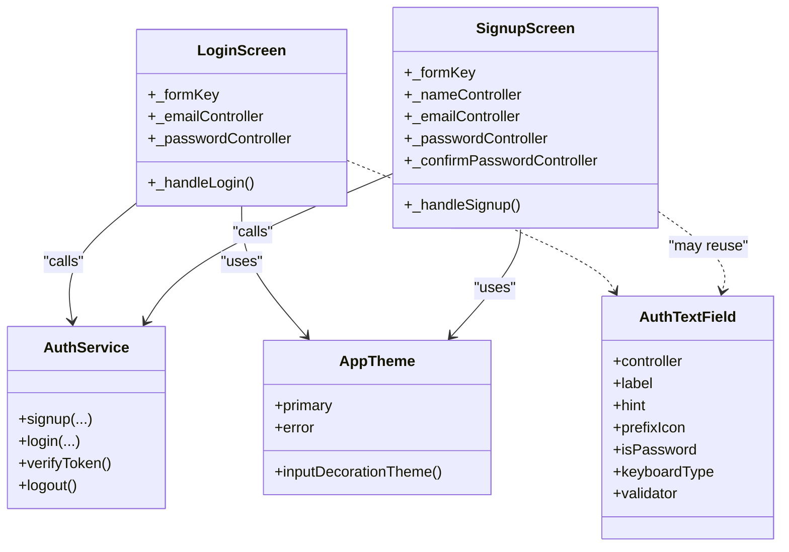

# Authentication Text Field Widget

<cite>
**Referenced Files in This Document**
- [auth_text_field.dart](file://lib/widgets/auth_text_field.dart)
- [login_screen.dart](file://lib/screens/login_screen.dart)
- [signup_screen.dart](file://lib/screens/signup_screen.dart)
- [app_theme.dart](file://lib/theme/app_theme.dart)
- [auth_service.dart](file://lib/services/auth_service.dart)
</cite>

## Table of Contents
1. [Introduction](#introduction)
2. [Project Structure](#project-structure)
3. [Core Components](#core-components)
4. [Architecture Overview](#architecture-overview)
5. [Detailed Component Analysis](#detailed-component-analysis)
6. [Dependency Analysis](#dependency-analysis)
7. [Performance Considerations](#performance-considerations)
8. [Troubleshooting Guide](#troubleshooting-guide)
9. [Conclusion](#conclusion)
10. [Appendices](#appendices)

## Introduction
This document provides detailed documentation for the Authentication Text Field widget designed specifically for login and registration forms. It explains how the widget handles authentication-specific inputs such as email validation, password masking, form state management, error handling, and styling. It also covers accessibility features like labeling, keyboard navigation, and screen reader compatibility, along with security considerations for sensitive input handling and best practices for form validation patterns.

## Project Structure
The authentication UI is implemented across dedicated screens that use either a reusable text field widget or inline text fields tailored to each screen’s needs. The theme system centralizes colors and input decoration styles used by these components.

**Diagram sources**
- [login_screen.dart:1-444](file://lib/screens/login_screen.dart#L1-L444)
- [signup_screen.dart:1-480](file://lib/screens/signup_screen.dart#L1-L480)
- [auth_text_field.dart:1-97](file://lib/widgets/auth_text_field.dart#L1-L97)
- [app_theme.dart:1-367](file://lib/theme/app_theme.dart#L1-L367)
- [auth_service.dart:1-258](file://lib/services/auth_service.dart#L1-L258)

**Section sources**
- [login_screen.dart:1-444](file://lib/screens/login_screen.dart#L1-L444)
- [signup_screen.dart:1-480](file://lib/screens/signup_screen.dart#L1-L480)
- [auth_text_field.dart:1-97](file://lib/widgets/auth_text_field.dart#L1-L97)
- [app_theme.dart:1-367](file://lib/theme/app_theme.dart#L1-L367)
- [auth_service.dart:1-258](file://lib/services/auth_service.dart#L1-L258)

## Core Components
- AuthTextField: A reusable, premium-styled text field for authentication screens. It supports password visibility toggling, validation, prefix icons, and consistent styling.
- LoginScreen and SignupScreen: Provide form state management, validation rules, focus handling, loading states, and error display. They integrate with AuthService for authentication flows.
- AppTheme: Centralizes color palette, typography, and input decoration themes used across authentication screens.

Key responsibilities:
- Input handling: Email and password inputs with appropriate keyboard types and masking.
- Validation: Inline validators for required fields, email format, and password complexity.
- Error handling: Form-level validation errors and backend error banners.
- Styling: Consistent borders, colors, and focus states aligned with the app theme.

**Section sources**
- [auth_text_field.dart:1-97](file://lib/widgets/auth_text_field.dart#L1-L97)
- [login_screen.dart:18-82](file://lib/screens/login_screen.dart#L18-L82)
- [signup_screen.dart:17-87](file://lib/screens/signup_screen.dart#L17-L87)
- [app_theme.dart:293-367](file://lib/theme/app_theme.dart#L293-L367)

## Architecture Overview
Authentication flows are driven by the screens, which validate user input locally before calling AuthService. On success, tokens and user data are stored securely; on failure, user-friendly messages are displayed.

**Diagram sources**
- [login_screen.dart:53-82](file://lib/screens/login_screen.dart#L53-L82)
- [signup_screen.dart:57-87](file://lib/screens/signup_screen.dart#L57-L87)
- [auth_service.dart:73-161](file://lib/services/auth_service.dart#L73-L161)

## Detailed Component Analysis

### AuthTextField Widget
A reusable StatefulWidget wrapping a TextFormField with:
- Password masking toggle via suffix icon
- Prefix icon support
- Customizable label, hint, keyboardType, and validator
- Rounded borders with green accent and filled background
- Focus and error border states

Properties:
- controller: TextEditingController for binding input
- label: String for labelText
- hint: String for hintText
- prefixIcon: IconData for visual cue
- isPassword: bool to enable masking and visibility toggle
- keyboardType: TextInputType for appropriate keyboard
- validator: Function for validation feedback

Behavior:
- Toggles obscureText based on internal state when isPassword is true
- Applies consistent styling and borders per design tokens
- Integrates with Form validation through validator callback

Accessibility:
- Uses labelText and hintText for semantic labels
- Suffix IconButton exposes visibility toggle action
- Keyboard navigation supported via standard Flutter input behavior

Security:
- Masks passwords by default and allows controlled visibility
- No logging or storage of raw input within the widget

Usage example references:
- See how similar fields are constructed in login and signup screens for integration patterns.

**Section sources**
- [auth_text_field.dart:7-97](file://lib/widgets/auth_text_field.dart#L7-L97)

### Login Screen Integration
Responsibilities:
- Manages form key, controllers, loading state, and error message
- Validates email using a regular expression and ensures password presence
- Unfocuses on submit, calls AuthService.login, and navigates or shows error banner
- Provides inline password visibility toggle and styled text fields

Validation and UX:
- Email regex validation and required checks
- Error banner displays backend messages
- Loading indicator during network requests

Focus and Accessibility:
- FocusScope unfocus on submit to dismiss keyboard
- Labels and hints provide context for screen readers

Integration points:
- Calls AuthService for authentication
- Uses AppTheme for colors and typography

**Section sources**
- [login_screen.dart:16-82](file://lib/screens/login_screen.dart#L16-L82)
- [login_screen.dart:214-237](file://lib/screens/login_screen.dart#L214-L237)
- [login_screen.dart:371-417](file://lib/screens/login_screen.dart#L371-L417)
- [login_screen.dart:419-441](file://lib/screens/login_screen.dart#L419-L441)

### Signup Screen Integration
Responsibilities:
- Manages multiple controllers and validation for name, email, password, and confirm password
- Enforces password complexity requirements and confirms matching passwords
- Displays dynamic password requirement indicators
- Calls AuthService.signup and handles results similarly to login

Validation and UX:
- Complex password rules enforced via validators
- Real-time updates to requirement indicators
- Error banner for backend responses

Focus and Accessibility:
- FocusScope unfocus on submit
- Clear labels and hints for all fields

Integration points:
- Calls AuthService for account creation
- Uses AppTheme for consistent styling

**Section sources**
- [signup_screen.dart:15-87](file://lib/screens/signup_screen.dart#L15-L87)
- [signup_screen.dart:210-266](file://lib/screens/signup_screen.dart#L210-L266)
- [signup_screen.dart:268-299](file://lib/screens/signup_screen.dart#L268-L299)
- [signup_screen.dart:370-419](file://lib/screens/signup_screen.dart#L370-L419)
- [signup_screen.dart:421-443](file://lib/screens/signup_screen.dart#L421-L443)

### Theme and Styling
AppTheme defines:
- Color palette including primary, secondary, error, success, and surface variants
- Typography scales and font families
- Input decoration theme with rounded borders, fill colors, and focus/error states

Impact on authentication fields:
- Ensures consistent appearance across login and signup screens
- Provides accessible contrast ratios and clear focus states

**Section sources**
- [app_theme.dart:7-46](file://lib/theme/app_theme.dart#L7-L46)
- [app_theme.dart:293-367](file://lib/theme/app_theme.dart#L293-L367)

## Dependency Analysis
The authentication flow depends on coordinated interactions between UI screens, optional reusable widgets, theme configuration, and the authentication service.

**Diagram sources**
- [auth_text_field.dart:7-97](file://lib/widgets/auth_text_field.dart#L7-L97)
- [login_screen.dart:16-82](file://lib/screens/login_screen.dart#L16-L82)
- [signup_screen.dart:15-87](file://lib/screens/signup_screen.dart#L15-L87)
- [auth_service.dart:73-258](file://lib/services/auth_service.dart#L73-L258)
- [app_theme.dart:7-46](file://lib/theme/app_theme.dart#L7-L46)

**Section sources**
- [auth_text_field.dart:7-97](file://lib/widgets/auth_text_field.dart#L7-L97)
- [login_screen.dart:16-82](file://lib/screens/login_screen.dart#L16-L82)
- [signup_screen.dart:15-87](file://lib/screens/signup_screen.dart#L15-L87)
- [auth_service.dart:73-258](file://lib/services/auth_service.dart#L73-L258)
- [app_theme.dart:7-46](file://lib/theme/app_theme.dart#L7-L46)

## Performance Considerations
- Avoid unnecessary rebuilds by keeping controllers and form keys stable across renders.
- Use focused and enabled borders sparingly; rely on theme defaults where possible.
- Debounce or throttle any expensive validation logic if added later.
- Ensure network timeouts are respected to prevent long-running UI blocks.

[No sources needed since this section provides general guidance]

## Troubleshooting Guide
Common issues and resolutions:
- Validation not triggering: Ensure the Form has a GlobalKey and call validate before submission.
- Email format errors: Verify the regex pattern matches expected formats and trim inputs before validation.
- Password visibility toggle not working: Confirm isPassword is set and the suffix icon handler updates state.
- Backend errors displayed: Check AuthService response structure and ensure error banners render correctly.
- Network timeouts: Review timeout settings in AuthService and verify backend connectivity.

Relevant implementation references:
- Form validation and submission in login and signup screens
- Error banner rendering and message propagation from AuthService

**Section sources**
- [login_screen.dart:53-82](file://lib/screens/login_screen.dart#L53-L82)
- [signup_screen.dart:57-87](file://lib/screens/signup_screen.dart#L57-L87)
- [auth_service.dart:232-256](file://lib/services/auth_service.dart#L232-L256)

## Conclusion
The Authentication Text Field widget and its integration into login and signup screens provide a robust foundation for secure, accessible, and visually consistent authentication experiences. By leveraging centralized theming, clear validation rules, and reliable error handling, developers can build scalable authentication flows that meet both usability and security standards.

[No sources needed since this section summarizes without analyzing specific files]

## Appendices

### Usage Examples
- Email field with validation:
  - Reference: [login_screen.dart:214-225](file://lib/screens/login_screen.dart#L214-L225), [signup_screen.dart:221-232](file://lib/screens/signup_screen.dart#L221-L232)
- Password field with masking and visibility toggle:
  - Reference: [login_screen.dart:227-237](file://lib/screens/login_screen.dart#L227-L237), [signup_screen.dart:234-251](file://lib/screens/signup_screen.dart#L234-L251)
- Confirm password with matching validation:
  - Reference: [signup_screen.dart:253-266](file://lib/screens/signup_screen.dart#L253-L266)
- Displaying error messages:
  - Reference: [login_screen.dart:254-257](file://lib/screens/login_screen.dart#L254-L257), [signup_screen.dart:300-303](file://lib/screens/signup_screen.dart#L300-L303)
- Managing focus states:
  - Reference: [login_screen.dart:57-61](file://lib/screens/login_screen.dart#L57-L61), [signup_screen.dart:61-65](file://lib/screens/signup_screen.dart#L61-L65)

### Accessibility Features
- Proper labeling via labelText and hintText for screen readers
- Keyboard navigation supported through standard input behaviors
- Visible focus states for clarity and orientation

**Section sources**
- [auth_text_field.dart:48-92](file://lib/widgets/auth_text_field.dart#L48-L92)
- [app_theme.dart:293-367](file://lib/theme/app_theme.dart#L293-L367)

### Security Considerations
- Password masking by default with controlled visibility toggle
- Secure token storage via FlutterSecureStorage in AuthService
- Timeouts and error handling to avoid hanging or exposing sensitive details
- No logging or persistence of raw passwords in UI components

**Section sources**
- [auth_text_field.dart:31-92](file://lib/widgets/auth_text_field.dart#L31-L92)
- [auth_service.dart:14-62](file://lib/services/auth_service.dart#L14-L62)
- [auth_service.dart:105-161](file://lib/services/auth_service.dart#L105-L161)