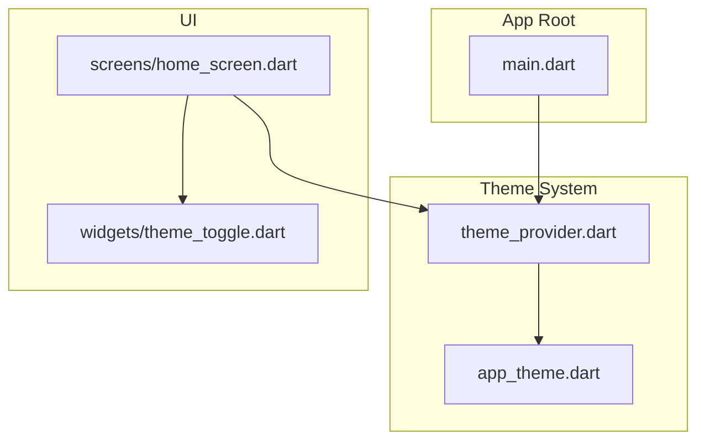
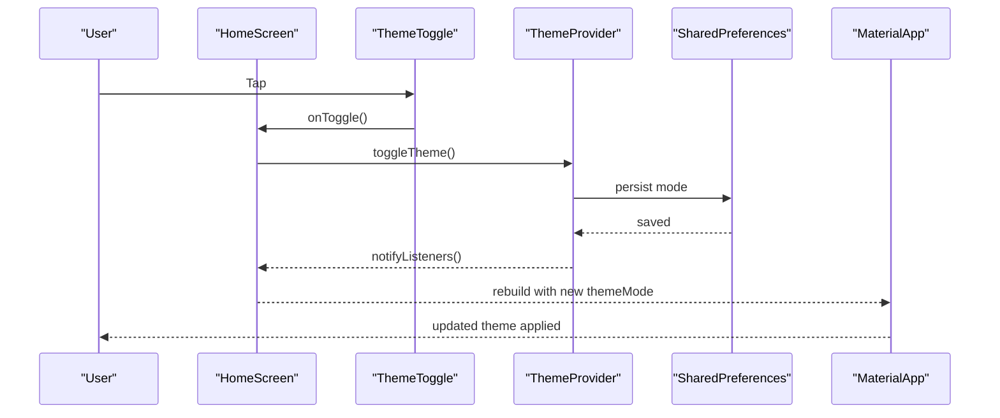
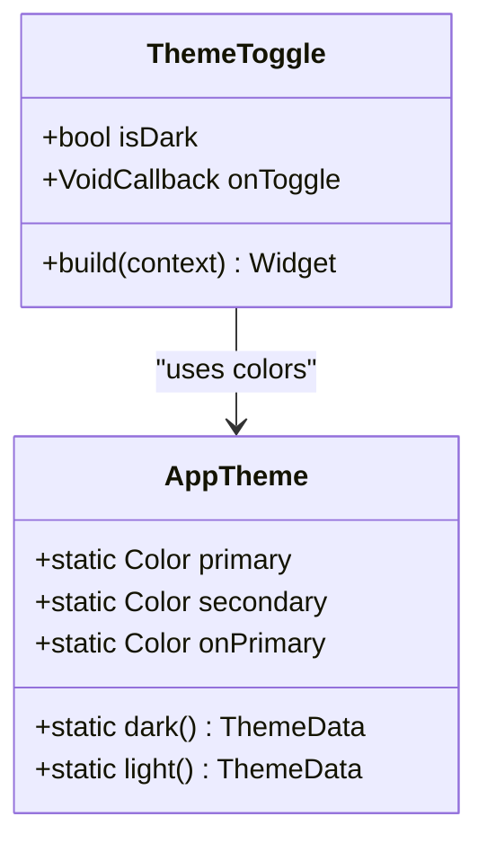
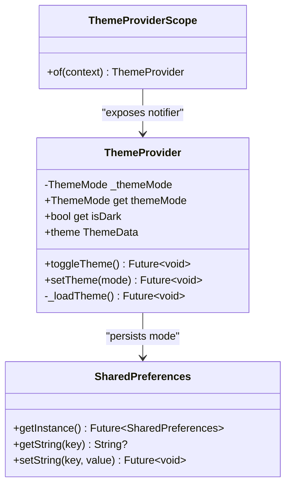
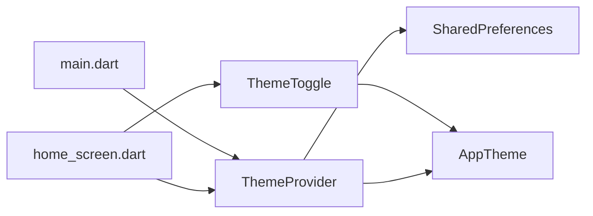

# Theme Toggle Widget

<cite>
**Referenced Files in This Document**
- [main.dart](file://lib/main.dart)
- [theme_provider.dart](file://lib/theme/theme_provider.dart)
- [app_theme.dart](file://lib/theme/app_theme.dart)
- [theme_toggle.dart](file://lib/widgets/theme_toggle.dart)
- [home_screen.dart](file://lib/screens/home_screen.dart)
</cite>

## Table of Contents
1. [Introduction](#introduction)
2. [Project Structure](#project-structure)
3. [Core Components](#core-components)
4. [Architecture Overview](#architecture-overview)
5. [Detailed Component Analysis](#detailed-component-analysis)
6. [Dependency Analysis](#dependency-analysis)
7. [Performance Considerations](#performance-considerations)
8. [Troubleshooting Guide](#troubleshooting-guide)
9. [Conclusion](#conclusion)

## Introduction
This document explains the Theme Toggle widget used in Bon Voyage Pakistan to let users switch between light and dark themes. It covers how the widget integrates with a theme provider system, how user preferences are persisted using shared_preferences, event handling for theme changes, usage examples, accessibility considerations, responsive behavior, and performance implications.

## Project Structure
The theme toggle feature spans three main areas:
- Theme state management and persistence via a ChangeNotifier-based provider
- A reusable UI toggle component
- Integration points in the app root and screens

**Diagram sources**
- [main.dart:1-47](file://lib/main.dart#L1-L47)
- [theme_provider.dart:1-63](file://lib/theme/theme_provider.dart#L1-L63)
- [app_theme.dart:1-367](file://lib/theme/app_theme.dart#L1-L367)
- [theme_toggle.dart:1-52](file://lib/widgets/theme_toggle.dart#L1-L52)
- [home_screen.dart:1-420](file://lib/screens/home_screen.dart#L1-L420)

**Section sources**
- [main.dart:1-47](file://lib/main.dart#L1-L47)
- [theme_provider.dart:1-63](file://lib/theme/theme_provider.dart#L1-L63)
- [app_theme.dart:1-367](file://lib/theme/app_theme.dart#L1-L367)
- [theme_toggle.dart:1-52](file://lib/widgets/theme_toggle.dart#L1-L52)
- [home_screen.dart:1-420](file://lib/screens/home_screen.dart#L1-L420)

## Core Components
- ThemeToggle (widget): A compact circular button that visually indicates current theme and triggers theme switching when tapped.
- ThemeProvider (ChangeNotifier): Holds the current ThemeMode, persists it to shared_preferences, and notifies listeners on change.
- AppTheme: Centralized color palette and ThemeData builders for light and dark modes.
- App integration: The root app wraps content with a provider scope and uses ListenableBuilder to react to theme changes. Screens consume the provider to trigger toggles.

Key responsibilities:
- ThemeToggle: UI only; receives isDark and an onToggle callback.
- ThemeProvider: State holder and persistence layer; exposes toggle/set methods and computed properties.
- AppTheme: Provides consistent colors and Material 3 theme configurations.
- Home screen: Demonstrates embedding the toggle within a settings menu and invoking provider actions.

**Section sources**
- [theme_toggle.dart:1-52](file://lib/widgets/theme_toggle.dart#L1-L52)
- [theme_provider.dart:1-63](file://lib/theme/theme_provider.dart#L1-L63)
- [app_theme.dart:1-367](file://lib/theme/app_theme.dart#L1-L367)
- [main.dart:1-47](file://lib/main.dart#L1-L47)
- [home_screen.dart:370-392](file://lib/screens/home_screen.dart#L370-L392)

## Architecture Overview
The theme system follows a unidirectional data flow:
- User taps ThemeToggle
- Screen calls ThemeProvider.toggleTheme()
- Provider updates internal ThemeMode, writes to shared_preferences, and notifies listeners
- Root rebuilds via ListenableBuilder and applies new themeMode to MaterialApp
- UI reflects the new theme across the app

**Diagram sources**
- [home_screen.dart:370-392](file://lib/screens/home_screen.dart#L370-L392)
- [theme_toggle.dart:15-51](file://lib/widgets/theme_toggle.dart#L15-L51)
- [theme_provider.dart:29-44](file://lib/theme/theme_provider.dart#L29-L44)
- [main.dart:27-44](file://lib/main.dart#L27-L44)

## Detailed Component Analysis

### ThemeToggle Widget
Purpose:
- Provide a small, accessible, animated control to switch between light and dark themes.

Properties:
- isDark: boolean indicating current theme mode.
- onToggle: callback invoked on tap to request a theme change.

Behavior:
- Wraps an icon inside a circular container with subtle background and border.
- Uses AnimatedSwitcher with rotation and fade transitions to animate icon changes.
- Icon selection switches between sun and dark mode icons based on isDark.
- Colors adapt to current theme using AppTheme constants.

Accessibility:
- The widget is a simple interactive element; ensure surrounding context provides semantic labels or semantics if needed by the host screen.

Responsive behavior:
- Fixed size (44x44) ensures consistent touch target across devices.

Usage example path:
- See how the home screen embeds the toggle in a settings row and wires up the callback.

**Section sources**
- [theme_toggle.dart:1-52](file://lib/widgets/theme_toggle.dart#L1-L52)
- [home_screen.dart:370-392](file://lib/screens/home_screen.dart#L370-L392)

#### Class Diagram

**Diagram sources**
- [theme_toggle.dart:1-52](file://lib/widgets/theme_toggle.dart#L1-L52)
- [app_theme.dart:1-367](file://lib/theme/app_theme.dart#L1-L367)

### ThemeProvider (State and Persistence)
Responsibilities:
- Maintain current ThemeMode.
- Persist preference to shared_preferences under a stable key.
- Notify listeners on change so the UI rebuilds.
- Expose helpers like isDark and theme getter.

Key methods:
- toggleTheme(): flips between light and dark, persists, then notifies.
- setTheme(mode): sets a specific mode, persists, then notifies.
- _loadTheme(): reads saved preference at startup and initializes state.

Integration:
- Wrapped in ThemeProviderScope (InheritedNotifier) to expose to descendants.
- Consumed by the root app via ListenableBuilder to apply themeMode to MaterialApp.

**Section sources**
- [theme_provider.dart:1-63](file://lib/theme/theme_provider.dart#L1-L63)
- [main.dart:23-44](file://lib/main.dart#L23-L44)

#### Class Diagram

**Diagram sources**
- [theme_provider.dart:1-63](file://lib/theme/theme_provider.dart#L1-L63)

### AppTheme (Design Tokens and Themes)
Provides:
- Centralized color palette for light and dark modes.
- ThemeData builders returning complete theme configurations for both modes.
- Consistent typography, buttons, and input decoration themes.

Usage:
- ThemeProvider selects light or dark ThemeData based on current mode.
- Widgets can reference AppTheme colors directly for custom styling.

**Section sources**
- [app_theme.dart:1-367](file://lib/theme/app_theme.dart#L1-L367)

### Integration Points
Root app:
- Creates a ThemeProvider instance.
- Wraps the app in ThemeProviderScope.
- Uses ListenableBuilder to listen to provider changes and update MaterialApp’s themeMode.

Screens:
- Home screen demonstrates embedding ThemeToggle in a settings row and calling provider.toggleTheme().

**Section sources**
- [main.dart:23-44](file://lib/main.dart#L23-L44)
- [home_screen.dart:370-392](file://lib/screens/home_screen.dart#L370-L392)

## Dependency Analysis
High-level dependencies:
- ThemeToggle depends on AppTheme for colors.
- ThemeProvider depends on shared_preferences for persistence and AppTheme for theme selection.
- Root app depends on ThemeProvider to drive MaterialApp theme.
- Screens depend on ThemeProvider to trigger theme changes and on ThemeToggle for UI.

**Diagram sources**
- [theme_toggle.dart:1-52](file://lib/widgets/theme_toggle.dart#L1-L52)
- [theme_provider.dart:1-63](file://lib/theme/theme_provider.dart#L1-L63)
- [app_theme.dart:1-367](file://lib/theme/app_theme.dart#L1-L367)
- [main.dart:23-44](file://lib/main.dart#L23-L44)
- [home_screen.dart:370-392](file://lib/screens/home_screen.dart#L370-L392)

**Section sources**
- [theme_toggle.dart:1-52](file://lib/widgets/theme_toggle.dart#L1-L52)
- [theme_provider.dart:1-63](file://lib/theme/theme_provider.dart#L1-L63)
- [app_theme.dart:1-367](file://lib/theme/app_theme.dart#L1-L367)
- [main.dart:23-44](file://lib/main.dart#L23-L44)
- [home_screen.dart:370-392](file://lib/screens/home_screen.dart#L370-L392)

## Performance Considerations
- Minimal rebuilds: Only widgets listening to the provider rebuild when theme changes. The root uses ListenableBuilder to limit scope.
- Efficient persistence: shared_preferences writes occur once per theme change. Avoid redundant writes by checking current mode before setting.
- Animation cost: AnimatedSwitcher adds smooth transitions; duration is short and typically negligible on modern devices.
- Memory footprint: ThemeProvider is lightweight; AppTheme is static and does not allocate per build.

Recommendations:
- Keep ThemeToggle stateless to avoid unnecessary rebuilds.
- Ensure provider is placed high enough in the tree to be accessible but not so broad as to cause excessive rebuilds.
- If adding more complex logic, consider debouncing rapid toggles to reduce I/O churn.

[No sources needed since this section provides general guidance]

## Troubleshooting Guide
Common issues and resolutions:
- Theme not applying:
  - Verify the root app wraps content with ThemeProviderScope and uses ListenableBuilder to update MaterialApp.themeMode.
  - Confirm provider.notifyListeners() is called after changing theme.
- Preference not persisting:
  - Ensure shared_preferences is initialized and write operations succeed.
  - Check that the same key is used consistently for reading and writing.
- UI not updating:
  - Make sure the screen calls provider.toggleTheme() from the correct context where ThemeProviderScope is available.
  - Confirm that the widget tree includes the provider scope above the screen.

Relevant code paths:
- Root setup and listener wiring
- Provider toggle and persistence
- Screen invocation of toggle

**Section sources**
- [main.dart:23-44](file://lib/main.dart#L23-L44)
- [theme_provider.dart:19-44](file://lib/theme/theme_provider.dart#L19-L44)
- [home_screen.dart:370-392](file://lib/screens/home_screen.dart#L370-L392)

## Conclusion
The Theme Toggle widget offers a clean, animated interface for switching between light and dark themes. It integrates seamlessly with a ChangeNotifier-based provider that persists user preferences using shared_preferences. The root app listens to provider changes to apply the selected theme globally. The design leverages centralized theme tokens for consistency and maintains good performance through targeted rebuilds and efficient persistence.

[No sources needed since this section summarizes without analyzing specific files]