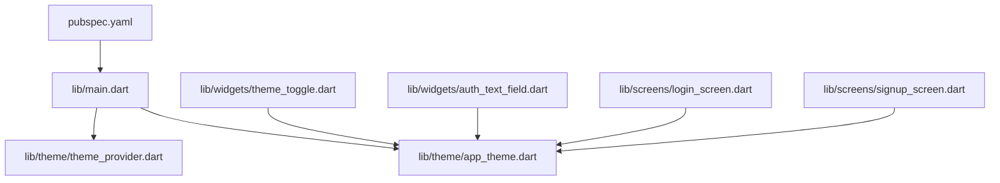
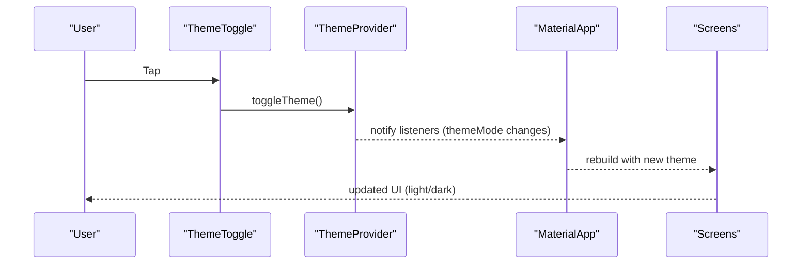
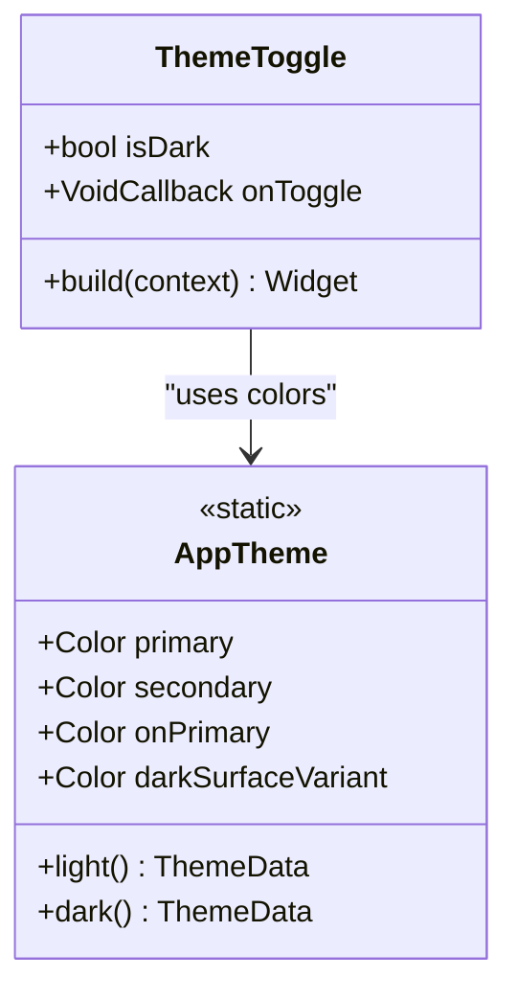
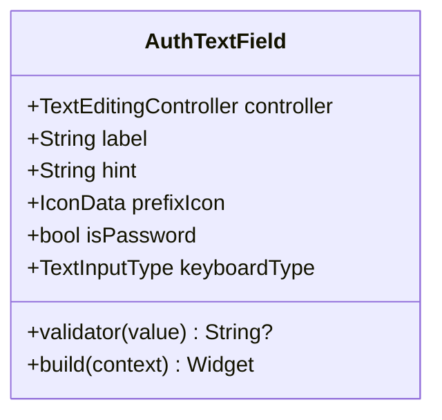
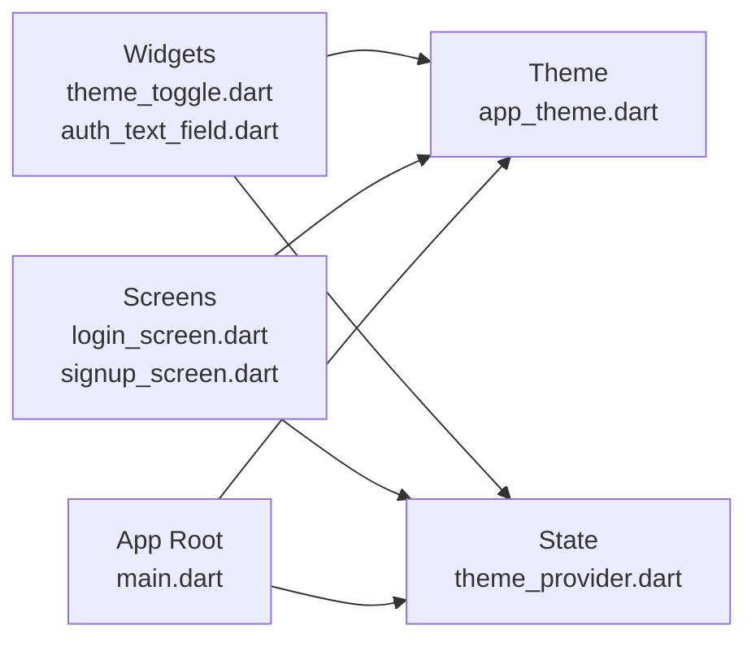

# Widget Library

<cite>
**Referenced Files in This Document**
- [main.dart](file://lib/main.dart)
- [app_theme.dart](file://lib/theme/app_theme.dart)
- [theme_provider.dart](file://lib/theme/theme_provider.dart)
- [theme_toggle.dart](file://lib/widgets/theme_toggle.dart)
- [auth_text_field.dart](file://lib/widgets/auth_text_field.dart)
- [login_screen.dart](file://lib/screens/login_screen.dart)
- [signup_screen.dart](file://lib/screens/signup_screen.dart)
- [pubspec.yaml](file://pubspec.yaml)
</cite>

## Table of Contents
1. [Introduction](#introduction)
2. [Project Structure](#project-structure)
3. [Core Components](#core-components)
4. [Architecture Overview](#architecture-overview)
5. [Detailed Component Analysis](#detailed-component-analysis)
6. [Dependency Analysis](#dependency-analysis)
7. [Performance Considerations](#performance-considerations)
8. [Troubleshooting Guide](#troubleshooting-guide)
9. [Conclusion](#conclusion)
10. [Appendices](#appendices)

## Introduction
This document describes the reusable widget library for Bon Voyage Pakistan, focusing on custom UI components and their integration patterns. It covers:
- Theme toggle and theme management
- Custom authentication text field
- Loading indicators used across screens
- Button styling via centralized theme
- Prop/attribute definitions, event handling, and customization options
- Accessibility considerations and responsive design patterns
- Usage examples showing how to integrate widgets into screens with consistent styling

The goal is to help developers reuse these components consistently while maintaining a premium cinematic identity with light/dark support.

## Project Structure
At a high level, the widget library lives under lib/widgets and lib/theme, with usage demonstrated in lib/screens. The app root initializes theme management and provides Material 3 theming globally.

**Diagram sources**
- [main.dart:1-47](file://lib/main.dart#L1-L47)
- [theme_provider.dart:1-64](file://lib/theme/theme_provider.dart#L1-L64)
- [app_theme.dart:1-367](file://lib/theme/app_theme.dart#L1-L367)
- [theme_toggle.dart:1-53](file://lib/widgets/theme_toggle.dart#L1-L53)
- [auth_text_field.dart:1-97](file://lib/widgets/auth_text_field.dart#L1-L97)
- [login_screen.dart:1-444](file://lib/screens/login_screen.dart#L1-L444)
- [signup_screen.dart:1-480](file://lib/screens/signup_screen.dart#L1-L480)
- [pubspec.yaml:1-31](file://pubspec.yaml#L1-L31)

**Section sources**
- [main.dart:1-47](file://lib/main.dart#L1-L47)
- [pubspec.yaml:1-31](file://pubspec.yaml#L1-L31)

## Core Components
- ThemeToggle: A circular button that switches between light and dark modes with animated icon transitions.
- AuthTextField: A reusable, styled input field for authentication flows with optional password visibility toggle and validation hooks.
- Centralized Buttons: Elevated and Text buttons are themed centrally for consistent appearance and behavior.
- Loading Indicators: Circular progress indicators are used within action buttons during async operations.

These components rely on a centralized theme system (AppTheme) and a state provider (ThemeProvider) to maintain consistency and persistence across the app.

**Section sources**
- [theme_toggle.dart:1-53](file://lib/widgets/theme_toggle.dart#L1-L53)
- [auth_text_field.dart:1-97](file://lib/widgets/auth_text_field.dart#L1-L97)
- [app_theme.dart:1-367](file://lib/theme/app_theme.dart#L1-L367)
- [theme_provider.dart:1-64](file://lib/theme/theme_provider.dart#L1-L64)

## Architecture Overview
The widget library integrates with a global theme system and screen-level usage:

**Diagram sources**
- [theme_toggle.dart:1-53](file://lib/widgets/theme_toggle.dart#L1-L53)
- [theme_provider.dart:1-64](file://lib/theme/theme_provider.dart#L1-L64)
- [main.dart:1-47](file://lib/main.dart#L1-L47)

## Detailed Component Analysis

### ThemeToggle
Purpose:
- Provides a compact, accessible toggle for switching between light and dark themes.
- Uses animated transitions for visual feedback.

Props/Attributes:
- isDark: boolean indicating current theme mode.
- onToggle: callback invoked when the user taps the toggle.

Behavior:
- Wraps an icon inside a circular container with subtle background and border.
- Animates icon change using AnimatedSwitcher with rotation and fade.

Event Handling:
- Delegates theme switching to ThemeProvider.toggleTheme().

Customization Options:
- Size and colors are derived from AppTheme constants; adjust by modifying theme or wrapping in a sized container if needed.

Accessibility:
- Tappable area size meets common minimums.
- For improved accessibility, consider adding semantic labels and semantics actions in future iterations.

Usage Example:
- Place in app bar or settings panel; pass current isDark and an onToggle handler that calls ThemeProvider.toggleTheme().

**Section sources**
- [theme_toggle.dart:1-53](file://lib/widgets/theme_toggle.dart#L1-L53)
- [theme_provider.dart:1-64](file://lib/theme/theme_provider.dart#L1-L64)
- [app_theme.dart:1-367](file://lib/theme/app_theme.dart#L1-L367)

#### Class Diagram: ThemeToggle and Dependencies

**Diagram sources**
- [theme_toggle.dart:1-53](file://lib/widgets/theme_toggle.dart#L1-L53)
- [app_theme.dart:1-367](file://lib/theme/app_theme.dart#L1-L367)

### AuthTextField
Purpose:
- Reusable input field tailored for authentication flows with consistent styling and optional password visibility toggle.

Props/Attributes:
- controller: TextEditingController for binding input value.
- label: displayed label above the field.
- hint: placeholder text.
- prefixIcon: icon shown at the start of the field.
- isPassword: enables password masking and shows/hides visibility toggle.
- keyboardType: keyboard type for the input.
- validator: optional validation function returning error messages.

Behavior:
- Applies rounded borders, filled background, and focus/error states.
- If isPassword is true, toggles obscureText via a suffix icon.

Event Handling:
- Validation runs on form submission or when configured to validate on change.
- Password visibility toggles locally within the widget.

Customization Options:
- Colors and typography are applied inline; for broader customization, consider extending the widget or overriding styles via theme where applicable.

Accessibility:
- Provide meaningful labels and hints.
- Ensure error messages are announced by screen readers through proper FormField semantics.

Usage Example:
- Wrap in a Form and TextFormField-based validation.
- Pass controllers, labels, hints, icons, and validators per field.

**Section sources**
- [auth_text_field.dart:1-97](file://lib/widgets/auth_text_field.dart#L1-L97)

#### Class Diagram: AuthTextField

**Diagram sources**
- [auth_text_field.dart:1-97](file://lib/widgets/auth_text_field.dart#L1-L97)

### Centralized Buttons (ElevatedButton and TextButton)
Purpose:
- Provide consistent button styling across the app using Material 3 themes.

Key Styling:
- ElevatedButton: full-width, rounded corners, primary color background, white foreground, disabled states handled.
- TextButton: primary-colored text for links and secondary actions.

Customization Options:
- Override via ElevatedButton.styleFrom or TextButton.styleFrom when specific overrides are needed.

Usage Examples:
- Login and Signup screens use ElevatedButton for primary actions.
- TextButton used for secondary actions like “Forgot Password?” and navigation prompts.

**Section sources**
- [app_theme.dart:237-291](file://lib/theme/app_theme.dart#L237-L291)
- [login_screen.dart:259-286](file://lib/screens/login_screen.dart#L259-L286)
- [signup_screen.dart:305-332](file://lib/screens/signup_screen.dart#L305-L332)

### Loading Indicators
Purpose:
- Communicate ongoing asynchronous operations to users.

Implementation:
- CircularProgressIndicator embedded within ElevatedButton content during loading states.
- Switches between idle and loading states using AnimatedSwitcher for smooth transitions.

Usage Examples:
- Login screen shows a spinner in the login button while authenticating.
- Signup screen shows a spinner in the create account button while registering.

Best Practices:
- Disable the button during loading to prevent duplicate submissions.
- Clear loading state on success or failure paths.

**Section sources**
- [login_screen.dart:259-286](file://lib/screens/login_screen.dart#L259-L286)
- [signup_screen.dart:305-332](file://lib/screens/signup_screen.dart#L305-L332)

## Dependency Analysis
The widget library depends on:
- Flutter Material and Animation APIs
- AppTheme for consistent colors and typography
- ThemeProvider for theme state and persistence
- Screens consume these components to build user-facing flows

**Diagram sources**
- [theme_toggle.dart:1-53](file://lib/widgets/theme_toggle.dart#L1-L53)
- [auth_text_field.dart:1-97](file://lib/widgets/auth_text_field.dart#L1-L97)
- [app_theme.dart:1-367](file://lib/theme/app_theme.dart#L1-L367)
- [theme_provider.dart:1-64](file://lib/theme/theme_provider.dart#L1-L64)
- [login_screen.dart:1-444](file://lib/screens/login_screen.dart#L1-L444)
- [signup_screen.dart:1-480](file://lib/screens/signup_screen.dart#L1-L480)
- [main.dart:1-47](file://lib/main.dart#L1-L47)

**Section sources**
- [main.dart:1-47](file://lib/main.dart#L1-L47)
- [theme_provider.dart:1-64](file://lib/theme/theme_provider.dart#L1-L64)
- [app_theme.dart:1-367](file://lib/theme/app_theme.dart#L1-L367)

## Performance Considerations
- ThemeToggle uses AnimatedSwitcher with short durations to keep interactions snappy.
- Avoid heavy computations inside build methods; delegate logic to providers or services.
- Use ListenableBuilder around MaterialApp to minimize unnecessary rebuilds when theme changes.
- Prefer const constructors where possible to reduce widget tree rebuilds.

[No sources needed since this section provides general guidance]

## Troubleshooting Guide
Common issues and resolutions:
- Theme not persisting: Ensure SharedPreferences is initialized and ThemeProvider.toggleTheme/setTheme is called. Verify that ThemeProviderScope wraps MaterialApp and that ListenableBuilder listens to the notifier.
- Input validation not triggering: Confirm the Form key is attached and TextFormField has a validator. Validate on submit or configure autovalidate as needed.
- Loading indicator stuck: Ensure loading state is reset in both success and error branches of async operations.
- Inconsistent button styles: Use ElevatedButton and TextButton without overriding styles unless necessary; rely on centralized theme.

**Section sources**
- [theme_provider.dart:1-64](file://lib/theme/theme_provider.dart#L1-L64)
- [auth_text_field.dart:1-97](file://lib/widgets/auth_text_field.dart#L1-L97)
- [login_screen.dart:53-82](file://lib/screens/login_screen.dart#L53-L82)
- [signup_screen.dart:57-87](file://lib/screens/signup_screen.dart#L57-L87)

## Conclusion
The Bon Voyage Pakistan widget library centers around a cohesive theme system and a small set of reusable components:
- ThemeToggle for seamless light/dark switching
- AuthTextField for consistent authentication inputs
- Centralized button themes for uniform UI
- Loading indicators for clear feedback during async operations

By composing these components and following the documented prop/attribute patterns, developers can build accessible, responsive, and visually consistent screens efficiently.

[No sources needed since this section summarizes without analyzing specific files]

## Appendices

### Integration Examples

- Using ThemeToggle:
  - Obtain ThemeProvider from context and call toggleTheme on tap.
  - Pass current isDark state to ThemeToggle for correct icon selection.

- Using AuthTextField:
  - Create a TextEditingController per field.
  - Provide label, hint, prefixIcon, and optional isPassword.
  - Attach a validator to enforce input rules.

- Adding Loading Indicators:
  - Set a local _isLoading flag before calling async operations.
  - Show CircularProgressIndicator inside ElevatedButton while loading.
  - Reset _isLoading on completion or error.

- Maintaining Consistent Styling:
  - Rely on AppTheme for colors and typography.
  - Use ElevatedButton and TextButton for standard actions.
  - Customize only when necessary via styleFrom overrides.

[No sources needed since this section provides general guidance]