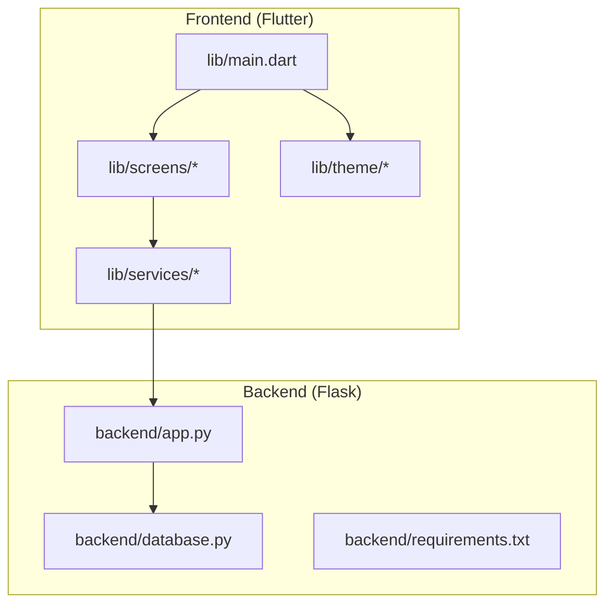
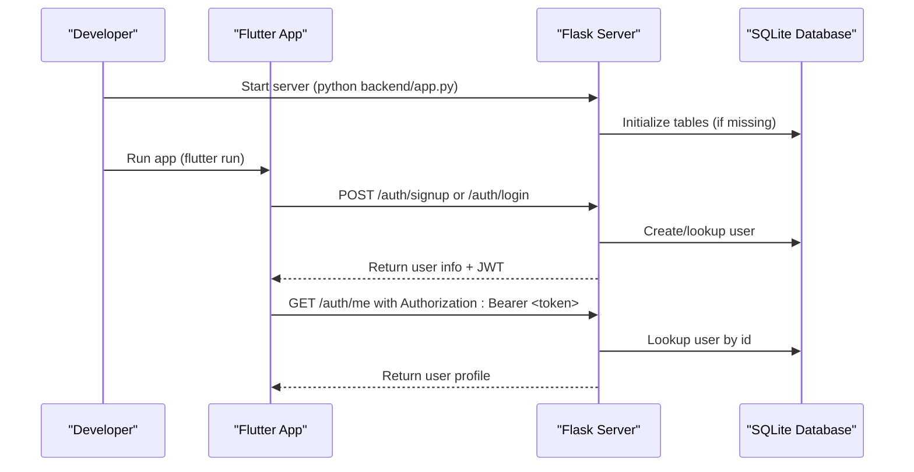
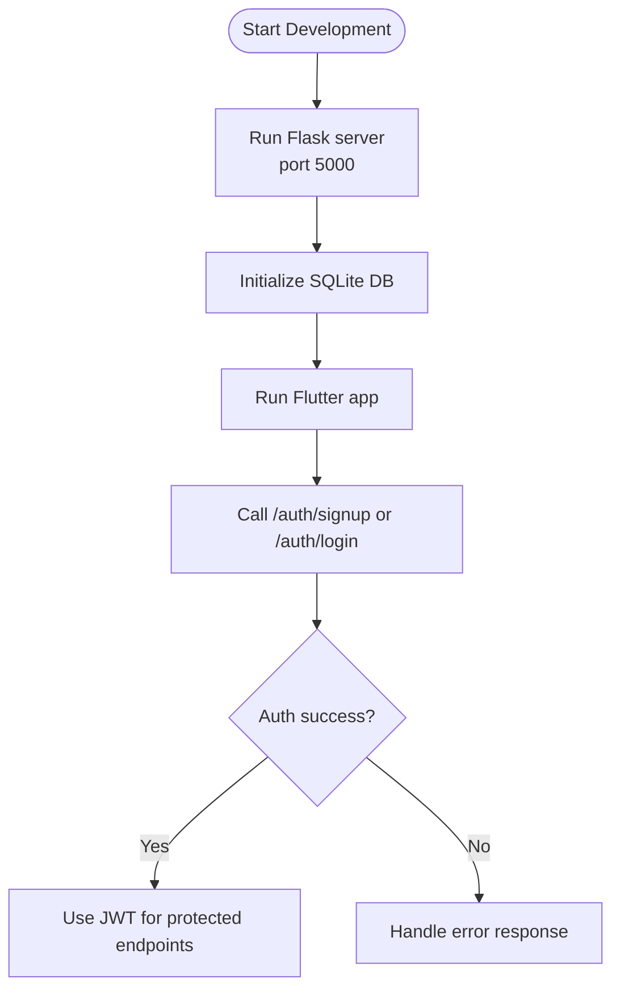
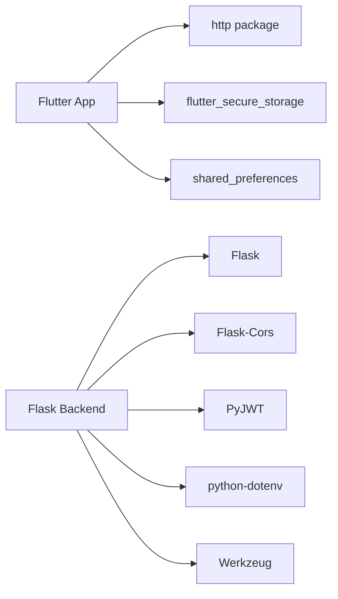

# Getting Started

<cite>
**Referenced Files in This Document**
- [README.md](file://README.md)
- [pubspec.yaml](file://pubspec.yaml)
- [lib/main.dart](file://lib/main.dart)
- [android/app/build.gradle.kts](file://android/app/build.gradle.kts)
- [backend/requirements.txt](file://backend/requirements.txt)
- [backend/app.py](file://backend/app.py)
- [backend/database.py](file://backend/database.py)
- [backend/test_api.py](file://backend/test_api.py)
</cite>

## Table of Contents
1. [Introduction](#introduction)
2. [Project Structure](#project-structure)
3. [Core Components](#core-components)
4. [Architecture Overview](#architecture-overview)
5. [Detailed Component Analysis](#detailed-component-analysis)
6. [Dependency Analysis](#dependency-analysis)
7. [Performance Considerations](#performance-considerations)
8. [Troubleshooting Guide](#troubleshooting-guide)
9. [Conclusion](#conclusion)
10. [Appendices](#appendices)

## Introduction
This guide helps you set up and run the Bon Voyage Pakistan application locally for development. The app is a Flutter mobile application with a Flask-based backend that provides authentication endpoints and a SQLite database. You will install required tools, configure your environment, start both frontend and backend services, and learn how to build for different platforms.

## Project Structure
The repository contains:
- A Flutter frontend under lib/ with screens, services, theme, and configuration folders.
- An Android project under android/ configured for Java 17 and Flutter Gradle plugin.
- A Python backend under backend/ implementing authentication routes, JWT handling, and SQLite storage.

**Diagram sources**
- [lib/main.dart:1-47](file://lib/main.dart#L1-L47)
- [backend/app.py:1-226](file://backend/app.py#L1-L226)
- [backend/database.py:1-75](file://backend/database.py#L1-L75)

**Section sources**
- [README.md:1-18](file://README.md#L1-L18)
- [pubspec.yaml:1-31](file://pubspec.yaml#L1-L31)
- [android/app/build.gradle.kts:1-50](file://android/app/build.gradle.kts#L1-L50)

## Core Components
- Frontend entry point initializes Flutter bindings and runs the root widget that configures theme management and navigation.
- Backend defines RESTful authentication endpoints, JWT token generation/validation, and SQLite-backed user storage.

Key responsibilities:
- Frontend: UI composition, theme switching, and API calls via HTTP client.
- Backend: User registration/login, protected endpoints, and health check.

**Section sources**
- [lib/main.dart:1-47](file://lib/main.dart#L1-L47)
- [backend/app.py:1-226](file://backend/app.py#L1-L226)
- [backend/database.py:1-75](file://backend/database.py#L1-L75)

## Architecture Overview
The app follows a typical mobile-first architecture:
- Flutter app communicates with a local or remote Flask server over HTTP.
- Authentication uses JSON Web Tokens (JWT). Protected endpoints require a Bearer token.
- Data persistence on the backend uses SQLite; the database file is created automatically when the server starts.

**Diagram sources**
- [backend/app.py:109-193](file://backend/app.py#L109-L193)
- [backend/database.py:20-75](file://backend/database.py#L20-L75)

## Detailed Component Analysis

### Prerequisites
Install the following tools before proceeding:
- Flutter SDK (compatible with Dart SDK ^3.13.0 as specified in the project).
- A Python environment with Python 3.x installed.
- Android Studio or command-line tools for building Android apps.
- Optional: iOS toolchain if you plan to build for iOS.

Notes:
- The Android module targets Java 17, so ensure your JDK is set to version 17.
- The backend uses Flask and related packages listed in requirements.txt.

**Section sources**
- [pubspec.yaml:6-8](file://pubspec.yaml#L6-L8)
- [android/app/build.gradle.kts:12-15](file://android/app/build.gradle.kts#L12-L15)
- [backend/requirements.txt:1-6](file://backend/requirements.txt#L1-L6)

### Install Dependencies

- Flutter dependencies:
  - Navigate to the project root and fetch dependencies using the Flutter CLI.

- Backend dependencies:
  - Create a virtual environment inside the backend directory.
  - Install packages from requirements.txt.

Environment variables:
- The backend loads configuration from a .env file. Ensure you create a .env file in the backend directory with at least:
  - SECRET_KEY=<your-secret-key>
  - JWT_EXPIRATION_HOURS=<number>
- If not provided, the backend falls back to safe defaults for development.

**Section sources**
- [backend/app.py:18-26](file://backend/app.py#L18-L26)
- [backend/requirements.txt:1-6](file://backend/requirements.txt#L1-L6)

### IDE Configuration
- Flutter:
  - Use Android Studio or VS Code with the Flutter and Dart extensions enabled.
  - Configure the project root as the working directory.
- Backend:
  - Use any Python-capable IDE (VS Code, PyCharm).
  - Set the interpreter to the virtual environment created in the backend directory.
  - Add a run configuration pointing to backend/app.py.

**Section sources**
- [lib/main.dart:1-10](file://lib/main.dart#L1-L10)
- [backend/app.py:223-226](file://backend/app.py#L223-L226)

### Initial Project Structure Navigation
- Frontend:
  - Entry point: lib/main.dart
  - Screens: lib/screens/*
  - Services: lib/services/*
  - Theme: lib/theme/*
- Backend:
  - Routes and logic: backend/app.py
  - Database helpers: backend/database.py
  - Tests: backend/test_api.py

**Section sources**
- [lib/main.dart:1-47](file://lib/main.dart#L1-L47)
- [backend/app.py:1-226](file://backend/app.py#L1-L226)
- [backend/database.py:1-75](file://backend/database.py#L1-L75)

### Running the Application in Development Mode

- Start the backend:
  - From the backend directory, run the Flask app. It initializes the SQLite database and listens on port 5000.

- Start the frontend:
  - From the project root, run the Flutter app on an emulator or device.

- Verify connectivity:
  - Use the included test script to validate backend endpoints. Update the base URL in the script to match your machine’s IP address if testing across devices.

**Diagram sources**
- [backend/app.py:223-226](file://backend/app.py#L223-L226)
- [backend/test_api.py:1-62](file://backend/test_api.py#L1-L62)

**Section sources**
- [backend/app.py:223-226](file://backend/app.py#L223-L226)
- [backend/test_api.py:1-62](file://backend/test_api.py#L1-L62)

### Building for Different Platforms

- Android:
  - Build debug APK/AAB using Flutter commands.
  - The Android module is configured with Java 17 and Flutter Gradle plugin.

- iOS:
  - Requires macOS and Xcode toolchain. Use standard Flutter build commands.

- Web:
  - Build web assets using Flutter web build commands.

Note: Ensure platform-specific toolchains are installed and configured before building.

**Section sources**
- [android/app/build.gradle.kts:1-50](file://android/app/build.gradle.kts#L1-L50)

## Dependency Analysis
- Flutter dependencies include HTTP client, secure storage, and shared preferences.
- Backend dependencies include Flask, CORS, JWT library, dotenv, and Werkzeug.

**Diagram sources**
- [pubspec.yaml:9-16](file://pubspec.yaml#L9-L16)
- [backend/requirements.txt:1-6](file://backend/requirements.txt#L1-L6)

**Section sources**
- [pubspec.yaml:9-16](file://pubspec.yaml#L9-L16)
- [backend/requirements.txt:1-6](file://backend/requirements.txt#L1-L6)

## Performance Considerations
- Keep network requests efficient; cache tokens securely on the client.
- Use minimal payloads for authentication responses.
- For high traffic, consider moving from SQLite to a more scalable database.
- Enable production-grade logging and monitoring for the backend.

[No sources needed since this section provides general guidance]

## Troubleshooting Guide
Common issues and resolutions:
- Cannot connect to backend:
  - Ensure the Flask server is running and accessible on port 5000.
  - If testing on a physical device, use your machine’s LAN IP instead of localhost.
- CORS errors:
  - Confirm the backend enables CORS and that the frontend origin is allowed.
- Invalid or expired JWT:
  - Re-authenticate to obtain a fresh token. Check expiration settings.
- Duplicate email during signup:
  - The backend returns a conflict status when attempting to register an existing email.
- Missing environment variables:
  - Provide SECRET_KEY and JWT_EXPIRATION_HOURS in a .env file within the backend directory.

Verification steps:
- Use the backend test script to verify endpoints and flows. Adjust the base URL to match your environment.

**Section sources**
- [backend/app.py:109-193](file://backend/app.py#L109-L193)
- [backend/app.py:213-216](file://backend/app.py#L213-L216)
- [backend/test_api.py:1-62](file://backend/test_api.py#L1-L62)

## Conclusion
You now have the essential knowledge to set up, run, and build the Bon Voyage Pakistan application. Start the backend, then launch the Flutter app, and use the provided endpoints to authenticate and access protected resources. Refer to the troubleshooting section if you encounter common setup or runtime issues.

[No sources needed since this section summarizes without analyzing specific files]

## Appendices

### Quick Commands Reference
- Backend:
  - Install dependencies: pip install -r backend/requirements.txt
  - Run server: python backend/app.py
- Frontend:
  - Get dependencies: flutter pub get
  - Run app: flutter run
  - Build Android: flutter build apk or flutter build appbundle
  - Build iOS: flutter build ios
  - Build Web: flutter build web

[No sources needed since this section provides general guidance]