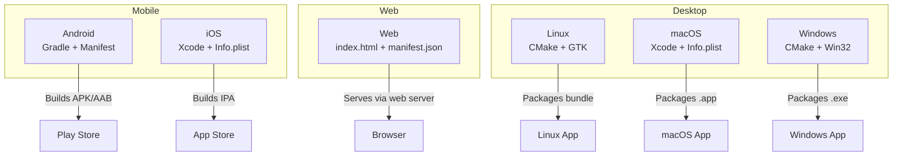
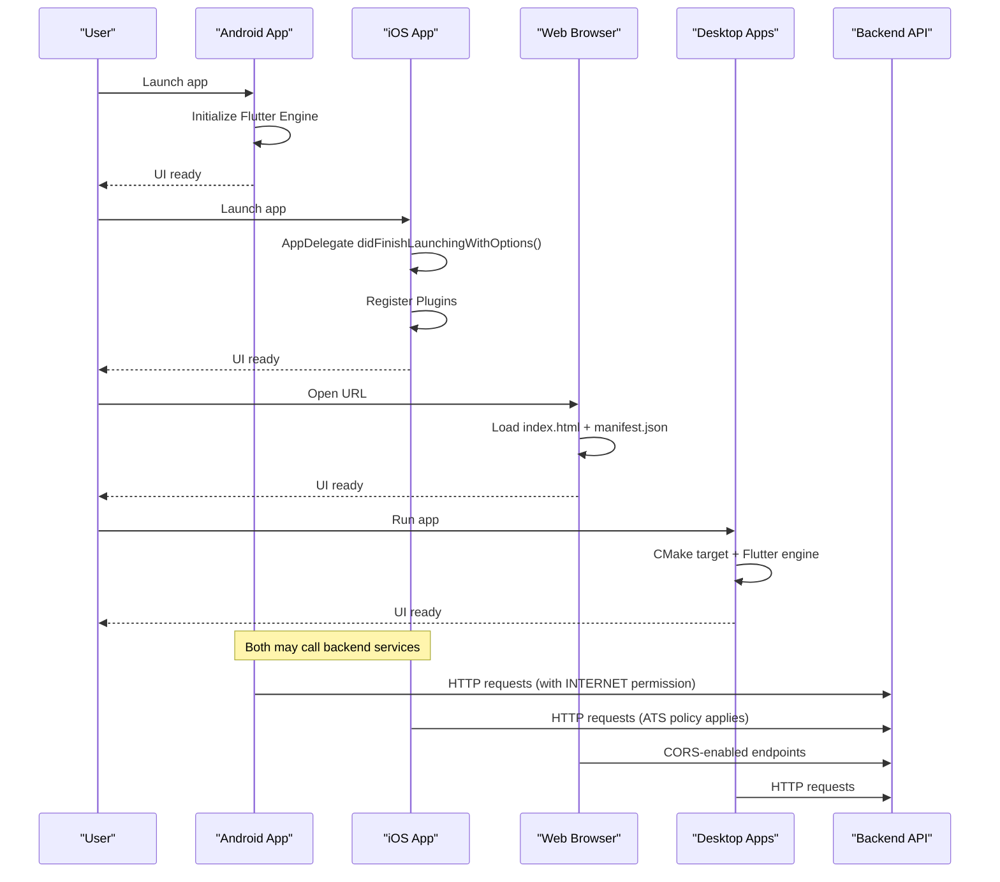
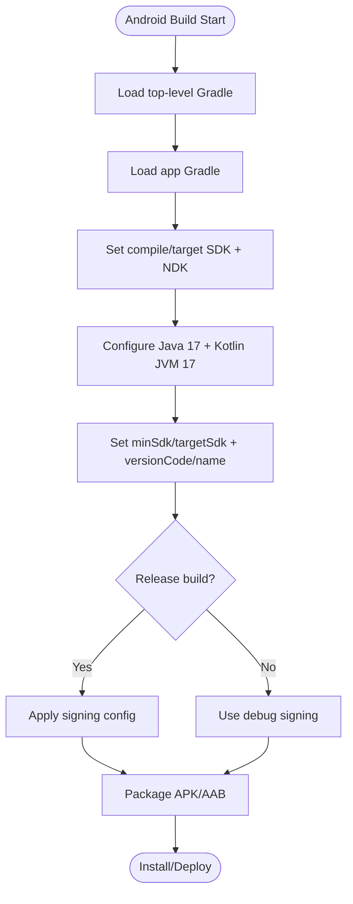
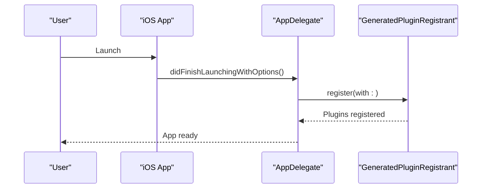
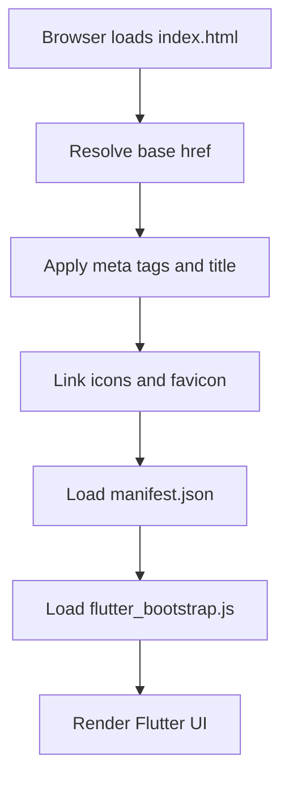
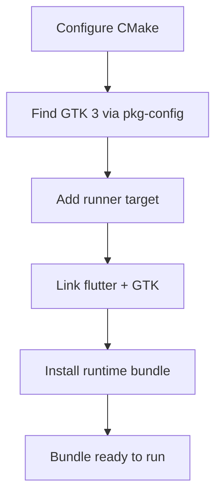
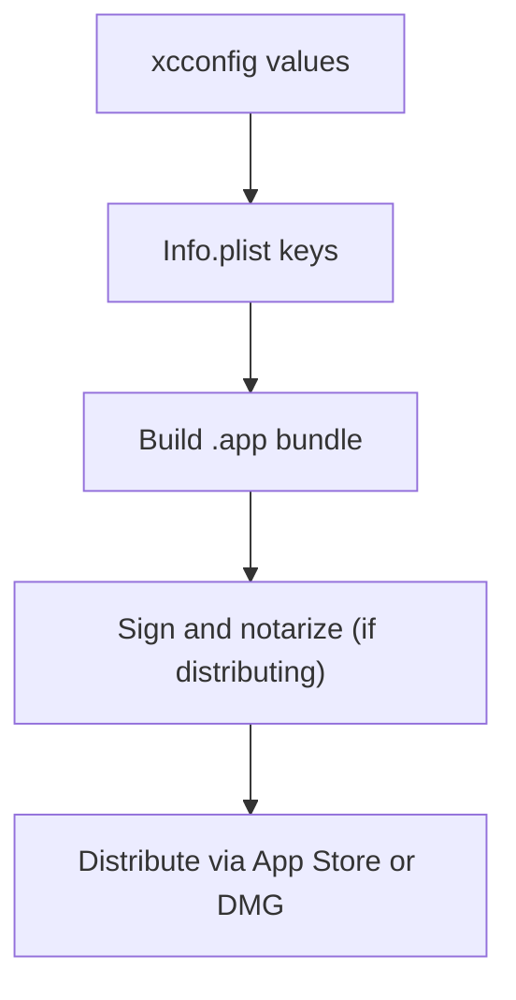
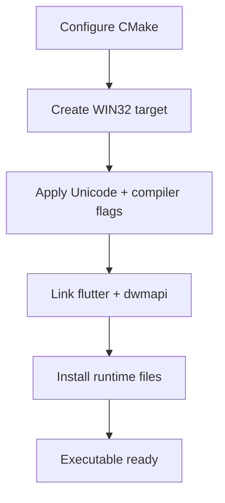
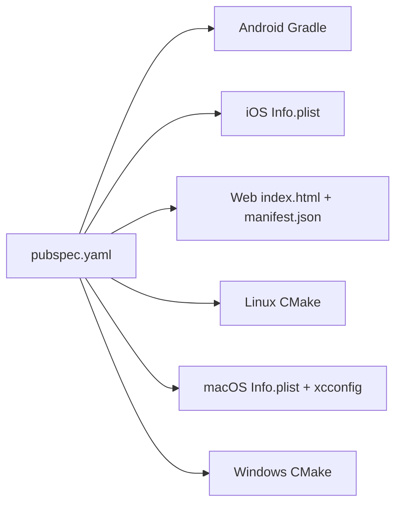

# Platform-Specific Configuration

<cite>
**Referenced Files in This Document**
- [pubspec.yaml](file://pubspec.yaml)
- [android/build.gradle.kts](file://android/build.gradle.kts)
- [android/app/build.gradle.kts](file://android/app/build.gradle.kts)
- [android/gradle.properties](file://android/gradle.properties)
- [android/app/src/main/AndroidManifest.xml](file://android/app/src/main/AndroidManifest.xml)
- [android/app/src/profile/AndroidManifest.xml](file://android/app/src/profile/AndroidManifest.xml)
- [ios/Runner/Info.plist](file://ios/Runner/Info.plist)
- [ios/Flutter/Debug.xcconfig](file://ios/Flutter/Debug.xcconfig)
- [ios/Runner/AppDelegate.swift](file://ios/Runner/AppDelegate.swift)
- [web/index.html](file://web/index.html)
- [web/manifest.json](file://web/manifest.json)
- [linux/CMakeLists.txt](file://linux/CMakeLists.txt)
- [linux/runner/CMakeLists.txt](file://linux/runner/CMakeLists.txt)
- [macos/Runner/Info.plist](file://macos/Runner/Info.plist)
- [macos/Runner/Configs/AppInfo.xcconfig](file://macos/Runner/Configs/AppInfo.xcconfig)
- [windows/CMakeLists.txt](file://windows/CMakeLists.txt)
- [windows/runner/CMakeLists.txt](file://windows/runner/CMakeLists.txt)
</cite>

## Table of Contents
1. [Introduction](#introduction)
2. [Project Structure](#project-structure)
3. [Core Components](#core-components)
4. [Architecture Overview](#architecture-overview)
5. [Detailed Component Analysis](#detailed-component-analysis)
6. [Dependency Analysis](#dependency-analysis)
7. [Performance Considerations](#performance-considerations)
8. [Troubleshooting Guide](#troubleshooting-guide)
9. [Conclusion](#conclusion)

## Introduction
This document provides platform-specific configuration guidance for the Bon Voyage Pakistan cross-platform application across Android, iOS, Web, Windows, macOS, and Linux. It covers build system setup, manifest and configuration files, native integrations, permissions, deployment considerations, and troubleshooting strategies tailored to each target platform. The goal is to help developers configure, build, and deploy the app reliably on all supported platforms while understanding how Flutter integrates with native toolchains and platform capabilities.

## Project Structure
The project follows a standard Flutter multi-platform layout:
- Android: Gradle-based build with Kotlin, AndroidManifest for permissions and app metadata.
- iOS: Xcode project with Info.plist for app identity and capabilities; Swift AppDelegate for initialization.
- Web: index.html and manifest.json for browser behavior and PWA settings.
- Desktop (Linux/macOS/Windows): CMake-based builds with runner targets and platform-specific configurations.

[No sources needed since this diagram shows conceptual workflow, not actual code structure]

## Core Components
- Application identity and versioning are coordinated through platform manifests and the central pubspec metadata.
- Network access is declared on Android via permissions; iOS uses default networking unless restricted by App Transport Security policies.
- Web PWA behavior is controlled by manifest and HTML meta tags.
- Desktop apps rely on CMake targets and platform libraries (GTK on Linux, Win32/DWM on Windows, Cocoa on macOS).

Key configuration anchors:
- Android: Gradle scripts and AndroidManifest define SDK versions, Java/Kotlin targets, signing, and permissions.
- iOS: Info.plist defines display name, orientation support, and scene configuration; AppDelegate initializes Flutter engine and plugins.
- Web: index.html sets base href, icons, and loads the Flutter bootstrap; manifest.json configures PWA behavior.
- Linux: CMake configures GTK dependencies and install paths for runtime assets.
- macOS: Info.plist and xcconfig define bundle identifiers and minimum OS version.
- Windows: CMake configures Unicode, compiler flags, and links required libraries.

**Section sources**
- [pubspec.yaml:1-31](file://pubspec.yaml#L1-L31)
- [android/app/build.gradle.kts:7-38](file://android/app/build.gradle.kts#L7-L38)
- [android/app/src/main/AndroidManifest.xml:1-49](file://android/app/src/main/AndroidManifest.xml#L1-L49)
- [ios/Runner/Info.plist:1-71](file://ios/Runner/Info.plist#L1-L71)
- [ios/Runner/AppDelegate.swift:1-17](file://ios/Runner/AppDelegate.swift#L1-L17)
- [web/index.html:1-47](file://web/index.html#L1-L47)
- [web/manifest.json:1-36](file://web/manifest.json#L1-L36)
- [linux/CMakeLists.txt:1-129](file://linux/CMakeLists.txt#L1-L129)
- [macos/Runner/Info.plist:1-33](file://macos/Runner/Info.plist#L1-L33)
- [windows/CMakeLists.txt:1-109](file://windows/CMakeLists.txt#L1-L109)

## Architecture Overview
At runtime, each platform initializes the Flutter engine and registers plugins. On iOS, the AppDelegate implements implicit engine initialization and plugin registration. On Android, the Flutter embedding is configured via manifest metadata. Web and desktop platforms load the Flutter engine from their respective entry points and link against platform libraries.

**Diagram sources**
- [android/app/src/main/AndroidManifest.xml:1-49](file://android/app/src/main/AndroidManifest.xml#L1-L49)
- [ios/Runner/AppDelegate.swift:1-17](file://ios/Runner/AppDelegate.swift#L1-L17)
- [web/index.html:1-47](file://web/index.html#L1-L47)
- [web/manifest.json:1-36](file://web/manifest.json#L1-L36)
- [linux/CMakeLists.txt:1-129](file://linux/CMakeLists.txt#L1-L129)
- [windows/CMakeLists.txt:1-109](file://windows/CMakeLists.txt#L1-L109)

## Detailed Component Analysis

### Android Configuration
- Build system:
  - Top-level Gradle script configures repositories and build directories.
  - App-level Gradle script sets namespace, compile/target SDK, NDK version, Java/Kotlin versions, minSdk/targetSdk, versionCode/versionName, and release signing configuration.
- Permissions and network:
  - Internet and network state permissions are declared for backend communication.
  - Cleartext traffic is enabled for development or specific backend requirements.
  - Profile manifest includes internet permission for debugging flows.
- Embedding and activity:
  - Flutter embedding version is set to 2.
  - MainActivity is exported and configured with launch mode, theme, and configuration changes handling.

**Diagram sources**
- [android/build.gradle.kts:1-25](file://android/build.gradle.kts#L1-L25)
- [android/app/build.gradle.kts:7-38](file://android/app/build.gradle.kts#L7-L38)

**Section sources**
- [android/build.gradle.kts:1-25](file://android/build.gradle.kts#L1-L25)
- [android/app/build.gradle.kts:7-38](file://android/app/build.gradle.kts#L7-L38)
- [android/gradle.properties:1-7](file://android/gradle.properties#L1-L7)
- [android/app/src/main/AndroidManifest.xml:1-49](file://android/app/src/main/AndroidManifest.xml#L1-L49)
- [android/app/src/profile/AndroidManifest.xml:1-7](file://android/app/src/profile/AndroidManifest.xml#L1-L7)

### iOS Configuration
- App identity and behavior:
  - Info.plist defines display name, bundle identifier, versioning, supported orientations, and scene configuration.
- Initialization:
  - AppDelegate implements didFinishLaunchingWithOptions and registers plugins via GeneratedPluginRegistrant.
- Build configs:
  - Debug.xcconfig includes generated configuration for consistent build settings.

**Diagram sources**
- [ios/Runner/Info.plist:1-71](file://ios/Runner/Info.plist#L1-L71)
- [ios/Runner/AppDelegate.swift:1-17](file://ios/Runner/AppDelegate.swift#L1-L17)
- [ios/Flutter/Debug.xcconfig:1-2](file://ios/Flutter/Debug.xcconfig#L1-L2)

**Section sources**
- [ios/Runner/Info.plist:1-71](file://ios/Runner/Info.plist#L1-L71)
- [ios/Runner/AppDelegate.swift:1-17](file://ios/Runner/AppDelegate.swift#L1-L17)
- [ios/Flutter/Debug.xcconfig:1-2](file://ios/Flutter/Debug.xcconfig#L1-L2)

### Web Configuration
- Entry point:
  - index.html sets base href placeholder, meta tags for mobile/web app behavior, favicon, and loads flutter_bootstrap.js.
- PWA:
  - manifest.json defines app name, start URL, display mode, theme colors, and icons for various densities and maskable variants.

**Diagram sources**
- [web/index.html:1-47](file://web/index.html#L1-L47)
- [web/manifest.json:1-36](file://web/manifest.json#L1-L36)

**Section sources**
- [web/index.html:1-47](file://web/index.html#L1-L47)
- [web/manifest.json:1-36](file://web/manifest.json#L1-L36)

### Linux Configuration
- Build system:
  - CMake configures project name, binary name, application ID, and links GTK 3.
  - Runner target compiles main.cc and my_application.cc and includes generated plugin registrant.
- Installation:
  - Installs Flutter library, ICU data, plugin libraries, native assets, and flutter_assets into a relocatable bundle.

**Diagram sources**
- [linux/CMakeLists.txt:1-129](file://linux/CMakeLists.txt#L1-L129)
- [linux/runner/CMakeLists.txt:1-27](file://linux/runner/CMakeLists.txt#L1-L27)

**Section sources**
- [linux/CMakeLists.txt:1-129](file://linux/CMakeLists.txt#L1-L129)
- [linux/runner/CMakeLists.txt:1-27](file://linux/runner/CMakeLists.txt#L1-L27)

### macOS Configuration
- App identity:
  - Info.plist defines bundle info, minimum system version, and main menu nib.
- xcconfig:
  - AppInfo.xcconfig sets product name, bundle identifier, and copyright metadata.

**Diagram sources**
- [macos/Runner/Info.plist:1-33](file://macos/Runner/Info.plist#L1-L33)
- [macos/Runner/Configs/AppInfo.xcconfig:1-15](file://macos/Runner/Configs/AppInfo.xcconfig#L1-L15)

**Section sources**
- [macos/Runner/Info.plist:1-33](file://macos/Runner/Info.plist#L1-L33)
- [macos/Runner/Configs/AppInfo.xcconfig:1-15](file://macos/Runner/Configs/AppInfo.xcconfig#L1-L15)

### Windows Configuration
- Build system:
  - CMake configures Unicode, compiler warnings, and build types (Debug/Profile/Release).
  - Runner target compiles flutter_window, main, utils, win32_window, and links flutter and dwmapi.
- Installation:
  - Installs Flutter library, ICU data, plugin libraries, native assets, and flutter_assets next to the executable.

**Diagram sources**
- [windows/CMakeLists.txt:1-109](file://windows/CMakeLists.txt#L1-L109)
- [windows/runner/CMakeLists.txt:1-41](file://windows/runner/CMakeLists.txt#L1-L41)

**Section sources**
- [windows/CMakeLists.txt:1-109](file://windows/CMakeLists.txt#L1-L109)
- [windows/runner/CMakeLists.txt:1-41](file://windows/runner/CMakeLists.txt#L1-L41)

## Dependency Analysis
- Central metadata:
  - pubspec.yaml declares app name, version, environment constraints, and assets used across platforms.
- Android:
  - Gradle scripts depend on Flutter Gradle plugin and Kotlin/JVM targets; AndroidManifest depends on declared permissions for network calls.
- iOS:
  - Info.plist and AppDelegate coordinate app lifecycle and plugin registration.
- Web:
  - index.html and manifest.json control PWA behavior and asset references.
- Desktop:
  - CMake targets link platform libraries (GTK on Linux, Win32/DWM on Windows) and include generated plugin registrants.

**Diagram sources**
- [pubspec.yaml:1-31](file://pubspec.yaml#L1-L31)
- [android/app/build.gradle.kts:7-38](file://android/app/build.gradle.kts#L7-L38)
- [ios/Runner/Info.plist:1-71](file://ios/Runner/Info.plist#L1-L71)
- [web/index.html:1-47](file://web/index.html#L1-L47)
- [web/manifest.json:1-36](file://web/manifest.json#L1-L36)
- [linux/CMakeLists.txt:1-129](file://linux/CMakeLists.txt#L1-L129)
- [macos/Runner/Info.plist:1-33](file://macos/Runner/Info.plist#L1-L33)
- [windows/CMakeLists.txt:1-109](file://windows/CMakeLists.txt#L1-L109)

**Section sources**
- [pubspec.yaml:1-31](file://pubspec.yaml#L1-L31)

## Performance Considerations
- Android:
  - Use release builds with proper signing for optimized performance and smaller artifacts.
  - Ensure minSdk/targetSdk align with device coverage goals.
- iOS:
  - Configure appropriate orientations and ensure ATS policies allow backend connectivity if needed.
- Web:
  - Optimize icons and consider lazy loading; ensure correct base href when serving under non-root paths.
- Linux:
  - Link only necessary libraries; avoid unnecessary dependencies to reduce bundle size.
- macOS:
  - Set minimum system version appropriately; sign and notarize for distribution.
- Windows:
  - Enable optimizations in Release builds; link only required libraries like dwmapi.

[No sources needed since this section provides general guidance]

## Troubleshooting Guide

### Android
- Build issues:
  - Verify Java/Kotlin versions match configured targets; adjust gradle.properties JVM args if memory errors occur.
  - Ensure compileSdk/targetSdk/minSdk are compatible with your environment.
- Runtime/network:
  - If backend calls fail, confirm INTERNET permission is present and cleartext traffic is allowed for development.
  - For production, restrict cleartext traffic and use HTTPS.

**Section sources**
- [android/app/build.gradle.kts:7-38](file://android/app/build.gradle.kts#L7-L38)
- [android/gradle.properties:1-7](file://android/gradle.properties#L1-L7)
- [android/app/src/main/AndroidManifest.xml:1-49](file://android/app/src/main/AndroidManifest.xml#L1-L49)

### iOS
- Build issues:
  - Confirm Info.plist keys for bundle identifier and versioning resolve correctly; check xcconfig includes.
  - Ensure AppDelegate registers plugins during launch.
- Networking:
  - If backend calls fail due to ATS, add exceptions or switch to HTTPS.

**Section sources**
- [ios/Runner/Info.plist:1-71](file://ios/Runner/Info.plist#L1-L71)
- [ios/Runner/AppDelegate.swift:1-17](file://ios/Runner/AppDelegate.swift#L1-L17)
- [ios/Flutter/Debug.xcconfig:1-2](file://ios/Flutter/Debug.xcconfig#L1-L2)

### Web
- Deployment:
  - If served from a subpath, update base href accordingly; verify manifest.json paths for icons.
- Browser compatibility:
  - Ensure modern browsers; test PWA features like offline caching and install prompts.

**Section sources**
- [web/index.html:1-47](file://web/index.html#L1-L47)
- [web/manifest.json:1-36](file://web/manifest.json#L1-L36)

### Linux
- Dependencies:
  - Ensure GTK 3 and required dev packages are installed; verify pkg-config can locate GTK.
- Packaging:
  - Confirm install rules copy flutter_assets and native assets; run the bundled executable from the install directory.

**Section sources**
- [linux/CMakeLists.txt:1-129](file://linux/CMakeLists.txt#L1-L129)
- [linux/runner/CMakeLists.txt:1-27](file://linux/runner/CMakeLists.txt#L1-L27)

### macOS
- Distribution:
  - Set minimum system version and ensure signing/notarization steps are completed before distribution.
- Identity:
  - Verify bundle identifier and product name in xcconfig and Info.plist.

**Section sources**
- [macos/Runner/Info.plist:1-33](file://macos/Runner/Info.plist#L1-L33)
- [macos/Runner/Configs/AppInfo.xcconfig:1-15](file://macos/Runner/Configs/AppInfo.xcconfig#L1-L15)

### Windows
- Build:
  - Ensure Visual Studio toolchain and CMake are configured; verify Unicode and warning flags.
- Runtime:
  - Confirm required DLLs (flutter, dwmapi) are present alongside the executable after installation.

**Section sources**
- [windows/CMakeLists.txt:1-109](file://windows/CMakeLists.txt#L1-L109)
- [windows/runner/CMakeLists.txt:1-41](file://windows/runner/CMakeLists.txt#L1-L41)

## Conclusion
This document outlined platform-specific configurations for Bon Voyage Pakistan across Android, iOS, Web, and desktop platforms. By aligning build settings, manifests, and native integrations with each platform’s expectations, you can reliably build, deploy, and distribute the application. Use the troubleshooting sections to diagnose common issues and optimize performance per platform.