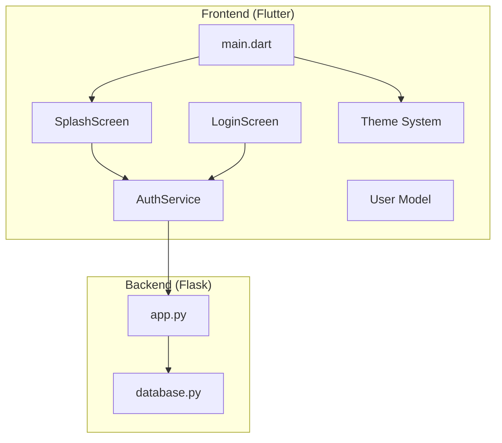
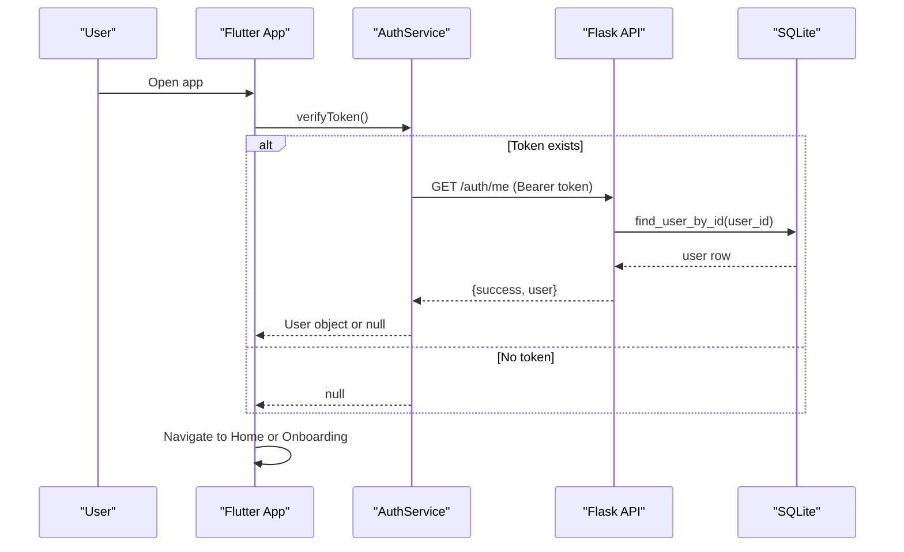
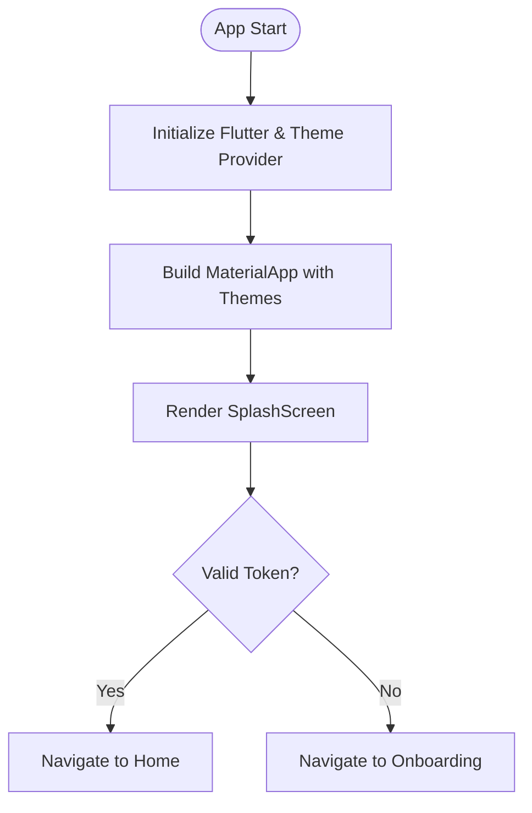
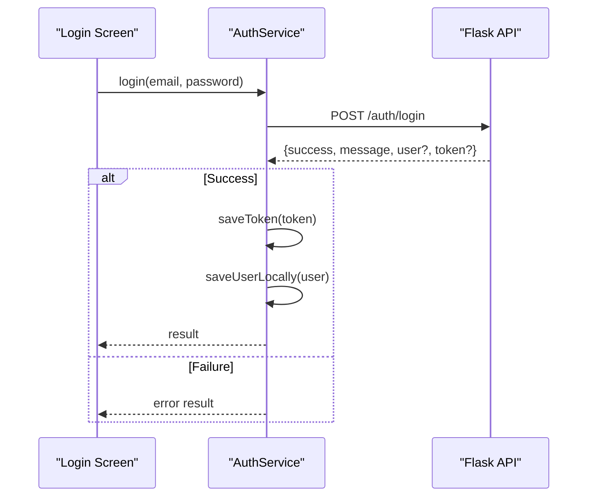
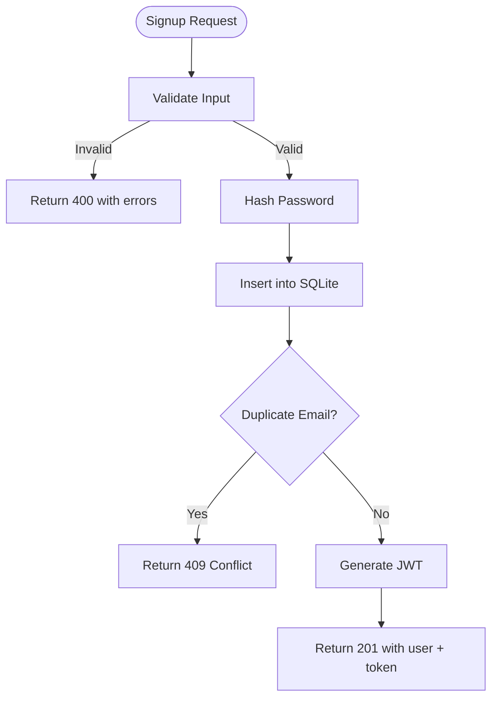
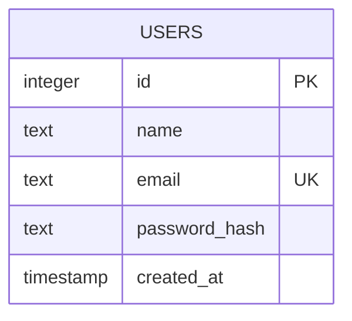
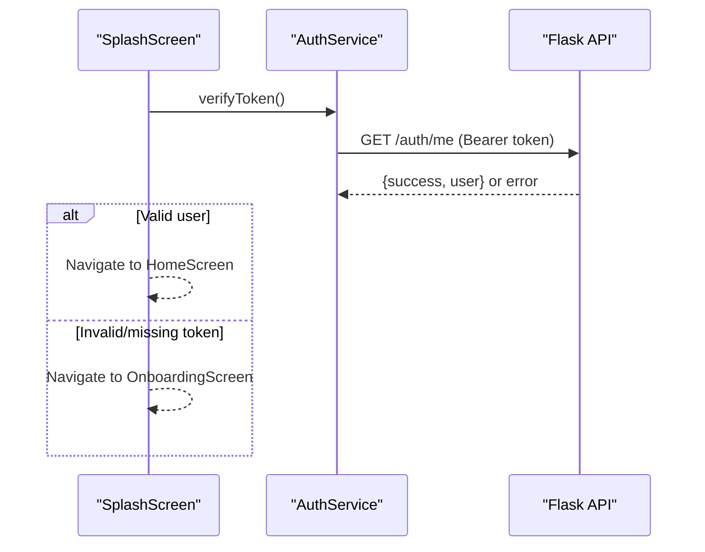
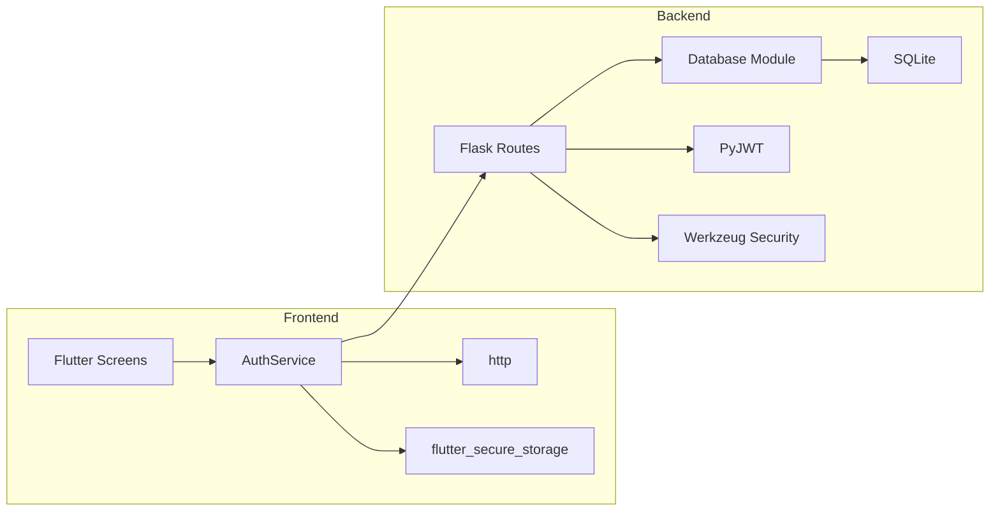

# Project Overview

<cite>
**Referenced Files in This Document**
- [README.md](file://README.md)
- [pubspec.yaml](file://pubspec.yaml)
- [lib/main.dart](file://lib/main.dart)
- [lib/screens/splash_screen.dart](file://lib/screens/splash_screen.dart)
- [lib/screens/login_screen.dart](file://lib/screens/login_screen.dart)
- [lib/services/auth_service.dart](file://lib/services/auth_service.dart)
- [lib/models/user.dart](file://lib/models/user.dart)
- [backend/app.py](file://backend/app.py)
- [backend/database.py](file://backend/database.py)
</cite>

## Table of Contents
1. Introduction
2. Project Structure
3. Core Components
4. Architecture Overview
5. Detailed Component Analysis
6. Dependency Analysis
7. Performance Considerations
8. Troubleshooting Guide
9. Conclusion

## Introduction
Bon Voyage Pakistan is a cross-platform travel companion app designed to help users explore and plan trips across Pakistan. The application provides an AI-powered travel companion experience, user authentication with secure token storage, and a modern UI/UX built for both light and dark modes. It uses Flutter for the frontend (Dart) and Flask for the backend (Python), with SQLite as the local database and JWT for secure authentication.

The project targets Android, iOS, Web, Linux, macOS, and Windows through Flutter’s multi-platform support, while the backend exposes REST endpoints for authentication and profile retrieval.

## Project Structure
At a high level:
- Frontend (Flutter): Entry point, theme system, screens, services, and models.
- Backend (Flask): Authentication routes, JWT handling, and SQLite data access.
- Platform-specific folders: android, ios, web, linux, macos, windows generated by Flutter tooling.

**Diagram sources**
- [lib/main.dart:1-47](file://lib/main.dart#L1-L47)
- [lib/screens/splash_screen.dart:1-200](file://lib/screens/splash_screen.dart#L1-L200)
- [lib/screens/login_screen.dart:1-444](file://lib/screens/login_screen.dart#L1-L444)
- [lib/services/auth_service.dart:1-258](file://lib/services/auth_service.dart#L1-L258)
- [lib/models/user.dart:1-29](file://lib/models/user.dart#L1-L29)
- [backend/app.py:1-226](file://backend/app.py#L1-L226)
- [backend/database.py:1-75](file://backend/database.py#L1-L75)

**Section sources**
- [README.md:1-18](file://README.md#L1-L18)
- [pubspec.yaml:1-31](file://pubspec.yaml#L1-L31)
- [lib/main.dart:1-47](file://lib/main.dart#L1-L47)

## Core Components
- App entrypoint and theming: Initializes Flutter, sets up Material app with light/dark themes, and renders the splash screen.
- Splash screen: Displays branding and navigates based on authentication state.
- Login screen: Provides email/password login with validation and error display.
- Authentication service: Handles signup, login, logout, and token verification; securely stores tokens locally.
- User model: Represents user data returned from the backend.
- Backend API: Flask server exposing auth endpoints (/auth/signup, /auth/login, /auth/me, /auth/logout) and a health check.
- Database layer: SQLite schema for users with hashed passwords and helper functions for CRUD operations.

Key technology stack:
- Dart/Flutter for frontend UI and navigation
- Python/Flask for backend API
- SQLite for persistent user storage
- JWT for secure authentication flow
- Secure storage for client-side token persistence

Practical examples of core functionality:
- New user registration: The frontend calls the signup endpoint, receives a JWT, and stores it securely.
- Login flow: The frontend sends credentials, receives a JWT, and navigates to the home screen upon success.
- Protected route: The frontend includes the JWT in Authorization headers to access protected endpoints like /auth/me.

**Section sources**
- [lib/main.dart:12-47](file://lib/main.dart#L12-L47)
- [lib/screens/splash_screen.dart:69-87](file://lib/screens/splash_screen.dart#L69-L87)
- [lib/screens/login_screen.dart:53-82](file://lib/screens/login_screen.dart#L53-L82)
- [lib/services/auth_service.dart:68-161](file://lib/services/auth_service.dart#L68-L161)
- [lib/models/user.dart:1-29](file://lib/models/user.dart#L1-L29)
- [backend/app.py:109-206](file://backend/app.py#L109-L206)
- [backend/database.py:20-75](file://backend/database.py#L20-L75)

## Architecture Overview
The app follows a clean separation between presentation (Flutter screens), business logic (services), and data (models). The backend is a stateless API that issues and validates JWTs and persists user data in SQLite.

**Diagram sources**
- [lib/screens/splash_screen.dart:69-87](file://lib/screens/splash_screen.dart#L69-L87)
- [lib/services/auth_service.dart:163-202](file://lib/services/auth_service.dart#L163-L202)
- [backend/app.py:186-193](file://backend/app.py#L186-L193)
- [backend/database.py:67-74](file://backend/database.py#L67-L74)

## Detailed Component Analysis

### App Entry Point and Theme Management
- Initializes Flutter bindings and runs the root widget.
- Wraps the app with a theme provider scope to support dynamic light/dark mode.
- Renders the splash screen as the initial page.

**Diagram sources**
- [lib/main.dart:7-47](file://lib/main.dart#L7-L47)
- [lib/screens/splash_screen.dart:69-87](file://lib/screens/splash_screen.dart#L69-L87)

**Section sources**
- [lib/main.dart:12-47](file://lib/main.dart#L12-L47)

### Authentication Service (Client-Side)
Responsibilities:
- Securely store and retrieve JWT tokens and cached user info.
- Make HTTP requests to backend endpoints with timeouts and robust error handling.
- Persist user profile locally after successful authentication.

Key behaviors:
- Signup and login send JSON payloads and store tokens on success.
- Token verification calls /auth/me to validate session state.
- Logout clears local state and attempts a best-effort backend call.

**Diagram sources**
- [lib/screens/login_screen.dart:53-82](file://lib/screens/login_screen.dart#L53-L82)
- [lib/services/auth_service.dart:117-161](file://lib/services/auth_service.dart#L117-L161)
- [backend/app.py:156-183](file://backend/app.py#L156-L183)

**Section sources**
- [lib/services/auth_service.dart:1-258](file://lib/services/auth_service.dart#L1-L258)

### User Model
- Immutable data class representing user fields returned by the backend.
- Provides JSON serialization helpers for parsing responses.

**Section sources**
- [lib/models/user.dart:1-29](file://lib/models/user.dart#L1-L29)

### Backend API (Flask)
Endpoints:
- POST /auth/signup: Register new users, hash passwords, create records, issue JWT.
- POST /auth/login: Authenticate users, verify password hashes, issue JWT.
- GET /auth/me: Protected route requiring valid JWT; returns current user.
- POST /auth/logout: Stateless logout helper; client clears local token.
- GET /: Health check.

Security:
- Passwords are hashed using a secure hashing utility before storage.
- JWTs are signed with HS256 and include expiration time.
- Protected routes use a decorator to extract and validate tokens.

**Diagram sources**
- [backend/app.py:109-153](file://backend/app.py#L109-L153)
- [backend/database.py:39-54](file://backend/database.py#L39-L54)

**Section sources**
- [backend/app.py:1-226](file://backend/app.py#L1-L226)

### Database Layer (SQLite)
Schema:
- users table with id, name, email (unique), password_hash, created_at.

Operations:
- init_db: Creates the users table if missing.
- create_user: Inserts a new user and returns the id or None on conflict.
- find_user_by_email/find_user_by_id: Retrieve user rows.

**Diagram sources**
- [backend/database.py:20-36](file://backend/database.py#L20-L36)

**Section sources**
- [backend/database.py:1-75](file://backend/database.py#L1-L75)

### Screens and Navigation
- SplashScreen: Shows branding and checks authentication to navigate to Home or Onboarding.
- LoginScreen: Validates input, calls AuthService.login, handles loading states and errors, and navigates to Home on success.

**Diagram sources**
- [lib/screens/splash_screen.dart:69-87](file://lib/screens/splash_screen.dart#L69-L87)
- [lib/services/auth_service.dart:163-202](file://lib/services/auth_service.dart#L163-L202)
- [backend/app.py:186-193](file://backend/app.py#L186-L193)

**Section sources**
- [lib/screens/splash_screen.dart:1-200](file://lib/screens/splash_screen.dart#L1-L200)
- [lib/screens/login_screen.dart:1-444](file://lib/screens/login_screen.dart#L1-L444)

## Dependency Analysis
High-level dependencies:
- Frontend depends on:
  - http for network requests
  - flutter_secure_storage for secure token storage
  - shared_preferences for lightweight preferences
- Backend depends on:
  - Flask and flask_cors for API and CORS
  - werkzeug.security for password hashing
  - PyJWT for token signing/verification
  - sqlite3 for data persistence

**Diagram sources**
- [pubspec.yaml:9-16](file://pubspec.yaml#L9-L16)
- [backend/app.py:10-16](file://backend/app.py#L10-L16)
- [backend/database.py:6-17](file://backend/database.py#L6-L17)

**Section sources**
- [pubspec.yaml:9-16](file://pubspec.yaml#L9-L16)
- [backend/app.py:10-16](file://backend/app.py#L10-L16)
- [backend/database.py:6-17](file://backend/database.py#L6-L17)

## Performance Considerations
- Network timeouts: All HTTP requests enforce a timeout to prevent UI hangs when the backend is unreachable.
- Local caching: User profile information is cached locally to reduce repeated network calls.
- State management: Theme changes are applied via a provider pattern to minimize rebuilds.
- Database: SQLite is lightweight and suitable for small-scale user data; ensure proper connection handling and avoid blocking operations.

[No sources needed since this section provides general guidance]

## Troubleshooting Guide
Common issues and resolutions:
- Cannot connect to server: Ensure the backend is running and accessible from the device/emulator. The service returns a specific connection error message.
- Token expired or invalid: The backend will reject expired or malformed tokens; clear local state and re-authenticate.
- Duplicate email during signup: The backend enforces unique emails; handle the conflict response accordingly.
- Validation errors: Both frontend and backend validate inputs; address required fields and formats.

Operational tips:
- Use the health endpoint to verify backend availability.
- Confirm CORS is enabled for development environments.
- Verify environment variables for JWT secret and expiration settings.

**Section sources**
- [lib/services/auth_service.dart:232-256](file://lib/services/auth_service.dart#L232-L256)
- [backend/app.py:109-153](file://backend/app.py#L109-L153)
- [backend/app.py:156-183](file://backend/app.py#L156-L183)
- [backend/app.py:213-216](file://backend/app.py#L213-L216)

## Conclusion
Bon Voyage Pakistan combines a polished Flutter frontend with a secure Flask backend to deliver a modern travel companion experience. The architecture emphasizes clarity and maintainability:
- Clear separation of concerns between UI, services, and data layers.
- Robust authentication using JWT and secure storage.
- A simple yet effective SQLite-backed user store.
This foundation supports future enhancements such as AI-driven trip planning, destination discovery, and richer content features while maintaining performance and security.

[No sources needed since this section summarizes without analyzing specific files]