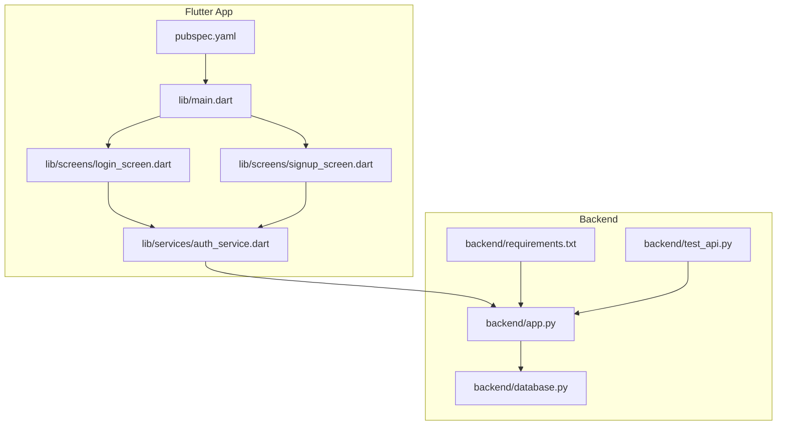
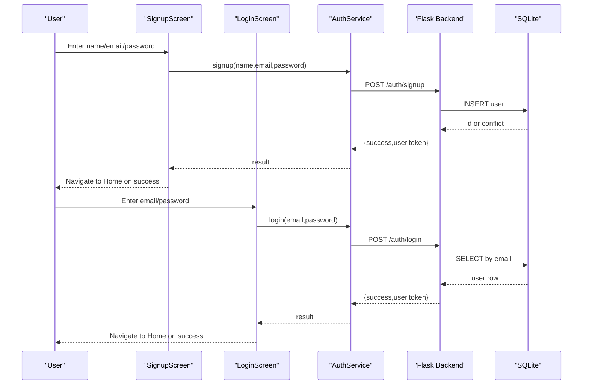
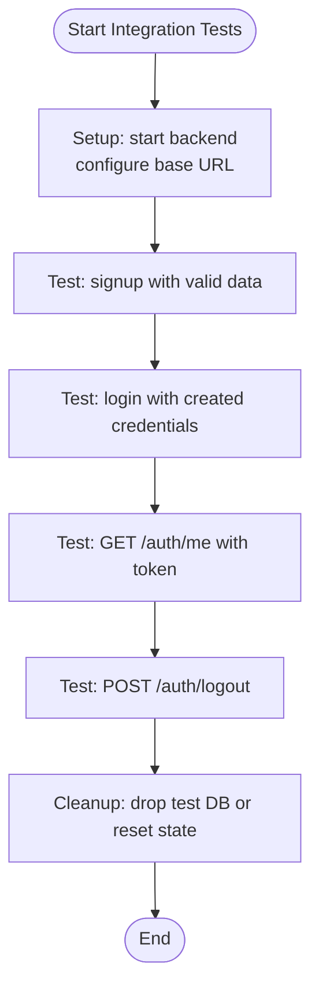
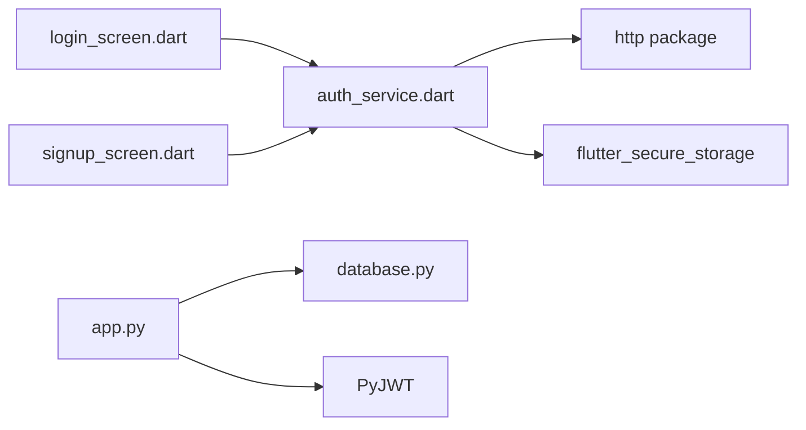

# Testing Strategy

<cite>
**Referenced Files in This Document**
- [main.dart](file://lib/main.dart)
- [pubspec.yaml](file://pubspec.yaml)
- [widget_test.dart](file://test/widget_test.dart)
- [auth_service.dart](file://lib/services/auth_service.dart)
- [login_screen.dart](file://lib/screens/login_screen.dart)
- [signup_screen.dart](file://lib/screens/signup_screen.dart)
- [app.py](file://backend/app.py)
- [database.py](file://backend/database.py)
- [requirements.txt](file://backend/requirements.txt)
- [test_api.py](file://backend/test_api.py)
</cite>

## Table of Contents
1. Introduction
2. Project Structure
3. Core Components
4. Architecture Overview
5. Detailed Component Analysis
6. Dependency Analysis
7. Performance Considerations
8. Troubleshooting Guide
9. Conclusion
10. Appendices

## Introduction
This document defines a comprehensive testing strategy for the Bon Voyage Pakistan application across Flutter widgets, backend APIs, and end-to-end integration flows. It covers unit testing setup for Flutter, backend API testing with Python tools, integration testing of authentication flows, best practices for asynchronous operations, network calls, and state management, plus environment setup, test data management, CI considerations, maintainability guidance, and coverage measurement.

## Project Structure
The project includes:
- Flutter app under lib with screens, services, theme, and models.
- A minimal existing widget test under test.
- A Flask backend under backend with routes, database helpers, and a manual test script.

**Diagram sources**
- [main.dart:1-47](file://lib/main.dart#L1-L47)
- [login_screen.dart:1-444](file://lib/screens/login_screen.dart#L1-L444)
- [signup_screen.dart:1-480](file://lib/screens/signup_screen.dart#L1-L480)
- [auth_service.dart:1-258](file://lib/services/auth_service.dart#L1-L258)
- [app.py:1-226](file://backend/app.py#L1-L226)
- [database.py:1-75](file://backend/database.py#L1-L75)
- [requirements.txt:1-6](file://backend/requirements.txt#L1-L6)
- [test_api.py:1-62](file://backend/test_api.py#L1-L62)
- [pubspec.yaml:1-31](file://pubspec.yaml#L1-L31)

**Section sources**
- [pubspec.yaml:1-31](file://pubspec.yaml#L1-L31)
- [main.dart:1-47](file://lib/main.dart#L1-L47)
- [app.py:1-226](file://backend/app.py#L1-L226)
- [database.py:1-75](file://backend/database.py#L1-L75)
- [test_api.py:1-62](file://backend/test_api.py#L1-L62)

## Core Components
- Authentication service (Flutter): encapsulates HTTP calls to /auth endpoints, secure token storage, and error handling.
- Login and Signup screens: UI components that call AuthService and handle navigation and error display.
- Backend API (Flask): provides signup, login, me, logout, and health endpoints; uses SQLite for persistence and JWT for auth.
- Database module: initializes schema and CRUD helpers for users.

Testing implications:
- Unit tests should target AuthService methods and validation logic in screens.
- Backend tests should cover all auth endpoints, including success and failure paths.
- Integration tests should validate the full flow from UI to backend and back.

**Section sources**
- [auth_service.dart:1-258](file://lib/services/auth_service.dart#L1-L258)
- [login_screen.dart:1-444](file://lib/screens/login_screen.dart#L1-L444)
- [signup_screen.dart:1-480](file://lib/screens/signup_screen.dart#L1-L480)
- [app.py:1-226](file://backend/app.py#L1-L226)
- [database.py:1-75](file://backend/database.py#L1-L75)

## Architecture Overview
The authentication architecture spans Flutter screens calling a centralized AuthService, which communicates with the Flask backend over HTTP. The backend validates input, persists users in SQLite, issues JWTs, and protects sensitive routes with a decorator.

**Diagram sources**
- [signup_screen.dart:57-87](file://lib/screens/signup_screen.dart#L57-L87)
- [login_screen.dart:53-82](file://lib/screens/login_screen.dart#L53-L82)
- [auth_service.dart:68-161](file://lib/services/auth_service.dart#L68-L161)
- [app.py:109-183](file://backend/app.py#L109-L183)
- [database.py:39-64](file://backend/database.py#L39-L64)

## Detailed Component Analysis

### Flutter Widget Testing Strategy
- Framework and setup:
  - Use flutter_test from dev_dependencies.
  - Existing example shows building the root app without errors.
- Test structure:
  - Place tests under test/.
  - Use testWidgets for UI interactions.
  - Isolate each test case with pumpWidget to mount only what is needed.
- Mocking strategies:
  - Replace network-dependent behavior by mocking AuthService or using http overrides.
  - For secure storage interactions, consider isolating via dependency injection or stubbing static calls where feasible.
- Assertion patterns:
  - Verify form validation messages appear/disappear.
  - Assert navigation occurs on successful login/signup.
  - Assert loading indicators are shown during async operations.
- Asynchronous operations:
  - Use tester.pumpAndSettle() to process animations and futures.
  - Ensure timers and animations are flushed before assertions.

Example scope:
- Validate email field rejects invalid formats.
- Confirm password visibility toggle works.
- Verify error banner displays when backend returns failure.
- Check navigation to home screen after successful auth.

**Section sources**
- [pubspec.yaml:17-20](file://pubspec.yaml#L17-L20)
- [widget_test.dart:1-9](file://test/widget_test.dart#L1-L9)
- [login_screen.dart:53-82](file://lib/screens/login_screen.dart#L53-L82)
- [signup_screen.dart:57-87](file://lib/screens/signup_screen.dart#L57-L87)

### Backend API Testing Strategy
- Framework and setup:
  - Use requests for endpoint testing; pytest recommended for structured tests.
  - Install dependencies from requirements.txt.
- Endpoint testing:
  - Cover /auth/signup with valid and invalid payloads.
  - Cover /auth/login with correct and incorrect credentials.
  - Cover /auth/me with and without Authorization header.
  - Cover /auth/logout and / health check.
- Authentication flow testing:
  - Create a user via signup, capture token, then verify /auth/me.
  - Test duplicate signup returns conflict.
  - Test wrong password returns unauthorized.
- Database operation testing:
  - Verify unique constraint on email prevents duplicates.
  - Confirm user retrieval by email/id works as expected.

Example scenarios:
- Successful signup returns 201 with token and user.
- Duplicate signup returns 409 with message.
- Login with wrong password returns 401.
- Accessing /auth/me without token returns 401.

**Section sources**
- [requirements.txt:1-6](file://backend/requirements.txt#L1-L6)
- [test_api.py:1-62](file://backend/test_api.py#L1-L62)
- [app.py:109-216](file://backend/app.py#L109-L216)
- [database.py:39-75](file://backend/database.py#L39-L75)

### Integration Testing Strategy (Frontend to Backend)
- Objective: Validate complete authentication flow from UI to backend and back.
- Approach:
  - Start a local backend instance.
  - Run Flutter widget tests that call real endpoints through AuthService.
  - Use a dedicated test database file to avoid polluting development data.
  - Seed test users if necessary and clean up after tests.
- Key flows:
  - Signup -> store token -> navigate to home.
  - Login -> store token -> navigate to home.
  - Token verification -> refresh cached user info.
  - Logout -> clear local state.

[No sources needed since this diagram shows conceptual workflow, not actual code structure]

### AuthService Unit Testing
- Focus areas:
  - Network timeouts and connection errors return consistent error maps.
  - On success, token and user info are persisted locally.
  - verifyToken clears stale tokens on failure.
- Mocking:
  - Override http client or use a test server to simulate responses.
  - Stub secure storage reads/writes to assert side effects.
- Assertions:
  - Verify returned map keys and success flags.
  - Verify local storage updates on success paths.
  - Verify no storage changes on failure paths.

**Section sources**
- [auth_service.dart:68-258](file://lib/services/auth_service.dart#L68-L258)

### Login Screen Unit Testing
- Focus areas:
  - Form validation rules for email and password.
  - Loading indicator toggles during async login.
  - Navigation to home on success; error banner on failure.
- Mocking:
  - Mock AuthService.login to return controlled results.
- Assertions:
  - Assert presence of CircularProgressIndicator while loading.
  - Assert route change to home on success.
  - Assert error text appears on failure.

**Section sources**
- [login_screen.dart:53-82](file://lib/screens/login_screen.dart#L53-L82)
- [login_screen.dart:99-369](file://lib/screens/login_screen.dart#L99-L369)

### Signup Screen Unit Testing
- Focus areas:
  - Validation for name, email, password strength, and confirm password match.
  - Password requirement indicators update reactively.
  - Navigation to home on success; error banner on failure.
- Mocking:
  - Mock AuthService.signup to return controlled results.
- Assertions:
  - Assert requirement indicators reflect current input.
  - Assert navigation on success.
  - Assert error banner content on failure.

**Section sources**
- [signup_screen.dart:57-87](file://lib/screens/signup_screen.dart#L57-L87)
- [signup_screen.dart:97-369](file://lib/screens/signup_screen.dart#L97-L369)

### Theme Switching Testing
- Focus areas:
  - Root app wraps MaterialApp with ThemeProviderScope and ListenableBuilder.
  - ThemeMode switches between light and dark based on provider state.
- Testing approach:
  - Pump the app and assert initial theme mode.
  - Trigger theme change via provider and assert theme rebuilds.
  - Verify UI elements respond to brightness changes.

**Section sources**
- [main.dart:12-47](file://lib/main.dart#L12-L47)

## Dependency Analysis
- Flutter dependencies relevant to testing:
  - flutter_test for widget/unit tests.
  - http for network calls in AuthService.
  - flutter_secure_storage for token persistence.
- Backend dependencies:
  - Flask, Flask-Cors, PyJWT, python-dotenv, Werkzeug.
- Coupling:
  - Screens depend on AuthService; AuthService depends on http and secure storage.
  - Backend routes depend on database module and JWT utilities.

**Diagram sources**
- [login_screen.dart:1-444](file://lib/screens/login_screen.dart#L1-L444)
- [signup_screen.dart:1-480](file://lib/screens/signup_screen.dart#L1-L480)
- [auth_service.dart:1-258](file://lib/services/auth_service.dart#L1-L258)
- [app.py:1-226](file://backend/app.py#L1-L226)
- [database.py:1-75](file://backend/database.py#L1-L75)
- [requirements.txt:1-6](file://backend/requirements.txt#L1-L6)

**Section sources**
- [pubspec.yaml:9-20](file://pubspec.yaml#L9-L20)
- [requirements.txt:1-6](file://backend/requirements.txt#L1-L6)

## Performance Considerations
- Keep widget tests fast by pumping only necessary widgets and avoiding heavy animations.
- Use tester.pumpAndSettle() judiciously to prevent long-running tests.
- Mock network calls to eliminate flakiness and speed up tests.
- In backend tests, use an in-memory or isolated SQLite file per test run to reduce I/O overhead.
- Avoid real network calls in unit tests; reserve them for integration suites.

[No sources needed since this section provides general guidance]

## Troubleshooting Guide
Common issues and resolutions:
- Network timeouts in AuthService:
  - Ensure backend is running and reachable from the test device/emulator.
  - Verify base URL configuration matches the test environment.
- Secure storage access in tests:
  - Some platforms may require platform-specific setup; isolate storage calls behind mocks where possible.
- Duplicate user errors:
  - Use unique test emails per test case or reset the database between runs.
- CORS errors:
  - Confirm Flask-CORS is enabled and origins allow test clients.

**Section sources**
- [auth_service.dart:105-160](file://lib/services/auth_service.dart#L105-L160)
- [app.py:10-22](file://backend/app.py#L10-L22)
- [database.py:39-54](file://backend/database.py#L39-L54)

## Conclusion
This testing strategy establishes a robust foundation for validating both frontend and backend behavior of Bon Voyage Pakistan. By combining widget tests, backend endpoint tests, and integration flows, you can ensure reliability across the entire authentication journey. Adopt mocking, deterministic test data, and CI automation to keep tests fast, stable, and maintainable.

[No sources needed since this section summarizes without analyzing specific files]

## Appendices

### Environment Setup
- Flutter:
  - Ensure SDK and packages are installed; dev_dependencies include flutter_test.
- Backend:
  - Install dependencies from requirements.txt.
  - Initialize database via backend entry point before running tests.
- Test Data:
  - Use unique emails per test run.
  - Optionally seed a known user for login tests.

**Section sources**
- [pubspec.yaml:17-20](file://pubspec.yaml#L17-L20)
- [requirements.txt:1-6](file://backend/requirements.txt#L1-L6)
- [app.py:223-226](file://backend/app.py#L223-L226)

### Continuous Integration Considerations
- Flutter:
  - Run flutter test to execute widget and unit tests.
  - Cache pub dependencies to speed up builds.
- Backend:
  - Install dependencies and initialize DB before running tests.
  - Use a temporary SQLite file per job to avoid cross-test contamination.
- Reporting:
  - Generate test reports for Flutter and Python suites.
  - Fail pipelines on any test failures.

[No sources needed since this section provides general guidance]

### Maintainable Tests and Coverage
- Best practices:
  - One assertion per scenario conceptually; group related checks logically.
  - Extract reusable test fixtures for common payloads and users.
  - Prefer explicit mocks over global state.
- Coverage:
  - Flutter: use flutter test --coverage and analyze with lcov.
  - Backend: use pytest-cov to measure line coverage.
  - Set thresholds in CI to enforce minimum coverage.

[No sources needed since this section provides general guidance]