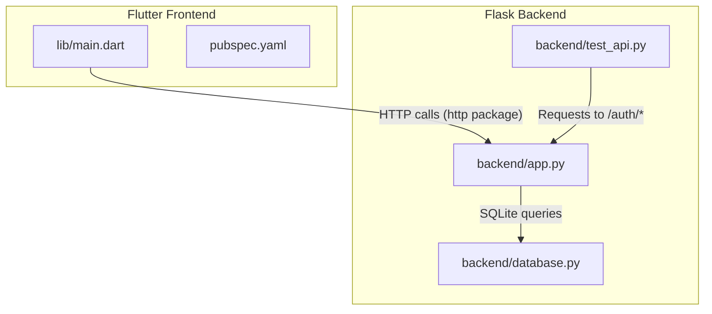
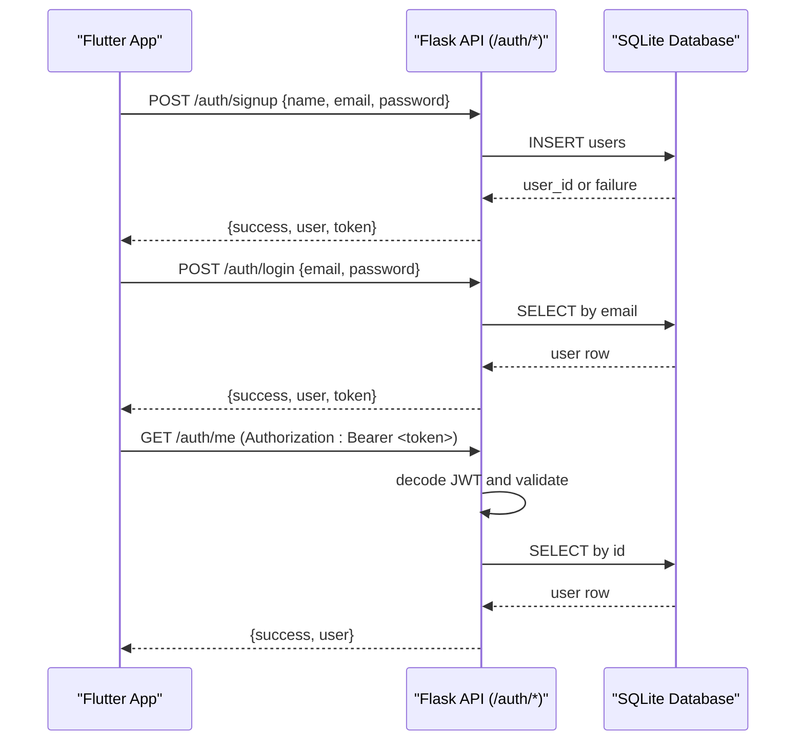
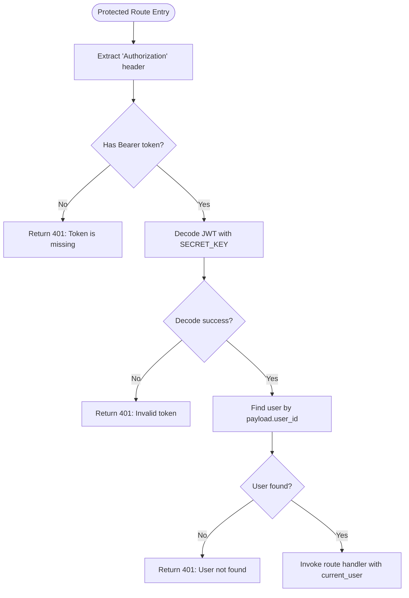
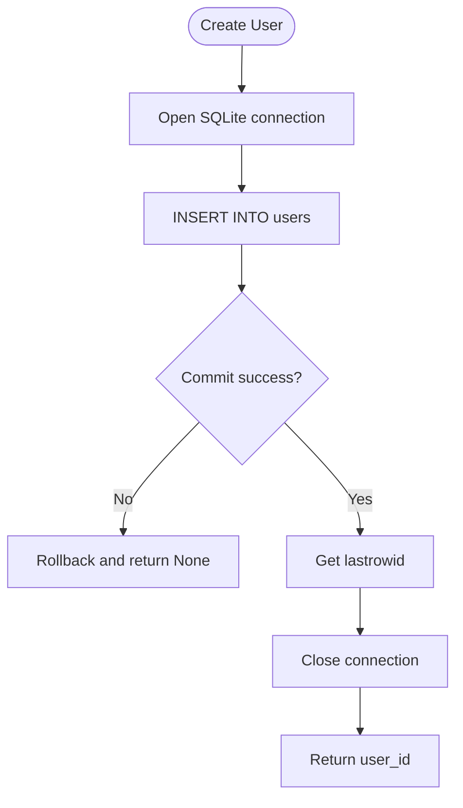
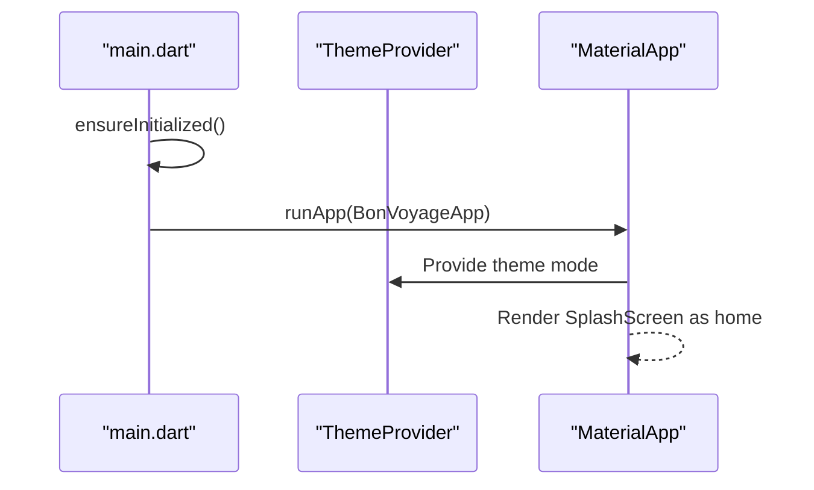
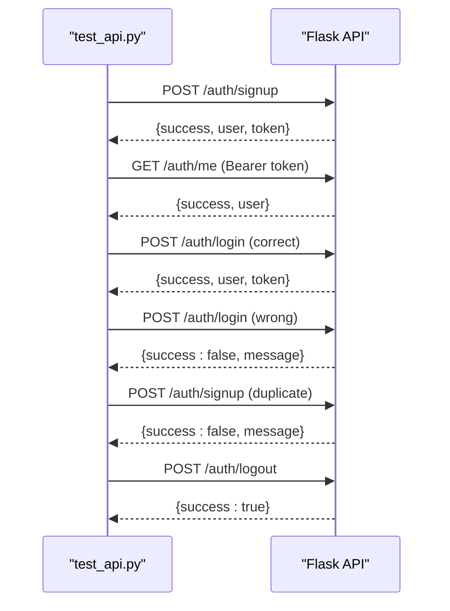
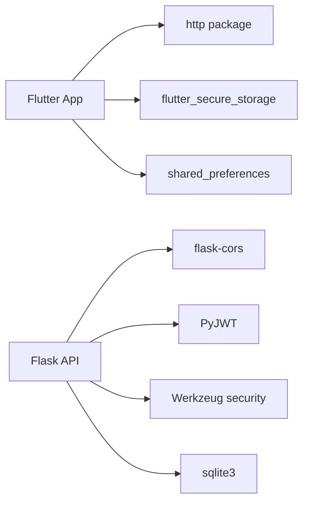

# Troubleshooting and Debugging

<cite>
**Referenced Files in This Document**
- [app.py](file://backend/app.py)
- [database.py](file://backend/database.py)
- [test_api.py](file://backend/test_api.py)
- [main.dart](file://lib/main.dart)
- [pubspec.yaml](file://pubspec.yaml)
</cite>

## Table of Contents
1. [Introduction](#introduction)
2. [Project Structure](#project-structure)
3. [Core Components](#core-components)
4. [Architecture Overview](#architecture-overview)
5. [Detailed Component Analysis](#detailed-component-analysis)
6. [Dependency Analysis](#dependency-analysis)
7. [Performance Considerations](#performance-considerations)
8. [Troubleshooting Guide](#troubleshooting-guide)
9. [Conclusion](#conclusion)
10. [Appendices](#appendices)

## Introduction
This document provides comprehensive troubleshooting and debugging guidance for the Bon Voyage Pakistan application across its Flutter frontend and Flask backend. It focuses on common issues such as JWT token failures, network connectivity problems, and build configuration errors. It also covers debugging techniques for both platforms, error handling patterns, logging best practices, performance diagnostics, and platform-specific considerations for Android, iOS, and web deployments.

## Project Structure
The project consists of:
- A Flutter frontend that initializes the app, manages theme state, and hosts screens for authentication and navigation.
- A Flask backend that exposes authentication endpoints, handles JWT issuance and validation, and persists users to a local SQLite database.
- A test script to validate API behavior end-to-end.

**Diagram sources**
- [main.dart:1-47](file://lib/main.dart#L1-L47)
- [pubspec.yaml:1-31](file://pubspec.yaml#L1-L31)
- [app.py:1-226](file://backend/app.py#L1-L226)
- [database.py:1-75](file://backend/database.py#L1-L75)
- [test_api.py:1-62](file://backend/test_api.py#L1-L62)

**Section sources**
- [main.dart:1-47](file://lib/main.dart#L1-L47)
- [pubspec.yaml:1-31](file://pubspec.yaml#L1-L31)
- [app.py:1-226](file://backend/app.py#L1-L226)
- [database.py:1-75](file://backend/database.py#L1-L75)
- [test_api.py:1-62](file://backend/test_api.py#L1-L62)

## Core Components
- Authentication service (frontend): Uses HTTP requests to call backend endpoints and stores tokens securely using flutter_secure_storage.
- Authentication routes (backend): Provide signup, login, protected user info retrieval, logout, and health check.
- Database layer (backend): Manages SQLite connection, schema initialization, and user CRUD operations.

Key responsibilities:
- Frontend: Initialize app, manage theme, orchestrate auth flows via services.
- Backend: Validate inputs, hash passwords, issue/verify JWTs, persist data.
- Tests: Exercise core flows to verify integration between client expectations and server behavior.

**Section sources**
- [app.py:109-216](file://backend/app.py#L109-L216)
- [database.py:20-75](file://backend/database.py#L20-L75)
- [main.dart:7-46](file://lib/main.dart#L7-L46)
- [pubspec.yaml:9-16](file://pubspec.yaml#L9-L16)

## Architecture Overview
The authentication flow involves the Flutter app calling backend endpoints to create accounts, log in, and access protected resources. The backend validates credentials, issues JWTs, and enforces authorization on protected routes.

**Diagram sources**
- [app.py:109-216](file://backend/app.py#L109-L216)
- [database.py:39-75](file://backend/database.py#L39-L75)

## Detailed Component Analysis

### Backend Authentication and Authorization
- Token protection: A decorator extracts the Bearer token from the Authorization header, decodes it with HS256 using the configured secret key, resolves the current user, and injects it into protected handlers.
- Token generation: Tokens include user identifier and expiration based on environment configuration.
- Error handling: Distinct responses for missing token, expired token, invalid token, and user not found.

**Diagram sources**
- [app.py:33-65](file://backend/app.py#L33-L65)
- [app.py:72-82](file://backend/app.py#L72-L82)

**Section sources**
- [app.py:33-82](file://backend/app.py#L33-L82)
- [app.py:186-193](file://backend/app.py#L186-L193)

### Database Layer
- Connection management: Creates connections with dictionary row factory for convenient access.
- Schema initialization: Ensures users table exists with unique email constraint.
- Operations: Create user with integrity error handling; find by email/id with proper resource cleanup.

**Diagram sources**
- [database.py:39-55](file://backend/database.py#L39-L55)

**Section sources**
- [database.py:13-75](file://backend/database.py#L13-L75)

### Flutter Application Initialization
- Initializes Flutter binding and runs the root widget.
- Wraps the app with theme provider scope and Material app configuration.

**Diagram sources**
- [main.dart:7-46](file://lib/main.dart#L7-L46)

**Section sources**
- [main.dart:7-46](file://lib/main.dart#L7-L46)

### API Test Script
- Exercises signup, token verification, login with correct/incorrect credentials, duplicate signup, and logout.
- Useful for validating backend behavior and diagnosing integration issues.

**Diagram sources**
- [test_api.py:1-62](file://backend/test_api.py#L1-L62)
- [app.py:109-216](file://backend/app.py#L109-L216)

**Section sources**
- [test_api.py:1-62](file://backend/test_api.py#L1-L62)

## Dependency Analysis
- Frontend dependencies relevant to networking and secure storage are declared in the pubspec file.
- Backend depends on Flask, CORS, PyJWT, Werkzeug security utilities, and sqlite3.

**Diagram sources**
- [pubspec.yaml:9-16](file://pubspec.yaml#L9-L16)
- [app.py:10-16](file://backend/app.py#L10-L16)

**Section sources**
- [pubspec.yaml:9-16](file://pubspec.yaml#L9-L16)
- [app.py:10-16](file://backend/app.py#L10-L16)

## Performance Considerations
- Backend:
  - Use connection pooling or a WSGI server like Gunicorn/Uvicorn for production instead of the development server.
  - Ensure indexes on frequently queried columns if the schema grows beyond a single table.
  - Avoid unnecessary joins or repeated queries; batch operations where possible.
- Frontend:
  - Profile rendering with Flutter DevTools to identify layout rebuilds and memory spikes.
  - Debounce network requests and cache responses when appropriate to reduce load.
  - Use efficient widgets and avoid rebuilding large subtrees unnecessarily.

[No sources needed since this section provides general guidance]

## Troubleshooting Guide

### Authentication Issues (JWT)
Symptoms:
- 401 Unauthorized on protected endpoints.
- Login succeeds but subsequent calls fail.
- Token appears valid but user not found.

Checklist:
- Verify the Authorization header format: must be "Bearer <token>".
- Confirm the backend SECRET_KEY used for decoding matches the one used during encoding.
- Check token expiration settings and system time synchronization.
- Ensure the user still exists in the database after token issuance.

Relevant code paths:
- Token extraction and decoding: [app.py:33-65](file://backend/app.py#L33-L65)
- Token generation: [app.py:72-82](file://backend/app.py#L72-L82)
- Protected route example: [app.py:186-193](file://backend/app.py#L186-L193)

Common fixes:
- Regenerate tokens after password changes or user deletion.
- Align SECRET_KEY across environments via environment variables.
- Update client to refresh tokens before expiry.

**Section sources**
- [app.py:33-82](file://backend/app.py#L33-L82)
- [app.py:186-193](file://backend/app.py#L186-L193)

### Network Connectivity Issues
Symptoms:
- Timeouts or DNS resolution failures from the app.
- CORS errors in browser console.
- Inability to reach backend from device/emulator.

Checklist:
- Confirm backend host and port accessibility from the device/network.
- For web, ensure CORS is enabled on the server side.
- Validate firewall rules and proxy configurations.
- Use the test script to isolate whether the issue is client-side or server-side.

Relevant code paths:
- CORS setup: [app.py:21-22](file://backend/app.py#L21-L22)
- Health endpoint for quick checks: [app.py:213-216](file://backend/app.py#L213-L216)
- End-to-end API tests: [test_api.py:1-62](file://backend/test_api.py#L1-L62)

**Section sources**
- [app.py:21-22](file://backend/app.py#L21-L22)
- [app.py:213-216](file://backend/app.py#L213-L216)
- [test_api.py:1-62](file://backend/test_api.py#L1-L62)

### Build Configuration Errors
Symptoms:
- Missing assets at runtime.
- Package resolution failures.
- Platform-specific build issues.

Checklist:
- Verify assets are listed under the flutter.assets section in pubspec.
- Ensure SDK constraints match your installed Flutter/Dart versions.
- Clean and rebuild artifacts when switching branches or updating dependencies.

Relevant files:
- Assets declaration: [pubspec.yaml:25-31](file://pubspec.yaml#L25-L31)
- Environment and dependencies: [pubspec.yaml:6-16](file://pubspec.yaml#L6-L16)

**Section sources**
- [pubspec.yaml:6-31](file://pubspec.yaml#L6-L31)

### Flutter Frontend Debugging Techniques
- Use Flutter DevTools:
  - Widgets Inspector to inspect tree and layout issues.
  - Performance overlay to detect jank and excessive rebuilds.
  - Memory tab to identify leaks and high allocations.
- Logging strategies:
  - Log request payloads and responses around network calls.
  - Wrap async operations with try/catch and log exceptions with context.
  - Add structured logs including timestamps and correlation IDs.
- Profiling:
  - Use the Timeline view to analyze frame times and long tasks.
  - Profile CPU usage to locate hotspots in business logic.

[No sources needed since this section provides general guidance]

### Backend Debugging Approaches
- Development mode:
  - Run with debug enabled to get detailed stack traces and auto-reload.
- Database query optimization:
  - Inspect slow queries and add indexes where necessary.
  - Use EXPLAIN plans to understand query execution.
- API endpoint testing:
  - Use the provided test script to validate flows quickly.
  - Extend tests to cover edge cases and error conditions.

Relevant code paths:
- Debug run configuration: [app.py:223-226](file://backend/app.py#L223-L226)
- API tests: [test_api.py:1-62](file://backend/test_api.py#L1-L62)

**Section sources**
- [app.py:223-226](file://backend/app.py#L223-L226)
- [test_api.py:1-62](file://backend/test_api.py#L1-L62)

### Error Handling Patterns and Logging Best Practices
- Backend:
  - Return consistent JSON envelopes with success flags and messages.
  - Differentiate between client errors (4xx) and server errors (5xx).
  - Log sensitive information carefully; avoid logging secrets or full tokens.
- Frontend:
  - Centralize error handling in services to standardize user feedback.
  - Retry transient network failures with exponential backoff.
  - Surface actionable messages to users while preserving technical details in logs.

[No sources needed since this section provides general guidance]

### Diagnostic Tools and Techniques
- Identify bottlenecks:
  - Use Flutter DevTools Timeline and Performance tabs.
  - On the backend, measure response times and database query durations.
- Detect memory leaks:
  - Take heap snapshots in DevTools and compare over time.
  - Monitor process memory on the backend under load.
- Performance profiling:
  - Enable sampling profilers for CPU-bound workloads.
  - Instrument critical paths with timing metrics.

[No sources needed since this section provides general guidance]

### Platform-Specific Debugging Considerations
- Android:
  - Use adb logcat to capture native logs and crashes.
  - Verify internet permissions and network security configurations.
- iOS:
  - Use Xcode console and Instruments for profiling.
  - Check entitlements and network capabilities.
- Web:
  - Use browser DevTools Network and Console tabs.
  - Validate CORS policies and mixed content warnings.

[No sources needed since this section provides general guidance]

### Step-by-Step Guides for Frequent Issues
- Resolving JWT failures:
  - Confirm token presence and format in Authorization header.
  - Verify SECRET_KEY alignment between environments.
  - Check token expiration and regenerate if needed.
  - Validate user existence post-decode.
- Fixing network connectivity:
  - Ping the backend host and port from the device.
  - Ensure CORS is enabled and origins are allowed.
  - Use the health endpoint to confirm server availability.
- Addressing build configuration errors:
  - Sync pubspec assets and dependencies.
  - Clean and rebuild the project.
  - Validate SDK version compatibility.

[No sources needed since this section provides general guidance]

### Preventive Measures
- Enforce input validation on both client and server.
- Use environment variables for secrets and configuration.
- Implement rate limiting and request size limits on the backend.
- Write automated tests for critical flows and integrate them into CI.
- Monitor application health with uptime and error tracking tools.

[No sources needed since this section provides general guidance]

## Conclusion
This guide outlined the architecture and key components of the Bon Voyage Pakistan application and provided targeted troubleshooting steps for authentication, networking, and build issues. By applying the recommended debugging techniques, error handling patterns, and performance diagnostics, you can efficiently identify and resolve issues across Flutter and Flask layers while maintaining a robust and maintainable codebase.

## Appendices

### Quick Reference: Key Endpoints and Behaviors
- POST /auth/signup: Validates input, hashes password, creates user, returns token.
- POST /auth/login: Authenticates user, returns token.
- GET /auth/me: Protected; requires valid Bearer token; returns user info.
- POST /auth/logout: Stateless; useful for completeness.
- GET /: Health check.

**Section sources**
- [app.py:109-216](file://backend/app.py#L109-L216)