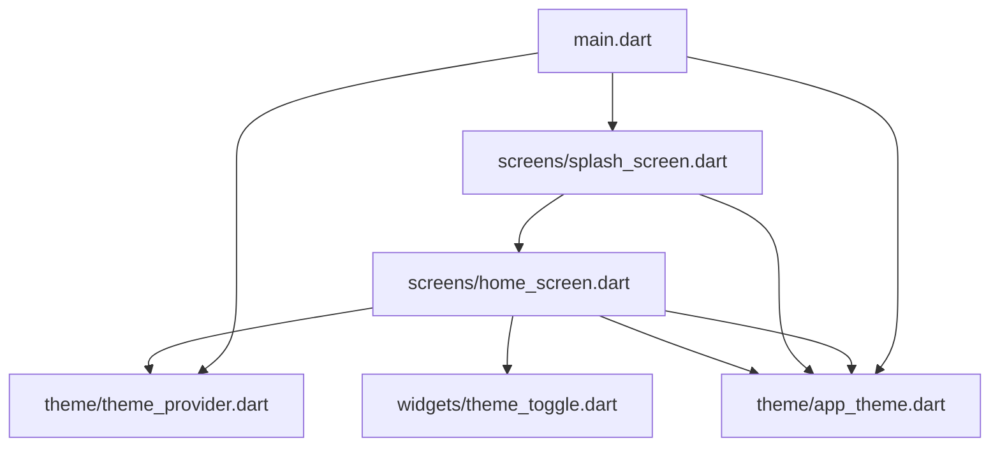
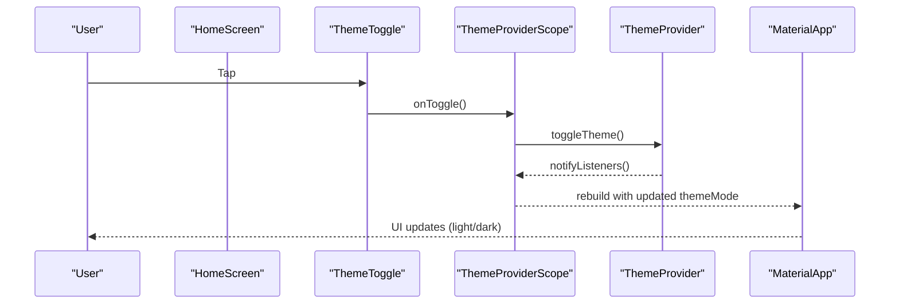
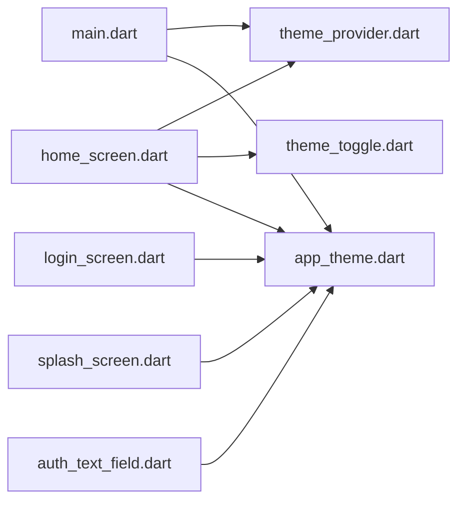

# UI Components and Widgets

<cite>
**Referenced Files in This Document**
- [main.dart](file://lib/main.dart)
- [app_theme.dart](file://lib/theme/app_theme.dart)
- [theme_provider.dart](file://lib/theme/theme_provider.dart)
- [theme_toggle.dart](file://lib/widgets/theme_toggle.dart)
- [auth_text_field.dart](file://lib/widgets/auth_text_field.dart)
- [home_screen.dart](file://lib/screens/home_screen.dart)
- [login_screen.dart](file://lib/screens/login_screen.dart)
- [splash_screen.dart](file://lib/screens/splash_screen.dart)
- [pubspec.yaml](file://pubspec.yaml)
</cite>

## Table of Contents
1. Introduction
2. Project Structure
3. Core Components
4. Architecture Overview
5. Detailed Component Analysis
6. Dependency Analysis
7. Performance Considerations
8. Troubleshooting Guide
9. Conclusion

## Introduction
This document provides a comprehensive guide to the UI components and widgets used in the Bon Voyage Pakistan Flutter application. It focuses on reusable widgets, the theme system with light/dark mode switching, Material Design integration, custom styling approaches, responsive design patterns, animation usage, accessibility considerations, and performance optimization techniques. It also includes guidelines for creating new custom widgets that follow the established patterns and integrate seamlessly with the app’s architecture.

## Project Structure
The UI layer is organized into focused directories:
- Theme configuration and state management live under lib/theme.
- Reusable UI components are implemented under lib/widgets.
- Screens compose these widgets and orchestrate navigation and user flows under lib/screens.
- The application entry point initializes the theme provider and Material app under lib/main.dart.

**Diagram sources**
- [main.dart:1-47](file://lib/main.dart#L1-L47)
- [app_theme.dart:1-367](file://lib/theme/app_theme.dart#L1-L367)
- [theme_provider.dart:1-64](file://lib/theme/theme_provider.dart#L1-L64)
- [splash_screen.dart:1-200](file://lib/screens/splash_screen.dart#L1-L200)
- [home_screen.dart:1-800](file://lib/screens/home_screen.dart#L1-L800)
- [theme_toggle.dart:1-53](file://lib/widgets/theme_toggle.dart#L1-L53)

**Section sources**
- [main.dart:1-47](file://lib/main.dart#L1-L47)
- [pubspec.yaml:1-31](file://pubspec.yaml#L1-L31)

## Core Components
- Theme system: Centralized color palette, typography, and component themes via AppTheme, with dynamic light/dark support.
- Theme state: ThemeProvider manages current theme mode, persists selection, and exposes a scope for descendants.
- Reusable widgets: ThemeToggle for theme switching; AuthTextField for consistent authentication inputs.
- Screens: Splash, Login, Home demonstrate composition, animations, and integration with theme and services.

Key responsibilities:
- AppTheme defines colors, text styles, button themes, and input decoration themes for both brightness modes.
- ThemeProvider encapsulates theme mode state and persistence using shared preferences.
- ThemeToggle provides an animated toggle control bound to ThemeProvider.
- AuthTextField standardizes input fields with validation, prefix icons, and password visibility toggling.

**Section sources**
- [app_theme.dart:1-367](file://lib/theme/app_theme.dart#L1-L367)
- [theme_provider.dart:1-64](file://lib/theme/theme_provider.dart#L1-L64)
- [theme_toggle.dart:1-53](file://lib/widgets/theme_toggle.dart#L1-L53)
- [auth_text_field.dart:1-97](file://lib/widgets/auth_text_field.dart#L1-L97)

## Architecture Overview
The app uses a lightweight state management approach centered around ChangeNotifier (ThemeProvider) and InheritedNotifier (ThemeProviderScope). The root widget wraps MaterialApp with ThemeProviderScope so descendant screens can access and mutate theme state.

**Diagram sources**
- [home_screen.dart:370-392](file://lib/screens/home_screen.dart#L370-L392)
- [theme_toggle.dart:15-51](file://lib/widgets/theme_toggle.dart#L15-L51)
- [theme_provider.dart:29-47](file://lib/theme/theme_provider.dart#L29-L47)
- [main.dart:23-44](file://lib/main.dart#L23-L44)

## Detailed Component Analysis

### Theme System (AppTheme)
AppTheme centralizes the visual identity:
- Color palette: Primary olive-green accent, secondary warm tones, error/success colors, and distinct light/dark backgrounds and surfaces.
- Typography: Consistent text styles across display, headline, title, body, and label scales with appropriate font families and weights.
- Component themes: ElevatedButton and TextButton themes enforce brand colors, sizes, shapes, and typography.
- Input decoration: Rounded filled fields with focus/error states aligned to the theme.

Usage highlights:
- Light and dark ThemeData builders select appropriate colors based on brightness.
- AppBarTheme sets transparent background, elevation, center title, and icon/title text styles.
- InputDecorationTheme configures borders, fill, content padding, and hint/label styles.

Customization points:
- Add new semantic colors by extending the palette and mapping them into the color scheme.
- Extend or override button/input themes to create variant styles while preserving consistency.

Accessibility notes:
- Ensure contrast ratios meet guidelines for text and interactive elements in both themes.
- Use semantic labels for icons and buttons where needed.

**Section sources**
- [app_theme.dart:10-133](file://lib/theme/app_theme.dart#L10-L133)
- [app_theme.dart:135-235](file://lib/theme/app_theme.dart#L135-L235)
- [app_theme.dart:237-367](file://lib/theme/app_theme.dart#L237-L367)

### Theme State Management (ThemeProvider and ThemeProviderScope)
ThemeProvider:
- Holds current ThemeMode and exposes getters for mode and brightness.
- Persists theme choice using SharedPreferences.
- Provides methods to toggle or set theme explicitly and notifies listeners to trigger UI rebuilds.
- Exposes a convenience getter to compute the active ThemeData based on current mode.

ThemeProviderScope:
- Wraps the app tree with InheritedNotifier to expose ThemeProvider to descendants.
- Offers a static helper to retrieve the notifier from BuildContext safely.

Integration:
- Root widget creates ThemeProvider instance and passes it to ThemeProviderScope.
- MaterialApp receives themeMode from the provider, enabling seamless light/dark switching.

Best practices:
- Always call toggleTheme or setTheme through the provider to ensure persistence and notifications.
- Avoid direct manipulation of internal state outside the provider.

**Section sources**
- [theme_provider.dart:5-48](file://lib/theme/theme_provider.dart#L5-L48)
- [theme_provider.dart:50-64](file://lib/theme/theme_provider.dart#L50-L64)
- [main.dart:23-44](file://lib/main.dart#L23-L44)

### ThemeToggle Widget
ThemeToggle is a compact, animated toggle button:
- Props: isDark (boolean), onToggle (callback).
- Behavior: Toggles theme via provided callback; visually switches between sun/moon icons with rotation and fade transitions.
- Styling: Circular container with subtle border and shadow; adapts colors based on theme.

Usage example pattern:
- Place within profile menus or settings rows.
- Bind onToggle to ThemeProviderScope.of(context).toggleTheme().

Accessibility:
- Ensure accessible name via semantics if needed (e.g., “Switch to light mode”).

Performance:
- Uses AnimatedSwitcher with short durations to minimize layout thrash.

**Section sources**
- [theme_toggle.dart:1-53](file://lib/widgets/theme_toggle.dart#L1-L53)
- [home_screen.dart:370-392](file://lib/screens/home_screen.dart#L370-L392)

### AuthTextField Widget
AuthTextField standardizes authentication inputs:
- Props: controller, label, hint, prefixIcon, isPassword, keyboardType, validator.
- Features: Password visibility toggle, rounded borders, consistent colors, and validation hooks.
- States: Normal, focused, error, and disabled states are styled consistently.

Usage example pattern:
- Wrap in Form with GlobalKey<FormState>.
- Provide validators for email/password rules.
- Compose multiple fields vertically with spacing.

Accessibility:
- Use meaningful labels and hints.
- Ensure error messages are announced by screen readers.

Performance:
- Keep controllers scoped to their owning widget and dispose properly.

**Section sources**
- [auth_text_field.dart:1-97](file://lib/widgets/auth_text_field.dart#L1-L97)
- [login_screen.dart:18-25](file://lib/screens/login_screen.dart#L18-L25)
- [login_screen.dart:214-237](file://lib/screens/login_screen.dart#L214-L237)

### Screen Integration Examples

#### HomeScreen
- Demonstrates bottom navigation, profile menu, and theme toggle integration.
- Uses ThemeProviderScope.of(context).toggleTheme() to switch themes from the profile menu.
- Applies theme-aware colors and typography throughout.

Interaction flow:
- User opens profile menu -> taps Appearance row -> ThemeToggle triggers theme change -> UI rebuilds with new theme.

**Section sources**
- [home_screen.dart:370-392](file://lib/screens/home_screen.dart#L370-L392)
- [home_screen.dart:425-800](file://lib/screens/home_screen.dart#L425-L800)

#### LoginScreen
- Implements form-based login with animations and error handling.
- Uses theme-aware colors and consistent input styling.
- Navigates to HomeScreen on success and shows errors inline.

Animation highlights:
- Fade and slide transitions for entrance effects.
- AnimatedSwitcher for loading indicator vs. button content.

**Section sources**
- [login_screen.dart:16-51](file://lib/screens/login_screen.dart#L16-L51)
- [login_screen.dart:53-82](file://lib/screens/login_screen.dart#L53-L82)
- [login_screen.dart:98-369](file://lib/screens/login_screen.dart#L98-L369)
- [login_screen.dart:371-441](file://lib/screens/login_screen.dart#L371-L441)

#### SplashScreen
- Displays branded logo with staggered animations.
- Checks authentication token and navigates to HomeScreen or OnboardingScreen.

Animation highlights:
- Staggered fade and slide transitions for logo, title, subtitle, and progress indicator.

**Section sources**
- [splash_screen.dart:20-67](file://lib/screens/splash_screen.dart#L20-L67)
- [splash_screen.dart:69-87](file://lib/screens/splash_screen.dart#L69-L87)
- [splash_screen.dart:89-199](file://lib/screens/splash_screen.dart#L89-L199)

## Dependency Analysis
The UI components depend on the theme system and each other as follows:

**Diagram sources**
- [main.dart:1-47](file://lib/main.dart#L1-L47)
- [theme_provider.dart:1-64](file://lib/theme/theme_provider.dart#L1-L64)
- [app_theme.dart:1-367](file://lib/theme/app_theme.dart#L1-L367)
- [home_screen.dart:1-800](file://lib/screens/home_screen.dart#L1-L800)
- [theme_toggle.dart:1-53](file://lib/widgets/theme_toggle.dart#L1-L53)
- [login_screen.dart:1-444](file://lib/screens/login_screen.dart#L1-L444)
- [splash_screen.dart:1-200](file://lib/screens/splash_screen.dart#L1-L200)
- [auth_text_field.dart:1-97](file://lib/widgets/auth_text_field.dart#L1-L97)

**Section sources**
- [main.dart:1-47](file://lib/main.dart#L1-L47)
- [home_screen.dart:1-800](file://lib/screens/home_screen.dart#L1-L800)
- [login_screen.dart:1-444](file://lib/screens/login_screen.dart#L1-L444)
- [splash_screen.dart:1-200](file://lib/screens/splash_screen.dart#L1-L200)
- [theme_toggle.dart:1-53](file://lib/widgets/theme_toggle.dart#L1-L53)
- [auth_text_field.dart:1-97](file://lib/widgets/auth_text_field.dart#L1-L97)

## Performance Considerations
- Prefer const constructors for static widgets to reduce rebuilds.
- Use AnimatedSwitcher sparingly and keep durations short to avoid jank.
- Avoid heavy computations inside build; move logic to initState or separate functions.
- Reuse controllers and dispose them properly to prevent memory leaks.
- Leverage theme-aware colors rather than hardcoding to minimize conditional logic in widgets.
- Use slivers and efficient scrolling patterns in long lists (as seen in HomeScreen).

[No sources needed since this section provides general guidance]

## Troubleshooting Guide
Common issues and resolutions:
- Theme not updating:
  - Ensure you call toggleTheme or setTheme on ThemeProvider and that your widget tree is wrapped with ThemeProviderScope.
  - Verify that MaterialApp receives themeMode from the provider.
- Inputs not validating:
  - Confirm TextFormField has a validator and is part of a Form with a GlobalKey.
  - Check that the parent widget calls validate before submitting.
- Animations not playing:
  - Ensure AnimationController is initialized and disposed correctly.
  - Verify CurvedAnimation and Tween configurations match expected ranges.
- Accessibility problems:
  - Add semantic labels to icons and buttons where necessary.
  - Ensure error messages are associated with inputs for screen reader announcements.

**Section sources**
- [theme_provider.dart:29-47](file://lib/theme/theme_provider.dart#L29-L47)
- [main.dart:23-44](file://lib/main.dart#L23-L44)
- [auth_text_field.dart:31-96](file://lib/widgets/auth_text_field.dart#L31-L96)
- [login_screen.dart:16-51](file://lib/screens/login_screen.dart#L16-L51)

## Conclusion
The Bon Voyage Pakistan application implements a cohesive UI system built around a centralized theme, a simple yet effective state provider for theme switching, and reusable widgets that maintain consistency across screens. The design leverages Material Design principles with custom styling, thoughtful animations, and responsive layouts. By following the patterns outlined here—centralizing theme definitions, managing state via ThemeProvider, composing widgets with clear props and events, and adhering to accessibility and performance best practices—you can extend the UI with new components that integrate seamlessly into the existing architecture.

[No sources needed since this section summarizes without analyzing specific files]