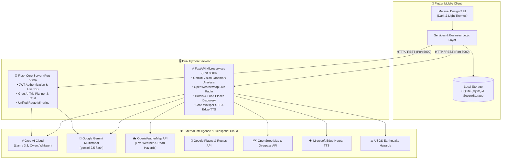
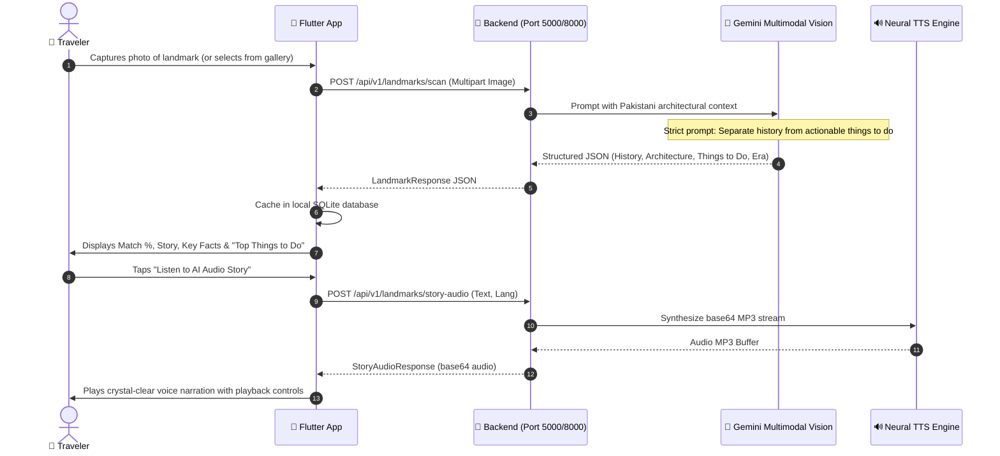
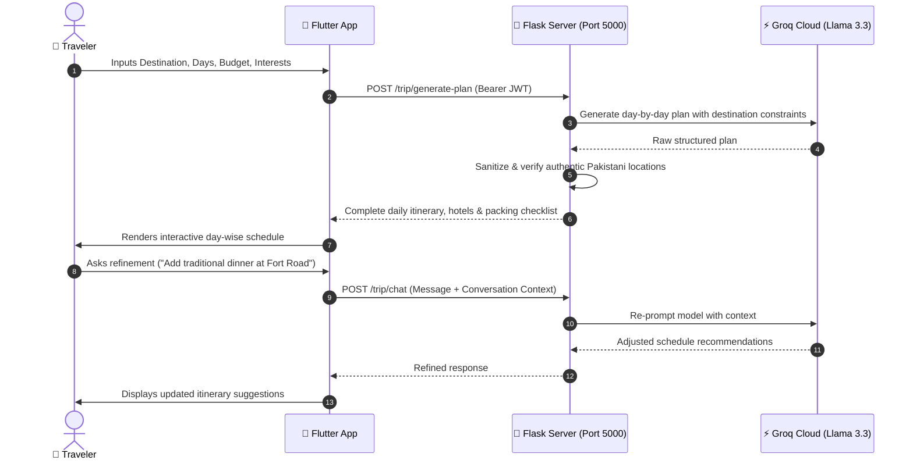

# 🏔️ Bon Voyage Pakistan (BVP)
> **Discover Pakistan, Beyond the Map.**  
> An intelligent, AI-powered smart tourism companion, visual heritage explorer, and travel safety assistant engineered specifically for travelers journeying across Pakistan.

[](https://flutter.dev/)
[](https://dart.dev/)
[](https://www.python.org/)
[](https://fastapi.tiangolo.com/)
[](https://flask.palletsprojects.com/)
[](https://groq.com/)
[](https://ai.google.dev/)
[](https://openweathermap.org/)
[](https://www.openstreetmap.org/)

---

## 📌 Table of Contents
1. [Executive Overview](#-executive-overview)
2. [What's New in the Latest Release](#-whats-new-in-the-latest-release)
3. [Comprehensive Feature Suite](#-comprehensive-feature-suite)
   - [1. AI Tour Planning & Itinerary Engine](#1--ai-tour-planning--itinerary-engine)
   - [2. Smart Landmark Vision Scanner & Neural Storyteller](#2--smart-landmark-vision-scanner--neural-storyteller)
   - [3. Live Weather & Road Safety Radar](#3--live-weather--road-safety-radar)
   - [4. Stays & Accommodations Finder (Hotels)](#4--stays--accommodations-finder-hotels)
   - [5. Food & Dining Culinary Guide](#5--food--dining-culinary-guide)
   - [6. First Aid & Emergency Medical Locator](#6--first-aid--emergency-medical-locator)
   - [7. Multilingual Speech & Text Translator](#7--multilingual-speech--text-translator)
   - [8. Interactive Geospatial Mapping & Routing](#8--interactive-geospatial-mapping--routing)
   - [9. User Profiles, Security & Theme System](#9--user-profiles-security--theme-system)
4. [System Architecture](#-system-architecture)
5. [End-to-End Technical Workflows](#-end-to-end-technical-workflows)
6. [Technology Stack](#-technology-stack)
7. [Project Directory Structure](#-project-directory-structure)
8. [Complete API Endpoints Reference](#-complete-api-endpoints-reference)
9. [Installation & Setup](#-installation--setup)
   - [Prerequisites](#prerequisites)
   - [1. Backend Setup](#1-backend-setup)
   - [2. Mobile Client Setup](#2-mobile-client-setup)
10. [Running the Application](#-running-the-application)
    - [Terminal 1: FastAPI Async Microservices](#terminal-1-fastapi-async-microservices-port-8000)
    - [Terminal 2: Flask Core Server](#terminal-2-flask-core-server-port-5000)
    - [Terminal 3: Flutter Mobile Client](#terminal-3-flutter-mobile-client)
11. [Configuration & Environment Variables](#-configuration--environment-variables)
12. [Verification & Testing](#-verification--testing)
13. [License & Acknowledgments](#-license--acknowledgments)

---

## 🌟 Executive Overview

**Bon Voyage Pakistan (BVP)** is an all-in-one smart travel super-app built specifically to resolve the unique challenges of traveling in Pakistan. Navigating across historical metropolitan hubs (Lahore, Karachi, Islamabad) to rugged high-altitude valleys (Hunza, Skardu, Swat, Chitral) requires specialized cultural, linguistic, geographical, and safety context.

BVP bridges these on-ground travel requirements with modern edge and cloud AI:
- **Groq Llama 3.3 / Qwen LLMs**: Ultra-low latency generation of realistic multi-day Pakistani itineraries, custom checklists, and conversational trip adjustment.
- **Google Gemini Multimodal Vision**: Camera and photo-based landmark identification capable of recognizing Mughal monuments, Gandharan ruins, and northern fortresses with verified architectural lore.
- **Dedicated Visitor Activities Engine**: AI-curated actionable things to do (sightseeing, photography spots, museum visits, local culinary streets) decoupled from historical dates.
- **Microsoft Edge-TTS & Groq Whisper**: Ultra-responsive speech-to-speech bilingual translation and high-fidelity oral storytelling in English and Urdu (`ur-PK-UzmaNeural`).
- **Live OpenWeatherMap & USGS Radar**: City-wide weather search bar with real-time temperature, wind, humidity, road hazard advisories, and Northern Pakistan seismic event tracking.
- **Interactive OpenStreetMap Engine**: Client-side vector tile rendering via `flutter_map` with turn-by-turn route computation, eliminating high proprietary map SDK costs.

---

## 🚀 What's New in the Latest Release

- 🧭 **Official Brand Launcher Icon**: Custom circular BVP Compass emblem across standard, round, and adaptive Android/iOS densities (`app_icon.png`).
- 🏛️ **Actionable "Top Things to Do" in Landmark Scanner**: Overhauled the landmark vision engine. "Top Things to Do" strictly displays actionable visitor experiences, photography tips, and culinary walks rather than historical milestones/chronology.
- 🌦️ **Live City Weather Search Engine**: New dedicated weather screen powered by OpenWeatherMap with dynamic search for all Pakistani cities and northern valleys.
- 🏨 **City-Bound Stays Search**: Geofenced hotel search by canonical Pakistani coordinates, preventing cross-city leakage, featuring real hotel photography and clean aesthetic cards.
- 🍲 **Verified Food & Cuisine Filter**: Deep-cuisine filtering (Desi, BBQ, Karahi, Biryani, Chinese, Continental, Fast Food) delivering authentic local establishments with verified specialties.
- 🏥 **Optimized First Aid & Medical Directory**: Streamlined assistance categories (Emergency, First Aid, Private, Govt, Pharmacy) with custom badges and one-touch national emergency dialers.
- 🌓 **Global Theme System**: Seamless toggle between Dark & Light themes with custom emerald/slate palette across all screens.

---

## 📱 Comprehensive Feature Suite

### 1. 🤖 AI Tour Planning & Itinerary Engine
- **Custom Multi-Day Generation**: Plan itineraries from 1 to 14 days customized for solo travelers, families, adventure seekers, cultural buffs, or foodies.
- **Anti-Hallucination Verification**: Backend filters cross-check recommended destinations, monuments, and roads against ground-truth Pakistani geography.
- **Interactive Conversational Refinement**: Directly chat with the AI travel agent (`/trip/chat`) to refine schedules (e.g., *"Make Day 3 more relaxing for elderly parents"*, *"Add a traditional dinner at Fort Road Food Street"*).
- **Automated Trip Checklist**: Smart packing lists tailored to the specific terrain (warm layers for Hunza/Skardu, trekking shoes, altitude medication, power banks, cash notes for remote valleys).

### 2. 🏛️ Smart Landmark Vision Scanner & Neural Storyteller
- **Multimodal Visual Identification**: Snap a photo or choose an image from the gallery. Google Gemini Multimodal Vision identifies the landmark with a confidence score.
- **Authentic Architectural Context**: Comprehensive historical era, architectural highlights, masonry details, and cultural importance.
- **"Top Things to Do" Section**: Strictly actionable tourist recommendations:
  - Guided walking routes through main halls and courtyards.
  - Golden-hour photography viewpoints (sunrise/sunset).
  - On-site heritage relic museums and exhibits.
  - Authentic culinary delicacies and tea spots in the surrounding bazaars.
- **Bilingual Neural Audio Storyteller**: High-fidelity synthesized oral storytelling (`ur-PK-UzmaNeural` or `en-US`) with integrated playback controls (play, pause, seek).
- **Offline Scan History**: Automatically saves recognized landmarks locally in SQLite (`sqflite`) with image caching and favorites tagging.

### 3. 🌦️ Live Weather & Road Safety Radar
- **OpenWeatherMap Integration**: Live weather parameters (temperature, "feels like", humidity, wind speed, visibility, and sky conditions).
- **Dynamic City Search**: Instant search bar supporting metropolitan cities and remote northern destinations (Islamabad, Lahore, Karachi, Hunza, Skardu, Gilgit, Swat/Kalam, Naran, Chitral, Gwadar, Ziarat, etc.).
- **Situational Travel Advisory**: Evaluates meteorological conditions to surface road warnings (monsoon flash floods, snow blockages on Karakoram Highway/Babusar Pass, winter fog/smog).

### 4. 🏨 Stays & Accommodations Finder (Hotels)
- **City-Specific Geocoding**: Search verified accommodations across major destinations without cross-city spillover.

- **Rich Filtering**: Filter by star rating, property type (Hotel, Resort, Guest House), and amenities (Wi-Fi, Heating, Parking, Breakfast).
- **Clean Aesthetic Cards**: Clutter-free design focusing on verified amenities, guest ratings, location, and direct waypoint map navigation.

### 5. 🍲 Food & Dining Culinary Guide
- **Authentic Pakistani Cuisine Taxonomy**: Dedicated filters for Desi, Karahi, Balochi Sajji, Chapli Kabab, BBQ, Biryani, Fast Food, Chinese, Continental, and Traditional Chai/Sweets.
- **Verified Local Specialties**: Displays authentic signature dishes for each restaurant (e.g. Shinwari Karahi, Dum Pukht, Mutton Kunna, Halwa Puri).
- **Interactive Restaurant Cards**: Shows exact address, opening status, average rating, contact info, and one-tap turn-by-turn routing.

### 6. 🏥 First Aid & Emergency Medical Locator
- **5 Streamlined Categories**:
  - 🚨 **Emergency**: 24/7 trauma centers and emergency rooms.
  - 🩹 **First Aid**: Urgent care clinics and basic health units.
  - 🏥 **Private Hospitals**: Comprehensive tertiary private healthcare.
  - 🏛️ **Government Hospitals**: District headquarters (DHQ) and public medical complexes.
  - 💊 **Pharmacies**: 24-hour dispensaries and medical stores.
- **Emergency Speed Dialers**: Direct phone call triggers for **1122 (Rescue)**, **15 (Police)**, **115 (Edhi Ambulance)**, **1020 (Chhipa)**, and **130 (Motorway Police)**.
- **Offline Medical Handbook**: Practical guides for high-altitude sickness (AMS/HAPE/HACE), hypothermia, fractures, heat exhaustion, and snakebite first response.

### 7. 🗣️ Multilingual Speech & Text Translator
- **Bidirectional Speech Translation**: English ⇋ Urdu, with support for regional dialects.
- **Groq Whisper STT**: High-accuracy voice transcription even in noisy outdoor environments.
- **Microsoft Edge-TTS**: Expressive neural speech synthesis for crystal-clear spoken translation.
- **Categorized Offline Phrasebook**: Quick essential phrases with Urdu text, English transliteration, and audio pronunciation for Emergency, Shopping, Transit, Food, and Greetings.

### 8. 🗺️ Interactive Geospatial Mapping & Routing
- **OpenStreetMap (`flutter_map`)**: High-performance client-rendered map canvas with smooth zooming, panning, and zero proprietary map licensing restrictions.
- **Turn-by-Turn Waypoints**: Computes polyline driving routes between traveler position and chosen hotels, restaurants, or medical facilities.
- **Custom Themed Markers**: Visually distinct pins for hospitals, hotels, restaurants, and historical monuments.

### 9. 🔐 User Profiles, Security & Theme System
- **JWT Authentication**: Secure registration, login, and token refresh with password hashing via `werkzeug.security`.
- **Profile Management**: Update display name, change password securely, and manage session tokens.
- **Hardware-Level Encryption**: Sensitive auth tokens stored via `flutter_secure_storage` using Android Keystore and iOS Keychain.
- **Dark & Light Mode**: Fluid theme toggle (`ThemeToggle`) supporting vibrant emerald and deep slate colorways.

---

## 🏗️ System Architecture

BVP adopts a robust dual-server architecture:
1. **Flask Core Server (Port `5000`)**: Handles user authentication, SQLite database, Groq LLM tour planning, conversational chat, and landmark vision routing.
2. **FastAPI High-Performance Async Microservices (Port `8000`)**: Handles async vision analysis, speech recognition (Whisper), neural TTS streaming, geospatial POI queries, and live weather/hazard feeds.
3. **Dynamic Host Resolution (`ApiConfig`)**: Flutter automatically adapts its connection mode based on the environment (ADB reverse port forwarding, Wi-Fi LAN IP, or Android emulator host `10.0.2.2`).



---

## 🔄 End-to-End Technical Workflows

### 1. Landmark Vision Recognition & Actionable Things to Do


### 2. Conversational AI Tour Planning


---

## 💻 Technology Stack

| Domain | Technology / Component | Details & Version |
| :--- | :--- | :--- |
| **Mobile Client** | [Flutter](https://flutter.dev/) | `v3.41+` (Material Design 3, Dark & Light Mode) |
| **Language (Mobile)** | [Dart](https://dart.dev/) | `v3.11+` |
| **Local Storage** | `sqflite`, `flutter_secure_storage`, `shared_preferences` | SQLite relational DB, Android Keystore / iOS Keychain |
| **Mapping & Location** | `flutter_map`, `latlong2`, `geolocator` | OpenStreetMap vector tiles, GPS coordinates, geofencing |
| **Media & Audio** | `camera`, `audioplayers`, `record` | Camera capture, voice STT recording, neural audio playback |
| **Backend Core** | [Python](https://www.python.org/) | `Python 3.10` / `Python 3.13` runtime |
| **FastAPI Microservices** | [FastAPI](https://fastapi.tiangolo.com/) + `Uvicorn` | Async REST framework, Pydantic v2 validation (Port 8000) |
| **Flask Core Server** | [Flask](https://flask.palletsprojects.com/) + `PyJWT` | User authentication, SQLite DB, Groq trip planner (Port 5000) |
| **LLM Inference** | [Groq Cloud API](https://groq.com/) | Llama 3.3 70B, Qwen 2.5 (Trip planning & conversational chat) |
| **Speech Recognition** | [Groq Whisper](https://groq.com/) | `whisper-large-v3` for speech-to-text transcription |
| **Multimodal Vision** | [Google Gemini Vision](https://ai.google.dev/) | `gemini-2.5-flash`, `gemini-1.5-flash` with automatic fallback |
| **Speech Synthesis** | [Microsoft Edge-TTS](https://github.com/rany2/edge-tts) | Neural voice synthesis (`ur-PK-UzmaNeural`, `en-US-JennyNeural`) |
| **Live Weather** | [OpenWeatherMap API](https://openweathermap.org/) | Real-time weather parameters & travel situational hazards |
| **Geospatial & Places** | Google Places & Routes API, Geoapify, OSM | POI search, bounding-box validation, route geometry |


---

## 📂 Project Directory Structure

```text
Bon-Voyage-Pakistan/
├── README.md                                  # Top-level repository documentation
└── Bon_Voyage_Pakistan_Qoder/
    ├── README.md                              # Application comprehensive documentation
    ├── pubspec.yaml                           # Flutter dependencies, assets & launcher icons
    │
    ├── assets/                                # Static Application Assets
    │   ├── images/
    │   │   ├── app_icon.png                   # Official BVP circular compass logo
    │   │   ├── logo.png                       # Primary brand asset
    │   │   ├── onboarding1.png                # Onboarding screen asset
    │   │   ├── onboarding2.png                # Onboarding screen asset
    │   │   ├── login_bg.png                   # Auth background graphic
    │   │   └── signup_bg.png                  # Auth background graphic
    │   └── videos/                            # Ambient onboarding video background
    │
    ├── lib/                                   # Flutter Client Source Code
    │   ├── main.dart                          # App bootstrap, theme initialization
    │   ├── config/
    │   │   └── api_config.dart                # Dynamic host resolution (ADB, Wi-Fi, Emulator)
    │   ├── models/                            # Strongly typed Dart models
    │   │   ├── user.dart                      # User profile & credentials
    │   │   ├── scan_item_model.dart           # Landmark scan item with things to do
    │   │   ├── hotel_model.dart               # Hotel details, star rating & amenities
    │   │   ├── food_place_model.dart          # Food places & verified specialties
    │   │   ├── medical_facility_model.dart    # Hospitals, pharmacies & emergency badges
    │   │   ├── weather_model.dart             # OpenWeatherMap data & road conditions
    │   │   ├── travel_alert_model.dart        # USGS seismic alerts & weather warnings
    │   │   ├── trip_plan_model.dart           # Structured multi-day itinerary model
    │   │   ├── trip_checklist_item_model.dart # Smart packing checklist model
    │   │   └── translation_model.dart         # Speech & text translation model
    │   ├── screens/                           # User Interface Views
    │   │   ├── splash_screen.dart             # Animated splash screen
    │   │   ├── onboarding_screen.dart         # Walkthrough & video hero
    │   │   ├── login_screen.dart              # User sign-in
    │   │   ├── signup_screen.dart             # New user registration
    │   │   ├── forgot_password_screen.dart    # Password recovery
    │   │   ├── home_screen.dart               # Primary dashboard & feature hub
    │   │   ├── ai_tour_planning_screen.dart   # Multi-day trip planner & live chat
    │   │   ├── scan_search_screen.dart        # Gemini Vision scanner & audio storyteller
    │   │   ├── translator_screen.dart         # Voice/text bilingual speech translator
    │   │   ├── hotels_screen.dart             # Geofenced accommodations & map pins
    │   │   ├── food_dining_screen.dart        # Regional cuisine & restaurant directory
    │   │   ├── first_aid_hospitals_screen.dart# 5-category medical locator & speed dialers
    │   │   ├── weather_screen.dart            # Live weather search for Pakistani cities
    │   │   ├── travel_alerts_screen.dart      # Safety radar & seismic alerts
    │   │   ├── trip_checklist_screen.dart     # Terrain-specific packing checklist
    │   │   ├── profile_settings_screen.dart   # Profile details & credential updates
    │   │   └── settings_screen.dart           # Preferences & system info
    │   ├── services/                          # Application Services & API Clients
    │   │   ├── auth_service.dart              # JWT auth & session management
    │   │   ├── scan_history_service.dart      # Gemini scan API & SQLite cache
    │   │   ├── weather_service.dart           # OpenWeatherMap API client
    │   │   ├── hotel_service.dart             # Hotel search & location filter
    │   │   ├── hotel_location_service.dart    # Geocoding & coordinate resolution
    │   │   ├── hotel_navigation_service.dart  # Hotel polyline route handler
    │   │   ├── food_service.dart              # Food search & cuisine filter
    │   │   ├── food_navigation_service.dart   # Restaurant routing & navigation
    │   │   ├── medical_assistance_service.dart# Medical search & category filter
    │   │   ├── translation_service.dart       # Groq Whisper STT & Edge-TTS
    │   │   ├── translation_history_service.dart# Local translation history store
    │   │   ├── translator_audio_handler.dart  # Speech recorder & audio player handler
    │   │   ├── travel_alert_service.dart      # USGS earthquake & advisory sync
    │   │   ├── trip_api_service.dart          # Groq LLM tour planning & chat
    │   │   ├── trip_checklist_service.dart    # Packing checklist persistent store
    │   │   └── trip_history_service.dart      # Saved trip itineraries manager
    │   ├── theme/                             # Emerald & slate design tokens
    │   └── widgets/                           # Reusable UI components & interactive maps
    │
    ├── backend/                               # Python Backend Architecture
    │   ├── app.py                             # Flask Core Server (Port 5000)
    │   ├── database.py                        # SQLite user database handler
    │   ├── trip_planner.py                    # Groq AI Tour Planning engine
    │   ├── requirements.txt                   # Backend dependencies
    │   ├── .env.example                       # Backend environment template
    │   ├── test_*.py                          # Comprehensive Python test suites
    │   │
    │   └── app/                               # FastAPI Async Microservices (Port 8000)
    │       ├── main.py                        # FastAPI application entry point
    │       ├── core/config.py                 # Pydantic environment configuration
    │       ├── api/v1/                        # API route handlers
    │       │   ├── translator.py              # Translation, STT & TTS routes
    │       │   ├── hotels.py                  # Hotel search & bounding box filter
    │       │   ├── food.py                    # Restaurant & cuisine search routes
    │       │   ├── help.py                    # Medical facility routes
    │       │   ├── routes.py                  # Polyline routing computation
    │       │   ├── landmarks.py               # Gemini Vision landmark routes
    │       │   ├── weather.py                 # OpenWeatherMap weather routes
    │       │   └── notifications.py           # USGS & weather advisory feed
    │       ├── models/                        # Pydantic schema definitions
    │       ├── services/                      # Background service implementations
    │       │   ├── landmark_service.py        # Gemini vision prompt & TTS caller
    │       │   ├── weather_service.py         # OpenWeatherMap client & road hazard logic
    │       │   ├── hotel_service.py           # Places & Overpass hotel finder
    │       │   ├── food_service.py            # Places restaurant finder
    │       │   ├── google_places_service.py   # Google Places API wrapper
    │       │   ├── google_routes_service.py   # Route matrix & polyline computation
    │       │   ├── geoapify_service.py        # Geoapify fallback POI queries
    │       │   ├── notification_sync_service.py # USGS earthquake background sync
    │       │   └── tts_service.py             # Microsoft Edge-TTS wrapper
    │       └── utils/geo.py                   # Geographic bounding boxes & math
    │
    └── android/                               # Native Android configuration
        └── app/src/main/res/                  # App launcher icons & resources
```

---

## 📡 Complete API Endpoints Reference

### 1. Flask Core Services (Port `5000`)
| Method | Endpoint | Description | Auth Required |
| :--- | :--- | :--- | :--- |
| `POST` | `/auth/signup` | Register new traveler account | No |
| `POST` | `/auth/login` | Authenticate and obtain JWT Bearer token | No |
| `GET` | `/auth/me` | Retrieve authenticated profile | Bearer Token |
| `PUT` | `/auth/change-username` | Update user display name | Bearer Token |
| `PUT` | `/auth/change-password` | Update account password | Bearer Token |
| `POST` | `/trip/generate-plan` | Generate customized multi-day trip plan | Bearer Token |
| `POST` | `/trip/chat` | Conversational trip plan refinement | Bearer Token |
| `POST` | `/api/v1/landmarks/scan` | Gemini Vision landmark identification | Optional |
| `POST` | `/api/v1/landmarks/story-audio` | Synthesize neural storytelling audio | Optional |
| `GET` | `/api/v1/weather/current` | Live weather & road conditions by city | No |
| `POST` | `/api/v1/help/search` | Nearby hospitals & medical centers | No |
| `GET` | `/api/v1/hotels/search` | Search verified hotels by city/coords | No |
| `GET` | `/api/v1/food/search` | Search restaurants by city/cuisine | No |

### 2. FastAPI Async Microservices (Port `8000`)
| Method | Endpoint | Description |
| :--- | :--- | :--- |
| `GET` | `/docs` | Interactive Swagger API documentation |
| `GET` | `/health` | Health & dependency status check |
| `POST` | `/api/v1/landmarks/scan` | High-performance async landmark scan |
| `POST` | `/api/v1/tts/story` | Synthesize neural audio story (MP3 base64) |
| `POST` | `/api/v1/translate/text` | Text translation between English and Urdu |
| `POST` | `/api/v1/translate/voice` | Whisper voice audio transcription & translation |
| `POST` | `/api/v1/translate/synthesize` | Edge-TTS speech synthesis |
| `GET` | `/api/v1/weather/current` | OpenWeatherMap real-time weather & road hazard query |
| `GET` | `/api/v1/hotels/search` | Hotel discovery with bounding box filtering |
| `GET` | `/api/v1/food/search` | Restaurant search with cuisine taxonomy filtering |
| `POST` | `/api/v1/help/search` | Emergency facilities & pharmacies search |
| `POST` | `/api/v1/routes` | Compute waypoint polyline navigation routes |
| `GET` | `/api/v1/notifications` | Real-time seismic & meteorological warnings |

---

## 🛠️ Installation & Setup

### Prerequisites
- **Flutter SDK**: `v3.11.0` or higher (`flutter doctor` should report zero issues).
- **Python**: `3.10` or `3.13` (64-bit).
- **Android Device or Emulator**: Physical Android phone with USB Debugging enabled, or Android Studio Emulator.

---

### 1. Backend Setup

1. Open a PowerShell / Terminal window and navigate to the backend directory:
   ```powershell
   cd Bon_Voyage_Pakistan_Qoder\backend
   ```

2. Create `.env` file from the provided `.env.example` template:
   ```powershell
   Copy-Item .env.example .env
   # Or on macOS/Linux:
   # cp .env.example .env
   ```

3. Create and activate a Python virtual environment:
   ```powershell
   python -m venv venv
   .\venv\Scripts\Activate.ps1
   # Or on macOS/Linux:
   # source venv/bin/activate
   ```

4. Install required dependencies:
   ```powershell
   pip install -r requirements.txt
   ```

---

### 2. Mobile Client Setup

1. Open a second terminal window and navigate to the project root:
   ```powershell
   cd Bon_Voyage_Pakistan_Qoder
   ```

2. Retrieve all Flutter dependencies:
   ```powershell
   flutter pub get
   ```

3. Verify asset integrity and launcher icons:
   ```powershell
   dart run flutter_launcher_icons
   ```

---

## 🚀 Running the Application

Because BVP uses a dual-service architecture, run the backend and client in separate terminals:

### Terminal 1: FastAPI Async Microservices (Port `8000`)
```powershell
cd Bon_Voyage_Pakistan_Qoder\backend
.\venv\Scripts\Activate.ps1
uvicorn app.main:app --host 0.0.0.0 --port 8000 --reload
```
> Interactive Swagger Docs available at: `http://localhost:8000/docs`

### Terminal 2: Flask Core Server (Port `5000`)
```powershell
cd Bon_Voyage_Pakistan_Qoder\backend
.\venv\Scripts\Activate.ps1
python app.py
```
> Running on `http://127.0.0.1:5000`

### Terminal 3: Flutter Mobile Client

#### Option A: Running on a Physical Android Phone over USB (Recommended)
Forward ports directly through `adb` so loopback routing works seamlessly:
```powershell
adb reverse tcp:5000 tcp:5000
adb reverse tcp:8000 tcp:8000
flutter run
```

#### Option B: Running over Wi-Fi / Local Area Network
Pass your computer's Wi-Fi IP address (check via `ipconfig`):
```powershell
flutter run --dart-define=WIFI_IP=192.168.100.4
```

#### Option C: Running on an Android Studio Emulator
```powershell
flutter run --dart-define=BACKEND_HOST=10.0.2.2
```

---

## ⚙️ Configuration & Environment Variables

Key backend configurations and API credentials are maintained in `backend/.env`:

| Key | Description | Example / Note |
| :--- | :--- | :--- |
| `SECRET_KEY` | JWT signing secret for auth tokens | `your_jwt_secret_key_here` |
| `JWT_EXPIRATION_HOURS` | Token validity duration | `24` |
| `GROQ_API_KEY` | Groq AI Cloud API Key (LLM & Whisper) | `your_groq_api_key_here` |
| `GEMINI_API_KEY` | Google Gemini Vision API Key | `your_gemini_api_key_here` |
| `OPENWEATHER_API_KEY` | OpenWeatherMap API Key for live weather | `your_openweather_api_key_here` |
| `GOOGLE_PLACES_API_KEY`| Google Places (New) API Key | `your_places_api_key_here` |
| `GOOGLE_ROUTES_API_KEY`| Google Directions / Routes API Key | `your_routes_api_key_here` |
| `GEOAPIFY_API_KEY` | Geoapify POI search API Key | `your_geoapify_api_key_here` |
| `CORS_ORIGINS` | Allowed cross-origin domains | `*` |

---

## 🧪 Verification & Testing

### Running Flutter Unit & Widget Tests
```powershell
flutter test test/widget_test.dart
```

### Static Analysis & Lint Verification
```powershell
flutter analyze
```

### Testing Backend Endpoints
- **Swagger Interactive Testing**: Navigate to `http://localhost:8000/docs` in any web browser to test all FastAPI endpoints with interactive payloads.
- **Flask Health & Scan Test**:
  ```powershell
  curl -X GET http://127.0.0.1:5000/api/v1/weather/current?city=Islamabad
  ```

---

## 📄 License & Acknowledgments

- **Built with Pride**: Dedicated to promoting Pakistan's world-class cultural heritage, breathtaking northern valleys, and diverse regional traditions.
- **OpenStreetMap & Contributors**: Map data © [OpenStreetMap](https://www.openstreetmap.org/copyright) contributors.
- **Crafted with ❤️**: Engineered for modern travelers exploring Pakistan.
